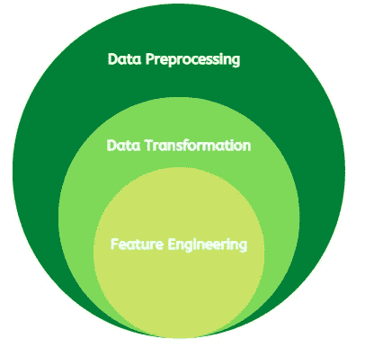
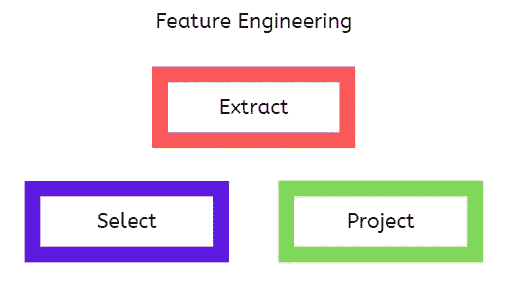
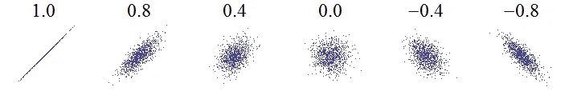
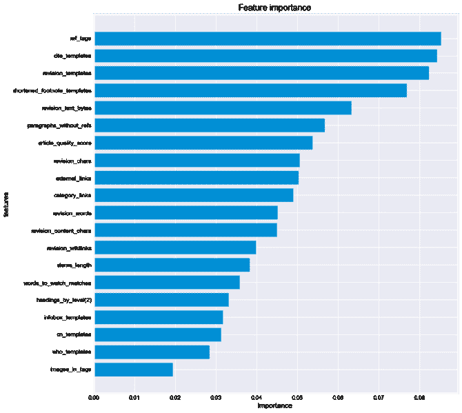

# 特征工程的 3 个基本过程

> 原文：<https://towardsdatascience.com/3-fundamental-processes-in-feature-engineering-d6b84983754>

## 以正确的方式向模型呈现数据模式

阿克顿·克劳福德在 [Unsplash](https://unsplash.com?utm_source=medium&utm_medium=referral) 上的照片

## 介绍

这篇文章解释了特征工程(FE)中的三个关键过程，你需要知道这三个过程才能正确地将数据模式呈现给机器学习(ML)模型。

特征工程是修改现有特征以增强模型从数据中学习的能力的过程。

> 有限元在不显著增加计算时间和成本的情况下，显著提高了模型精度。

FE 是数据转换的子集，是数据预处理的关键元素。

数据预处理的层次(图片由作者提供)

在最近的一篇文章中，我详细讨论了数据转换。然而，FE 作为一个子领域很突出。文章的链接如下所示:

</three-critical-elements-of-data-preprocessing-part-3-6a7da681ae16>  

本文的主要目的是讨论数据转换的组件。这有助于更好地理解数据科学项目生命周期中的数据预处理步骤。

## 特征工程的 3 个基本过程

特征工程的基本过程(图片由作者提供)

现在，让我们深入研究 FE 中的主要过程:

1.**特征提取**

这是从现有要素生成新要素的过程。它是高度特定于领域的，并且很大程度上依赖于你对主题领域的知识。主要思想是创建新的特征，使 ML 模型能够更好地从数据中学习。例如，当预测风力涡轮机的功率输出时，根据原始 X 和 Y 方向风速创建风速大小特征可提供更高的模型精度。

此外，许多 ML 模型处理数字数据，即由整数或小数组成的数据。因此，我们需要对原始的分类数据(由字符串组成的数据)进行编码，以使它们可用于模型。例如，状态变量可以有“开”和“关”类别。

基于特征学习技术，有更高级的特征提取方法。这种方法更加数据驱动、通用和可伸缩。一些例子包括[自动编码器](https://machinelearningmastery.com/autoencoder-for-classification/)和[集群](/how-to-create-new-features-using-clustering-4ae772387290)。

2.**功能选择**

这是为训练过程选择最相关特征的过程。特征选择方法分为三个主要类别，即包装器、过滤器和嵌入式方法。关于特性选择的深入讨论可以在[这里](https://neptune.ai/blog/feature-selection-methods)找到。

功能相关性的一些衡量标准包括:

*相关分析:*相关系数衡量两个变量之间的关系，取值在-1 和+1 之间。正相关意味着两个变量同向变动(即一个变量增加，另一个变量增加，反之亦然)。此外，系数越大，变量之间的相关性越强。在特征选择中，选择与目标变量具有更高相关性的特征，因为它们具有更高的预测能力。

样本相关图。[原始照片](https://commons.wikimedia.org/wiki/File:Correlation_examples.png)被[裁剪 w:用户:Imagecreator](https://commons.wikimedia.org/wiki/File:Correlation_examples_1.png) ， [CC0](https://creativecommons.org/publicdomain/zero/1.0/deed.en) ，via Wikimedia

*特征重要性:*一些树方法，例如随机森林和梯度提升算法，提供特征重要性分数，其显示每个特征对目标预测的影响。这些分数可以用来选择最相关的特征。更多详情可在[这里](/understanding-feature-importance-and-how-to-implement-it-in-python-ff0287b20285)找到。

特征重要性排序示例。照片由 [0xkaywong](https://commons.wikimedia.org/wiki/File:Wikireliability_original-research_feature-importance.png) ， [CC BY-SA 4.0](https://creativecommons.org/licenses/by-sa/4.0) 通过维基媒体提供

*互信息:*基于对一个变量的了解，测量另一个变量的不确定性的减少。不确定性的减少是因为掌握了更多的变量信息。具有高互信息分数的特征被认为更相关，并被选择用于 ML 建模。更多细节可以在找到[。](https://guhanesvar.medium.com/feature-selection-based-on-mutual-information-gain-for-classification-and-regression-d0f86ea5262a)

3.**特征投影**

这是将高维数据映射到低维空间的过程。它通常包括减少馈送给 ML 算法的特征的数量。这是有益的，原因有很多。一个是降低最终模型的复杂性，从而减少过度拟合的机会。另一个目的是减少计算时间和工作量，同时不显著影响模型的准确性。

有两类主要的特征投影技术:

*线性投影:*这些方法采用特征的线性组合，并且不捕捉两个或更多特征之间的相互作用。一些例子包括线性判别分析(LDA)和主成分分析(PCA)。更多细节可以在[这里](https://bitsandbrains.io/2018/09/25/linear-dimensionality-reduction.html)找到。

*非线性投影:*这些方法比较复杂，用非线性方程描述。一些例子包括核主成分分析(KPCA)和主曲线。更多细节可以在这里找到[。](https://golden.com/wiki/Nonlinear_dimensionality_reduction_(NDR_or_NLDR)-6834P)

## 结论

在本文中，我们讨论了特征工程中的三个基本过程，特征工程是数据转换的一个子领域。这些过程是特征提取、选择和投影。提供了在这些过程中使用的不同方法的例子，包括一些资源链接。

我希望你觉得这篇文章很有见地，下次再见。干杯！

你可以通过下面我的推荐链接订阅 Medium 来获得更多我和其他作者的启发性文章，这也支持我的写作。谢谢大家！

<https://aolaoye.medium.com/membership> 