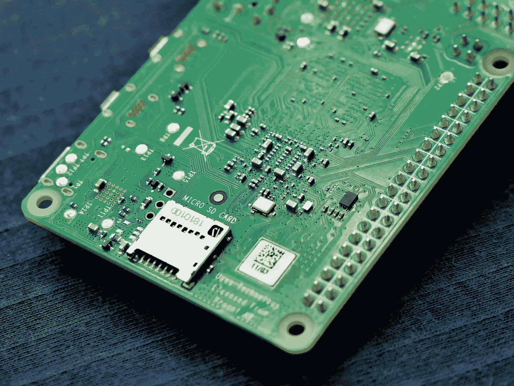
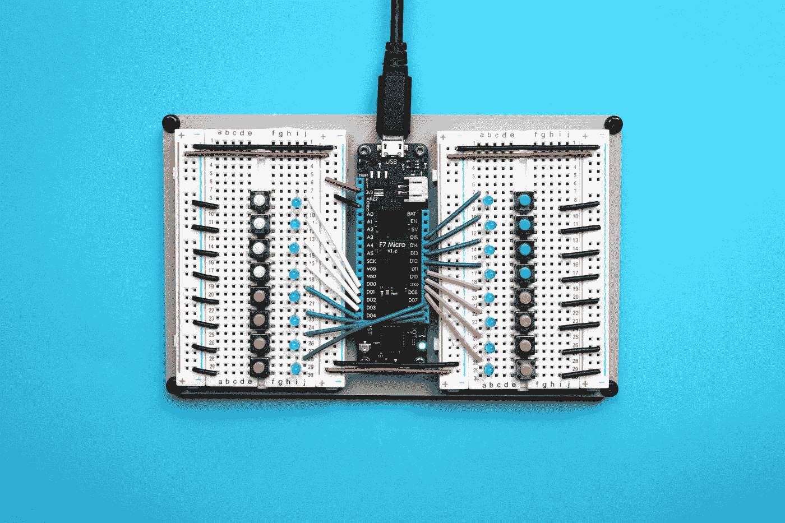
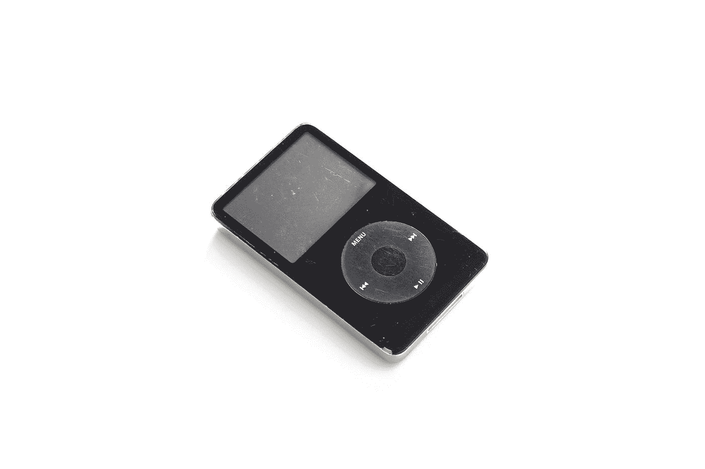

# 量化对 tinyML 重要的 3 个基本原因

> 原文：<https://towardsdatascience.com/3-fundamental-reasons-why-quantization-is-important-for-tinyml-92df82234b91>

## 实现 tinyML 的尺寸、延迟和可移植性

Vishnu Mohanan 在 [Unsplash](https://unsplash.com?utm_source=medium&utm_medium=referral) 上的照片

机器学习(ML)已经成为几十年来的热门话题，在我们生活的方方面面都有成功的现实应用，从健康信息学到商业再到网络安全。将 ML 直接嵌入边缘设备彻底改变了 ML 在物联网(IoT)上的研究和应用，在物联网中，成千上万的 thasounds 微型设备被用来提高现实世界问题解决的生产率和效率；这引发了微型机器学习(tiny ML)的使用，这被认为是人工智能的下一件大事。Tiny ML 是机器学习的高级部分之一，它缩小了深度学习神经网络，以适应微型硬件或嵌入式 AI 处理器，如微控制器或嵌入式 npu，它们包含极小的尺寸(例如，内存 256 KB 和存储 1 MB)。小型廉价机器(微控制器)、超低功耗、小内存、低延迟(即时分析)和嵌入式 ML 算法——是微型 ML 的主要特征。

在收缩过程中，TinyML 利用了一些模型压缩技术，如**量化、修剪和知识提炼**。今天，我将讨论量子化以及它如何有助于开发 TinyML。

**量化**是一种优化技术，它将模型参数的精度从 **32 位浮点**值降低到 **8 位(int8)** 值，而不影响精度，从而减小模型尺寸，提高可移植性，加快计算速度。通过采用可实现更显著加速的超低(1 位或 2 位)精度缩减，可以执行更积极的压缩以进一步减少内存消耗和计算。然而，超低缩减过程可能会产生量化噪声，导致模型精度的显著损失。量化为开发微小的 ML 提供了三个重要的好处:**大小、延迟和可移植性。**

**尺寸—** 量化显著减小模型尺寸，使得在嵌入式设备(如微控制器)上运行 ML 模型。

假设我们训练了一个神经网络并获得了一个最优的权重矩阵，我们必须将这个包含权重的模型保存到某个地方以便进行推理。在常规的微控制器中，我们可能有 256 KB (RAM)的存储器大小和 1 MB 的闪存驱动器存储，而神经网络模型的大小明显大于此。例如，专为在边缘设备上应用而设计的 MoblieNet 模型的模型大小为 **16 MB** ，有 430 万个参数。因此，考虑到存储容量，将这个庞大的模型直接安装在微控制器上是完全不可行的。在这种情况下，量化可能是一个潜在的解决方案—通过应用量化(32 位浮点到 8 位 int 值)，我们可以立即将模型大小减少到 4 倍。

照片由 [Jorge Ramirez](https://unsplash.com/@jorgedevs?utm_source=medium&utm_medium=referral) 在 [Unsplash](https://unsplash.com?utm_source=medium&utm_medium=referral) 上拍摄

现在，你可以想一想，如果我们能以某种方式将模型尺寸缩小到微控制器的给定 RAM 尺寸，那么我们就可以轻松地适应模型，并充分利用 RAM 的空间。然而，我们应该考虑到，整个内存不应该专用于 ML 任务，因为应用程序由 ML 和非 ML 部分组成。因此，我们应该始终致力于将模型缩小到最小，以便内存为非 ML 作业获得空闲空间。

**延迟—** 在任何微处理器上执行的浮点运算通常比整数运算慢，因为整数运算可能只需要一到两个周期，而浮点运算可能需要十多个周期。因此，将 32 位浮点转换为 8 位 ineger 系统可以显著提高性能。

与浮点计算相比，整数点计算更便宜(因为它需要更长的计算时间和功耗)，因此切换到 int8 系统可以降低微控制器的功耗。**一些实验表明，与相关浮点模型相比，MobileNet V1、ResNet V2 和 Inception V3 的量化模型(int8 算法)在 CPU 上的速度快 2-4 倍，体积小 4 倍，推理速度更高。**

**可移植性——**量化提供了另一个重要的好处——**可移植性**——开发微小的 ML，因为可移植性对于嵌入式系统极其重要。并非所有的嵌入式设备都是同等创建的，因为一些微控制器与浮点运算兼容，而一些则与整数值系统兼容。因此，如果不考虑算法兼容性，任何给定的神经网络都不能直接部署在嵌入式设备上进行推理。人们可以认为量化是 ML 算法的归一化技术。与归一化一样，我们将所有特征的值转换为相似的尺度；量化通过将模型参数转换成**整数**系统来做同样的事情，这是所有不同嵌入式系统的公共基线。因此，量化可以提供更好的可移植性并实现更好的效率。

[杰里米·贝赞格](https://unsplash.com/@unarchive?utm_source=medium&utm_medium=referral)在 [Unsplash](https://unsplash.com?utm_source=medium&utm_medium=referral) 上拍摄的照片

总之，对于在嵌入式设备上开发 tinyML 来说，量化是确保达到所需大小、延迟和可移植性的重要步骤。

# 阅读默罕默德·马苏姆博士(以及媒体上成千上万的其他作家)的每一个故事。

你的会员费将直接支持和激励穆罕默德·马苏姆和你所阅读的成千上万的其他作家。你还可以在媒体上看到所有的故事—[**https://masum-math8065.medium.com/membership**](https://masum-math8065.medium.com/membership)

**快乐阅读！**

**参考**

受 HaevardX 在线课程《TinyML 的应用》的启发