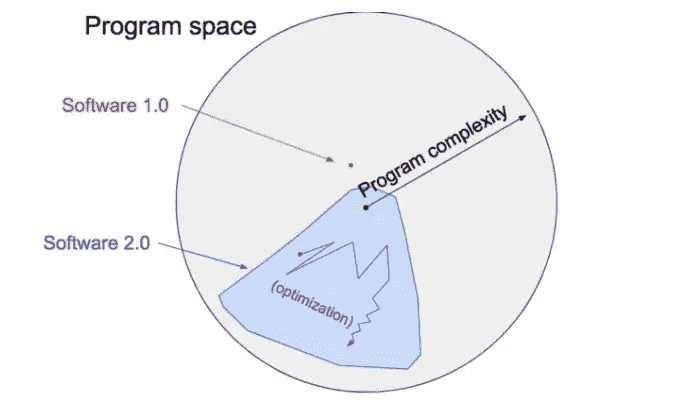

# 改变我数据科学职业生涯的 3 次讲座

> 原文：<https://towardsdatascience.com/3-lectures-that-changed-my-data-science-career-5b78e02acb30>

## 这是我经常与我的同事分享的三个讲座，并且一直记在我的脑海里

# 介绍

围绕人工智能有很多令人兴奋的事情。最近，ChatGPT 和 Dall-E-2 等模型的演示引起了不可思议的轰动。尽管这些系统令人印象深刻，但我认为保持头脑冷静，不被兴奋的海洋冲昏头脑变得越来越重要。

以下视频/讲座更侧重于如何思考数据科学项目，以及如何解决一个问题。我发现这些讲座对我的职业生涯非常有影响，使我能够建立有效和实用的解决方案，满足我所工作的公司的确切需求。

# #1)大数据中缺失的人类洞察力| Tricia Wang

这个视频有点老，是 2017 年的，但它仍然非常相关。Tricia Wang 是一名人种学家，也是咨询公司 [*【突发罗盘】*](https://www.suddencompass.com/) *的联合创始人，该公司与财富 500 强公司和科技初创公司合作，从大数据中获取见解。最近[她]联合创立了 CRADL——基于世界经济论坛的密码研究和设计实验室。*【1】。

她的演讲主要集中在她与诺基亚及其大数据分析工作的经验，以了解中国的手机市场。她认为，诺基亚错过了一个潜在手机买家的大市场，因为他们的数据收集没有捕捉到重要信息。她的论点不是大数据不好，而是大数据可能被错误地使用，并因此变得具有误导性，尤其是当你忽视它的局限性时。最明显的限制是它无法捕捉(她称之为)“厚数据”。“厚数据”是定性信息，如故事和极其复杂的细节。

为什么这个讲座会改变游戏规则？**强调定性数据不可替代，定量数据不篡夺定性数据**。

好吧，有什么大不了的？一位同事曾经问我“在我们的日常工作中，我们如何根据这些信息采取行动？”我回答说，你可以从定性的方法开始，然后朝着定量的方法努力。在许多 NLP 项目中，我通常从无休止的阅读开始，像一个研究者一样对待问题。只有在我对数据和公司的需求有了深入的了解之后，我才开始解决和提取见解。

我试着指导初级数据科学家去获取哪怕是一个数据点，并把这些数据追溯到源头，然后继续下去！一直追溯到定性数据——这个数据点背后的故事。这不仅是对数据的深入了解，也是对整个系统和企业文化的深入了解。然后，开始问更深层次的商业问题。首先像一个研究者一样思考，在你进入定量部分之前问一些定性的问题。

我如何选择一个数据点进行分析？您可以构建一个非常简单的模型(例如，sci-kit learn random forest，使用 0 超参数调整)，然后找到置信度最低的数据点。或者你甚至可以随机选择一个数据点。或者随机抽取 10 或 100 个样本。只要你开始对数据和业务有一个定性的了解，那么你就在正确的轨道上。

# #2)构建软件 2 0 堆栈(Andrej Karpathy)

安德烈·卡帕西很可能不需要介绍，但如果你不熟悉，安德烈"*卡帕西是人工智能研究小组* [*OpenAI*](https://en.wikipedia.org/wiki/OpenAI) *的创始成员，他从 2015 年到 2017 年作为研究科学家在那里工作。2017 年 6 月，他成为特斯拉的人工智能总监。卡帕西被麻省理工科技评论评为 2020 年 35 岁以下创新者之一。*【②】。

在这次演讲中，他解释了两件事。

1.  AI/ML 只是一种新的编写软件的方式。
2.  在商业中，你的大部分时间最好花在理解和清理数据上。

我最后的视频/讲座推荐将触及第二项，所以我在这里将重点放在第一项。那么，这说明什么呢' *AI/ML 只是一种新的编写软件的方式？*‘Andrej 将软件开发分为他所谓的软件 1.0 和软件 2.0。软件 1.0 本质上是任何可以显式编写的程序。例如，如果我想让一个程序说“你好，马特”，给定用户的名字是“马特”，这是一个非常容易编写的程序，因此使用软件 1.0。现在让我们假设我想要一个程序获取一个图像，并确定图像中是否包含一只猫。这是一个非常复杂的问题，明确地写出每一条指令是不可能的。因此，我们没有手动编写所有指令，而是设置了一个程序(利用优化)来为我们编写程序，我们称之为机器学习(ML)，或软件 2.0。

随着程序复杂度的增加，我们从软件 1.0 切换到需要软件 2.0。

[https://karpathy.medium.com/software-2-0-a64152b37c35](https://karpathy.medium.com/software-2-0-a64152b37c35)【3】

为什么这会改变游戏规则？**它本质上是一张如何确定什么是 ML 项目，什么不是的蓝图！** ChatGPT 出来了，世界兴奋得爆炸，但我要再次引用我自己的话’*尽管这些系统令人印象深刻，但我认为保持冷静，不要在兴奋的海洋中失去理智变得越来越重要。将 BERT 或 ChatGPT 塞进每一个 NLP 项目中是非常诱人的；但是我警告你停下来，沉思，从一张空白的画布开始。企业需要什么？数据是什么样的？伯特还有存在的必要吗？例如，假设企业想知道有多少系统注释提到了 COVID。在查看您的笔记主体时，您可能会发现，当笔记与 COVID 相关时，通常会提到' *COVID* ，而当笔记与 COVID 无关时，则会排除' *COVID* '。太好了！当一个非常简单的文本搜索就可以做到这一点时，不需要花费大量的金钱来培训、调整和部署一个庞大的模型。你为公司节省了大量的时间和精力！现在你可以前进了，相信我，在你面前有很多有趣的障碍(*所以不要担心你的团队会感到无聊，还有很多需要发现和改进的*)。*

# #3)与 Andrew 就 MLOps 的对话:从以模型为中心到以数据为中心的人工智能

2021 年和 2022 年的新热门术语之一是“以数据为中心的人工智能”，而在这场运动的中心，你会发现吴恩达。安德鲁很可能也不需要介绍，但如果你不熟悉的话，安德鲁" *Ng 是斯坦福大学* [*兼职教授*](https://en.wikipedia.org/wiki/Stanford_University)**(之前是斯坦福人工智能实验室* [*副教授兼主任*](https://en.wikipedia.org/wiki/Stanford_AI_Lab) *或 SAIL)。Ng 还在* [*在线教育*](https://en.wikipedia.org/wiki/Online_education) *领域做出了实质性贡献，作为双方*[*Coursera*](https://en.wikipedia.org/wiki/Coursera)*和*[*deep learning . ai*](https://www.deeplearning.ai/)*的联合创始人。他带头通过他的在线课程向超过 250 万名学生教授“民主化深度学习”。他是世界上最著名和最有影响力的计算机科学家之一，被《时代》杂志评为 2012 年* [*100 位最具影响力的人*](https://en.wikipedia.org/wiki/Time_100) *，以及 2014 年* [*【快公司】*](https://en.wikipedia.org/wiki/Fast_Company) *最具创造力的人。*【④】。*

*这个视频/讲座详细阐述了 Andrej 的观点，即在商业中，你的大部分时间都花在理解和清理数据上；然后 Andrew 进一步指出**理解和清理数据*通常*比**对模型性能的影响更大。当你只关注模型而在数据上花费更少的时间时——他将此定义为“以模型为中心”的 ML 方法(*，这是过去 20 年来的主要方法*)。**“以数据为中心”的方法是不去管模型算法，而是试图通过关注清理和提高数据质量来提高性能**。这并不是说建模算法不重要，这只是强调了数据清理的力量及其对最终 ML 系统的影响。*

*这很有趣，因为这绝不是一个新想法。这是一个非常古老的想法。统计学家过去常说“*垃圾进，垃圾出*”，意思是说，如果你给你的模型输入了糟糕的数据，那么从建模的角度来看，无论你做什么，你的模型都将是垃圾。*

*事实上，如果你有非常高质量的数据，你不需要那么多数据来建立一个模型。如果您有糟糕的数据，那么您可以 1)收集大量数据，希望冲淡糟糕数据带来的噪音，或者 2)修复/清理您的数据。*

*在我的职业生涯中，我只在几百行数据上建立了高效的模型。怎么会？我们擦洗、检查和审查我们的数据，直到我们知道我们有可以信任的训练和维持数据集。这并不是说你应该扔掉你所有的数据，大数据是愚蠢的，它只是突出了高质量数据和数据清洗的力量。*

*我认为这引发了更大的讨论，比如你的基本事实是什么？你拿你的模型和什么做比较？0.76 AUC 对你的坚守组合意味着什么？你的坚持集是你试图建模的清晰而准确的表现吗？如果不是，那么 0.76 AUC 实际上代表什么？我的观点是，你应该对你的顽固分子非常挑剔。如果你不能信任你的坚持者，那你还在做什么？*

# *摘要*

*如果你把这三个讲座放在一起，你会发现它真的为处理数据科学工作创建了一个完整的框架。从定性回顾开始。了解业务和业务需求。密切了解数据。你需要一个软件解决方案吗？如果是，请确定您是需要软件 1.0 解决方案还是更复杂的软件 2.0 解决方案。即使看起来像是软件 2.0 项目，软件 1.0 解决方案的表现如何？如果您绝对需要一个软件 2.0 解决方案(ML)，那么在增加建模复杂性之前，从以数据为中心的方法开始。增加建模的复杂性应该是最后一件事。我将再次声明，随着更新的大型语言模型(LLM)的出现和更新的神经网络架构的出现，*我认为保持冷静的头脑，不要在兴奋的海洋中迷失方向变得越来越重要。*“你想解决正确的事情，如果你没有解决正确的事情，你想快速学习，这样你就可以更快地朝着正确的方向前进。*

# *结束了*

*感谢阅读，希望你发现这篇文章很有见地，或者至少引发了一些有趣的想法。快乐学习！*

# *参考*

*   *[1]https://www.triciawang.com/*
*   *[2][https://en.wikipedia.org/wiki/Andrej_Karpathy](https://en.wikipedia.org/wiki/Andrej_Karpathy)*
*   *[3][https://karpathy.medium.com/software-2-0-a64152b37c35](https://karpathy.medium.com/software-2-0-a64152b37c35)*
*   *[4]https://en.wikipedia.org/wiki/Andrew_Ng*