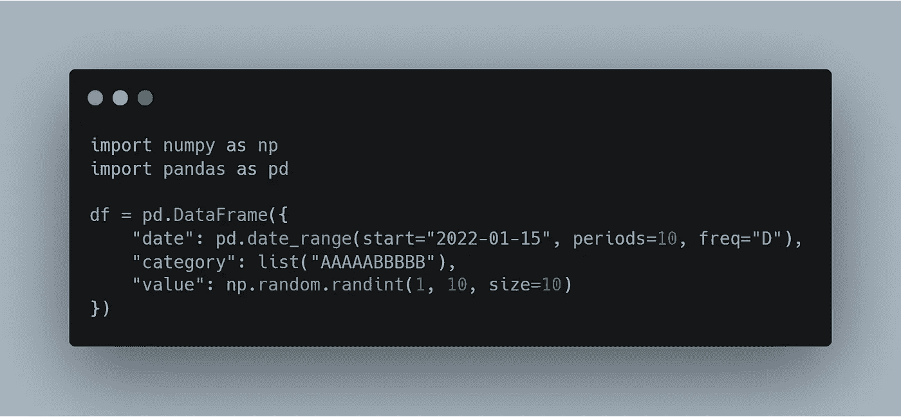
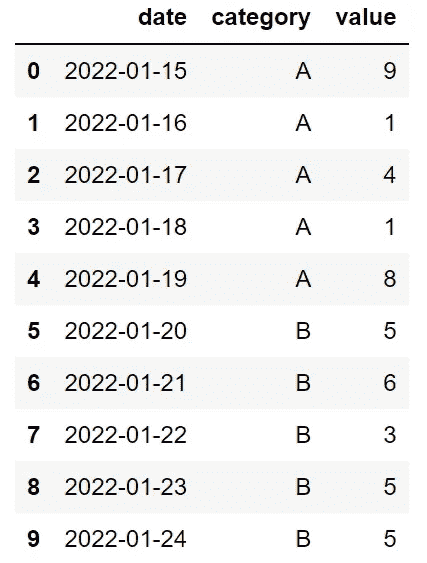
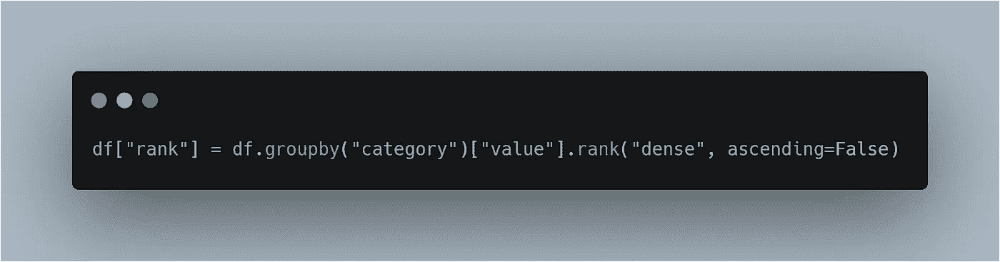
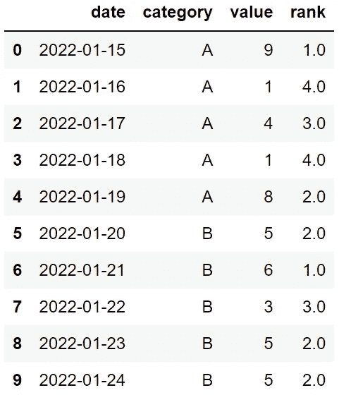
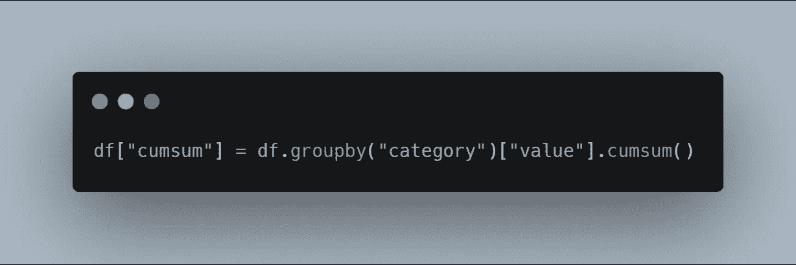
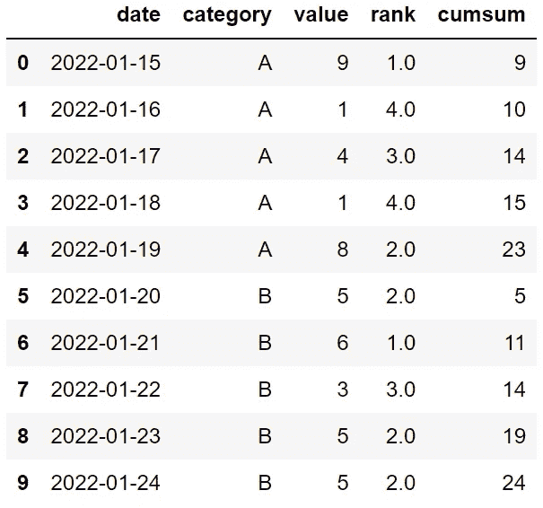
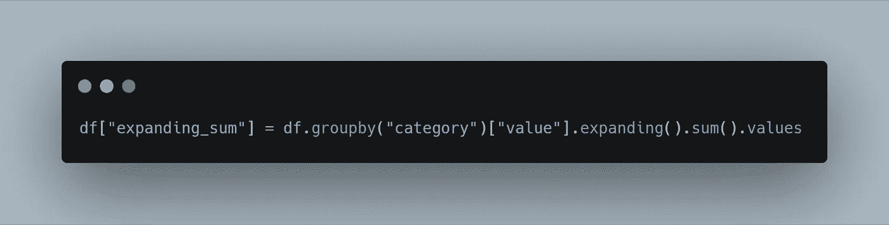
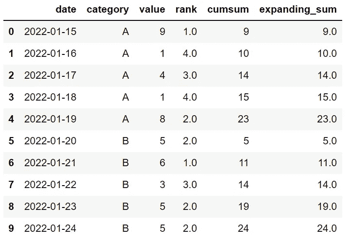
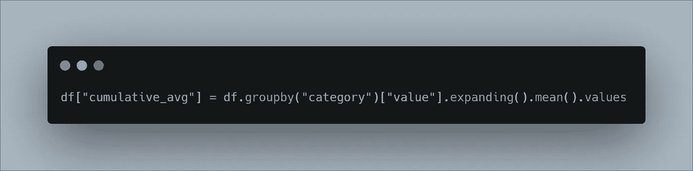
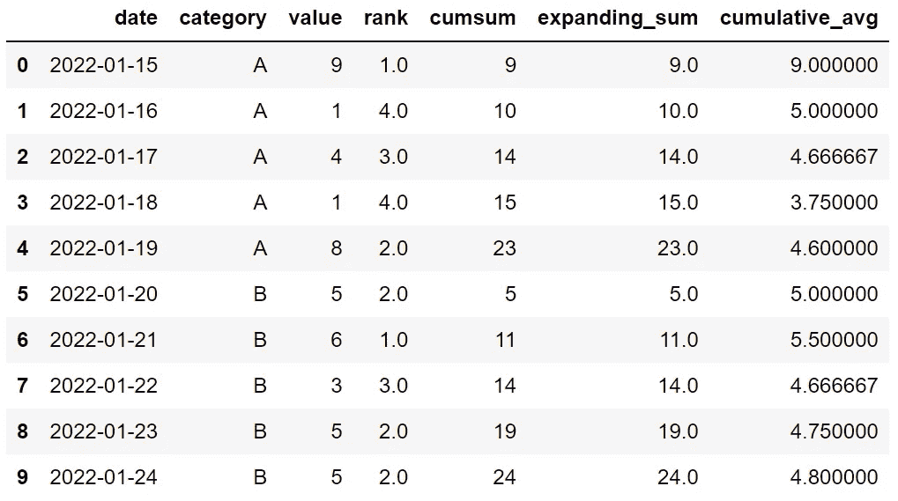

# 3 个鲜为人知的熊猫函数将与 Groupby 一起使用

> 原文：<https://towardsdatascience.com/3-lesser-known-pandas-functions-to-be-used-with-groupby-2f971d99d95d>

## 这将帮助你充分利用它

凯文·穆勒在 [Unsplash](https://unsplash.com/s/photos/rare?utm_source=unsplash&utm_medium=referral&utm_content=creditCopyText) 上的照片

groupby 是数据分析中最常用的 Pandas 函数之一。它根据列中的不同值对行进行分组，以便我们可以按组计算聚合值。

groupby 函数只对行进行分组，不进行任何计算。我们需要对 groupby 的输出应用一个聚合函数。在某种意义上，它为我们计算聚合值准备了数据框架。

假设我们有一个包含产品代码、产品类别和价格列的数据框架。为了计算每个类别的平均产品价格，我们按产品类别列对行进行分组，然后应用 mean 函数。

平均值、总和、最小值、最大值和计数是常用的聚合函数。在本文中，我们将介绍 3 个不常用的函数，它们可以和 groupby 一起使用。

> 如果你想在我发表新文章时收到电子邮件，别忘了订阅。

让我们从创建示例中使用的样本数据帧开始。

(图片由作者提供)

它看起来是这样的:

df(作者图片)

# 1.军阶

第一个是等级函数，用于根据值的降序或升序来分配等级。

我们可以将它与 groupby 函数一起使用，为每个类别分配一个单独的等级。我们按类别列对行进行分组，然后选择值列。最后，使用升序或降序选项应用排名函数。

(图片由作者提供)

下面是数据帧现在的样子:

df(作者图片)

因为选择了升序选项，所以具有最高值的行在每个类别中排名第一。

# 2.累计

cumsum 函数计算累积和，因此第一行中的值是第一行和第二行中的值的和。第三行中的值是第一、第二和第三行中的值之和，依此类推。

cumsum 函数可以与 groupby 一起使用，以计算每个类别的累积和。

(图片由作者提供)

下面是数据帧现在的样子:

df(作者图片)

# 3.扩大

扩展函数提供扩展变换。我们仍然需要一个函数来进行聚合，例如均值和求和。如果它与 sum 函数一起使用，结果将与 cumsum 函数相同。

(图片由作者提供)

让我们看看 cumsum 和 expanding sum 列是否有相同的值。

df(作者图片)

我们还可以使用 mean 和 expanding 函数来计算累积平均值。

(图片由作者提供)

df(作者图片)

“累积平均值”列中的第二个值是“值”列中第一个和第二个值的平均值，依此类推。

如果你正在使用熊猫进行数据分析，groupby 很可能是你最喜欢的函数。我们在本文中介绍的函数肯定会对充分利用 groupby 有所帮助。

*别忘了* [*订阅*](https://sonery.medium.com/subscribe) *如果你想在我发表新文章时收到电子邮件。*

*你可以成为* [*媒介会员*](https://sonery.medium.com/membership) *解锁我的全部写作权限，外加其余媒介。如果您使用以下链接，我将收取您的一部分会员费，无需您支付额外费用。*

<https://sonery.medium.com/membership>  

感谢您的阅读。如果您有任何反馈，请告诉我。