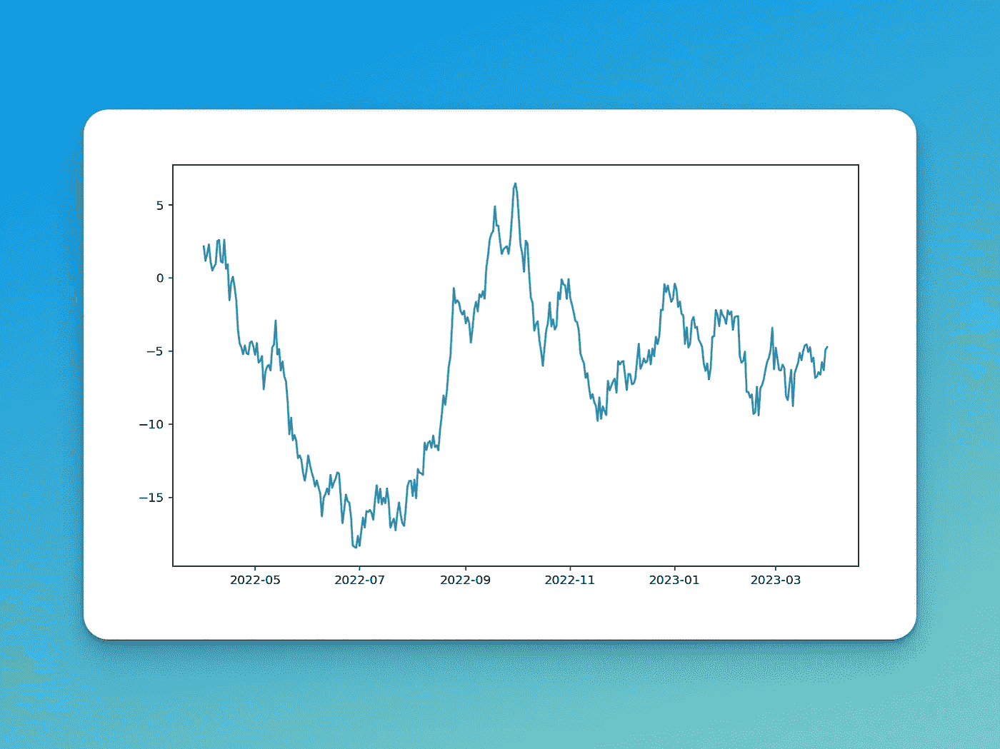
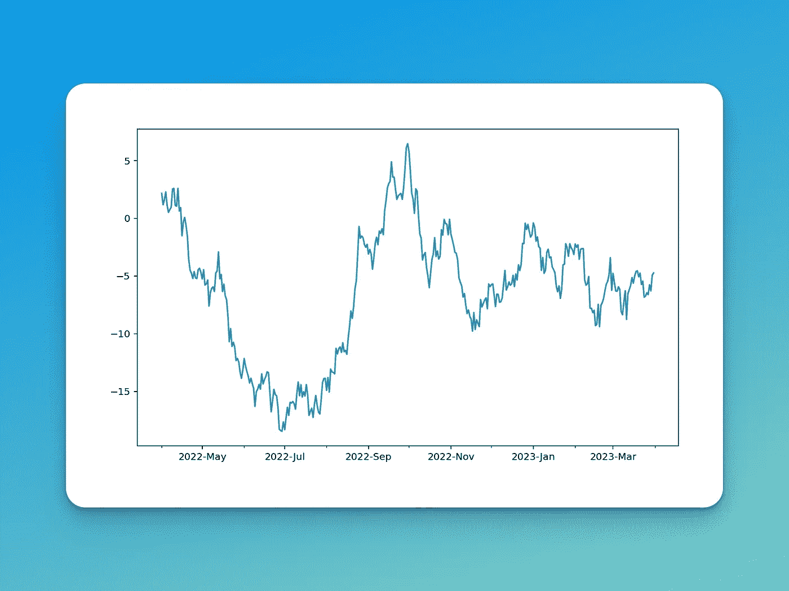
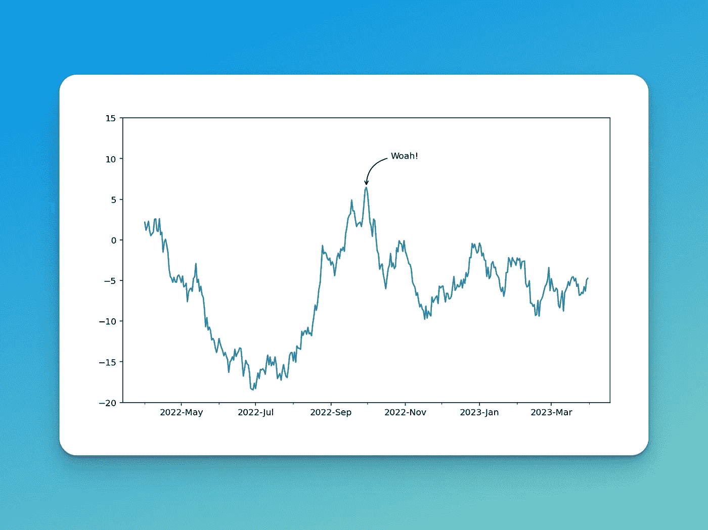
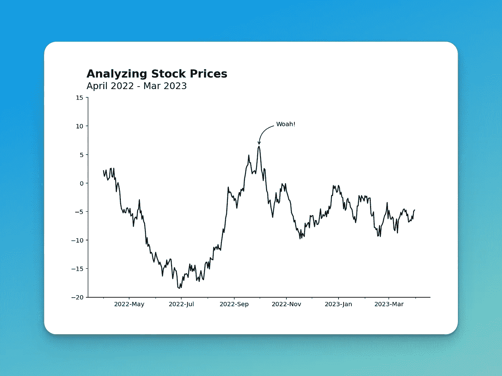

# 你需要知道的 3 个 Matplotlib 技巧

> 原文：<https://towardsdatascience.com/3-matplotlib-tips-you-need-to-know-1b24e41552d5>

## 定制坐标轴、添加标签并润色您的视觉效果

照片由[艾萨克·史密斯](https://unsplash.com/@isaacmsmith?utm_source=medium&utm_medium=referral)在 [Unsplash](https://unsplash.com?utm_source=medium&utm_medium=referral) 上拍摄

Matplotlib 是典型的数据可视化库。然而，图书馆是如此之大，以至于经常很难找到你能用它完成的所有酷的事情。

在本教程中，您将学习三种不同的技巧，帮助您创建漂亮的可视化效果。首先，您将学习如何更精确地设置坐标轴的格式，尤其是在处理日期时。然后，您将学习如何注释您的图表。最后，您将学习如何以《经济学人》的风格添加标题！

让我们开始吧！

# 创造你的第一个视觉效果

让我们从创建基础视觉开始，看看我们从哪里开始。我们将使用 Pandas 和 NumPy 来生成一个看起来像样本股票信息的数据帧。

创建样本数据并在 Matplotlib 中可视化

让我们来分解一下我们在上面的代码中做了什么:

1.  我们导入了我们的库，并在 Matplotlib 中启用了 retina 模式
2.  然后，我们设置一个随机种子，使我们的结果可重复
3.  我们创建了涵盖日期范围和随机数量的数据框架
4.  最后，我们使用默认参数绘制数据

让我们看看这个可视化是什么样子的:

我们最初的可视化(来源:作者)

好吧…所以这种视觉效果并不令人振奋！下面我们来分解一下如何通过添加更干净的 x 轴标签来改善。

# 自定义日期 x 轴标签

Matplotlib 试图找到显示每个轴中的值的最佳方式。然而，这不一定是您想要的数据显示方式。

Matplotlib 提供了大量不同的方法来定制你的坐标轴——你将学习到如何使用定制显示日期以及它们是如何显示的！

为了使这个工作，让我们再得到两个导入:

1.  `DateFormatter`修改日期的显示方式
2.  `mdates`能够找到具体的日期

看看下面的代码。我们一会儿将探究发生了什么。

在 Matplotlib 中自定义日期时间刻度。

让我们来分解一下代码在做什么:

1.  我们创建一个日期格式，使用`DateFormatter`类显示年份，并使用格式化的`'%Y-%n'`显示一个月的第一个字母。
2.  然后我们使用`.set_major_formatter()`方法，用我们指定的格式来格式化 x 轴上的主要标签
3.  然后每月用`.set_minor_formatter()`方法*定位*并显示

让我们看看现在我们的可视化是什么样子的:

使用日期刻度标签(来源:作者)

我们可以看到，我们的 x 轴现在以我们希望的格式显示了一些更清晰的日期。

# 在 Matplotlib 中标注数据点

有时你会想把注意力吸引到一个点(或多个点)上。Matplotlib 通过使用`.annotate()`方法使这变得简单！我们可以选择标签和箭头类型。

让我们来看看如何做到这一点:

注释 Matplotlib 可视化。

在第 27–33 行，我们添加了我们的注释。让我们看看如何实现这一点:

1.  我们添加了`text=`参数来修改我们想要使用的文本
2.  然后，我们选择希望标签指向的位置和希望文本出现的位置。我们在第 24 行和第 25 行定义了这些参数。
3.  然后，我们使用接受样式字典的`arrowprops=`参数定义我们希望箭头采用的样式。

让我们看看现在是什么样子:

向我们的 Matplotlib 可视化添加标签(来源:作者)

很棒，对吧？

# 让我们的土地更漂亮

在这最后一部分，我们将看看如何使我们的视觉效果看起来更加完美。Matplotlib 提供了一个*吨*的定制能力。这通常会让人不知所措，所以让我们来看看一些关键功能。

在下面的代码中，我们添加了第 30–41 行来定制我们的视觉效果。

给我们的视觉增添一些光彩。

让我们来分析一下这几行代码在做什么:

1.  我们从顶部和右侧移除脊柱
2.  然后我们使用`.text()`方法来添加标题和副标题

添加文本的过程可能有点启发性。最好的办法就是稍微试验一下，直到你得到满意的结果！

看起来很精致，对吧？与我们开始的地方相比，这是一个巨大的进步！

# 结论

在本指南中，您学习了如何将 Matplotlib 可视化提升到一个新的水平。因为 Matplotlib 提供了如此多的功能，所以常常不知道从哪里开始。希望这个指南为你提供了一些好的资源，让你开始让你的可视化效果更丰富、更漂亮！