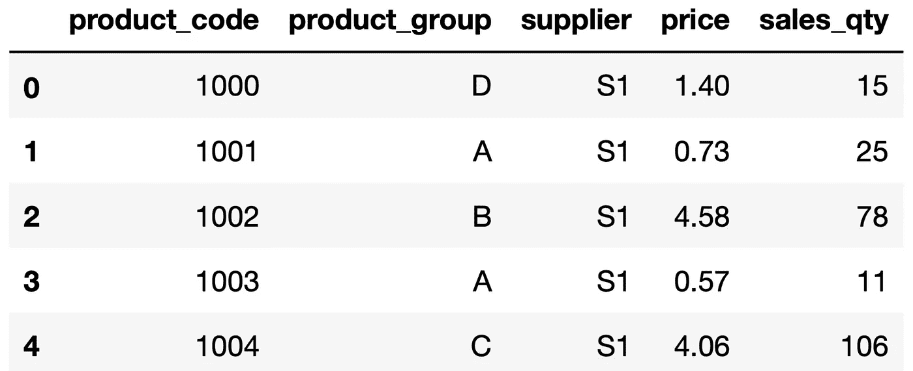
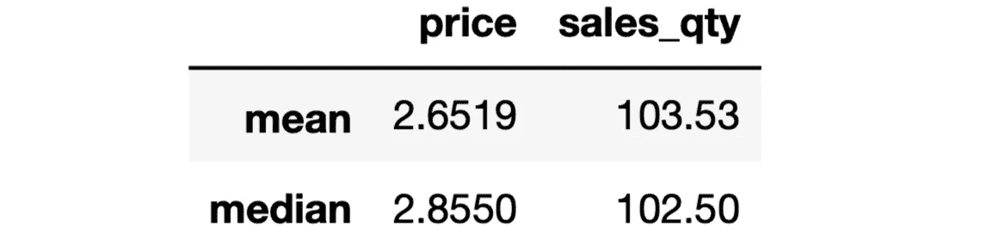
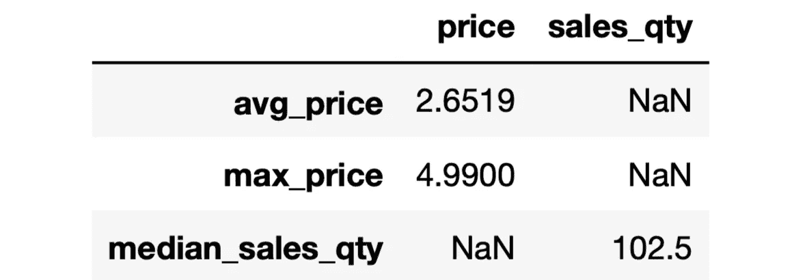
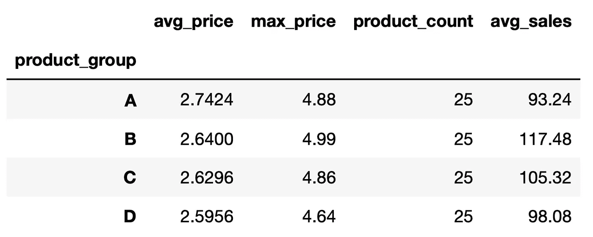
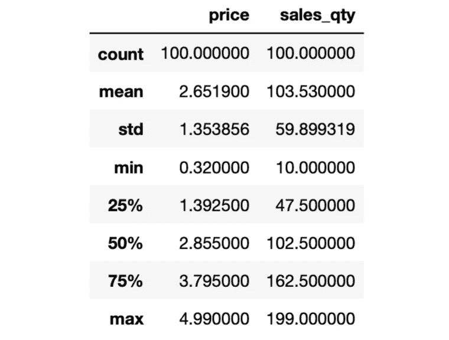

# 使用 Python Pandas 聚合数据的 3 种方法

> 原文：<https://towardsdatascience.com/3-methods-for-aggregating-data-with-python-pandas-14ceb75b6f6e>

## 熊猫提供最适合你的需求


由 [Unsplash](https://unsplash.com/s/photos/big-small?utm_source=unsplash&utm_medium=referral&utm_content=creditCopyText) 上 [Alp Duran](https://unsplash.com/@alpduran?utm_source=unsplash&utm_medium=referral&utm_content=creditCopyText) 拍摄的照片

Pandas 是 Python 的一个数据分析和操作库，也是最受欢迎的库之一。我认为它最大的优点是易用性和简洁的语法。

Pandas 在如何执行常见操作方面非常灵活，因此它几乎总能提供完全符合您需求的解决方案。

在这篇文章中，我们将回顾用 Pandas 聚合数据的不同方法。你将看到熊猫如何提供各种方法来完成一项特定的任务。

> 注:本文原载于 datasciencehowto.com[。](https://datasciencehowto.com/2022/10/29/3-methods-for-aggregating-data-with-python-pandas/)

让我们从创建一个填充了模拟数据的样本数据帧开始。

```
import pandas as pd
import numpy as np
from random import shufflepg = ["A","B","C","D"] * 25
supplier = ["S1","S2"] * 50
shuffle(pg)
shuffle(supplier)df = pd.DataFrame({
    "product_code": np.arange(1000,1100),
    "product_group": pg,
    "supplier": supplier,
    "price": np.round(np.random.rand(100) * 5, 2),
    "sales_qty": np.random.randint(10, 200, size=100)     
})df.head()
```



df 的前 5 行(图片由作者提供)

我们使用 NumPy 来生成带有随机数的数组。产品组和供应商列是用 Python 列表创建的。为了增加随机性，内置随机库中的洗牌模块用于洗牌。

## 1.直接使用聚合函数

显而易见的方法是使用集合函数，如均值、中值、最小值等。

```
df.mean()**# Output**
product_code    1049.5000
price              2.6519
sales_qty        103.5300
dtype: float64
```

在这种方法中，Pandas 只计算数字列的聚合值。但是，在未来的版本中将不推荐使用此功能，并且此操作将生成类型错误。因此，建议首先选择感兴趣的列，然后进行聚合。

```
df[["price","sales_qty"]].mean()**# Output**
price          2.6519
sales_qty    103.5300
dtype: float64
```

虽然产品代码列是数字，但我们不能真正谈论平均产品代码，所以我们不选择它。

## 2.具有应用功能的多个聚合

我们有时需要在一次操作中计算多个聚合。这可以通过向 apply 函数传递一个函数列表来实现。

```
df["price"].apply(["mean","median"])**# Output**
mean      2.6519
median    2.8550
Name: price, dtype: float64
```

如果多个列上有多个聚合，apply 函数将返回一个数据帧，其中包含索引中的函数名。

```
df[["price","sales_qty"]].apply(["mean","median"])**# Output**
```



(图片由作者提供)

如果要对不同的列应用不同的聚合函数，可以使用 Python 字典，如下所示:

```
df[["price","sales_qty"]].apply(
   {"price":"mean","sales_qty":"median"}
)**# Output** price          2.6519
sales_qty    102.5000
dtype: float64
```

我们在输出中看到的值是价格列的平均值和销售量列的中值。

## 3.agg 功能

一次计算多个聚合的另一种方法是 agg 函数。

```
df[["price","sales_qty"]].agg(["mean","median"])
```

这一行代码与上面的 apply 函数产生相同的输出。

agg 函数还允许为聚合列分配定制的名称。这里有一个例子。

```
df[["price","sales_qty"]].agg(
    avg_price = ("price","mean"),
    max_price = ("price","max"),
    median_sales_qty = ("sales_qty","median")
)**# Output**
```



(图片由作者提供)

要聚合的列和聚合函数写在一个元组中。输出是只填入相关值的数据帧。

当与 groupby 函数一起使用时，命名聚合会很方便。我们来做一个例子。

```
df.groupby("product_group").agg(
    avg_price = ("price","mean"),
    max_price = ("price","max"),
    product_count = ("product_code","count"),
    avg_sales = ("sales_qty","mean")
)**# Output**
```



(图片由作者提供)

## 奖励:描述

describe 函数计算以下聚合和统计数据:

*   数数
*   意思是
*   标准偏差
*   部
*   25%(第一个四分位数)
*   50%(第二个四分位数或中位数)
*   75%(第三个四分位数)
*   最大

从最低到最高排序时，25%的值低于第一个四分位数，50%的值低于第二个四分位数，依此类推。

describe 函数可以应用于一列或一组列。我们也可以直接在数据帧上使用它。

```
df[["price","sales_qty"]].describe()**# Output**
```



(图片由作者提供)

describe 函数提供了数字列的概述。对于探索性的数据分析是相当有用的。

*你可以成为* [*媒介会员*](https://sonery.medium.com/membership) *解锁我的全部写作权限，外加其余媒介。如果你已经是了，别忘了订阅*[](https://sonery.medium.com/subscribe)**如果你想在我发表新文章时收到电子邮件。**

*[](https://sonery.medium.com/membership)  

感谢您的阅读。如果您有任何反馈，请告诉我。*