# 3 必须了解数据可视化原理

> 原文：<https://towardsdatascience.com/3-must-know-data-visualization-principles-a203745867eb>

## 你的数据有故事可讲

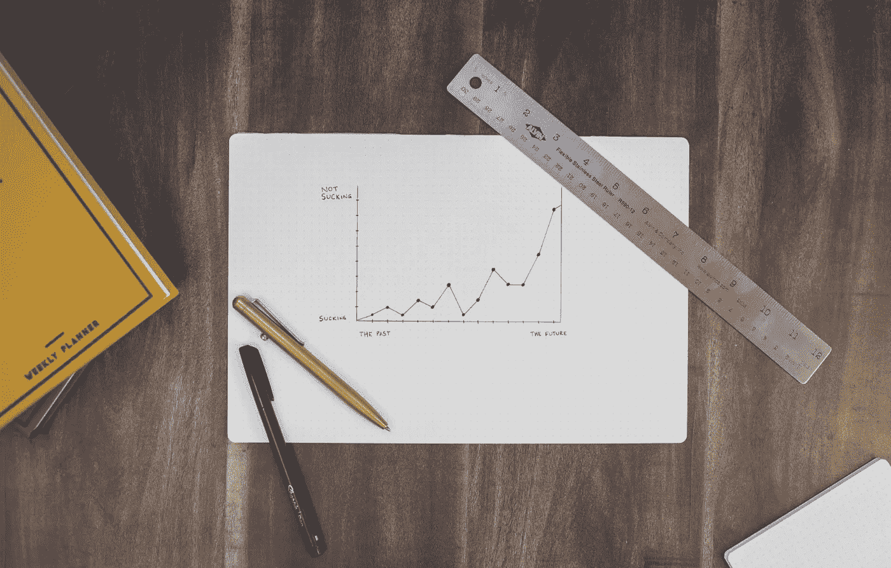

艾萨克·史密斯在 [Unsplash](https://unsplash.com/?utm_source=unsplash&utm_medium=referral&utm_content=creditCopyText) 上拍摄的照片

# **简介**

你的数据里有故事。作为分析师，你可能已经知道这个故事是什么了。但是你怎么把这个消息传出去呢？最重要的是，你如何确保你的听众会根据你的叙述采取具体行动？数据可视化是您分析之旅的最后一步，它将帮助您讲述故事并将其转化为决定性的措施。

但是讲述一个引人入胜的故事并非易事。像任何其他类型的交流一样，数据可视化的关键挑战是识别您的消息中哪些元素是**信号**——您想要交流的信息，哪些是**噪音**——污染您消息的不必要信息。

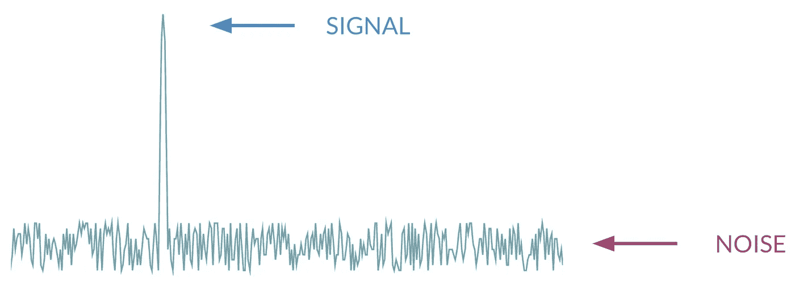

考虑到这一点，你的主要目标是以突出重点的方式向观众展示内容，排除任何干扰。

您可能已经花了很多时间来理解、清理和建模您的数据，以得出一个值得分享的结论。所以，不要让这最后一步妨碍你正确传达你的关键见解。

# 数据可视化中的内存

你上一次参加演示会，看着一系列图表，然后想:“我不知道我应该看什么”是什么时候？这都与你的记忆方式有关。

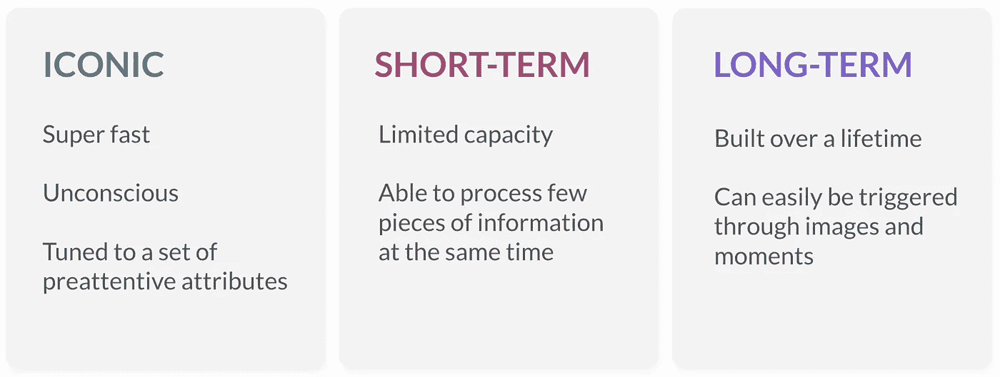

🧠记忆的三种类型

**标志性**记忆真的很快。通过你标志性记忆的信息只能持续几分之一秒。图标记忆基本上是视觉刺激的闪存，它将决定你的大脑是丢弃它还是将其转移到你的短期记忆中。

虽然你短期记忆中的信息可以持续几分钟，但它的容量是有限的。你的短期记忆只能同时处理有限的数据，很快就会饱和。同时向你的观众扔太多的信息，这就是你会失去他们的注意力的地方。

当信息离开你的短期记忆时，你的大脑要么永远失去它，要么把它转移到你的长期记忆中，在那里它会把信息储存更长的时间。

在讲述你的故事时，你要尽可能地利用你的听众的标志性记忆，让他们不用处理他们有限的短期记忆中的数据。

所以，下次当你在即将到来的同事的演示中感到失落时，不要责怪自己。要怪就怪你的短期记忆吧。

# 1.前注意属性

前注意属性是触发你的大脑快速处理信息的视觉特征，**不需要你的意识动作**。这一切都发生在你标志性的记忆中。

虽然一开始看起来像是一个模糊的概念，但是这些预先注意属性的力量是相对容易证明的。为此，请看下面的序列，并计算数字 9 出现的次数。

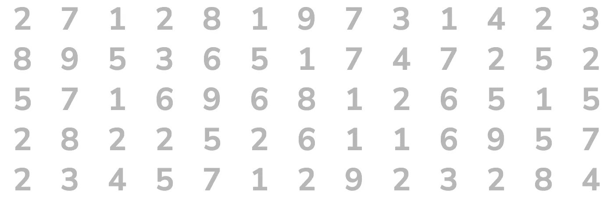

串行处理

正确答案是五。但是在这个例子中，没有可以帮助你得出这个结论的视觉指示。你必须一个一个地扫描每个数字，看它是不是 9。

让我们以完全相同的顺序重复同样的练习，但是现在，让我们看看当我们做出一个视觉变化时会发生什么。

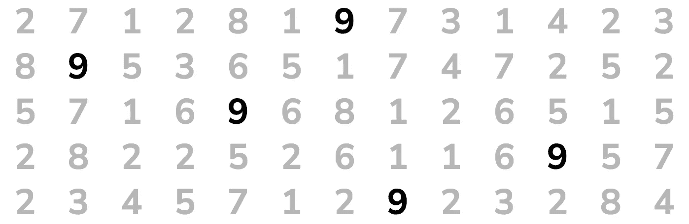

前注意加工

因为我们改变了这些数字的**颜色强度**，它们现在明显地突出来了。突然，你面前出现了五个 9。这是前注意加工和图像记忆在起作用。

现在让我们看看如何在数据可视化中集成这个概念，使用下面的例子，分析订单数和销售额之间的相关性。

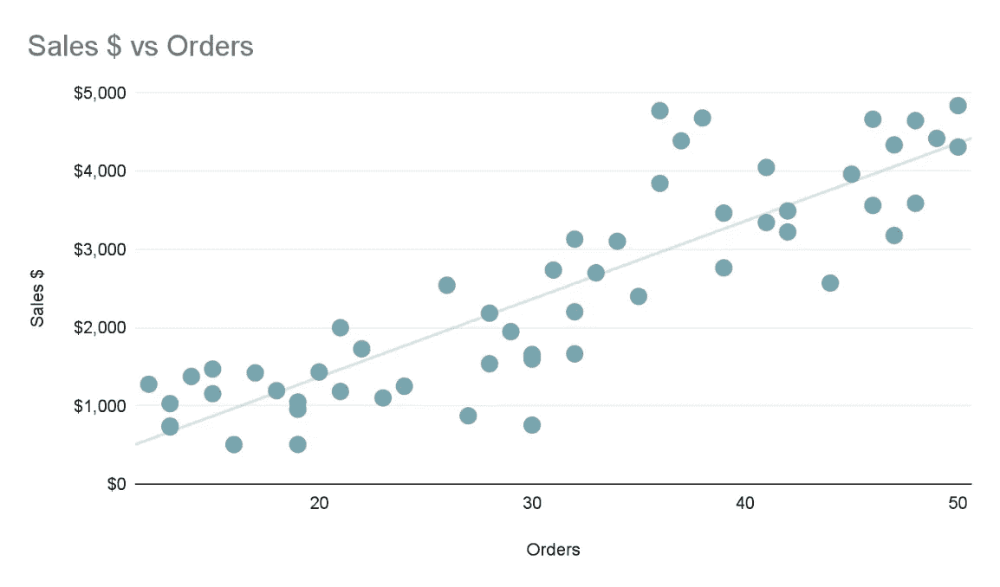

请注意，在没有任何视觉指示的情况下，您是如何独自处理所有信息的。你也许能从这张图表中找到自己的见解，但你必须好好利用你的短期记忆，这需要时间。

现在看看当我们将前注意属性包含到同一个图中时会发生什么。

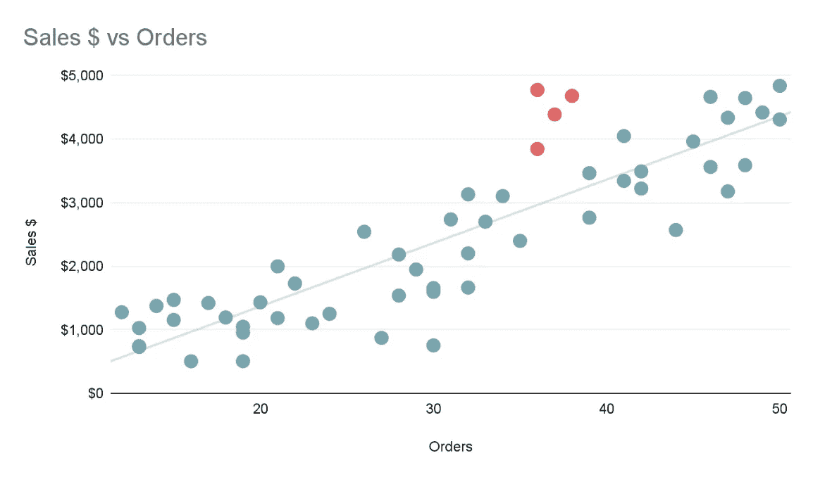

通过修改这四个数据点的**色调**，你可以让它们变得突出，现在你可以清楚地看到你在前面的例子中可能错过的图案。

前注意加工是一个非常强大的概念。在数据可视化中正确使用它可以让你的观众在意识到他们正在看之前就看到你想让他们看到的东西。

# 2.洞察时间到了

洞察时间对应于从图表或可视化中获得洞察力所需的时间。**越低越好**。你想让你的观众尽快从可视化中获得洞察力。

饼图是一个很好的例子来说明这个概念，虽然它们仍然被广泛使用，但你真的想远离它们。

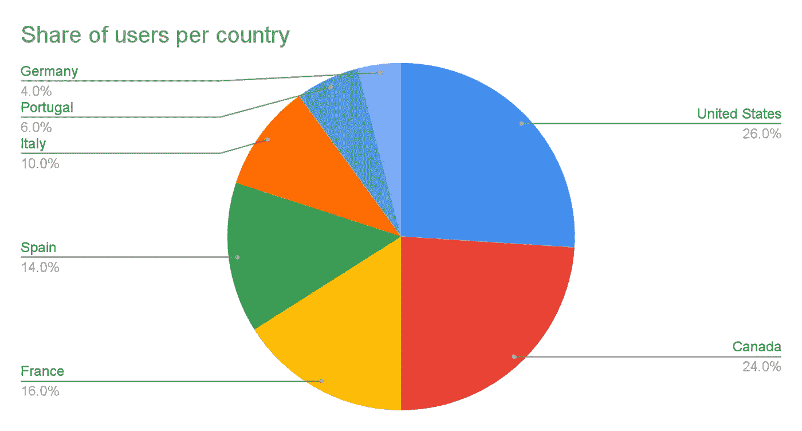

是洞察的时候了📈

使用上面的饼图示例，您可以注意到，从这种类型的图表中获得洞察力所需的时间非常长。你需要在切片和图例之间来来回回才能理解它。在这里，你让你的观众努力工作来获得你的信息。

现在，让我们看看如何改进它，并缩短洞察时间。

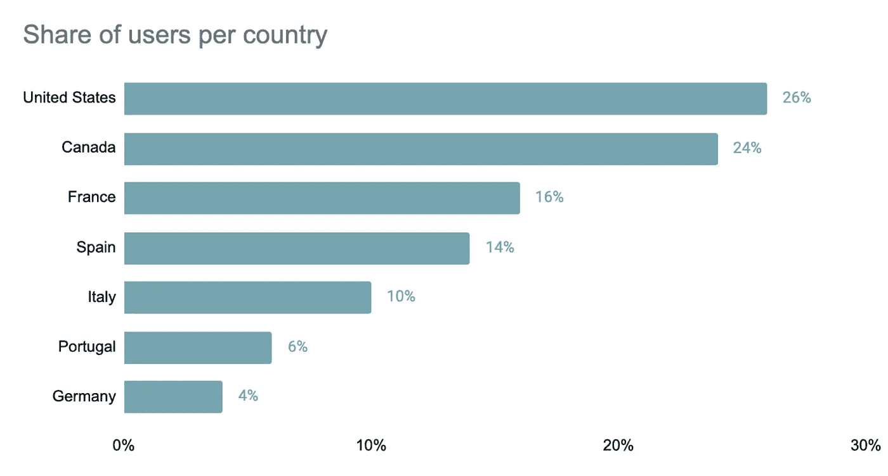

洞察时间缩短📉

将你的可视化转换成一个简单的水平条形图，瞧！你的眼睛自然地扫视每个国家。他们不需要像上一个例子那样在图表中移动。

想要将观众的注意力集中在表现最佳的欧洲市场上吗？你可以使用上面提到的前注意属性概念来进一步减少洞察的时间。

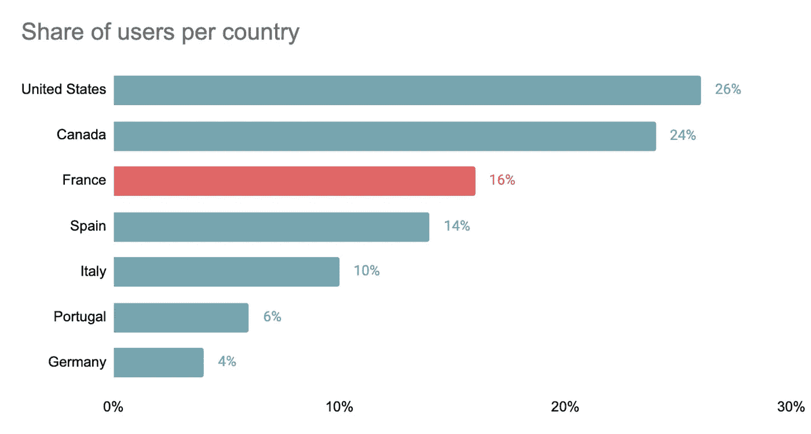

你的观众现在开始看到你的故事了。他们只花了几秒钟。

# 3.数据-油墨比

> 图形中用于数据的墨水份额越大，效果就越好 *—爱德华·塔夫特*

你的图表是用墨水做的。有些墨水代表重要的东西，有些则不重要。爱德华·塔夫特的书，*定量信息的可视化展示*，介绍了数据-墨水比率的概念，即你应该尽可能多地将墨水用于数据。换句话说，你应该消除所有不必要的信息，这些信息会分散你的观众对你想要传达的信息的注意力。

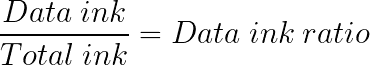

为了在你的图表中最大化你的数据-墨水比率，你应该问自己，'*如果这个被消除了，数据会遭受任何损失吗？'*如果答案是‘T6’否，‘摆脱它。

花点时间看看下面的组合折线图，测量两个关键的移动应用性能指标。

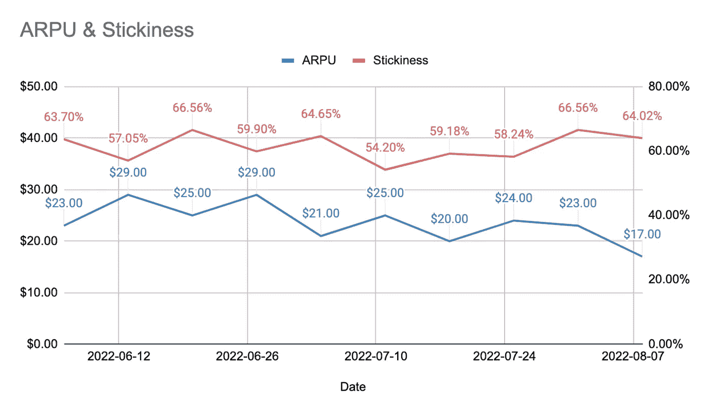

让我们看看如何通过几个步骤最大化数据-墨迹比。

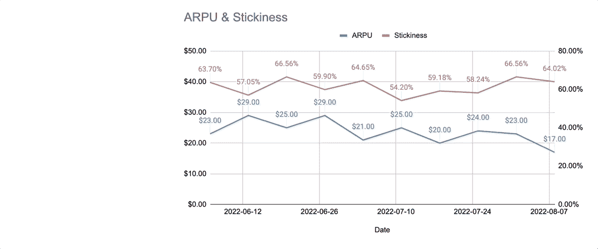

通过应用一组简单的动作，你已经消除了图表中的所有噪音，降低了你的观众的认知负荷。你的信息现在能更快地影响他们。

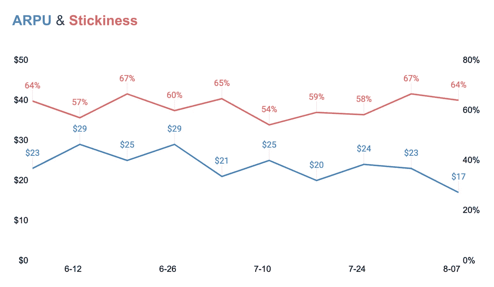

# 结论

作为一名分析师，你可能会认为你的职责仅限于发现隐藏在数据中的故事。但是，确保你的故事与你的观众保持一致往往会使一个好的分析师和一个伟大的分析师之间的差异。为此，请尽量利用好这三个概念:

1.  通过使用预先注意属性，利用他们的标志性记忆，帮助你的观众关注你的故事的要点。
2.  总是问自己，“为这张图表绘制洞察力需要多长时间？”“还能改进吗，”大多数时候，答案是肯定的。所以保持简单。
3.  只保留对你的信息至关重要的数据，去掉其余的。并不是所有的可视化信息都同样重要。有时候，少即是多。

这些简单的概念将帮助你创造简洁明了的视觉效果，让你的观众更容易获得你想要传达的洞察力，并将你的故事转化为具体的行动。

如果你必须记住上面的一件事，这里是最重要的一点:

> 最重要的是展示数据——爱德华·塔夫特

*除特别注明外，所有图片均为作者所有。*

# 参考

南少数，给我看数字:设计图表启发(第 2 版。)(2012)分析出版社

名词（noun 的缩写）C. Knaflic,《用数据讲故事:商业专家数据可视化指南》(第 1 版。)(2015)，威利

E.R. Tufte，定量信息的视觉显示(第 2 版。)(2001)，图形出版社