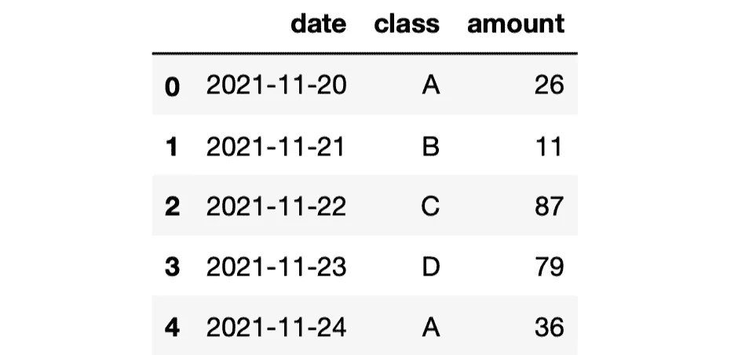
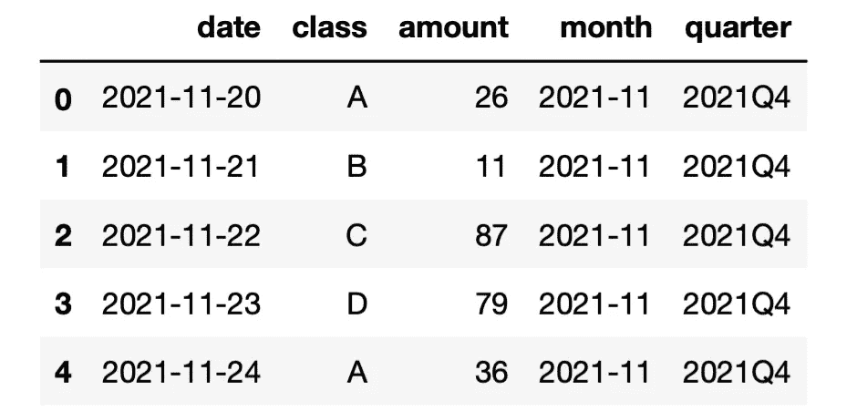
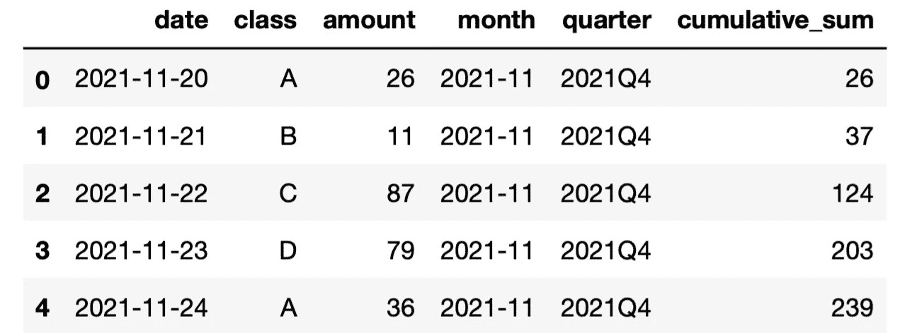
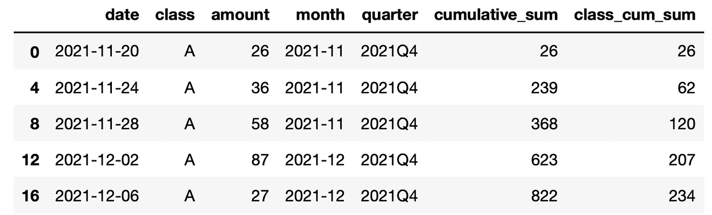

# 你应该知道的 3 个不常见的熊猫把戏

> 原文：<https://towardsdatascience.com/3-not-so-common-pandas-tricks-you-should-know-b26cc7536291>

## 充分利用熊猫


[约书亚·钟](https://unsplash.com/@joshuachun?utm_source=unsplash&utm_medium=referral&utm_content=creditCopyText)在 [Unsplash](https://unsplash.com/s/photos/style?utm_source=unsplash&utm_medium=referral&utm_content=creditCopyText) 上的照片

如果你正在读这篇文章，你一定听说过或用过熊猫。因此，我跳过了谈论大熊猫有多棒的部分。😊

在本文中，我们将通过例子展示一些不常用的熊猫功能。在我三年的熊猫之旅中，我并没有经常遇到它们。

学习熊猫或者其他软件工具的最好方法是练习。这就是我们要做的。第一步是创建一个样本数据框架。

```
import numpy as np
import pandas as pddf = pd.DataFrame({

   "date": pd.date_range(start="2021-11-20", periods=100, freq="D"),
   "class": ["A","B","C","D"] * 25,
   "amount": np.random.randint(10, 100, size=100)})df.head()
```



df 的前 5 行(图片由作者提供)

我们有一个 3 列 100 行的数据帧。date 列包含 100 个连续的日期，class 列包含 4 个与 object 数据类型一起存储的不同值，amount 列包含 10 到 100 之间的随机整数。

## 1.至 _ 期间

我们使用具有许多不同间隔或周期的日期，例如日、周、月、季度等等。使用哪一种取决于手头的任务。例如，在收入仪表板中，我们可能希望显示月收入或季度收入。

在 Pandas 中，操作日期的函数在 dt 访问器下可用。to_period 函数允许将日期转换为特定的时间间隔。我经常使用的周期是月和季度。

month 方法仅返回月份，这在许多情况下没有用，例如报告历史收入。我们需要能够区分 2020 年 12 月和 2021 年 12 月。这可以通过在 to_period 函数中使用“M”句点来实现。同样，我们可以用“Q”提取季度信息。

让我们为年-月和季度创建新的列。

```
df["month"] = df["date"].dt.to_period("M")
df["quarter"] = df["date"].dt.to_period("Q")df.head()
```



df 的前 5 行(图片由作者提供)

让我们也检查一下数据框架中不同的年-月和季度值。

```
df["month"].value_counts()**# output**
2021-12    31
2022-01    31
2022-02    27
2021-11    11
Freq: M, Name: month, dtype: int64--------------------------
df["quarter"].value_counts()**# output**
2022Q1    58
2021Q4    42
Freq: Q-DEC, Name: quarter, dtype: int64
```

## 2.累计和分组

累积是熊猫非常有用的功能。它计算列中值的累积和。我们通常是这样使用它的:

```
df["cumulative_sum"] = df["amount"].cumsum()df.head()
```



df 的前 5 行(图片由作者提供)

现在，我们得到了“金额”列中值的累积和。但是，它不考虑类。在某些情况下，我们可能需要分别计算不同类别的累计和。

谢天谢地，熊猫让这个任务变得非常简单。我们只需要按类列对行进行分组，然后应用 cumsum 函数。

```
df["class_cum_sum"] = df.groupby("class")["amount"].cumsum()
```

让我们确认一下 a 班的成绩。

```
df[df["class"]=="A"].head()
```



(图片由作者提供)

“类累积和”列包含为每个类单独计算的累积和值。

## 3.类别数据类型

我们经常需要处理分类数据，这些数据具有有限的、通常是固定数量的可能值。在我们的数据框架中，class 列是一个具有 4 个不同值的分类变量:A、B、C、d。

默认情况下，该列的数据类型变为“object”。

```
df.dtypes**# output**
date              datetime64[ns]
class                     object
amount                     int64
month                  period[M]
quarter            period[Q-DEC]
cumulative_sum             int64
class_cum_sum              int64
```

Pandas 还有一个“category”数据类型，它消耗的内存比 object 数据类型少得多。因此，最好尽可能使用 category 数据类型。

让我们复制 class 列，但是使用“category”数据类型。

```
df["class_category"] = df["class"].astype("category")df.dtypes**# output**
date              datetime64[ns]
class                     object
amount                     int64
month                  period[M]
quarter            period[Q-DEC]
cumulative_sum             int64
class_cum_sum              int64
class_category          category
dtype: object
```

我们现在可以比较 class 和 class_category 列的内存消耗。

```
df.memory_usage()**# output**
Index             128
date              800
class             800
amount            800
month             800
quarter           800
cumulative_sum    800
class_cum_sum     800
class_category    304
dtype: int64
```

class_category 列消耗的内存不到 class 列的一半。相差 496 字节，不算多。然而，当我们处理大型数据集时，这种差异肯定会很重要。

*你可以成为* [*媒介会员*](https://sonery.medium.com/membership) *解锁我的全部写作权限，外加其余媒介。如果你已经是了，别忘了订阅*<https://sonery.medium.com/subscribe>**如果你想在我发表新文章时收到电子邮件。**

*感谢您的阅读。如果您有任何反馈，请告诉我。*