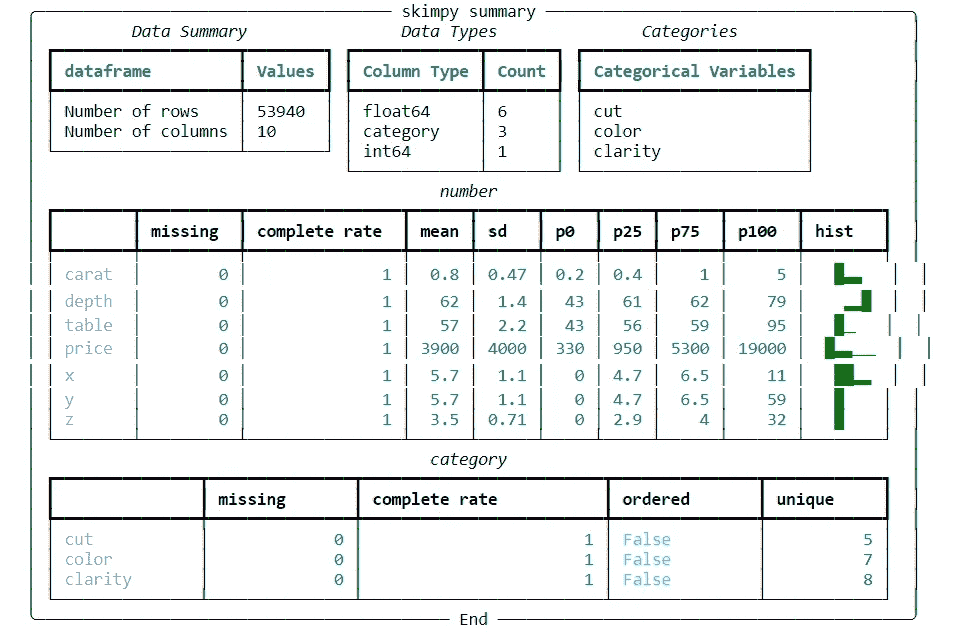

# 3 个 Python 库，用于您可能错过的有效 EDA

> 原文：<https://towardsdatascience.com/3-python-libraries-for-effective-eda-that-you-might-have-missed-3320f48ff070>

# 3 个 Python 库，用于您可能错过的有效 EDA

## 通过几行代码，EDA 变得更加简单


迈克·多尔纳在 [Unsplash](https://unsplash.com?utm_source=medium&utm_medium=referral) 上的照片

# 介绍

EDA，或探索性数据分析，是每个数据科学努力的第一阶段。这也是数据挖掘的第一阶段，帮助获得数据洞察力，同时不做任何假设。分析师可以使用 EDA 浏览数据描述，理解变量之间的关系，并通过验证数据源、发现缺失值和识别异常值来评估数据质量。简而言之，EDA 在生成精确的数据报告和精确的数据模型方面起着至关重要的作用。

对于初学者来说，由于不熟悉数据挖掘中的语法和过程，可能需要时间来完成这个初步筛选过程。我刚开始了解 Python 的时候也是这种情况。当时，我只希望有一种工具能一次自动为我做所有的工作。甚至在今天，随着我对数据挖掘和清理过程越来越熟悉，我希望在一些特定的过程中节省时间，并快速前进。

这就是为什么今天，我想让您接触一些强大的 EDA 工具，它们可能会帮助您更好地全面了解我们正在浏览的数据。

# 资料组

在 Python 包`seaborn`里，有很多免费数据集可以尝试。然而，我会选择名为**“钻石”的数据集**下面是我获取数据集的方法:

```
import seaborn as sns
df = sns.load_dataset('diamonds')
```

***数据来源参考:*** *Waskom，m .等人，2017。mwaskom/seaborn:v 0 . 8 . 1(2017 年 9 月)，芝诺多。可在:*[*https://doi.org/10.5281/zenodo.883859.*](https://doi.org/10.5281/zenodo.883859.)

# SweetViz

就个人而言，这是我最喜欢的自动化 EDA 之一。为什么？因为它超级酷的界面。为了证明我的说法，在图 1 中，您可以看到由 SweetViz 生成的报告的概述。很酷，对吧？

**图 1:作者 df — Gif 数据汇总**

## **那么，SweetViz 是什么？**

好吧，简单来说，SweetViz Package 是一个开源的 Python 库，它可以自动启动 EDA，只需几行代码就可以创建令人惊叹的视觉效果。输出是一个完全独立的 HTML 应用程序，如图 1 所示。SweetViz 有助于快速查看不同的数据集特征，并主要提供有关变量之间关联的完整信息。SweetViz 的另一个突出特点是其目标分析，它解释了目标值与其他变量的关系。

## 我们如何运行它？

基本上，创建报告有三个功能，分别是`analyze()`、`compare()`和`compare_intra()`

首先，让我们试着得到 ***所有数据集的汇总。*** `analyze()`就是你在这种情况下应该使用的函数。

```
#Installing the library 
pip install sweetviz#Importing the library 
import sweetviz as svreport = sv.analyze(df)
report.show_html()
```

而结果就是你在上面的**图 1** 中看到的。

当你想 ***比较两个独立的数据帧时呢？*** 比如我的情况，我想比较训练和测试集？非常简单，使用`compare()`，这是我得到的结果:

```
#Spliting data set into training and testing set
training_data = df.sample(frac=0.8, random_state=25)
testing_data = df.drop(training_data.index)#Applying compare function
report2 = sv.compare([training_data,"TRAINING SET"], [testing_data, "TESTING SET"])
report2.show_html()
```

**图 2:比较两个独立的数据帧——作者 Gif**

如果你想在你的数据子集之间进行比较，你可以选择`compare_intra()`。例如，图 3 显示了 D 颜色的子集和其余部分之间的比较。

```
report3 = sv.compare_intra(df, df["color"] == "D", ["D", "The rest"])report3.show_html()
```

**图 3:比较 2 个子集——作者 Gif**

# 数据准备

如果要用一句话来形容这个方案，我会说，“它已经做了所有的工作。”换句话说，我们可以在创建的报告中找到几乎所有的信息。这个软件包的一个优点是输出是交互式的，这使得报告更便于跟踪。

DataPrep 绝对是我最喜欢的自动化 EDA。与 SweetViz 类似，该库也有助于在一行代码中探索数据。这就是你要做的:

```
#Installing the library
!pip install dataprep#Importing 
from dataprep.eda import create_report#Creating report
create_report(df)
```

**图 4:作者的 EDA-Gif 数据准备图**

# 撇

Skimpy 是一个小的 Python 包，它提供了数据汇总的扩展版本。如图 5 所示，数据报告非常简单，但是包含了几乎所有必要的信息。该库不像以前的报告那样完整；不过，我觉得这个总结有时候用起来还是够用的。它的运行速度也比其他两个库快。

```
from skimpy import skim
skim(df)
```



**图 5:简略摘要—作者图片**

# 下一步是什么？

有许多令人兴奋的自动化 EDA 库，我肯定会进一步学习，如 Bamboolib、Autoviz 或 Dora。我目前只有这些了。

如果你们有任何建议，请与我分享，:D，我很乐意知道更多。