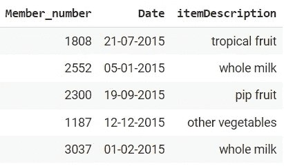
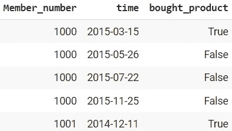
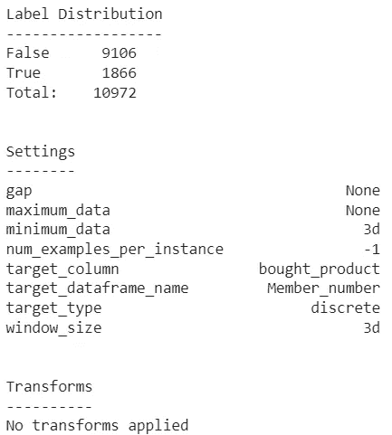
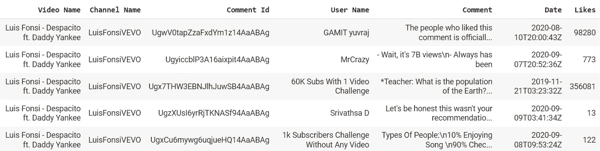
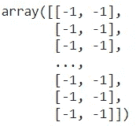
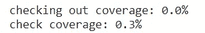
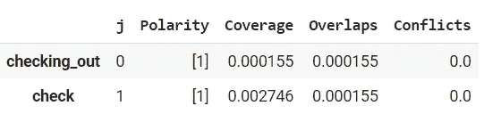
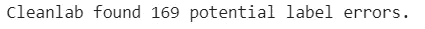
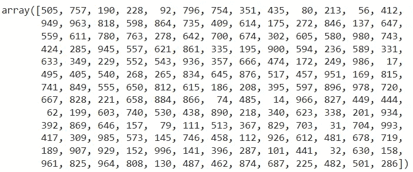

# 用于自动数据集标注过程的 3 个 Python 包

> 原文：<https://towardsdatascience.com/3-python-packages-for-automatic-dataset-labeling-process-3fb1d898db5b>

## 数据标注对于机器学习项目的成功至关重要


照片由[穆拉特·翁德尔](https://unsplash.com/@muratodr?utm_source=medium&utm_medium=referral)在 [Unsplash](https://unsplash.com?utm_source=medium&utm_medium=referral) 上拍摄

数据科学项目涉及大量的数据收集、清理和处理。我们做了所有的步骤来确保数据集质量对于机器学习训练来说是好的。尽管如此，数据科学项目中有一个特别重要的部分可能决定项目的成败:标签。

每个数据科学项目都是为了解决特定的业务问题而开发的，例如，客户流失、购买倾向、欺诈等。考虑主题很容易，但一旦我们需要考虑业务方面，标记过程就变得复杂了。

由于不同的业务需求，同一个客户流失项目可能有不同的标签——一个项目可能只考虑一年内客户流失的人数，而另一个项目则希望预测整体客户流失情况。看到标签已经变得如此不同了吗？这就是为什么贴标过程是必不可少的。

为了帮助从事标注处理的数据人员，我想介绍几个我认为对日常工作有用的 Python 包。包裹是什么？让我们开始吧。

# 1.构成

[Compose](https://compose.alteryx.com/en/stable/index.html) 是一个为自动化预测工程工作而开发的 Python 包。Compose 是专门为监督预测问题生成标签而创建的。用户定义标签标准，并合成运行历史数据以创建标签预测。

Compose 主要被设计为与名为 [featuretools](https://docs.featuretools.com/) 和 [EvalML](https://evalml.alteryx.com/) 的自动化特征工程包一起工作，用于自动化机器学习，但在本文中，我们将重点关注 Compose。

让我们从安装 Compose 包开始。

```
pip install composeml
```

此外，对于这个示例，我将使用 Heerla Dedhia 的 Kaggle 中的[杂货数据集](https://www.kaggle.com/datasets/heeraldedhia/groceries-dataset),该数据集在市场上可以买到。

```
import pandas as pddf = pd.read_csv('Groceries_dataset.csv')
df['Date'] = pd.to_datetime(df['Date'])df.head()
```



作者图片

数据集包含 3 列:ID(“Member _ number”)、购买时间(“Date”)和购买的项目(“itemDescription”)。

现在，假设我们有一个业务问题:

> "顾客会在下一个购物周期购买一些东西吗？"

根据上面的问题，我们可以尝试使用可用的数据集来回答它们，但是我们需要考虑两个参数:

1.  客户会购买什么产品？
2.  下一次购物期是多久？

假设我们想知道顾客是否会在未来 3 天内购买全脂牛奶；然后，我们可以尝试根据这个定义创建标签。

要开始为标签工作使用 Compose 包，我们需要首先定义符合我们标准的标签函数。

```
def bought_product(ds, itemDescription): return ds.itemDescription.str.contains(itemDescription).any()
```

上面的代码将检查客户是否购买了特定的产品。创建标签函数后，我们将使用以下代码设置标签生成器。

```
lm = cp.LabelMaker(#We want to process each customer so we use the Customer ID
target_dataframe_name='Member_number',#Because we want to know if the customer bought item on the next period, we would need the time column
time_index='Date',#Set the label function
labeling_function=bought_product,#How long the shopping Period (or any period between time)
window_size='3d'
)
```

当我们已经设置了 LabelMaker 类时，我们就可以运行 label maker 进程了。

```
lt = lm.search(#The dataset
df.sort_values('Date'),#Number of label per customers, -1 means find all the existing
num_examples_per_instance=-1,#What product we want to find
itemDescription='whole milk',minimum_data='3d',
verbose=False,)lt.head()
```



作者图片

输出的三列解释如下:

*   Member_number 与购买相关。由于每个顾客可以购买不止一次，因此可能有不止一个例子。
*   时间是购物期的开始。这也是建筑物特征的截止时间。
*   如果产品是在期间窗口内购买的，则它们是通过标签函数计算的。

我们可以使用下面的代码来获得结果的标签摘要。

```
lt.describe()
```



作者图片

从标记过程中，我们可以看到在我们的搜索中有一个不平衡的例子。在购物期的 3 天内购买全脂牛奶的顾客似乎不多。

这就是作曲的例子。如果你想尝试其他数据或看另一个例子，我们可以访问[教程](https://compose.alteryx.com/en/stable/examples/predict_next_purchase.html)。

# 2.通气管

[通气管](https://www.snorkel.org/get-started/)是专门为构建数据集标注而开发的 Python 包，无需任何手动标注过程。speak 旨在用几行代码减少标签工作所用的时间。通气管有 3 个主要特点:

*   **标注数据，**
*   **转换数据，**
*   **切片数据**。

但是，本文将只关注标记数据的过程。让我们试试通气管套件，让我们的贴标过程自动化。

首先，我们需要安装软件包。

```
pip install snorkel
```

出于指导的目的，我们将使用来自 Nipun Arora 的 Kaggle 的 [YouTube 评论数据集](https://www.kaggle.com/datasets/nipunarora8/most-liked-comments-on-youtube),该数据集在市场上可以买到。

```
import pandas as pddf = pd.read_csv('youtube_dataset.csv')
df.head()
```



作者图片

数据集包含许多字段，包括 YouTube 评论数据。假设我们想从数据集中训练一个 YouTube 评论垃圾预测器。在这种情况下，我们需要用特定的要求来标记数据—我们认为什么是垃圾邮件？

使用 scupk，我们可以创建一个称为标记功能的弱监督功能——监督规则和启发式规则，将标签分配给未标记的训练数据。

为了清楚起见，让我们将火腿视为 0，垃圾邮件视为 1，弃权为-1。

```
ABSTAIN = -1
HAM = 0
SPAM = 1
```

此外，我认为垃圾邮件的文本中包含“check”和“checking _ out”。让我们用上面的规则来构建标签函数。

```
from snorkel.labeling import labeling_function@labeling_function()def check(x):
   return SPAM if "check" in x.text.lower() else ABSTAIN @labeling_function()def checking_out(x):
   return SPAM if "checking out" in x.text.lower() else ABSTAIN
```

准备好函数后，我们可以标记注释数据。但是，我们需要更改希望作为“文本”处理的列名。

```
df = df.rename(columns = {'Comment' : 'text'})
```

因为我们也使用熊猫数据帧，我们将使用`PandasLFApplier`来应用标签功能。

```
from snorkel.labeling import PandasLFApplierlfs = [checking_out, check]applier = PandasLFApplier(lfs=lfs)L_train = applier.apply(df=df)
```

applier 函数的结果是一个标签矩阵，其中列表示标签函数，行表示数据点。

```
L_train
```



作者图片

从标签应用程序函数中，让我们检查每个单词的垃圾邮件覆盖率是多少。

```
coverage_checking_out, coverage_check = (L_train != ABSTAIN).mean(axis=0)print(f"checking out coverage: {coverage_checking_out * 100:.1f}%")
print(f"check coverage: {coverage_check * 100:.1f}%")
```



作者图片

根据我们的标签功能，似乎没有那么多的评论是垃圾邮件。让我们使用通气管中的功能来获得更详细的总结。

```
from snorkel.labeling import LFAnalysisLFAnalysis(L=L_train, lfs=lfs).lf_summary()
```



作者图片

使用`LFAnalysis`我们可以获得更多关于贴标过程的详细信息。每一列代表以下信息:

*   **极性**:标签功能的唯一标签(不含弃权)，
*   **覆盖率**:数据集中的 LF 标签分数，
*   **重叠**:该 LF 和至少一个其他 LF 标签重叠的数据集部分
*   **冲突**:该 LF 和至少一个其他 LF 标签不一致的数据集部分。

这是通气管在贴标过程中的基本用法。对于这些包，您仍然可以做很多事情并从中学习。重要的是，通气管会减少你的标记活动。

# 3.清洁实验室

[Cleanlab](https://docs.cleanlab.ai/v2.0.0/index.html) 是一个 python 包，用于发现标签问题并自动修复它们。本质上，这个包不同于我前面提到的两个包，因为 Cleanlab 要求我们的数据集已经包含标签。

Cleanlab 旨在减少修复数据错误的手动工作，并帮助使用干净的数据集训练可靠的 ML 模型。大多数时候，坏标签是因为贴错标签而产生的，Cleanlab 旨在解决这个问题。

让我们用一个数据集例子来使用 Cleanlab。首先，我们需要安装软件包。

```
pip install cleanlab
```

我们将使用来自 Sklearn 函数的信用数据，并设置随机种子以获得稳定的结果。数据来自于 [OpenML 信用数据](https://www.openml.org/search?type=data&status=active&id=31)，其来源是 [UCI](https://archive.ics.uci.edu/ml/datasets/statlog+(german+credit+data)) 并可商业使用。

```
from sklearn.datasets import fetch_openml
import random
import numpy as npSEED = 123456
np.random.seed(SEED)
random.seed(SEED)data = fetch_openml("credit-g")
X_raw = data.data
y_raw = data.target
```

之后，我们将使用几个 Sklearn 函数进行一些数据清理。

```
import pandas as pd
from sklearn.preprocessing import StandardScaler
cat_features = X_raw.select_dtypes("category").columnsX_encoded = pd.get_dummies(X_raw, columns=cat_features, drop_first=True)
num_features = X_raw.select_dtypes("float64").columnsscaler = StandardScaler()
X_scaled = X_encoded.copy()
X_scaled[num_features] = scaler.fit_transform(X_encoded[num_features])y = y_raw.map({"bad": 0, "good": 1})  # encode labels as integers
```

现在，我们将尝试从数据集样本中找到一个错误标签。根据 cleanlab 文档，cleanlab 需要从模型中对每个数据点进行概率预测。

Cleanlab 也仅用于**样本外**预测概率，即训练期间模型中的样本。这就是为什么我们会使用 K 倍交叉验证来获得样本外概率。

让我们先建立模型来计算概率。我们将使用样本逻辑回归。

```
from sklearn.linear_model import LogisticRegressionclf = LogisticRegression()
```

然后我们会建立 K 倍交叉验证。

```
from sklearn.model_selection import cross_val_predictnum_crossval_folds = 5 pred_probs = cross_val_predict(
    clf,
    X_scaled,
    y,
    cv=num_crossval_folds,
    method="predict_proba",
)
```

最后，我们将使用 Cleanlab `find_label_issues`根据样本外概率和给定标签在数据集中找到坏标签。

```
from cleanlab.filter import find_label_issuesranked_label_issues = find_label_issues(labels=y, pred_probs=pred_probs, return_indices_ranked_by="self_confidence")print(f"Cleanlab found {len(ranked_label_issues)} potential label errors.")
```



作者图片

如果我们检查结果，我们将得到坏标签的位置。

```
ranked_label_issues
```



作者图片

有了这些信息，我们需要再次检查数据，并确保质量优良。

使用 Cleanlab，您仍然可以探索许多事情。如果你想知道更多，请访问[文档](https://docs.cleanlab.ai/v2.0.0/index.html)。

# 结论

标签和数据科学项目一样重要，因为许多机器学习模型都依赖于正确的标签。为了帮助数据科学家在标注过程中工作，我为自动标注过程引入了 3 个 Python 包。这些软件包是:

1.  构成
2.  通气管
3.  清洁实验室

希望有帮助！

> *访问我的* [***社交媒体***](https://bio.link/cornelli)**进行更深入的交谈或有任何问题。**

> **如果您没有订阅为中等会员，请考虑通过我的推荐订阅。**