# 用于交互式数据分析的 3 个 Python 包

> 原文：<https://towardsdatascience.com/3-python-packages-for-interactive-data-analysis-3063a201a589>

## 以更具互动性的方式探索数据


由[Towfiqu barb huya](https://unsplash.com/@towfiqu999999?utm_source=medium&utm_medium=referral)在 [Unsplash](https://unsplash.com?utm_source=medium&utm_medium=referral) 拍摄的照片

数据分析是任何数据人员的主要活动，也是理解我们工作内容所必需的。为了帮助数据分析过程，我们使用了 Python 语言来简化工作流程。然而，有时我们想要一种更具交互性的方式来探索数据。一些人开发了 Python 包来交互式地探索数据以满足需求。

本文将探索 3 个 Python 包，我们可以用它们来交互式地探索数据集。让我们开始吧。

# 1.潘达斯吉

[PandasGUI](https://github.com/adamerose/pandasgui) 是一个简单的 Python 包，为数据集探索提供 GUI。该软件包提供了一个独立的 GUI，具有类似 excel 的体验，我们可以使用它来探索数据集、获取统计数据、可视化数据等等。让我们尝试一下这个包，体验一下实际操作。

首先，我们需要安装 PandasGUI 包。

```
pip install pandasgui
```

安装完这个包之后，我们可以立即使用这个包来研究我们的数据集。作为一个数据集示例，我将使用 seaborn 的 mpg 数据集。

```
#Load Dataset
import seaborn as sns
mpg = sns.load_dataset('mpg')#Initiate the GUI
from pandasgui import show
show(mpg)
```

使用上面的代码，您将在新的屏幕上获得下面的 GUI。

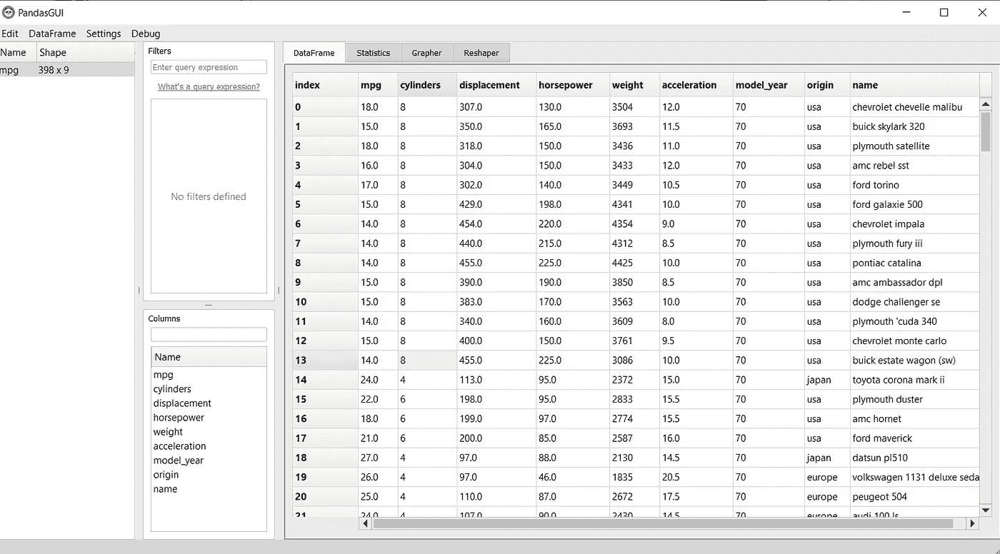

作者图片

PandasGUI 为我们提供了利用各种功能探索数据的选项，包括:

*   数据过滤，
*   统计信息，
*   绘图，
*   数据重塑。

首先，让我们看看 PandasGUI 选项卡。在下面的 GIF 中，你可以看到我们可以根据需要安排标签要求。

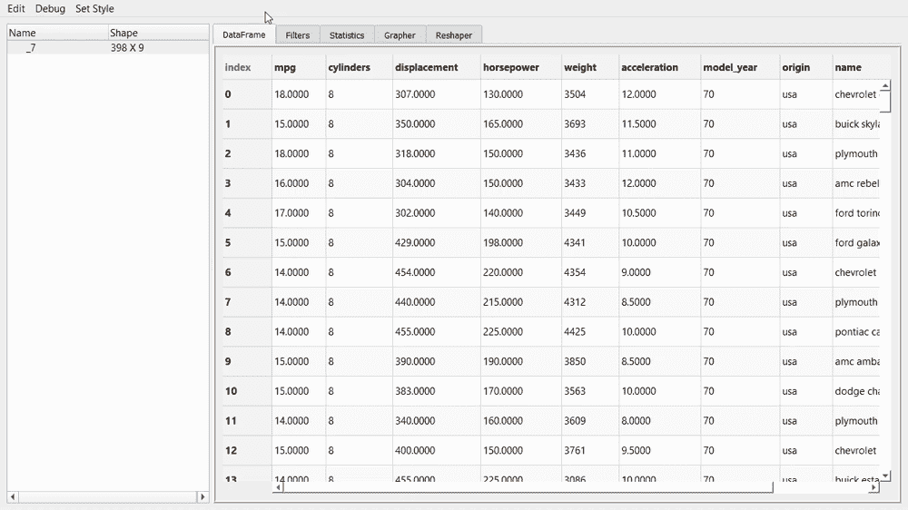

作者创建的 Gif

接下来，我们来看看过滤数据选项卡。此选项卡允许您使用特定查询过滤数据框。要填充的查询是基于 [Pandas 查询](https://pandas.pydata.org/pandas-docs/stable/reference/api/pandas.DataFrame.query.html)的，所以如果您已经了解过它，应该会很熟悉。

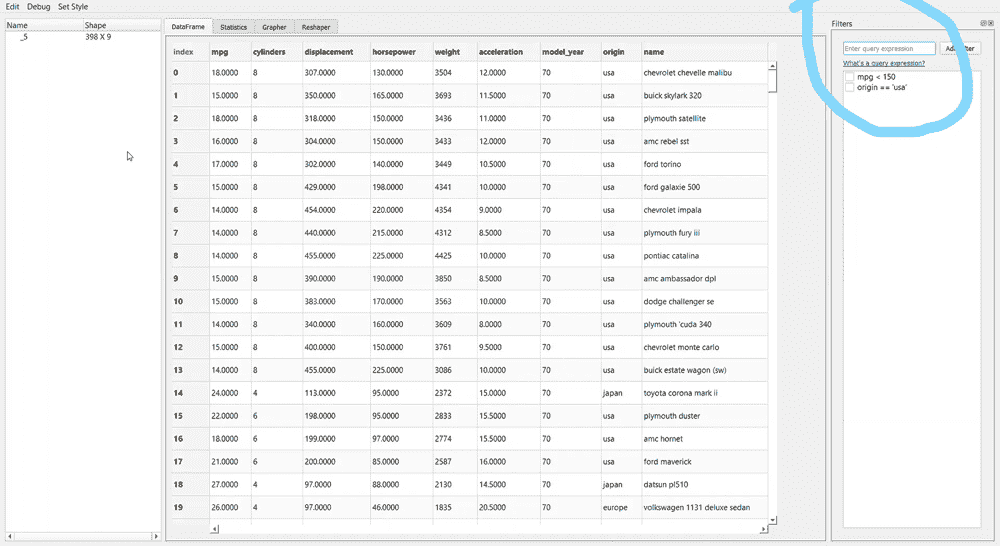

作者创建的 GIF

看一下上面的 GIF。在我的示例中，我编写了“model_year > 72”查询，其中的结果是带有勾选框的查询。过滤条件将永久存在于查询过滤器列表中，当您不需要它时，可以取消选中它。

如果在查询编写过程中出错，只需双击查询并重写即可。就这么简单。

现在，让我们看看“统计”选项卡。

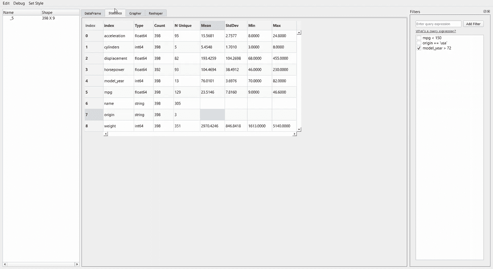

作者创建的 GIF

统计选项卡为您提供数据的简单变量统计，如计数、平均值和标准差。类似于熊猫的`describe`属性。

如果您在前面的选项卡中进行过滤，统计数据将根据您的过滤器进行更改。

接下来，我们将进入 Grapher 选项卡或绘图 GUI。此选项卡允许您创建单个变量图或多个变量图。让我给你看下面的例子。

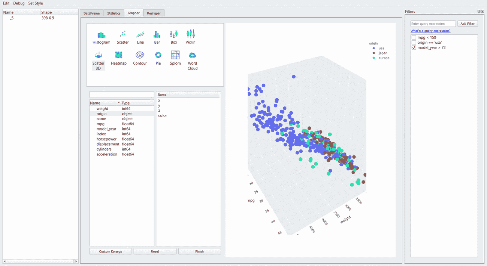

作者创建的 GIF

创建一个情节只是一个拖放的问题，就这么简单。 [plotly](https://plotly.com/) 包用于可视化，因此我们可以通过将光标悬停在图形上来浏览图形。

最后是整形标签。在这个选项卡中，我们可以通过创建新的数据透视表或融合数据集来重塑数据集。

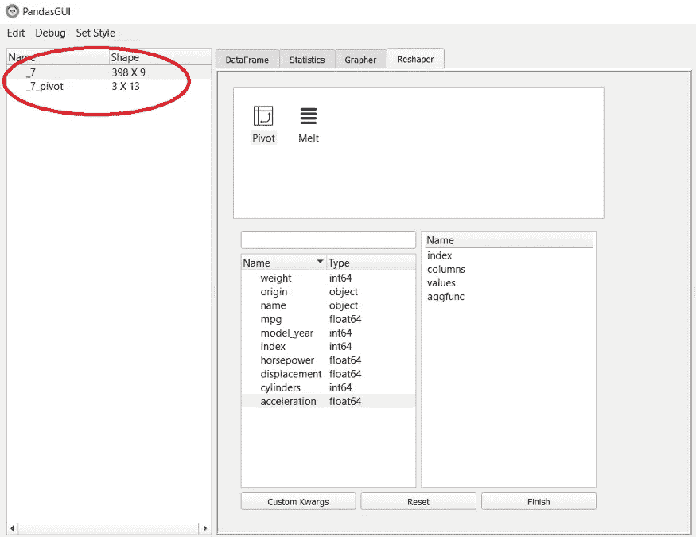

作者创建的图像

如果要将数据集导入新的 CSV 文件或将新的 CSV 文件导出到 PandasGUI，也可以单击下图所示的选择。

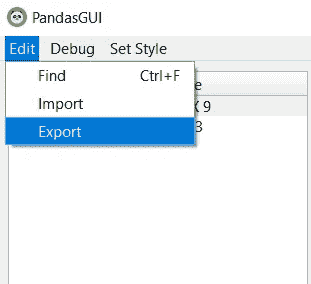

作者图片

# 2.数字童话

[D-Tale](https://github.com/man-group/dtale) 是一个用于交互式数据探索的 Python 包，它使用 Flask 后端和 React 前端来轻松分析数据。数据分析可以直接在你的 Jupyter 笔记本上进行，也可以在笔记本之外进行。让我们试着使用这个包。

首先，我们需要安装软件包。

```
pip install dtale
```

然后，我们可以使用以下代码启动 D-tale 流程。我将使用与前一个示例中相同的 MPG 数据集。

```
import dtale
d = dtale.show(mpg)
d
```

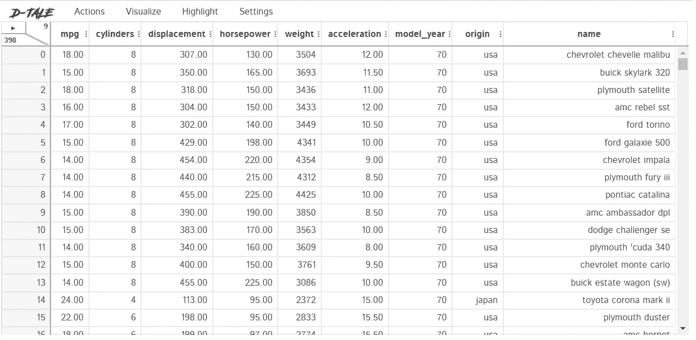

作者图片

你可以用 D-Tale 做很多活动，我无法一一解释。我只会解释我认为对你来说很重要的特性。

首先，让我们看看“操作”选项卡。我们可以操作该选项卡中的数据集，例如过滤、合并或删除。让我们看看 action 选项卡为我们提供了什么。

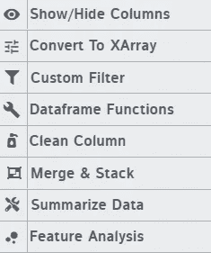

作者图片

操作选项卡具有操作数据集的所有功能，例如数据转换、创建数据框函数和过滤。此外，您可以使用 Summarize Data 函数获得数据摘要。

如果您不确定每个功能是做什么的，您可以突出显示该选项，解释就会出现。

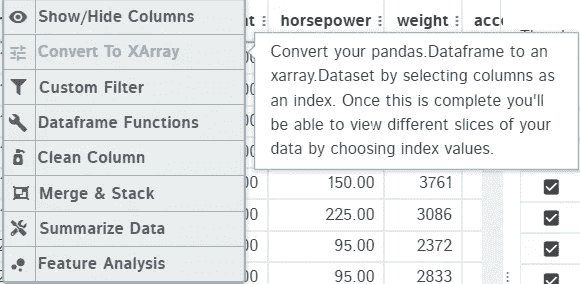

作者图片

就我个人而言，我觉得 D-tale 最大的特点是它的可视化功能。

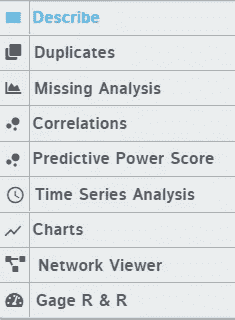

作者图片

正如我们在上图中看到的，我们可以尝试各种可视化方式，例如:

*   **形容**

描述让我们获得基本的统计可视化。

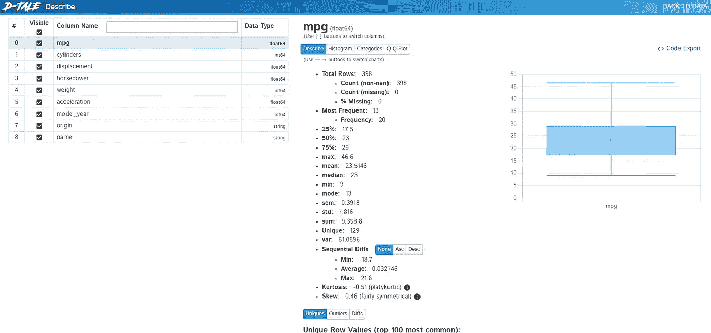

作者图片

*   **预测能力得分**

数据集的 PPS 评分可视化。

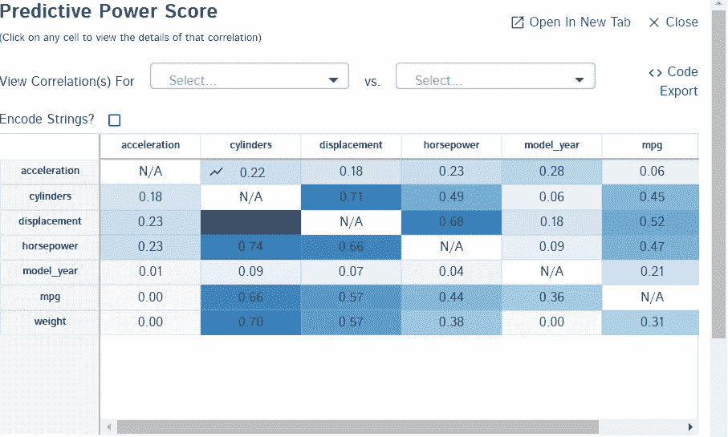

作者图片

*   **各种图表**


作者图片

可视化之后，我们可以使用 Highlight 选项卡来帮助我们突出显示数据集中的各种数据，例如缺失的数据或异常值。

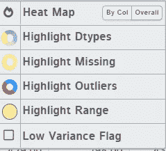

作者图片

最后，你可以改变 D-tale 的设置，比如主题、语言和屏幕大小。

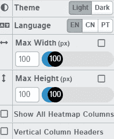

作者图片

# 3.米托

让我们尝试安装米托软件包。[米托](https://www.trymito.io/)是一个 Python 包，可将您的数据框转换为类似 excel 的分析数据框。想象一下，如果您有一个 excel 文件，但它在您的 Jupyter 笔记本中。我们可以使用下面的代码来做到这一点。

```
python -m pip install mitoinstaller
python -m mitoinstaller install
```

安装后，我们激活米托包，用下面的代码创建一个类似 excel 的工作表。

```
import mitosheet
mitosheet.sheet(mpg)
```

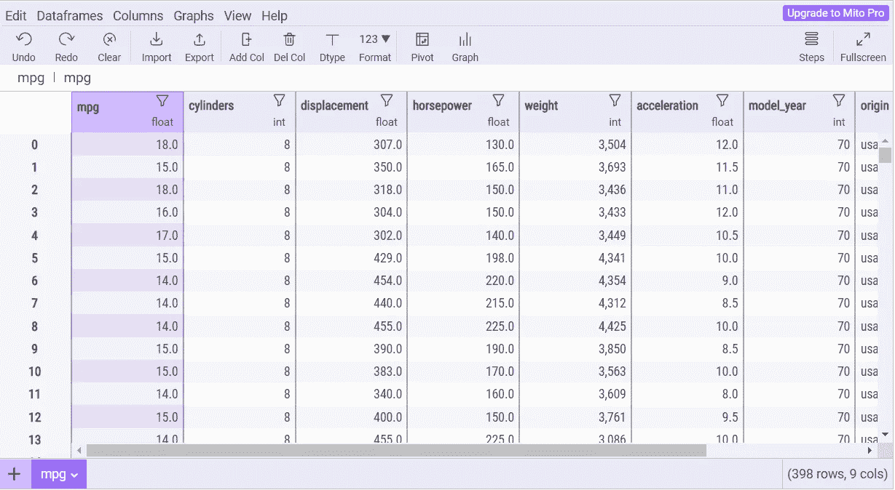

作者图片

如上图所示，我们之前的数据框被转换成了类似 excel 的数据表。

该软件包易于开发，如果您已经熟悉 excel，您会有宾至如归的感觉。让我们尝试使用一些我认为对数据探索有用的特性。

首先，我们可以使用 View column summary statistics 来查看列摘要统计信息。

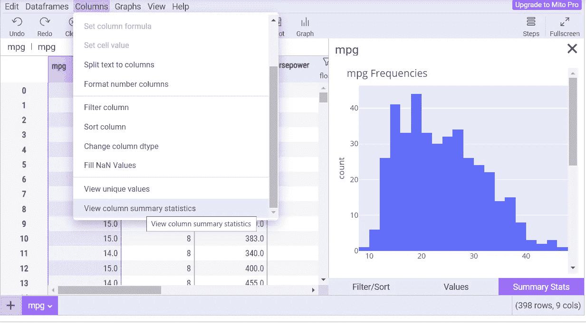

作者图片

然后，我们可以使用 Graph 按钮轻松创建各种图表。


作者图片

如果需要，我们也可以直接在列中过滤数据。

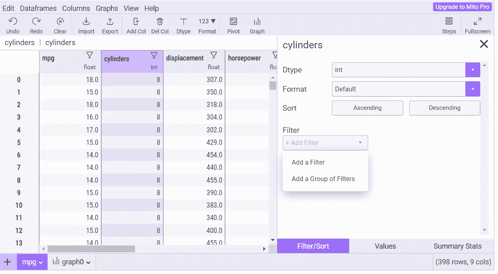

作者图片

你还可以尝试米托的许多功能。如果你喜欢用 excel 进行分析，米托将是一个不错的选择。

# 结论

任何数据人都做数据分析，因为这是必须的步骤。有时，我们想要一种更具互动性的方法来分析数据。为此，这里有 3 个 Python 包来进行交互式数据分析:

1.  潘达斯吉
2.  数字童话
3.  米托

希望有帮助！

> *访问我的* [***社交媒体***](https://bio.link/cornelli)**进行更深入的交谈或有任何问题。**

> **如果您没有订阅为中等会员，请考虑通过* [*我的推荐*](https://cornelliusyudhawijaya.medium.com/membership) *订阅。**