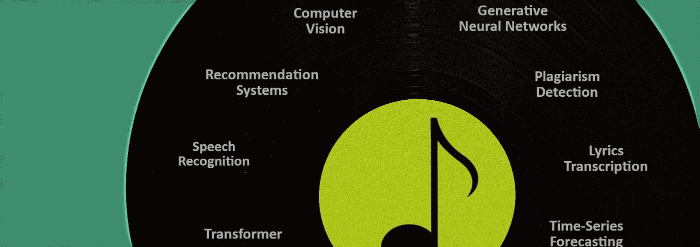
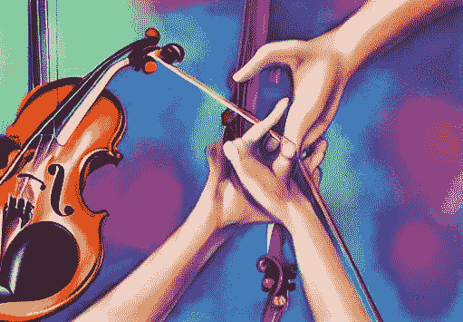
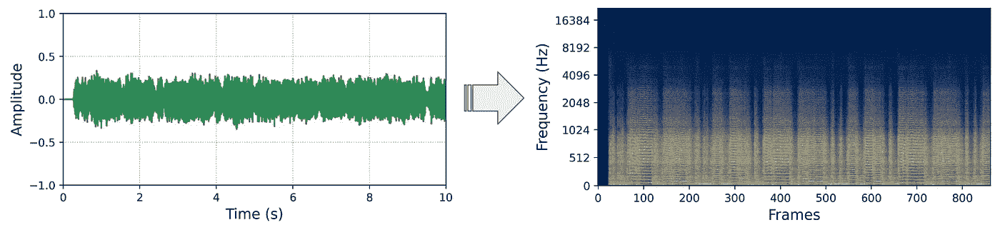

# 音乐是学习和教授数据科学的理想选择的 3 个原因

> 原文：<https://towardsdatascience.com/3-reasons-why-music-is-ideal-for-learning-and-teaching-data-science-59d892913608>

图片由作者提供。

音乐一直是我的一大爱好。以至于我拿到了我的第一个大学音乐学学位。当我开始学习数据科学时，人工智能音乐似乎是一条显而易见的前进道路。然而，在人工智能音乐学习和工作两年多后，我意识到，如果我能回到过去，**我会一遍又一遍地从人工智能音乐开始。因为我很快就要担任教学角色，所以我也一直在深入思考将音乐作为教授数据科学的工具。**

在本文中，我认为音乐是学习和教授数据科学的理想选择，因为:

1.  **音乐有趣又迷人。**
2.  **人工智能音乐包含了大部分人工智能学科。**
3.  有许多未解决的问题。

# 1.音乐对每个人来说都是有趣和迷人的

“各种各样的物种围绕着乐器跳舞的油画，冥想，精神，天堂般的灯光”——由作者使用稳定扩散生成。

现在，这第一个论点似乎是显而易见的，但它并不像听起来那样微不足道。我们不能忽视数据科学可能是一门非常枯燥和抽象的学科。线性代数、贝叶斯随机、梯度下降、反向传播——这些东西不是小菜一碟，尤其是对于非 STEM 学生/毕业生甚至没有学位的人来说。

## 音乐激励着每个人

当事情变得具有挑战性时，你需要拿出更多的意志来保持专注并完成困难的课题。根据*自我决定理论(SDT)，*在这些情况下，你真正需要的是一种尽可能内在的动力**。如果你完全是外部激励(“我需要学习随机，因为我的雇主希望我这么做”)，你已经输掉了这场战斗。尽管真正的内在动机是理想的，但是很少有人喜欢仅仅为了计算梯度而计算梯度。**

**在现实世界中，你只能在更多和更少的内在动力来源之间做出选择。你更喜欢以下两种心态中的哪一种？**

1.  **“我需要学习统计学，因为我想成为一名数据科学家”**
2.  **“我需要研究随机统计，因为这将帮助我理解 Spotify 是如何向我推荐新音乐的”**

**在我看来，两者都不错。不过，我想你们大多数人会选择心态 2。为什么？因为它不是在抽象和面向未来的意义上重要，而是几乎会立即影响你的日常生活。这是那种能让你坐下来学习的动力。音乐深深嵌入了几乎每个人的日常生活。当你可以教他们建立一个流派识别模型时，为什么要教一个班级建立预测模型来对不同种类的龟背竹进行分类？**

## **听音乐很有趣**

**除了为音乐应用程序构建人工智能很酷之外，实际上听音乐更有趣。专业做音乐分类模型快两年了。我要做的最有趣的事情——很大程度上——是通过听音乐和判断模型的预测来对我的模型进行定性评估。通过听音乐来了解你的人工智能的优缺点是非常生动的事情。**

**此外，作为一名数据科学家，有时您必须将您的模型与人类的判断进行比较。让我直截了当地问一句:你是愿意听 200 首音乐来分类它们的流派，还是愿意浏览 200 幅龟背竹的图片来找出每一种是哪一种？**

# **2.音乐包含了大多数人工智能学科**

****

**“多只手伸向一把小提琴，天堂般的背景，温柔”——由作者使用稳定扩散生成。**

**每个数据科学家都知道，处理文本数据与处理图像完全不同。音乐数据的迷人之处在于，它几乎被用于所有主要的数据科学学科，因为这种数据用途广泛。**

## **音乐分类包括图像分类**

**现在，这个事实可能会像我一样让你大吃一惊:最先进的音乐分类模型，如流派、情绪或乐器分类器，本质上是根据图像数据训练的**图像分类模型**。如果你将你的音频文件转换成所谓的频谱图(*图 1* **)** 并在上面微调一个标准的 CNN 图像处理，你很可能会获得令人印象深刻的效果。**

****

**图 Metallica《寻找与毁灭》前十秒的数字化音频信号波形和 Mel 声谱图。图片作者。**

**当然，有许多特定领域的修改可以改进您的模型(Oramas 等人，2017；Choi et al .，2017)，但这可能与您的个人学习/教学目的无关。请记住，当你在构建一个分类器来区分布鲁诺·马斯和迈克尔·杰克逊的音乐时，你也在学习构建分类器来区分空的人行横道和上面有奶奶的人行横道(这对自动驾驶来说是好事)。**

## **音乐总是带有元数据**

**无论是艺术家的名字、专辑的发行年份还是相关的流派，音乐几乎总是带有元数据。在一些免费提供的音乐数据集中，如[免费音乐档案馆(FMA)](https://github.com/mdeff/fma) 或[百万首歌曲数据集](http://millionsongdataset.com/)，你还会发现成百上千的众包标签，涵盖从风格或情绪到情景或关联的所有类别。有时候，你甚至会找到歌词！如果你正试图学习处理基本的文本数据，这里是**的绝佳场所**。**

**事实上，您可以在不接触音频信号的情况下构建有趣且有用的工具。也许你可以通过对不同艺术家的歌词进行情感检测来分析他们的歌词内容。你也可以建立一个关键词推荐系统，正如我在的这篇文章[中所展示的。如果你把元数据和音频结合起来，你可以建立流派或情绪分类器，或者提出你自己的想法。如果你有可用的歌词，你甚至可以尝试使用一个转换器来构建一个歌词转录工具——这就引出了我的下一个观点。](/building-a-recommender-system-for-tagging-music-cd8457d255cc)**

## **音乐数据非常适合变形金刚**

**transformer 架构及其关注机制无疑是过去几年最受关注的机器学习技术。在这一点上，如果有足够的数据，transformer 似乎可以解决所有涉及顺序数据的问题，如文本数据、股票数据或音乐数据。**

**有很多用变形金刚做音乐的很酷的事情。在这个视频中，著名的人工智能大师特里斯坦·伯伦斯展示了他的生成变压器如何为金属乐队的“恩特尔·桑德曼”编写替代鼓:**

**2021 年，德国人工智能初创公司 Cyanite 推出了一款[音乐字幕转换器](https://www.linkedin.com/posts/cyanite-ai_translating-workinprogress-audio-activity-6836656850163920896-tm3X?utm_source=share&utm_medium=member_desktop)，它可以自动为给定的音频输入编写全文描述。随着达尔-E-2 和稳定扩散等扩散模型的流行趋势，首次尝试使用扩散模型进行 MIDI-to-audio 合成[。在接下来的几个月里还会有更多！](https://github.com/magenta/music-spectrogram-diffusion)**

## **人工智能中音乐的其他酷用例**

**自从音乐流媒体服务兴起以来，音乐人工智能中最重要的用例之一就是智能**音乐推荐系统**的开发。概括地说，这些系统由一个相似性度量组成(什么是好的推荐？)和一个搜索算法(如何高效的找到好的推荐？).当谈到音乐推荐系统时，最有趣的部分是开发相似性度量，因为是什么使两个音乐作品彼此相似或不相似并不明显。**

**学习音乐人工智能的一个相当明显的优势是，你所学的大部分**可以转移到其他音频处理任务**，如鸟鸣分类、声音识别或语音转录。虽然肯定存在特定领域的特性，但大多数信号处理和机器学习都非常相似，有时甚至完全相同。随着基于音频的控制开始越来越多地取代键盘，这种可移植性在未来可能会被证明是有用的。**

**最后，音乐是一种很棒的数据类型，可以用来执行**数据扩充**。正如我之前指出的，音乐经常以图像的形式呈现给神经网络。因此，一些基本的图像增强技术，如拉伸和掩蔽是适用的。此外，**音频信号本身可以以多种方式增强**。您不仅可以拉伸信号来增加或减少轨道的速度，或者执行音高移动来使乐曲听起来更低或更高。您也可以将混响、合唱或压缩器等音频效果应用到音频信号。让我告诉你，对于数据科学家和音乐家来说，这是一个有趣的游戏场所。**

# **3.有许多未解决的问题**

****

**“一位老教授沉思一个特别复杂的问题的照片，蜡烛照明，特写”——由作者使用稳定扩散生成。**

**当你刚刚开始学习机器学习技术时，开发世界上第 100，000 个泰坦尼克号幸存者分类器肯定很有趣。然而，在某些时候，你可能会想开发一些在现实世界中有实际价值的东西。这就是为什么我想指出音乐人工智能中的各种问题，这些问题仍然没有得到令人满意的解决。愿这成为你人工智能之旅的灵感和动力。**

## **音乐词干**

**音乐词干背后的想法是将音乐作品的信号分离成其乐器成分。例如，通常将信号分为人声和乐器(2 个干)或人声、节奏和和声(3 个干)。对于初学者来说，这听起来似乎是一个微不足道的任务。毕竟，我们能不能不只是“定位人声”和“删除”它们呢？虽然我不能在这里列出技术细节，但我可以说，在 Deezer 2019 年开创性地发布[sp leater](https://github.com/deezer/spleeter)之前，音乐词干算法的质量远远不可用。**

**虽然市场上出现了许多创新的词干工具，但我仍然认为“孤立的”乐器轨道的质量不令人满意。我推荐你看看这篇[的好文章](https://musictech.com/guides/buyers-guide/best-stem-separation-tools/)，其中来自 musictech.com 的艾利克斯·霍姆斯比较了不同的最先进的堵塞工具。如果这些人工智能生成的茎真的变得与“真正的”孤立乐器轨道不可分，**那将是一场小小的革命**。**

## **音乐一代**

**音乐生成领域与音乐词干领域非常相似:创新的速度非常快，我们越来越接近目标，但我们还没有完全达到目标。首先，我们需要区分生成符号音乐(对音乐应该如何播放的高级描述)和发声音乐(构成实际的(数字模拟的)声学事件)。**

**在 AI 音乐中，常用 *MIDI* 作为一种象征性的音乐形式。粗略来说，MIDI 描述的是什么时候用什么速度弹奏哪个音符(~响度)。优秀的 transformer 模型已经被训练输出 MIDI 符号，这些符号可以被管弦乐队转换成声音音乐。**结果令人印象深刻**，你可以在特里斯坦·伯伦斯用 GPT-2 创作重金属音乐的视频中看到:**

**嵌入的 Youtube 视频显示特里斯坦伯伦斯如何使用 GPT-2 生成重金属音乐。**

**产生声音音乐比产生 MIDI 音乐要困难得多。这并不奇怪，因为 MIDI 是实际音频信号的简化抽象。然而，据我估计，自卡尔&祖科夫斯基(2018)训练递归神经网络生成重金属、摇滚和朋克的有影响力的 SampleRNN 模型以来，人工智能生成的声音音乐的质量并没有实质性的提高。事实上，他们在“Archspire”音乐风格上训练的模型仍然在 YouTube 直播流中全天候创作音乐:**

**Youtube 直播流全天候自动生成重金属音乐。**

## **歌词转录**

**语音转录工具变得越来越强大，现在可以用于多种语言。对于一个局外人来说，在这一点上，抄写音乐歌词似乎是一件微不足道的任务。然而，这与现实相去甚远。事实上，**令人震惊的是，人工智能转录工具在转录流行歌曲等看似简单的任务上仍然表现不佳。在一个[案例研究](https://www.assemblyai.com/blog/how-well-does-ai-transcribe-song-lyrics/)中，音频情报服务 AssemblyAI 显示他们的 AI 可以正确识别大约 20%到 30%的歌词。****

**我可以说，当一个人说瑞典语时，我目前能理解大约 70%的单词，**比 AssemblyAI 理解歌词**好得多。然而，出于显而易见的原因，我不会出售我作为一名瑞典语翻译的服务。此外，当公开评估他们自己的 AI 时，我确信作者选择了有利的例子。此外，所有的歌曲都来自流行、摇滚和 R & B 等流派。我敢打赌，为死亡金属歌曲改编的音乐更具喜剧性，而非有益性。然而，作者指出，如果将人声从乐器中分离出来，转录会变得更好。这意味着在某种程度上，词干和歌词转录的进展是齐头并进的。**

## **其他未解决的问题**

**在**热门歌曲检测**领域，构建分类器来找出哪些歌曲将成为热门歌曲，哪些将成为失败歌曲。该领域大多被放弃，因为即使有最先进的技术，也尚未找到广受欢迎的“热门歌曲公式”(见杨等人，2017)。也许当一个突破性的想法或新技术出现时，这个领域会经历一次复兴。**

****音乐抄袭检测**这个领域从商业角度来看也是极具前景的。虽然已经开发了性能良好的相似性度量(He 等人，2021)，但是从相似性度量转移到抄袭检测是相当大的一步。这一领域的一个主要问题是地面真实数据相对较少。毕竟还没有几十万成功的音乐抄袭诉讼。**

**最后，我想指出的是**音乐封面艺术生成**领域。该领域相当活跃，最近发表了许多有趣的文章(例如 Efimova 等人，2022；Marien 等人，2022 年)。然而，据我所知，还没有人尝试使用从达尔-E-2 和稳定扩散已知的当前趋势扩散模型来生成音乐封面艺术。这可能是有前途的！**

# **结论**

**在这篇文章中，我展示了音乐是学习和教授数据科学的理想选择，因为(1) **它有趣而迷人**，(2) **可以应用于大多数人工智能学科**，以及(3) **为你自己的创造性努力**和数据科学项目留下了很多空间。**

**如果你想阅读更多关于音乐和人工智能的内容，可以考虑看看我在 Medium 上的一些相关作品:**

1.  **用 Python 构建你的第一个基于情绪的音乐推荐系统**
2.  **[音乐流派分类采用一种划分方式&征服 CRNN](/music-genre-classification-using-a-divide-conquer-crnn-2ff1cf49859f)**

> **非常感谢你阅读这篇文章，请让我知道你对这个话题的想法！**

# **科学参考**

**[1]卡尔和祖科夫斯基(2018)。“使用 SampleRNN 生成专辑以模仿金属、摇滚和朋克乐队”，载于: *arXiv* ，DOI:[https://doi.org/10.48550/arXiv.1811.06633](https://doi.org/10.48550/arXiv.1811.06633)**

**[2] Choi 等人(2017)。《用于音乐分类的卷积递归神经网络》，载于:*声学、语音和信号处理国际会议 2017* 。**

**[3] Efimova 等人(2022 年)。“音乐封面图像的条件矢量图形生成”，载于: *arXiv* ，DOI:[https://doi.org/10.48550/arXiv.2205.07301](https://doi.org/10.48550/arXiv.2205.07301)**

**[4]何等(2021)。“通过二部图匹配的音乐剽窃检测”，载于: *arXiv* ，DOI:[https://doi.org/10.48550/arXiv.2107.09889](https://doi.org/10.48550/arXiv.2107.09889)**

**[5] Marien 等人(2022 年)。《用遗传算法进行音频引导的专辑封面艺术生成》，载于: *arXiv* ，土井:[https://doi.org/10.48550/arXiv.2207.07162](https://doi.org/10.48550/arXiv.2207.07162)**

**[6]奥拉马斯等人(2017 年)。“使用深度特征从音频、文本和图像进行多标签音乐流派分类”，载于: *arXiv* ，DOI:[https://doi.org/10.48550/arxiv](https://doi.org/10.48550/arxiv)**

**[7]杨等(2017)。“使用卷积神经网络重新审视基于音频的热门歌曲预测问题”，载于:arXiv，DOI:[https://doi.org/10.48550/arXiv.1704.01280](https://doi.org/10.48550/arXiv.1704.01280)**