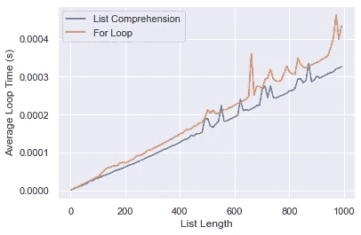

# 使用 Python 列表要避免的 3 个新手错误

> 原文：<https://towardsdatascience.com/3-rookie-mistakes-to-avoid-with-python-lists-625c0e8e57df>

## 如何解决可能导致严重问题的小错误

格伦·卡斯滕斯-彼得斯在 [Unsplash](https://unsplash.com?utm_source=medium&utm_medium=referral) 上拍摄的照片

在所有的编码语言中，Python 可能是对初学者最友好的。它直观、有据可查，并且易于学习。然而，所有的语言都有怪癖，特别是作为初学者，这一点很难发现。它们不会产生错误或终止运行。相反，它们与其他代码融合在一起。

许多数据科学项目使用列表作为存储有序数据的方式。然而，未能正确使用它们可能会导致效率低下、结论不正确，甚至丢失数据。

以下是使用列表时要注意的 3 个错误:

# 1.用等于运算符创建列表的副本

## 错误:

复制列表时，不要使用`=`。这是非常违反直觉的，因为`=`是用来给变量赋值的。然而，`=`操作符并不创建副本，而是创建一个*别名*。`original`和`new_copy`都指向相同的数据位置，如下所示。

`new_copy`没有复制数据，而是创建了另一种访问`original`的方式。

## 修复:

为了避免这个错误，使用`copy`，一个列表的内置方法。此方法将数据存储在内存中的两个不同位置。因此，对一个列表的更改不会影响另一个列表。

# 2.迭代时更改列表大小

## 错误:

上面的例子试图从`nums`中删除所有以`‘t’`开头的条目。然而，`‘three’`依旧。这是因为`nums`的长度在循环中发生了变化。For 循环依赖于内部的零索引计数器，它会记住自己在循环中的索引。该计数器为每次迭代确定`num`的值。

例如，在循环的第一次迭代中，计数器为 0，而`num`为‘0’，因为`nums[0] = ‘zero’`。对于第二次迭代，计数器等于 1，产生`num = ‘one’`。对于第三次迭代，`num = ‘two’`又被从`nums`中移除。对于第四次迭代，内部计数器等于 3 和`nums[3] = ‘four’`。结果，循环跳过了`‘three’`值。

第二次迭代开始时，`nums[3] = ‘three’`。到最后，列表的大小改变了，并且`‘three’`值滑回到`nums[2]`位置。**简而言之，循环改变列表，但不更新内部计数器。**

## 修复:

为了避免这种错误，创建列表的副本，并使用该副本来定义 for 循环。然后，在循环体中使用原始列表(在本例中为`nums`)。

因为`copy_nums`的长度从不改变，所以循环遍历列表中的每个值。

# 3.不使用列表理解来创建列表

## 错误:

For 循环为构造列表提供了一个简单明了、文档完备的解决方案。然而，Python 有一个更简洁的方法——列表理解。List comprehension 采用了 for 循环的功能，并将其压缩到一行代码中，使其更简洁、更易于理解。

与其他两个错误不同，这个错误不会产生*不正确的*解决方案，只是效率较低。例如:

## 修复:

使用列表理解代替 for 循环。两者产生相同的输出，但是列表理解在大多数情况下更加清晰和快速。随着列表长度的增加，下图比较了两种方法的时间。

作者图片

# 结论

这篇文章的代码可以在这里找到[。](https://github.com/katyhagerty/common_list_mistakes)

感谢您阅读我的文章。如果你喜欢我的内容，请考虑关注我。此外，欢迎所有反馈。我总是渴望学习新的或更好的做事方法。请随时留下您的评论或联系我 katyhagerty19@gmail.com。

 [## 加入我的介绍链接媒体-凯蒂哈格蒂

### 作为一个媒体会员，你的会员费的一部分会给你阅读的作家，你可以完全接触到每一个故事…

medium.com](https://medium.com/@katyhagerty19/membership)