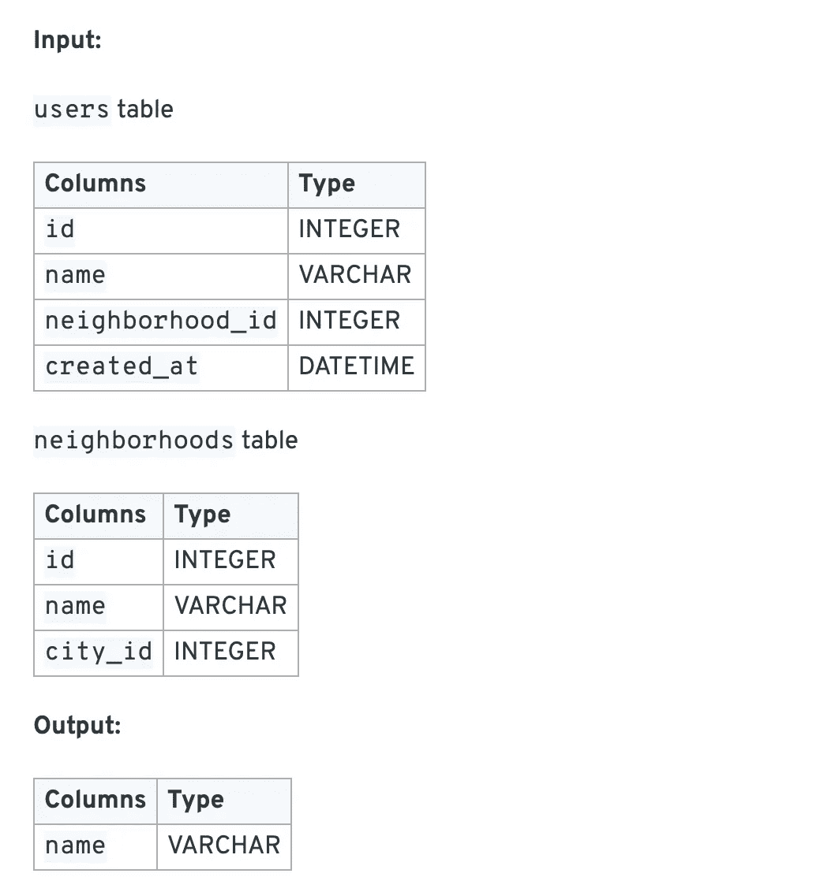
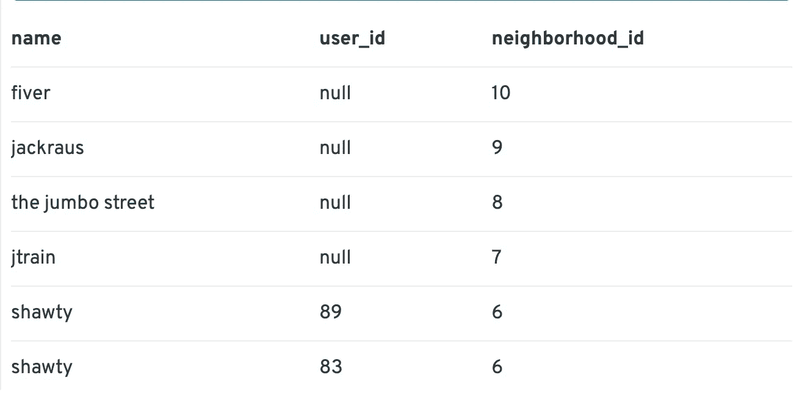
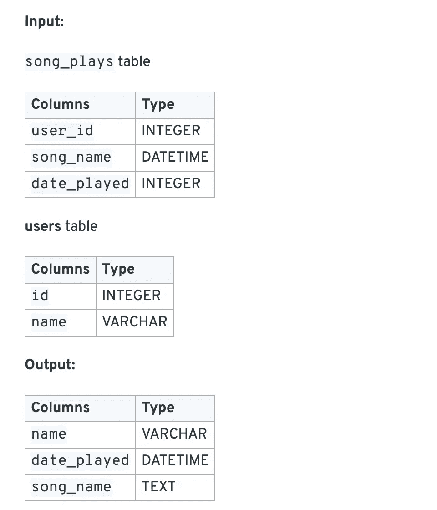
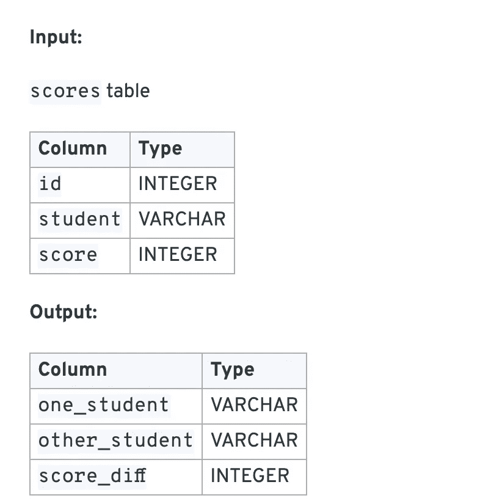
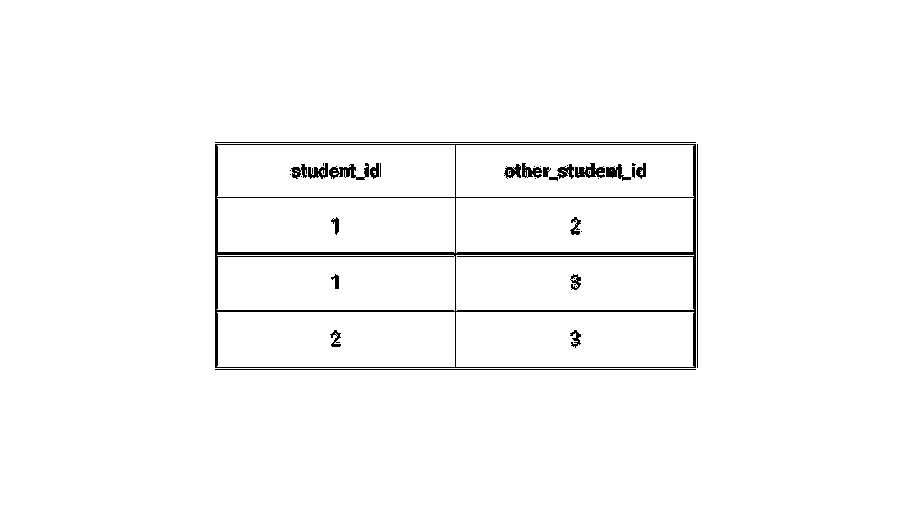

# 数据科学家和数据工程师的 3 个 SQL 面试技巧

> 原文：<https://towardsdatascience.com/3-sql-interview-tips-for-data-scientists-and-data-engineers-bbf7d859407c>

## 不仅仅是回答 SQL 问题

照片由 [Elisa Ventur](https://unsplash.com/@elisa_ventur?utm_source=medium&utm_medium=referral) 在 [Unsplash](https://unsplash.com?utm_source=medium&utm_medium=referral) 上拍摄

在过去的十年里，SQL 已经成为各行各业和各种工作岗位的通用技能要求。

像亚马逊和谷歌这样的公司通常会要求他们的数据分析师、数据科学家和产品经理至少熟悉 SQL。这是因为 SQL 仍然是数据的语言。

这导致 SQL 成为许多数据专业人员面试循环的主要部分。这意味着您最好计划将 SQL 包含在您的学习会话中。也就是说，仅仅解决 SQL 问题并不总是有效的。

在这篇文章中，我将介绍三个技巧来帮助你提高面试和一般情况下的 SQL。

# 尝试用多种方法解决 SQL 问题

解决大多数 SQL 问题的方法不止一种。

但是我们经常求助于我们最近用过的方法。

例如，如果你刚刚学习了分析函数，它可以为你未来的解决方案分类。这就是为什么尝试用多种方式解决 SQL 问题很重要。

为了解决我们所有的问题，我将使用 InterviewQuery 中的问题集，这是一个数据科学家可以用来练习比 SQL 更多内容的网站。

但是现在让我们看看他们提出的一个简单的问题。

> 我们有两个表，一个是包含人口统计信息和他们居住的街区的`users`表，另一个是`neighborhoods`表。
> 
> 编写一个查询，返回所有有 0 个用户的邻居。

我们拥有的表格如下所列。

[来源:访谈查询](https://www.interviewquery.com/questions/empty-neighborhoods)

这里我们有两个输入表和一个预期输出。在进一步阅读之前，你对如何获得 0 用户的社区名称有什么想法吗？

你的第一个回答是什么？

不管怎样，让我们看看第一个可能的解决方案。

这个解决方案依赖于左连接来返回任何没有用户的 u.id 为空的邻域。

但是这个例子可能有点令人困惑，因为它不明确，所以对某些人来说不可读。左连接有点让人读起来有点困难。这样做的原因是你必须在精神上管理你头脑中的逻辑。

让我们快速地看一下左连接将创建的“没有过滤器”的表。

[资料来源:访谈查询](https://www.interviewquery.com/questions/empty-neighborhoods)

上面你会看到 user_id 有空值。这是因为我们左边的表是邻居。这意味着没有用户的地方，仍然会有邻居。

但是，这只是解决这个问题的一种方法。让我们以不同的方式编写这个查询。

有什么想法吗？

您可以查看下面的查询，它实际上是相同的东西，但是以更明确的方式。

此查询使用更显式的 HAVING 子句只对 u.id 进行计数。count 只在 u . id 不为 null 时进行计数。因此，这样一来，查询真正以同样的方式运行。

因此，如果用户表中没有与邻域 id 匹配的 ID，那么它将使用 null 替换 user-id。因此，如果我在 user id 为 NULL 的地方写，我将得到与 COUNT(u.id)相同的响应。

# 分解问题和逻辑

你得到的许多问题将要求你把逻辑分解成多个步骤。一个简单的例子是，当问题要求您获取事件的第一个实例时。

InterviewQuery 有这样一个问题，他们会问:

> 给定一个表`song_plays`和一个表`users`，编写一个查询来提取每个用户播放他们的第三首独特歌曲的最早日期。

下表列出了:

[资料来源:采访查询](https://www.interviewquery.com/questions/third-unique-song)

在这里，他们写出了他们想要第三首“独特”歌曲的事实。如果您只是要实现一个快速的 [ROW_NUMBER](https://www.sqlservertutorial.net/sql-server-window-functions/sql-server-row_number-function/) ()函数，这应该是一个致命的提示，有多个歌曲播放的实例会打乱您的解决方案。

帮助简化的一个好方法是开始旋转一些形状。

首先，让我们创建一个数据集，该数据集只获得每个游戏的唯一实例。

这里有趣的是，我不同意 InterviewQuery 提供的解决方案，或者至少我不是 100%支持它。要获得一首独特的歌曲和第一次播放的日期，你应该能够只使用 MIN()获得第一次播放的日期。

您可以通过下面的查询做到这一点。

如您所见，我们需要做的就是获取歌曲 id 和用户的最小播放日期。这将清理连续播放的任何混乱的重复播放。使数据更容易处理。

InterviewQuery 建议使用 row_number()获取一首歌曲的首次播放。我发现这有点不太清楚，因为您现在将被迫进行第二次查询来获得第一个值。而使用 MIN()方法，您只有一个查询，并且已经缩减了数据集。

但是正如我前面提到的，获得大量 SQL 答案的方法不止一种。

我绝不讨厌 row_number()函数。事实上，在下一步中，我们将使用它。您可以在下面的查询中看到它。

从这里开始，其余的应该是不言自明的。我们需要查询第三行号码。如下所示。

还有一个问题。这实际上并不能解决 InterviewQuery 的问题。

这引出了我对 InterviewQuery 当前解决方案的另一个问题。InterviewQuery 希望我们返回所有用户，即使他们没有第三首歌曲播放。问题中没有提到这一点，我也看不到它的价值。但这些都是尼特。

他们有一个不同的解决方案，使用左连接，然后返回有和没有第三首歌曲播放的用户。所以一定要注意这个挑剔的细节。

# 了解如何进行非标准连接

许多人习惯于简单的连接。带一个基本的“=”。

这很好，但事实是连接可以像 WHERE 子句一样使用。

曾经有一段时间，联接并不存在，子句被用作联接。我偶尔还会看到一些人使用一长串 WHERE 子句进行连接，因为他们要么当前使用的是旧系统，要么曾经学习过 SQL，连接并不常见(SQL-92 中添加了[显式连接)。](https://learnsql.com/blog/history-of-sql-standards/)

这意味着你可以用很多有趣的方式使用连接。例如，如果您曾经不得不在没有窗口函数的情况下计算滚动和，您将知道您可以使用">和

In our final question we are asked:

> Given a table of students and their SAT test scores, write a query to return the two students with the closest test scores with the score difference.
> 
> If there are multiple students with the same minimum score difference, select the student name combination that is higher in the alphabet.

This is what the table looks like:

[来源:InterviewQuery](https://www.interviewquery.com/questions/closest-sat-scores)

花点时间想想你该如何解决这个问题。

别急着过来。有很多方法可以让这个问题变得特别复杂。

答案很简单。

但这一切都始于你需要创建一个每个学生和每个学生的分数的组合。

让我们来看一个可能的解决方案，并分析它为什么有效。

那么，为什么会这样呢？我们告诉查询在 ID 小于我们要连接的 ID 的所有情况下进行自连接。

这意味着我们正在创建一个类似于下表的表格:

作者图片

现在我们有了所有可能的学生 id 的组合，我们可以找到 ABS()分数的不同，并正确地设置顺序。

就是这样。

我要补充的最后一点是，我最终决定使用“！=" vs "

# How Will You Take Your SQL To The Next Level

SQL looks like it is here to stay. It seems if anything it is picking up speed. The challenge is how do you take your SQL to the next level. It’s not just about learning new syntax.

It’s about learning how the data you’re working on can be manipulated using even simple clauses. In doing so you will be creating SQL at a much higher level and better prepare you for your [SQL 面试](https://www.youtube.com/watch?v=W2L7Q3J-ei0)。

无论你是[的数据科学家](https://medium.com/p/c3824cb76c2e)、[的数据工程师](https://www.youtube.com/watch?v=PEsCumjfBW0)还是[的分析师](https://medium.com/coriers/5-tips-on-how-to-become-a-better-data-analyst-30f226c09c39)，我都祝你好运！