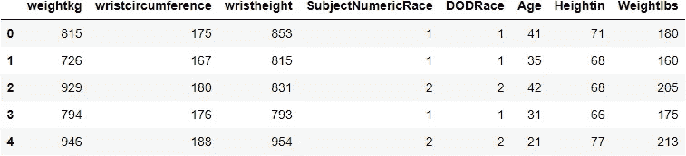
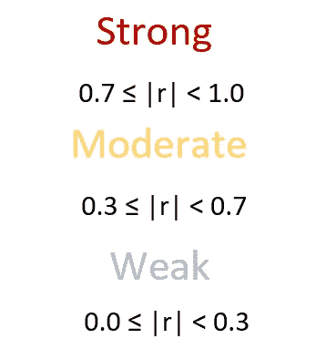
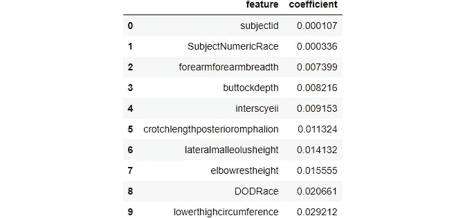

# Sklearn 中的 3 步功能选择指南，让您的模型焕然一新

> 原文：<https://towardsdatascience.com/3-step-feature-selection-guide-in-sklearn-to-superchage-your-models-e994aa50c6d2>

## 为任何受监督的问题开发一个健壮的特征选择工作流

了解如何使用最好的 Sklearn 功能选择器来面对机器学习的最大挑战之一。

照片由[斯蒂夫·约翰森](https://www.pexels.com/photo/person-s-index-finger-977246/)拍摄

## 介绍

如今，数据集拥有数百甚至数千个要素是很常见的。从表面上看，这似乎是一件好事——更多的特性提供了关于每个样本的更多信息。但通常情况下，这些额外的功能并不能提供太多的价值，反而会带来复杂性。

机器学习的最大挑战是通过使用尽可能少的特征来创建具有强大预测能力的模型。但是考虑到当今数据集的庞大规模，很容易忽略哪些特征重要，哪些不重要。

这就是为什么在 ML 领域需要学习一整套技能——特征选择。特征选择是选择最重要特征的子集，同时试图保留尽可能多的信息的过程(摘自本系列的[第一篇文章](/how-to-use-variance-thresholding-for-robust-feature-selection-a4503f2b5c3f))。

由于功能*选择*是一个如此紧迫的问题，有无数的解决方案可供你选择*🤦‍♂️🤦‍♂️.为了减轻你的痛苦，我将教你 3 个特征选择技巧，当一起使用时，可以增强任何模型的性能。*

本文将向您概述这些技术以及如何使用它们，而不需要过多了解其内部原理。为了更深入的理解，我为每一个都写了单独的帖子，并解释了细节。我们开始吧！

 [## 通过我的推荐链接加入 Medium-BEXGBoost

### 获得独家访问我的所有⚡premium⚡内容和所有媒体没有限制。支持我的工作，给我买一个…

ibexorigin.medium.com](https://ibexorigin.medium.com/membership) 

获得由强大的 AI-Alpha 信号选择和总结的最佳和最新的 ML 和 AI 论文:

 [## 阿尔法信号|机器学习的极品。艾总结的。

### 留在循环中，不用花无数时间浏览下一个突破；我们的算法识别…

alphasignal.ai](https://alphasignal.ai/?referrer=Bex) 

## 数据集介绍和问题陈述

我们将使用安苏尔男性数据集，该数据集包含 100 多种不同的美国陆军人员身体测量数据。在这个特征选择系列中，我一直在过度使用这个数据集，因为它包含 98 个数字特征，这是一个教授特征选择的完美数据集。

我们将尝试预测以磅为单位的重量，因此这是一个回归问题。让我们用简单的线性回归建立一个基本性能。LR 是这个问题的一个很好的候选，因为我们可以预期身体测量是线性相关的:

对于基本性能，我们得到了令人印象深刻的 0.956 的 R 平方。然而，这可能是因为在特性中也有以千克为单位的重量列，为算法提供了它所需要的一切(我们试图预测以磅为单位的重量)。所以，让我们试着不用它:

现在，我们有 0.945，但我们设法降低了模型的复杂性。

## 第一步:方差阈值

第一种技术将针对每个特征的单独属性。方差阈值化背后的思想是，具有低方差的特征对整体预测没有太大贡献。这些类型的要素的分布具有太少的唯一值或足够低的方差，因此无关紧要。VT 使用 Sklearn 帮助我们移除它们。

应用 VT 之前的一个关注点是特征的规模。随着要素中的值变大，方差呈指数增长。这意味着不同分布的特征具有不同的尺度，因此我们不能安全地比较它们的方差。因此，我们必须应用某种形式的标准化，将所有特征置于相同的比例，然后应用 VT。代码如下:

归一化后(这里，我们将每个样本除以特征的平均值)，您应该选择一个介于 0 和 1 之间的阈值。我们没有使用 VT 估算器的`.transform()`方法，而是使用了`get_support()`，它给出了一个布尔掩码(应该保留的特征的真值)。然后，可以用它来对数据进行子集划分，同时保留列名。

这可能是一个简单的技术，但它可以帮助消除无用的功能。要获得更深入的见解和对代码的更多解释，您可以阅读本文:

 [## 如何使用方差阈值进行鲁棒特征选择

### 编辑描述

towardsdatascience.com](/how-to-use-variance-thresholding-for-robust-feature-selection-a4503f2b5c3f) 

## 第二步:两两相关

我们将通过关注特征之间的*关系*来进一步修整我们的数据集。显示*线性*关系的最佳指标之一是皮尔逊相关系数(表示为 *r* )。使用 *r* 进行特征选择的逻辑很简单。如果特征 A 和 B 之间的相关性为 0.9，这意味着您可以在 90%的情况下使用 A 的值来预测 B 的值。换句话说，在存在 A 的数据集中，您可以丢弃 B，反之亦然。

**作者照片**

没有一个 Sklearn 估算器实现基于相关性的特征选择。所以，我们要靠自己:

这个函数是一个简写，它返回根据自定义相关阈值应该删除的列的名称。通常，阈值将超过 0.8 才是安全的。

在函数中，我们首先使用`.corr()`创建一个相关矩阵。接下来，我们创建一个布尔掩码，只包含相关矩阵对角线以下的相关性。我们用这个掩模来划分矩阵的子集。最后，在列表理解中，我们找到应该删除的特征的名称并返回它们。

关于代码，我还有很多没有解释。即使这个函数工作得很好，我还是建议阅读我的另一篇关于基于相关系数的特征选择的文章。我充分解释了相关性的概念以及它与因果关系的不同之处。还有一个单独的部分是关于将完美的相关矩阵绘制成热图，当然还有对上述函数的解释。

 [## 如何使用成对相关性进行鲁棒的特征选择

### 将久经考验的方法添加到您的武器库中

towardsdatascience.com](/how-to-use-pairwise-correlation-for-robust-feature-selection-20a60ef7d10) 

对于我们的数据集，我们将选择阈值 0.9:

该函数告诉我们删除 13 个功能:

现在，只剩下 35 个特征了。

## 步骤三:交叉验证的递归特征消除(RFECV)

最后，我们将根据特性对模型性能的影响来选择最终的特性集。大多数 Sklearn 模型都有`.coef_`(线性模型)或`.feature_importances_`(基于树和集合模型)属性，显示每个特征的重要性。例如，让我们将线性回归模型拟合到当前的要素集，并查看计算出的系数:

上面的数据框显示了系数最小的特征。特征的权重或系数越小，它对模型预测能力的贡献就越小。考虑到这一点，递归特征消除使用交叉验证逐个移除特征，直到剩下最佳的最小特征集。

Sklearn 在 RFECV 类下实现了这种技术，它采用一个任意的估计量和几个其他参数:

在将估计量拟合到数据之后，我们可以得到一个布尔掩码，其中的真值对应该保留的特征进行编码。我们最终可以用它来最后一次对原始数据进行子集划分:

在应用 RFECV 之后，我们成功地放弃了另外 5 个特性。让我们在此要素所选数据集上评估最终的 GradientBoostingRegressor 模型，并查看其性能:

尽管我们的性能略有下降，但我们设法删除了近 70 个特性，从而显著降低了模型的复杂性。

在另一篇文章中，我进一步讨论了`.coef_`和`.feature_importances_`属性，以及 RFE 每一轮淘汰赛中发生的额外细节:

 [## Sklearn 的递归特征消除(RFE)功能强大的特征选择

### 编辑描述

towardsdatascience.com](/powerful-feature-selection-with-recursive-feature-elimination-rfe-of-sklearn-23efb2cdb54e) 

## 摘要

功能选择不应该掉以轻心。在降低模型复杂性的同时，由于数据集中缺少分散注意力的特征，一些算法甚至可以看到性能的提高。依赖单一方法也是不明智的。相反，从不同的角度和使用不同的技巧来解决问题。

今天，我们了解了如何分三个阶段将要素选择应用于数据集:

1.  基于使用方差阈值的每个特征的属性。
2.  基于使用成对相关的特征之间的关系。
3.  基于特征如何影响模型的性能。

在处理过程中使用这些技术应该可以为你所面临的任何监督问题提供可靠的结果。

## 关于特征选择的进一步阅读

*   Sklearn 官方[功能选择指南](https://scikit-learn.org/stable/modules/feature_selection.html)
*   [差异阈值文档](https://scikit-learn.org/stable/modules/generated/sklearn.feature_selection.VarianceThreshold.html)
*   [RFECV 文件](https://scikit-learn.org/stable/modules/generated/sklearn.feature_selection.RFECV.html)
*   [相关系数深度指南](https://towardsdev.com/how-to-not-misunderstand-correlation-75ce9b0289e)
*   [通过组合多个模型进行高级特征选择](/superior-feature-selection-by-combining-multiple-models-607002c1a324)

 [## 通过我的推荐链接加入 Medium。

### 获得独家访问我的所有⚡premium⚡内容和所有媒体没有限制。你可以给我买一个 coffee☕，用你的…

ibexorigin.medium.com](https://ibexorigin.medium.com/membership)  [## 每当 Bex T .发布时收到电子邮件。

### 每当 Bex T .发布时收到电子邮件。注册后，如果您还没有中型帐户，您将创建一个…

ibexorigin.medium.com](https://ibexorigin.medium.com/subscribe)