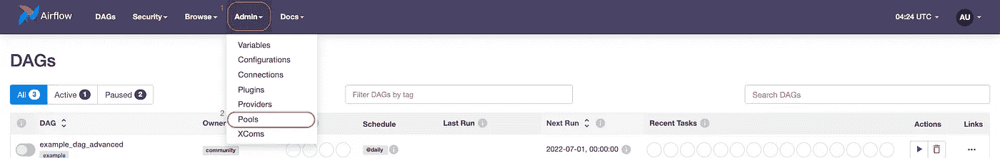
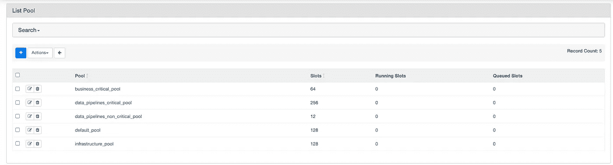
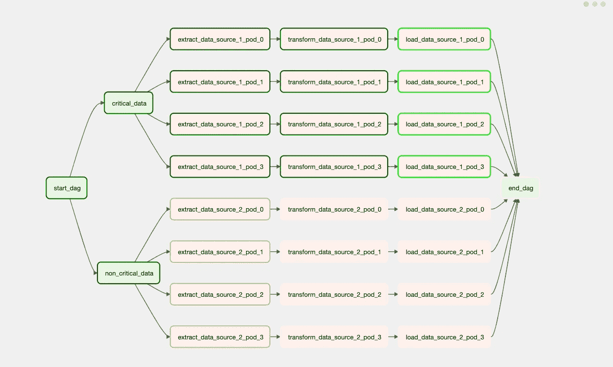
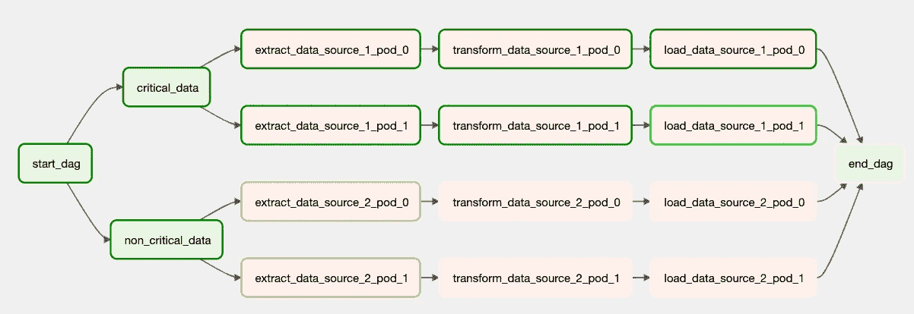
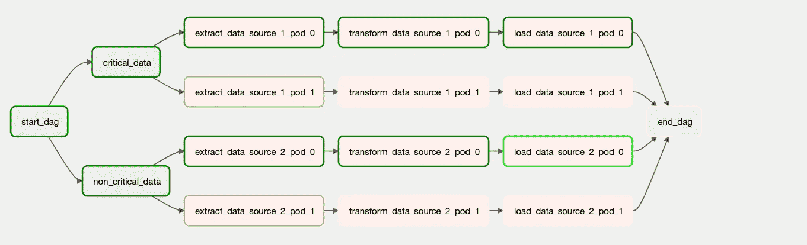
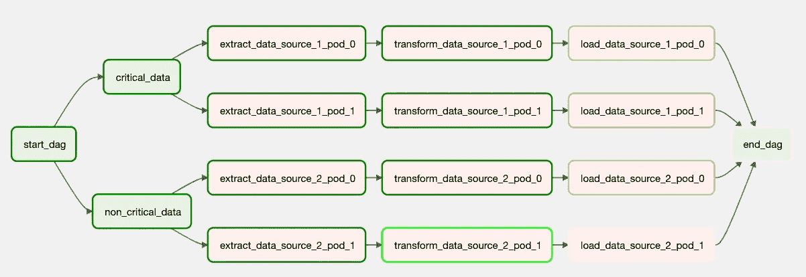

# 构建高效利用资源的气流管道的 3 个步骤

> 原文：<https://towardsdatascience.com/3-steps-to-build-airflow-pipelines-with-efficient-resource-utilisation-b9f399d29fb3>

照片由[凯勒·尼克森](https://unsplash.com/@knixon?utm_source=medium&utm_medium=referral)在 [Unsplash](https://unsplash.com?utm_source=medium&utm_medium=referral) 拍摄

这篇博客着眼于一些对管理工作流中的资源有价值的气流特性。我们将探讨一些相互关联的概念，这些概念会影响任何数据管道的底层基础设施的资源利用。特别是，我们将探讨以下概念:

*   **气流池**用于*根据预定义的指标将资源分配*给一组任务。
*   **并行&并发**高效*扩展*管道，充分利用可用的基础设施。
*   **优先级权重**用于*确定*的优先级，并在其他任务之前为关键任务分配资源。

本博客不着重介绍气流；要了解更多关于使用 Apache Airflow 构建管道的信息，请点击这里查看我的其他博客[。事不宜迟，让我们开始探讨上面提到的话题。](https://vachan15.medium.com/index-link-to-all-my-blogs-98efca323fa8)

# **1。气流池**

作为数据工程师，我们构建多个管道来负责运行特定的工作流。解决方案需要一个 DAG 或一组 DAG 来实现预期的结果。例如，一组 Dag 将数据加载到数据仓库，另一组部署和监控机器学习模型，一些 Dag 启动或停止项目的基础设施。

有这么多 Dag，有时需要同时运行其中的几个，管理底层资源的分配变得至关重要。这样做很重要，这样气流就不会淹没基础架构或由于资源限制(如可同时运行的任务/Dag 数量)而阻碍业务关键型任务。我们可以使用池的概念将任务分配给资源。

照片由 Jonathan Chng 在 [Unsplash](https://unsplash.com?utm_source=medium&utm_medium=referral) 上拍摄

与游泳池类似，气流罐中的池是流程运行的区域。它包含 ***插槽*** ，气流中的操作员一旦分配到池中就可以使用。根据任务的配置，任务可以使用一个或多个插槽。默认情况下，每个任务使用一个槽，并被分配给包含 128 个槽的 default_pool。

在单个池中运行所有任务是有问题的。例如，如果 airflow 实例正在利用池中的所有插槽，并且需要运行更多的任务，在这种情况下，任务将排队等待正在进行的进程完成。

## **在气流中使用水池**

如下所示，我们可以使用管理面板访问 Airflow 中的池。我们还可以使用它来查看/修改所有现有池或创建新池。

作者图片

创建之后，我们可以使用操作符中的 ***池*** 属性将任务分配给池。我们可以让同一个 DAG 中的操作员，或者根据逻辑差异将多个 DAG 分配给不同的池。此外，如果池中的一些任务比其他任务需要更多的资源，我们可以使用操作符中的 ***pool_slots*** 属性为这些任务分配更多的资源。

例如，我们可以从下面的 DAG 中观察到，我们有一些关键任务和一些非关键任务。我们根据任务的重要性将它们分配到不同的池中。此外，我们为基本任务分配更多的 pool_slots，让 Airflow 知道这些任务需要更多的资源。

现在我们知道了如何配置池，要有效地使用它们，还需要一些额外的步骤。

*   **将任务分配给不同的池。**在单个池中运行所有任务可能会有问题。例如，如果一个 Airflow 实例正在使用所有的槽，并且需要运行更多的任务，那么不管这些任务的重要性如何，它们都会被排队，直到一个正在进行的进程释放出一个位置。因此，我们可以为业务关键型作业创建一个池，为非关键型任务创建另一个池，并相应地为池类型分配操作。
*   除了分离池，我们还需要**管理池内的槽**。我们必须确保业务关键型池有足够的槽，以便任务在开始处理之前不会等待太久。
*   池的**数量**取决于用例。例如，我们可以为高、中、低关键任务设置三个池，或者为不同的工作流设置单独的池，例如一个池用于管理基础架构，另一个池用于管理数据管道等等。
*   池中的**插槽数量**。可以帮助确定槽数的几个因素如下
    *】需要并行运行的任务数
    *】每个任务需要的槽数
    *】一个任务的时延容忍度。
    例如，如果一个池需要为一个管道并行运行 10 个任务，每个任务需要两个插槽，并且如果所有的任务都是不停机运行的关键，那么我们应该为池分配至少 20 个插槽来有效地运行管道。

# 2.并行和并发

在本节中，我们将了解池正常工作所需的一些气流配置。

*   **并行度:**定义为一个气流实例可以同时执行**的任务数，即包括所有 Dag。如果 airflow 实例处于最大允许并行度容量，即将到来的任务将排队，而不管它们的池配置如何。
    例如，让我们假设具有以下配置的情况:
    *]要运行的任务:100
    *]池容量(槽数)= 200
    *]每个任务的槽数= 1
    假设 ***并行度*** 被设置为其默认值 32。在这种情况下，尽管池可以同时运行所有任务，但由于最大并行度的限制，它将在任何给定时间运行 32 个任务。**
*   **Dag_concurrency** :定义为一个 DAG 中可以同时执行**的最大任务数。与并行性类似，dag 并发会影响工作流的资源利用率。并行性影响气流级别(即跨所有 dag)的任务排队，而 dag_concurrency 影响 DAG 级别的进程排队。
    例如，让我们假设具有以下配置的情况:
    *]要运行的任务:100
    *]并行度= 128
    *]池容量(槽数)= 200
    *]每个任务的槽数= 1
    假设***Dag _ concurrency****设置为其默认值 16。尽管配置的其余部分支持并行处理，但它受到 dag 并发性的限制。因此，所有超过 16 的操作都要排队。***

# *3.优先级权重*

*在构建大数据管道时，有时我们希望将一组任务的优先级高于其他任务。例如，如果我们有多个数据源，并且在 ETL 过程中处理一些数据源比其他数据源更重要，我们可以配置我们的工作流来区分这些任务的优先级。*

**

*作者图片*

*从上面的 DAG 我们可以观察到，Airflow 运行一组任务，即在***data _ source _ 2***之前***data _ source _ 1***的 ETL。我们可以通过设置以下配置来实现:*

*   ****priority _ weight***:优先级权重是一个操作员的属性，为每个任务分配优先级。*

*   ****weight_rule*** :权重规则决定了任务权重的计算方法。*

*在气流中，我们有如下三个重量规则:*

1.  ***Absolute** :允许气流实例根据分配给每个任务的 ***priority_weight*** 对任务进行优先级排序。
    例如，让我们假设以下配置。
    *]priority _ weight = 2 for all critical_data 分支
    *]priority _ weight = 1 for all non _ critical _ data 分支
    现在，对于下面的 DAG，所有具有较高 priority_weights 的任务，即 critical _ data 任务，首先被调度和执行。*

**

*作者图片*

***2。上游**:使用上游权重规则允许 Airflow 实例通过将操作的权重分配为等于其下游任务的权重之和来区分 DAG 中上游任务的优先级。
例如，让我们假设以下配置。
*]所有任务的 priority _ weight = 1
现在，对于下面的 DAG，任务***load _ data _ source _ 1 _ pod _ 0***的 **priority_weight 为 5** ，即下游任务为 4，自身为 1。*

**

*作者图片*

***3。下游**:使用下游权重规则允许 Airflow 实例通过分配一个操作的权重等于其上游任务的权重之和来区分 DAG 中下游任务的优先级。例如，让我们假设以下配置。
*] priority_weight = 1 对于所有任务
现在，对于下面的 DAG，任务***extract _ data _ source _ 1 _ pod _ 0***的 **priority_weight 为 4，**即上游任务为 3，自身为 1。*

**

*作者图片*

*如果任务属于同一个库，那么知道它们之间的优先级是可比较的是至关重要的。如果 DAG 中的操作员被分配到不同的池，则每个池中具有较高优先级的任务将首先执行。较高的 priority_weights 意味着 Airflow 将在服务任何其他排队作业之前运行这些任务。*

# *结论*

*建立有效利用基础设施的数据管道是多种因素的结合。这篇博客探讨了其中一些相互关联的概念，以便管道可以基于底层资源和逻辑流进行伸缩。*

# *参考*

*  

# 阅读其他数据博客

  

# 在 Linkedin 上连接:

 *