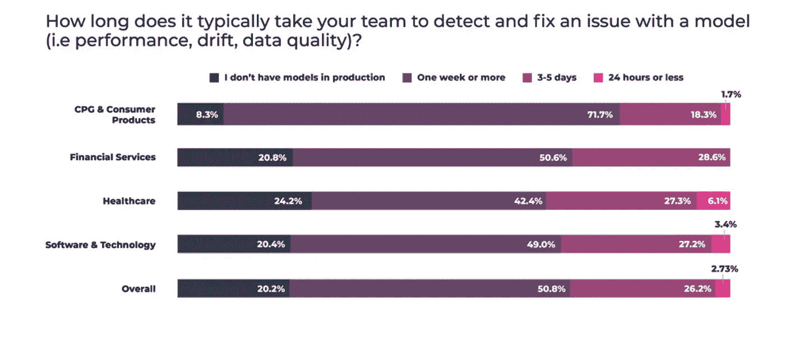
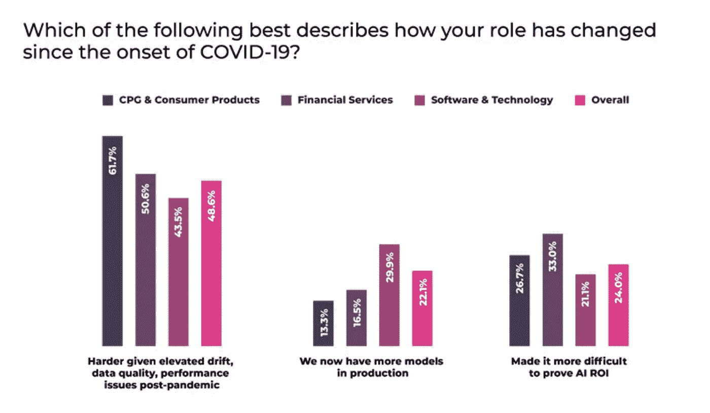
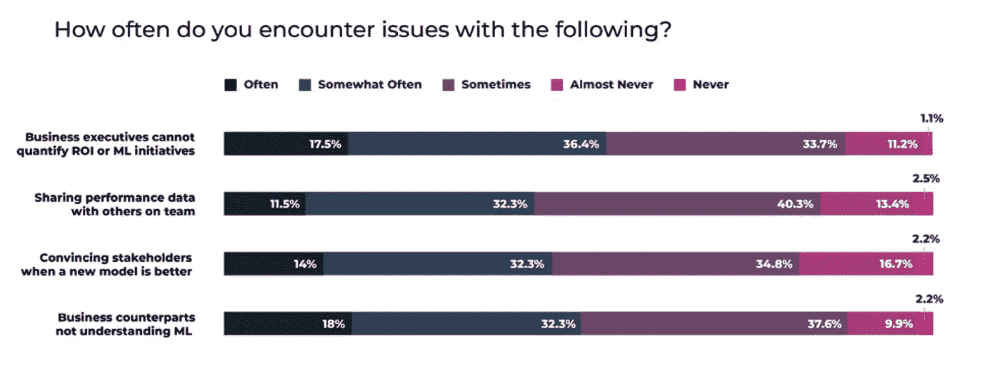
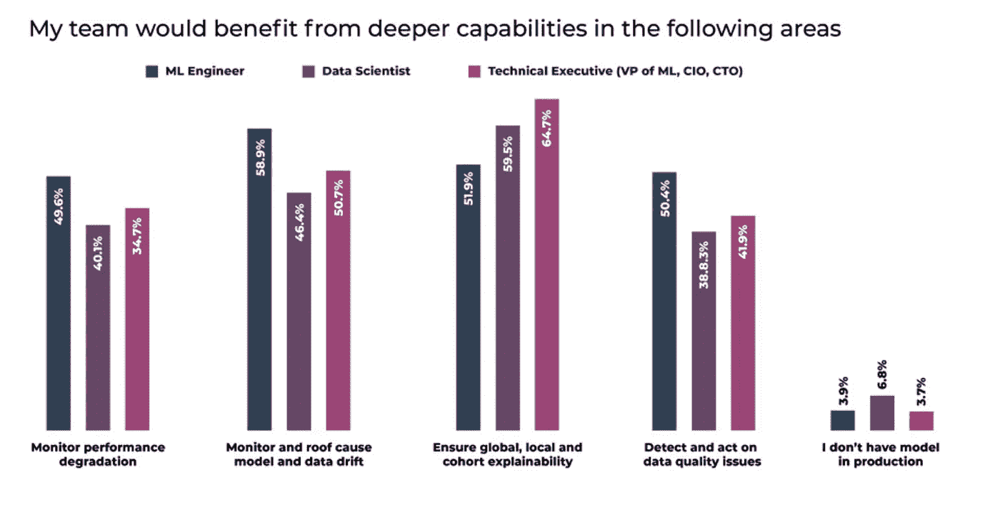

# 我们对顶级 ML 团队调查的 3 点收获

> 原文：<https://towardsdatascience.com/3-takeaways-from-our-survey-of-top-ml-teams-c53067fba50e>

图片由作者提供

与 DevOps 或数据工程相比，MLOps 作为一个学科仍然相对年轻，尽管有了巨大的增长。虽然人们很容易与 DevOps 相提并论，特别是因为它的一些最佳实践很容易被移植到 MLOps 中，但大多数业内人士都认为，在将 ML 投入生产时，存在一系列独特的挑战和需求。不幸的是，很少有强有力的行业调查来记录团队如何应对这些挑战。

为了弥补这一点，并让 MLOps 从业者从同行那里了解如何在专业上取得成功，并运送和维护更好的模型，我们[最近对 945 名数据科学家、ML 工程师、技术高管和其他人进行了调查](https://arize.com/resource/survey-machine-learning-observability-results/)。结果表明，当模型失败时，明显需要更顺畅的跨团队协作和改进的工具来帮助更快地进行根本原因分析。

以下是三个关于 ML 监控和可观察性的调查结果——以及关于团队可以做些什么的建议。

## 解决模型问题仍然非常痛苦和缓慢

尽管取得了进展，但在生产环境中进行故障诊断、分类和解决模型问题时，ML 团队经常面临延迟和挫折。总的来说，84.3%的数据科学家和 ML 工程师表示，检测和诊断模型问题所需的时间至少有时是他们团队的一个问题，超过四分之一(26.2%)的人承认，他们需要一周或更长时间来检测和修复模型问题(即在检测到概念漂移后在生产中重新训练模型)。一周或更长时间的延迟在金融服务中最为常见，紧随其后的是医疗保健和技术。

资料来源:阿里泽·艾[对大联盟球队的调查](https://arize.com/resource/survey-machine-learning-observability-results/)

根据近一半(48.6%)的团队，这些问题可能会因大流行后的环境而加剧，其中漂移和性能问题会增加。

资料来源:艾瑞泽艾[对大联盟球队的调查](https://arize.com/resource/survey-machine-learning-observability-results/)

**建议:** *评估并实现一个有助于暴露和消除 AI 盲点的 ML 可观察性平台。*

几乎所有的 ML 团队都监控已知的模型指标，如准确性、 [AUC](https://arize.com/blog/what-is-auc/) 、F1 等。—大多数人也试图通过可解释性来解决黑盒人工智能(已知的未知)。然而，经常缺少的是暴露团队*没有*积极寻找的问题的解决方案:盲点，或者未知的未知。真正的 [ML 可观察性](https://arize.com/ml-observability/)可以帮助消除盲点，在潜在问题影响业务结果之前自动将其暴露出来。使用现代 ML observability platform 的团队可以快速可视化所有潜在问题，并且只需点击几下鼠标就可以执行根本原因分析，而不是编写看似没完没了的查询来找出性能下降的原因。

## ML 团队需要与业务主管更好地沟通

尽管事实上，在新冠肺炎会议之后，ML 模型对业务结果更为关键，但超过一半(54.0%)的数据科学家和 ML 工程师报告说，他们经常遇到业务主管无法量化 ML 计划的 ROI 的问题，几乎同样多的人(52.3%)还报告说，业务主管并不一贯理解机器学习。可能导致这种脱节的事实是，“与团队中的其他人共享数据”和“当新模型更好时说服利益相关者”仍然是问题，至少有时对于超过 80%的 ML 实践者来说是这样。

资料来源:艾瑞泽 AI [对 ML 团队的调查](https://arize.com/resource/survey-machine-learning-observability-results/)

**建议:** *提高内部知名度，增加 ML 素养，将模型指标与业务结果联系起来*

业务高管需要更好地访问工具和可消化的相关 KPI——最重要的是，包括量化人工智能 ROI 的方法。通过将 ML [模型性能指标](https://arize.com/glossary/)与关键业务指标联系起来，并允许高管访问跟踪进度的仪表板，ML 团队可以确保更广泛的参与。为了帮助实现这一点，评估 [ML 可观察性平台](https://www.arize.com)的 ML 团队可能希望考虑产品功能，如支持设置用户定义的函数以将模型性能与业务结果联系起来，将预生产模型与当前生产模型(冠军和挑战者)进行比较的能力，以及动态分析基于概率的决策模型阈值的能力。此外，支持保存了过滤器的图表共享链接的平台也有助于跨团队协作。

## 可解释性很重要，但不是一切

尽管技术高管高度重视[的可解释性](https://arize.com/blog/model-explainability-primer/)，ML 工程师——他们通常是将模型投入生产并在生产后对其进行维护的人——将监控和排除漂移列为更高的优先级，将可解释性与监控性能和数据质量问题放在同等重要的位置。

资料来源:艾瑞泽 AI [对 ML 团队的调查](https://arize.com/resource/survey-machine-learning-observability-results/)

**推荐:** *不要单靠可交代性；采取积极主动的方法来模拟绩效管理*

在模型生命周期的预生产阶段关注可解释性——在部署之前训练模型并验证它——可能是有用的。然而，一旦模型投入生产，继续在可解释性上花费大量资源的效用是有限的，因为它创建了一个被动的反馈循环。虽然可解释性在对生产中的模型性能进行故障排除时有助于排序，但它不能像数据质量监控那样帮助您发现盲点，例如，在推理分布发生重大变化之前帮助您主动捕捉潜在问题。通过在给定的模型上设置自动化的性能监视器，ML 团队可以拥有第一道防线——特别是如果能够 A/B 比较数据集并执行数据质量检查的话。[跨环境或生产前期的漂移监控](https://arize.com/model-drift/)也可能是模型输出发生变化的早期信号。

# 结论

虽然这些并不是 MLOps 团队面临的唯一问题，但根据被调查者的说法，它们是一些最突出的问题。请参阅报告中按行业和角色列出的完整调查结果列表:“[调查:行业已经为大规模的 ML 可观察性做好了准备](https://arize.com/resource/survey-machine-learning-observability-results/)”