# 3 从多元非线性数据集构建机器学习回归模型的技术

> 原文：<https://towardsdatascience.com/3-techniques-for-building-a-machine-learning-regression-model-from-a-multivariate-nonlinear-dataset-88b25fc24ad5>

## 关于数据转换、多项式回归和非线性回归的一切

刘烨·埃斯塔班在 [Unsplash](https://unsplash.com?utm_source=medium&utm_medium=referral) 上拍摄的照片

当目标变量和预测变量之间的关系为线性时，简单线性回归(SLR)模型易于构建。当因变量和自变量之间存在非线性关系时，事情就变得更复杂了。在本文中，我将向您展示在同一个非线性数据集上构建回归模型的三种不同方法:

1.多项式回归
2。数据转换
3。非线性回归

# 数据集:

我考虑的数据集取自 ka ggle:[https://www . ka ggle . com/datasets/Yasser h/student-marks-dataset](https://www.kaggle.com/datasets/yasserh/student-marks-dataset)

数据由学生的分数组成，包括他们的学习时间和课程数量。

数据帧细节(作者图像)

如果你检查目标变量“标记”与学习时间和课程数量之间的关系，你会发现这种关系是非线性的。

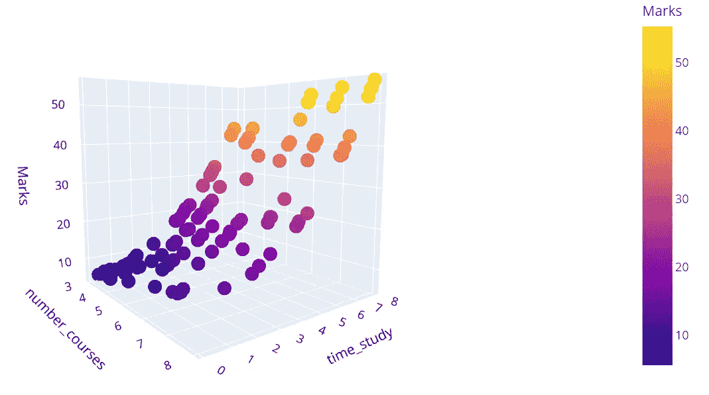

因变量和自变量之间的非线性关系(作者图片)

# 挑战此数据集上的简单线性模型

我尝试用 sklearn LinearRegression()模型建立一个线性回归模型。我定义了一个函数来计算模型的各种度量。

当我为我的模型调用这个函数时，我得到了下面的输出。

*R2 平方值:0.94
RSS:1211.696
MSE:12.117
EMSE:3.481*

94%的 r2 分数还不错，但我们很快就会看到，使用非线性回归模型可以得到更好的结果。问题更多在于线性回归模型背后的假设。

**单反假设 1:同质性**

同方差意味着残差在回归线上具有相等或几乎相等的方差。通过绘制误差项和预测项，我们应该确认误差项中没有模式。然而，在这种情况下，我们可以清楚地看到，误差项具有一定的形状。

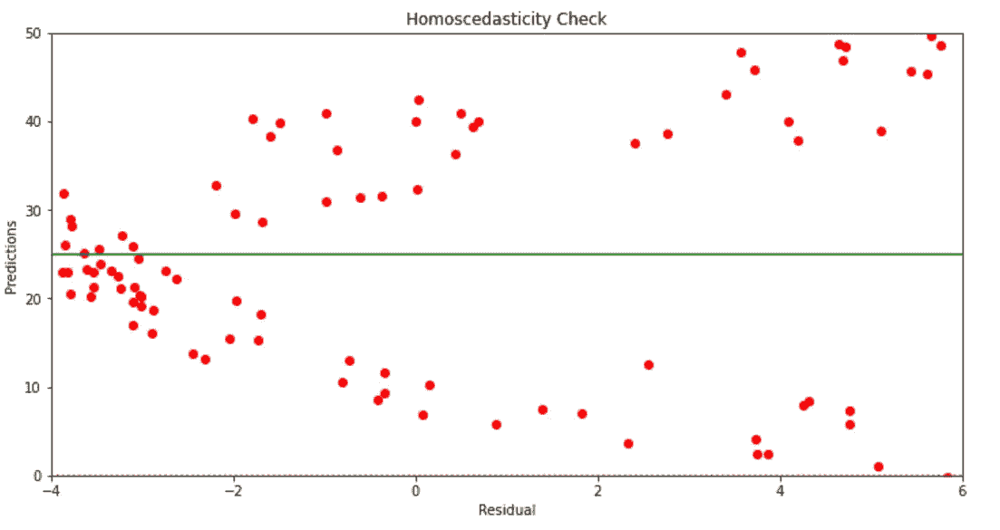

同质性(作者图像)

**单反假设 2:误差项正态分布**

具有正态或接近正态分布的钟形分布对于误差项应该是理想可见的。然而，从下图可以清楚地看出，我们有一个双模型分布。结果，在这种情况下，线性回归的假设被打破了。

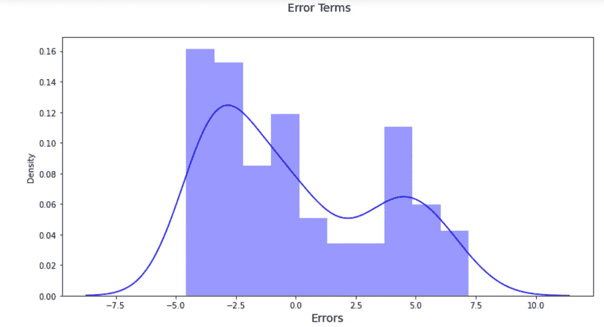

错误术语的分布(作者图片)

**单反假设 3:误差项相互独立**

因此，误差项之间的自相关应该不存在。然而，下图显示误差项似乎表现出一定程度的自相关性。

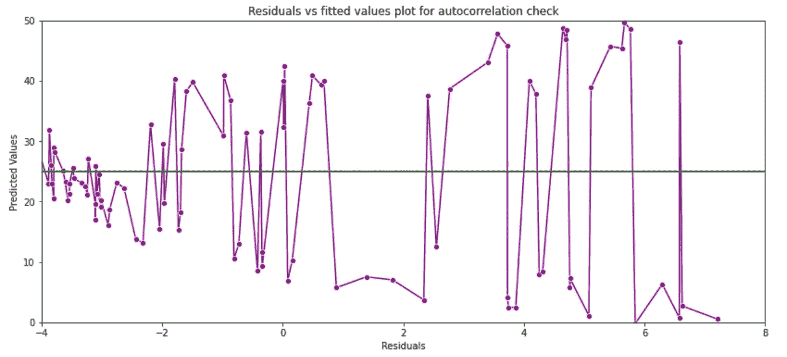

错误术语之间的自相关(作者图片)

到目前为止，我们已经验证了数据是非线性的，但我们仍然建立了一个 SLR 方程。虽然我们取得了令人尊敬的 94%的 r2 分数，但没有一个单反假设得到满足。因此，对于这种类型的数据，SLR 不是一个明智的解决方案。我们现在将研究在同一数据集上改进模型的其他技术。

# 1.使用多项式回归模型建模非线性关系

非线性回归是自变量 ***x*** 和因变量 ***y*** 之间的关系，其产生非线性函数模型化的数据。本质上，任何非线性的关系都可以被称为非线性，并且通常由 ***k*** 次的多项式来表示(最大功率为 ***x*** )。

*y**= a*x*+b*x*+c*x*+d*

*非线性函数可以包含指数、对数、分数等元素。比如:*y*= log(*x*)

甚至，更复杂的比如:
*y*= log(a*x*+b*x*+c*x*+d)*

****但是如果我们有不止一个自变量*会怎么样呢？***

*对于 2 个预测值，多项式回归方程变为:*

*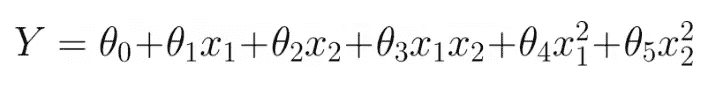*

*2-预测多项式方程*

*其中，
- Y 为目标，
- *x* 1， *x* 2 为预测值或自变量
- 𝜃0 为偏差，
-𝜃1、𝜃2、𝜃3、𝜃4 和𝜃5 为回归方程中的权重*

*对于 n 个预测值，该方程涵盖了各阶多项式的所有可行组合。这就是所谓的多维多项式回归，众所周知它很难实现。我们将构建不同程度的多项式模型，并评估它们的性能。但是首先，让我们为训练准备数据集。*

*我们可以建立一个管道，并传递我们希望用来生成各种次数的多项式的模型的次数和类别。这是下面的代码为我们做的:*

*如果您希望查看所有系数和截距，请使用以下代码块:请记住，系数的数量将根据多项式的次数而变化:*

*这是输出结果:*

*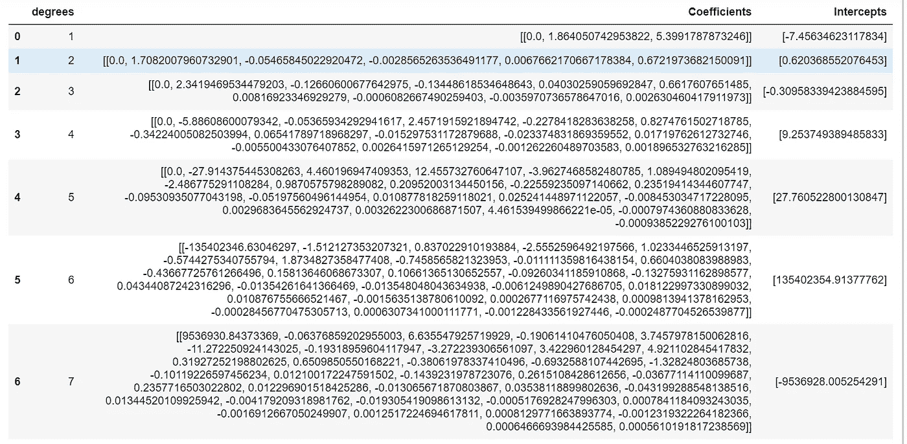*

*不同次数多项式回归的系数/截距(作者图片)*

*这并没有给出关于每个模型的性能的太多信息，所以将检查 r2 分数。*

*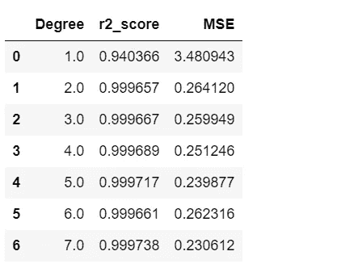*

*不同程度多项式回归的 r2 分数(作者图片)*

*因此，我们使用 sklearn 管道方法构建了高达 7 次的多项式方程，并发现 2 次及以上产生了 99.9%的准确度(相比之下，SLR 的准确度约为 94%)。在同一个数据集上，我们现在将看到另一种构建回归模型的技术。*

# *2.使用数据转换对非线性关系建模*

*线性回归框架假设反应变量和预测变量之间的关系是线性的。为了继续利用线性回归框架，我们必须修改数据，以便变量之间的关系变成线性的。*

***数据转换的一些准则:***

*   *响应变量和预测变量都可以转换*
*   *如果残差图显示数据中存在非线性关系，一个直接的策略是利用预测值的非线性变换。在 SLR 中，这些转换可以是 *log(x)、sqrt(x)、exp(x)、倒数*等等。*
*   *至关重要的是，每个回归变量与目标变量具有线性关系。因变量的变换是解决非线性问题的一种方法。*

***简而言之，通常是**:*

*   *-转换 y 值有助于处理误差项，并可能有助于非线性。*
*   *非线性主要通过变换 x 值来解决。*
*   *有关数据转换的更多信息，请参见[https://online.stat.psu.edu/stat462/node/155/](https://online.stat.psu.edu/stat462/node/155/)。*

*在我们的数据集中，当我们绘制因变量*【分数】*对*学习时间*和*课程数量*时，我们观察到分数与学习时间呈非线性关系。因此，我们将对特征 ***学习时间*** 进行转换。*

*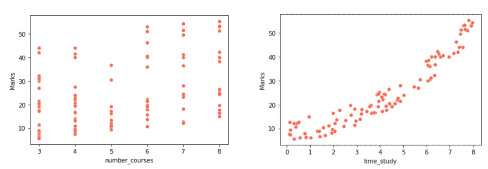*

*研究时间显示非线性行为与标记(作者图像)*

*在应用上述转换后，我们可以绘制相对于新功能 *time_study_sqaured* 的*标记*，以查看关系是否已变为线性。*

*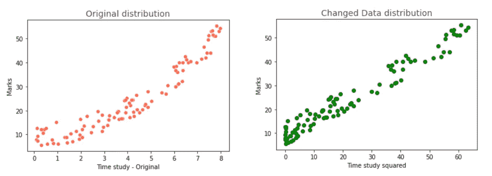*

*新特征表现出线性关系(作者图像)*

*我们的数据集现在已经准备好构建单反模型了。在这个转换后的数据集上，我们现在将使用 sklearn LinearRegression()方法创建一个简单的线性回归模型。当我们在构建模型后打印指标时，我们会得到以下结果:*

**R2 平方值:0.9996
RSS:7.083
MSE:0.071
EMSE:0.266**

*与之前在原始数据集上构建的 SLR 模型相比，这是一个显著的改进(没有任何数据转换)。我们得到的 R2 平方值是 99.9%，而不是 94%。现在，我们将验证单反模型的各种假设，看看它是否适合。*

*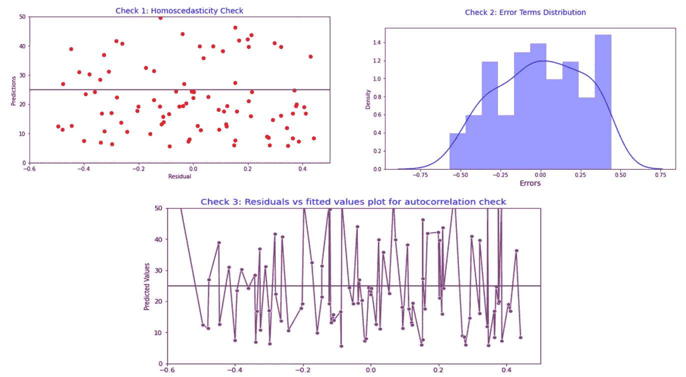*

*验证单反模型的所有假设(作者图片)*

*因此，在这一部分，我们转换了数据本身。知道特征 *time_study* 与*标记*不线性相关，我们创建了一个新的特征***time _ study _ squared***，它与*标记*线性相关。然后我们又建立了一个单反模型，验证了一个单反模型的所有假设。我们观察到这个新模型满足了所有的假设。现在，是时候探索我们的下一个和最后一个技术了，在同一个数据集上构建不同的模型。*

# *3.使用非线性回归模型对非线性关系建模*

*对于非线性回归问题，可以尝试 sklearn 库中的 *SVR()、KNeighborsRegressor()或 DecisionTreeRegression()* ，比较模型性能。这里，出于演示目的，我们将使用 **sklearn** **SVR()** 技术开发我们的非线性模型。SVR 支持多种 [**内核**](https://dataaspirant.com/svm-kernels/#t-1608054630727) 。核使得线性 SVM 模型能够分离非线性可分离的数据点。我们将使用 SVR 算法测试三个备选内核，并观察它们如何影响模型准确性:*

*   *rbf(支持向量回归的默认内核)*
*   *线性的*
*   *聚酯纤维（polyester 的简称）*

***i. SVR()使用 *rbf* 内核***

*这里是模型指标:仍然是一个更好的 R2 平方比我们的第一个单反模型。*

**R2 平方值:0.9982
RSS:4053558.081
MSE:0.363
EMSE:0.602**

*快速检查一下误差项分布似乎也没问题。*

*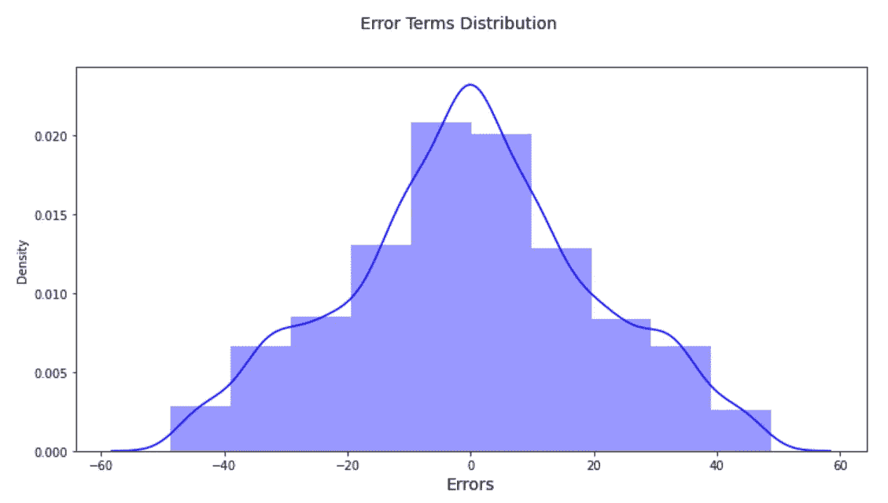*

*具有 rbf 核的 SVR 模型的误差项分布(作者图片)*

***二。SVR()使用*线性*内核***

*这里是我们使用线性内核时的模型指标:R2 平方值再次**下降到大约 93%***

**R2 平方值:0.9350
RSS:4063556.3
MSE:13.201
EMSE:3.633**

*同样在这种情况下，误差项似乎是一条近似正态分布曲线:*

*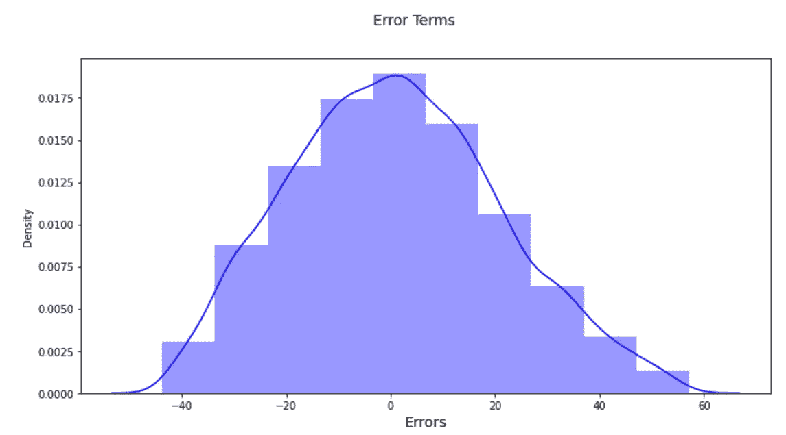*

*具有线性核的 SVR 模型的误差项分布(作者图片)*

***三世。SVR()使用 *poly* 内核***

*以下是支持向量回归多内核的模型指标:R2 平方值为 97%，高于线性内核，但低于 rbf 内核。*

**R2 平方值:0.9798
RSS:4000635.359
MSE:4.087
EMSE:2.022**

*这是误差项分布:*

*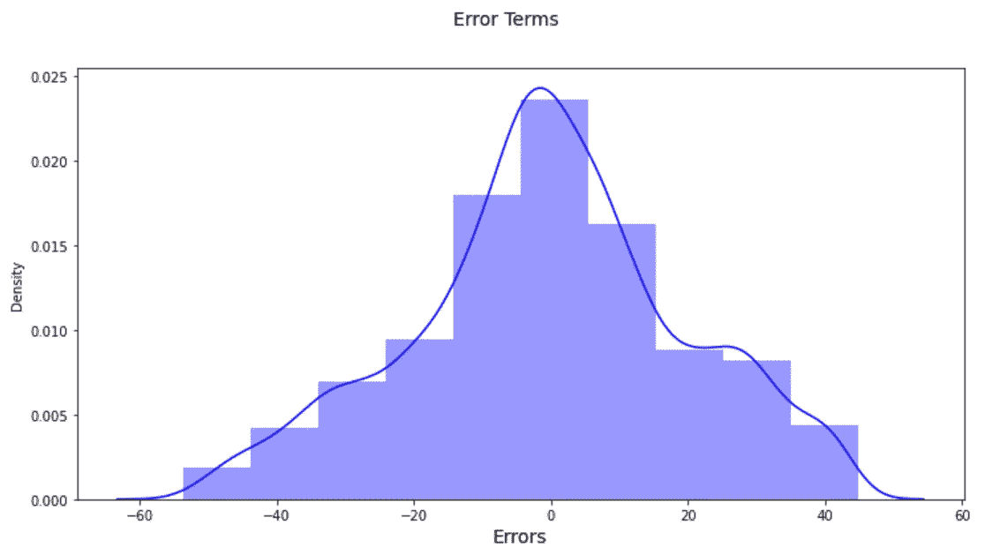*

*多重核支持向量回归模型的误差项分布(作者图片)*

*因此，在本节中，我们使用具有 3 个不同内核的 sklearn [**SVR 模型**](https://scikit-learn.org/stable/modules/generated/sklearn.svm.SVR.html) 创建了一个非线性模型。我们用 rbf 核得到了最好的 R2 平方值。*

*   *径向基函数核的 r2 得分= 99.82%*
*   *R2-线性核得分= 93.50 %*
*   *具有多内核的 r2 分数= 97.98 %*

# *结论:*

*在这篇文章中，我们从一个不依赖于目标变量的线性数据集开始。在我们能够研究在非线性数据集上建立回归模型的替代策略之前，我们构建了一个 r2 分数为 94%的简单线性回归模型。然后，我们研究了三种不同的非线性数据集建模方法:多项式回归、数据转换和非线性回归模型(SVR)。我们发现，多项式次数为 2 或更高会产生 99.9%的 r2 得分，而具有 rbf 核的 SVR 会产生 99.82%的 r2 得分。一般来说，每当我们有一个非线性数据集时，我们应该尝试几种策略，看看哪种效果最好。*

*【https://github.com/kg-shambhu/Non-Linear-Regression-Model】在这里找到数据集和代码:*

**你可以在 LinkedIn 上联系我:*[https://www.linkedin.com/in/shambhukgupta](https://www.linkedin.com/in/shambhukgupta/)/*