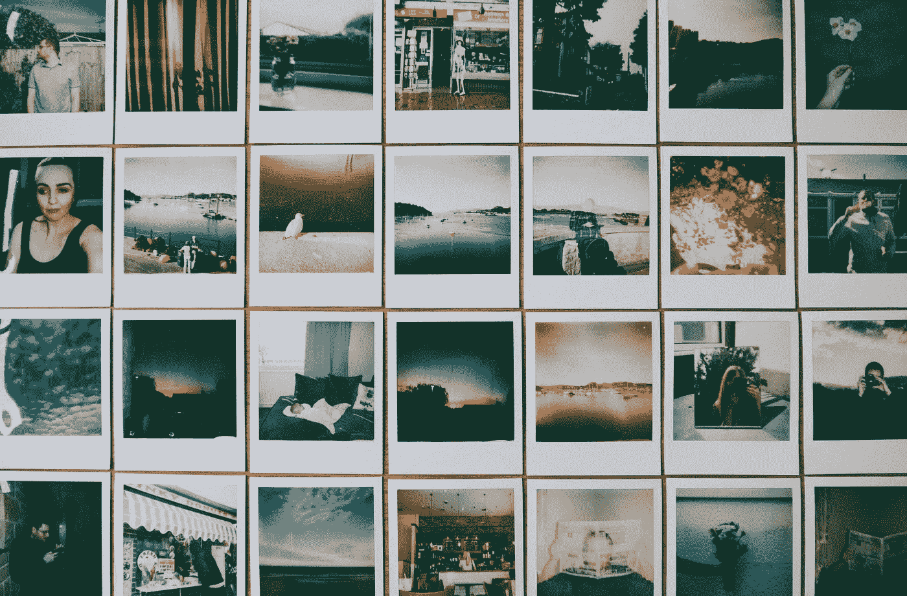
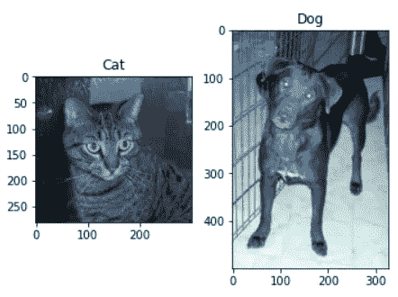
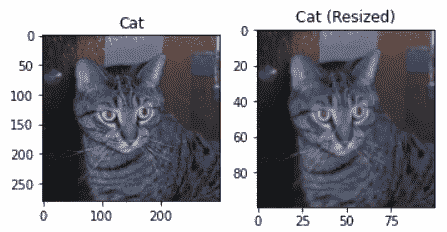
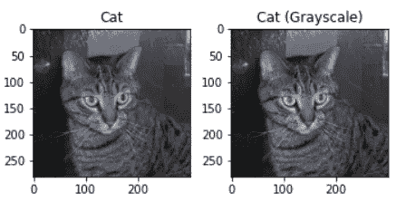
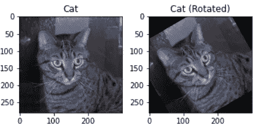

# 在机器学习中处理图像之前你需要知道的 3 件事

> 原文：<https://towardsdatascience.com/3-things-you-need-to-know-before-working-with-images-in-machine-learning-6a2ab6f6b822>

## 在接受计算机视觉项目之前掌握基本知识

照片由 [Pexels](https://www.pexels.com/photo/collage-photo-collage-3024995/?utm_content=attributionCopyText&utm_medium=referral&utm_source=pexels) 的 [Lisa Fotios](https://www.pexels.com/@fotios-photos?utm_content=attributionCopyText&utm_medium=referral&utm_source=pexels) 拍摄

从处理结构化数据过渡到处理非结构化数据是我学习过程中的一个重要里程碑。我喜欢在机器学习项目中处理图像，因为它让我接触到许多新的数据科学工具和技术。

然而，事后看来，我可以说我在承担计算机视觉项目之前没有打下良好的基础。由于我匆忙地通过使用图像来挑战自己，我忽略了许多重要的概念，从长远来看，这耗费了我大量的时间和精力。

为了给其他人省点麻烦，我将讨论我认为人们在机器学习项目中使用图像之前应该熟悉的 3 件事。

# 习惯导航目录

自然，在你开始处理你的图像之前，你必须阅读它们。

与电子表格不同，图像可以跨多个文件夹存储在数千个不同的文件中。因此，如果您选择处理图像，您将需要浏览各种文件夹以读取其中存储的图像。

目录是一个简单的概念，但是如果您刚刚开始，您可能会发现很难用代码遍历它们。

在 Python 中，用于此类任务的主要模块是 OS 和 Glob。

作为一个例子，我们可以使用一个猫对狗的数据集(版权免费)，可以在这里访问[。以下代码显示了一种使用 OS 和 OpenCV 模块读取文件夹中图像的方法。](https://www.kaggle.com/chetankv/dogs-cats-images)

让我们创建一个函数“show_images ”,我们可以用它来显示收集到的第一批猫和狗的图像。

代码输出(由作者创建)

# 了解图像变换的基本类型

与在用于训练模型之前转换的结构化数据集中的特征类似，图像也必须在任何模型训练之前经历一组转换。

有很多原因会让你想要修改你的图片。以下是一些主要的例子:

## 1.运行机器学习模型

图像需要在任何模型训练之前进行归一化。

卷积神经网络只有在用于训练它们的图像共享相同维度时才起作用。因此，调整图像大小是计算机视觉中的一种常见做法。

下面是你如何使用 Skimage 模块将先前加载的猫图像的大小调整为 100x100 像素。

代码输出(由作者创建)

## 2.降低计算需求

出于降低成本的考虑，最好只保留正在讨论的任务所需的信息。

执行此步骤的常见方法包括缩小图像尺寸和去除颜色。在许多情况下，这种详细程度并不是模型良好运行所必需的。

例如，在比较猫和狗时，颜色并不是决定性因素。你可以很容易地建立一个没有彩色图像的模型来区分这两个物种。

这里，Skimage 包用于从猫图像中去除颜色。

去除颜色并不会真的让猫看起来不像猫，对吧？

## 3.增加训练数据量

通过变换改变原始图像来增加训练数据的行为被称为**图像增强**。

这种类型的转换提供了许多好处。

首先，神经网络需要大量数据才能有效运行。数据扩充可以提供训练神经网络的方法，以便用有限的训练数据做出准确的预测。

其次，它是对数据不平衡的一种威慑。数据扩充可以通过人为增加表示少数类的数据量来抵消数据不平衡。这反过来减轻了过度拟合。

一个简单的变换例子是旋转，这是用 Skimage 模块演示的。

代码输出(由作者创建)

# 熟悉流行的图像处理模块

如果你有使用 Python 处理结构化数据的经验，你就会知道 Pandas 实际上已经垄断了数据框操作的手段。如果您有与数据框相关的查询，您会发现向他人寻求帮助很容易，因为他们的工作可能使用您非常熟悉的相同模块。

不幸的是，你没有同样的图像奢侈品。

有很多库可以用于图像处理，比如 OpenCV、Skimage、Pillow 等。

花时间探索这些库，不要太依赖它们。坚持一个意味着你受限于那个库提供的服务。

此外，如果你从其他人的工作中寻求指导或灵感，如果他们主要使用你不熟悉的库，你可能会陷入困境。

开始时，我个人非常喜欢 OpenCV 模块，我将它与 Keras 结合使用。不幸的是，这意味着每当我试图诊断一个问题或找到一种解决问题的方法时，我都会碰到涉及 Pillow、Torchvision 和其他对我来说非常陌生的库的代码。我对少数图像处理工具的过度依赖成了我学习中的一个主要瓶颈。

拥有用于图像处理的定位模块是可以的，但不要成为只会一招的小马。

# 结论

照片由[普拉蒂克·卡蒂亚尔](https://unsplash.com/@prateekkatyal?utm_source=medium&utm_medium=referral)在 [Unsplash](https://unsplash.com?utm_source=medium&utm_medium=referral) 拍摄

如果你没有在机器学习中处理图像的经验，你无疑会有相当多的挣扎。

然而，如果您花时间巩固您对图像处理中使用的基本工具和技术的理解，这些挫折将更容易管理。

我祝你在机器学习的努力中好运！

# 参考

1.  切塔尼姆拉万。(2018).猫狗图片，第一版。从[https://www.kaggle.com/chetankv/dogs-cats-images](https://www.kaggle.com/chetankv/dogs-cats-images)检索到 2022 年 1 月 9 日。