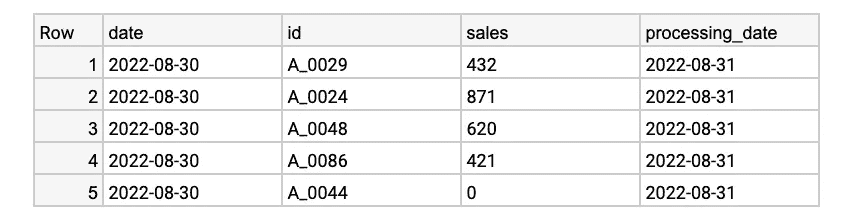
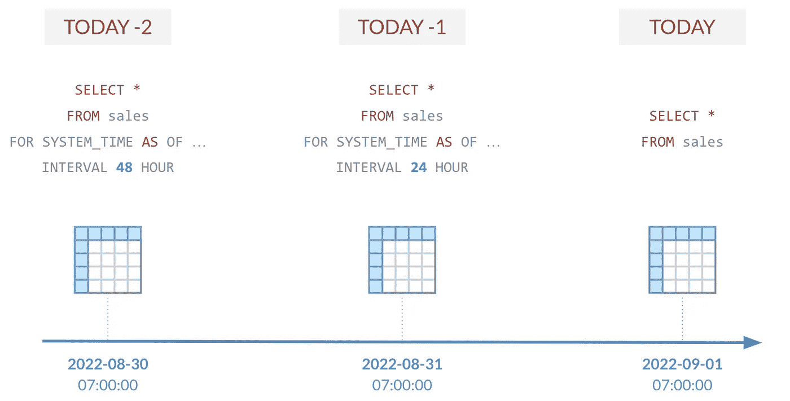
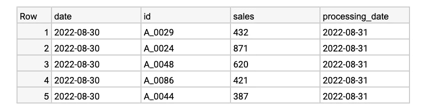
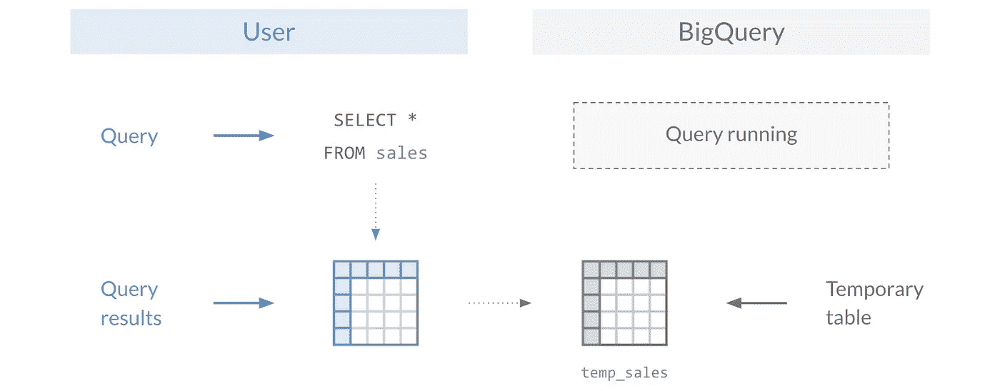
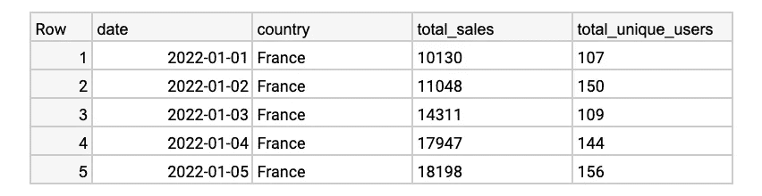
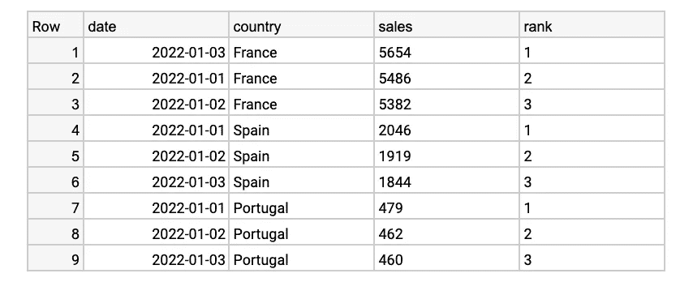

# 3 个省时的 BigQuery 特性

> 原文：<https://towardsdatascience.com/3-time-saving-bigquery-features-6433ba794e27>

## 编写更高效的查询并加快分析速度

照片由[泰勒维克](https://unsplash.com/@tvick?utm_source=unsplash&utm_medium=referral&utm_content=creditCopyText)在 [Unsplash](https://unsplash.com/?utm_source=unsplash&utm_medium=referral&utm_content=creditCopyText) 拍摄

# 介绍

BigQuery 是最流行的基于云的数据仓库平台之一。虽然它的主要功能是存储、管理和分析数据，但它的真正威力在于一组奇妙的内置功能，这些功能可用于从数据工程到数据科学的整个数据领域。

在过去几年的数据分析师工作中，我发现了一组有价值的特性和函数，它们帮助我编写了更高效的查询并增强了我的即席分析。

这里有三个必须知道的 BigQuery 特性和函数，它们将为您的数据之旅节省一些宝贵的时间。

# 时间旅行

"我希望我能回到过去。"谁没想过至少一次？BigQuery 在某种程度上让这成为可能。

为了演示到目前为止似乎不可能的事情，让我们以 BigQuery 中的`sales`表为例，该表每天更新前一天的数据，并直接输入到您的**销售仪表板中。**

今天是 2022 年 9 月 1 日，你正在查看你的**销售仪表板**，你注意到与昨天相比，两天前的 8 月 30 日销售量下降了。您的第一反应是使用以下查询在 BigQuery 中查看当天的原始数据:

查询结果(作者图片)

您的查询结果仅确认您在**销售仪表板**上看到的内容。但是当你昨天看着同一个仪表板时，你确信你的销售量更高。

使用 BigQuery 中的`FOR SYSTEM_TIME AS OF`子句，可以在特定时间点查询您的`sales`表，并确认您最初的假设。该功能的工作原理如下:

BigQuery 时间旅行图解(图片由作者提供)

例如，以下查询将返回 24 小时前`sales`表的历史版本:

查询结果(作者图片)

通过时光倒流，你已经确认了你的销售数字从一天到另一天发生了变化。你的商品 ***A_0044*** 的销售额从 387 降到了 0。看起来问题来自数据接收。你现在可以开始在那个方向缩小范围了。

当您需要检查旧版本的表或监控可能的数据摄取问题时，使用 BigQuery 进行时间旅行会很方便，如上例所示。

# 临时表

BigQuery 中另一个强大的概念是临时表。BigQuery 中的所有查询结果都自动存储在临时表中，供以后的分析使用。这对于在运行即席分析时使您的代码更加整洁非常有帮助。

图解的 BigQuery 临时表(图片由作者提供)

为了说明这个概念，让我们使用下面的查询示例，从您的`sales`和`users`表中返回每天的 **total_sales** 和 **total_unique_users** 。

查询结果(作者图片)

这个查询工作得很好，但是为了更容易阅读，您可以将`sales`和`users`cte(公共表表达式)的结果保存在 BigQuery 的临时表中。

为此，在两个大查询选项卡中分别运行`sales`和`users`查询(cte)**，并遵循以下步骤:**

**在 BigQuery **查询结果**窗口中，选择:**

1.  ****工作信息****
2.  ****目的地表****
3.  ****临时表****

**这将打开一个新的 BigQuery 窗口，查询结果存储在一个名为 randomly 的临时表中。对于这个例子，让我们假设这两个临时表被命名为`temporary_sales`和`temporary_users`。**

**然后，您可以在查询中使用这些新创建的临时表:**

****

**查询结果(作者图片)**

**这个最终查询将返回与原始查询相同的结果，除了它已经从 30 行减少到只有 8 行，使得它更容易阅读和操作。**

**当在即席分析中运行多个查询(有时是大量查询)时，这个 BigQuery 特性特别有用。**

# **过滤窗口函数**

**窗口函数(也称为分析函数)用于计算一组特定行的值，为每一行返回一个结果。**

**当您需要计算移动平均值、累积和，甚至对数据进行排序时，这些函数特别有用。**

**为了展示它们的威力，让我们使用`ROW_NUMBER` BigQuery 函数对`sales`表中的每一行进行排序，按国家进行分区，并按销售额降序排列:**

****

**查询结果(作者图片)**

**然而，大多数时候，您需要过滤查询结果。在这种情况下，我们希望只保留每个国家销售额最高的行— `WHERE rank = 1`。**

**您的第一个猜测可能是在`WHERE`子句中添加上述条件——您可能是对的。然而，您将在查询结果中得到以下错误消息。**

****

**BigQuery 错误消息(图片由作者提供)**

**这是不言自明的；在`WHERE`子句中不允许使用窗口函数。**

**要解决这个问题，第一个解决方案是在 CTE 中添加原始查询，并在下面的最终查询中过滤出结果，如下所示:**

****

**查询结果(作者图片)**

**那很完美，对吧？然而，BigQuery 提供了一个更加优雅的解决方案来过滤窗口函数的结果，它不会让您的代码负担过重。通过使用`QUALIFY`子句，您可以去掉 CTE，最终得到完全相同的结果。**

****

**查询结果(作者图片)**

**很棒，对吧？您的查询已经从十八行代码减少到只有七行代码。**

**SQL 窗口函数非常强大，知道如何操作它们的结果将允许您编写更干净、更高效的代码。**

# **结论**

**这些只是我经常使用的三个最有用的 BigQuery 特性。利用它们，您不仅可以编写更高效的查询，还可以在进行下一次分析时节省宝贵的时间。**

**现在轮到你了。**您最常用的 BigQuery 特性是什么？**不要犹豫，分享你的。**

# **参考**

**[1] BigQuery，[使用时间旅行访问历史数据](https://cloud.google.com/bigquery/docs/time-travel) (2022)，谷歌云**

**[2] BigQuery，[编写查询结果](https://cloud.google.com/bigquery/docs/writing-results) (2022)，谷歌云**

**[3] BigQuery，[查询语法— QUALIFY 子句](https://cloud.google.com/bigquery/docs/reference/standard-sql/query-syntax#qualify_clause) (2022)，谷歌云**