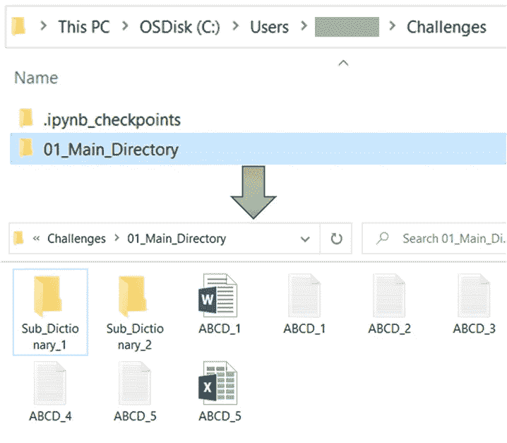
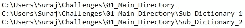
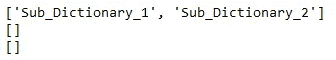
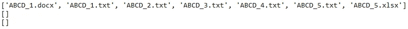

# 使用 Python 获取目录中所有文件的 3 种省时方法

> 原文：<https://towardsdatascience.com/3-time-saving-ways-to-get-all-files-in-a-directory-using-python-32113a801701>

## 数据科学

## 总有一种方法是你在寻找的


图片由 Freepik 上的[PCH . vector](https://www.freepik.com/free-vector/rich-people-keeping-cash-clocks-piggy-bank-vector-illustration-time-is-money-business-time-management-wealth-concept_11671960.htm#query=time%20is%20money&position=1&from_view=search&track=sph)

**获取目录和子目录中的所有文件！**

你谷歌过“ ***如何列出一个目录的所有文件？*** 或 ***使用 Python 查找一个目录下的所有 CSV 文件。*** “怎么样？

那么这篇文章将是你所有问题的一站式解决方案。

作为一名分析专家，我在日常工作中使用 Python。我经常需要从一个文件夹和子文件夹中取出所有文件。我相信你也遇到过类似的情况。

因此，我总结了 3 种快速获取目录或子目录中所有文件的方法。总有一种方法可以满足您的确切需求。

为了举例，我使用下面的文件夹模式。



字典结构|作者图片

将读取文件夹`**01_Main_Directory**`内容的笔记本在文件夹`**Challenges**`中。

我们开始吧..

根据您的任务，您可以使用以下一种或多种方法的组合。

我会从最简单的方法开始。

假设，你想列出文件夹`**01_Main_Directory**`中的所有文件。因此，您可以使用名称中明确说明其用途的功能，即`**listdir()**`

# os.listdir()

Python 模块`**os**`提供了这个功能，顾名思义，你可以获得路径中所有文件、文件夹和子文件夹的列表。

使用该功能前，不要忘记导入模块`os`。在这个例子中，要列出`**01_Main_Directory**` 中的所有文件，你需要做的就是——在`os.listdir()`函数中提供这个文件夹的路径。如果此文件夹不在您当前的路径中，那么您需要将它添加到路径中。

> 但是我怎么得到当前的路径呢？？

您可以使用另一个函数`os.getcwd()`来获取当前路径。

```
import os
os.getcwd()

#Output
'C:\\Users\\Suraj\\Challenges'
```

如您所见，当前路径指向存储该笔记本的挑战文件夹。

您需要手动将文件夹`01_Main_Directory`添加到该路径，以获得其中所有文件的列表，如下所示。

```
import os
os.listdir(os.getcwd()+'\\01_Main_Directory')

#Output
['ABCD_1.docx',
 'ABCD_1.txt',
 'ABCD_2.txt',
 'ABCD_3.txt',
 'ABCD_4.txt',
 'ABCD_5.txt',
 'ABCD_5.xlsx',
 'Sub_Dictionary_1',
 'Sub_Dictionary_2']
```

简单！你拿到了文件夹里所有文件的清单。

该列表包含所提供路径中的所有文件和子文件夹。

或者，要获得所有文件夹、子文件夹和子文件夹中的文件的列表，您可以使用 os 模块中更复杂的功能。

# os.walk()

顾名思义，这个函数将带您浏览目录树。

Python 中的这个方法类似于`os.listdir()`，但是`os.walk()`返回一个由 3 个元素组成的元组，其中包含——

1.  `**folder_path**`:当前文件夹以及当前文件夹中所有文件夹的路径
2.  `**folders**`:所提供路径中的文件夹或目录列表
3.  `**files**`:提供的目录路径及其子目录下的文件列表

为了便于理解，让我们来看看这个函数的运行情况！

```
path = os.getcwd()+'\\01_Main_Directory'
for folder_path, folders, files in os.walk(path):
    print(folder_path)
```



Python |作者图片中的 os.walk()

输出的第一行将总是当前目录的路径或作为输入提供给`os.walk()`的路径。后面是按字母顺序排列的子目录路径。

要获得所提供路径中所有文件夹的列表，可以使用`os.walk()`生成器对象中的第二个变量，如下所示。

```
path = os.getcwd()+'\\01_Main_Directory'
for folder_path, folders, files in os.walk(path):
    print(folders)
```



Python 中的 os.walk()目录名|作者图片

与`folder_path`类似，该输出的第一行将是在提供的路径中出现的所有子文件夹的列表。第二行和第三行列出了这些子文件夹中的文件夹。

在本例中，`Sub_Dictionary_1`和`Sub_Dictionary_2`中没有文件夹。所以输出的剩余行显示空列表。

类似地，使用元组的最后一个元素，可以检索路径中存在的所有文件。

```
path = os.getcwd()+'\\01_Main_Directory'
for folder_path, folders, files in os.walk(path):
    print(files)
```



按作者列出路径|图像中存在的文件列表

由于所有文件只存在于`01_Main_Directory`中，输出的第一行列出了所有文件。

当您只想查看文件夹中有哪些文件时，这尤其有用。要使用这些文件，您需要文件路径。

这就是另一个模块`glob`将帮助您实现的地方。

# glob — Unix 样式路径名模式扩展

该模块对匹配特定模式的文件路径很有帮助——在 Python *glob* 模块的`**glob()**`函数中指定。您应该在`glob()`函数中提到的模式应该遵循 Unix 路径扩展规则。

要获得后续文件夹中文件的路径，您只需提供存储文件的文件夹的路径。您可以灵活地提供绝对和相对文件路径。

例如，假设您想要检索`01_Main_Directory`中的所有文件，您需要做的就是提供该文件夹的路径。

```
import glob
path = os.getcwd()+'\\01_Main_Directory'
for filepath in glob.glob(path):
    print(filepath)

#Output
C:\Users\Suraj\Challenges\01_Main_Directory
```

这只是将路径返回给了`01_Main_Directory`，因为`glob.glob()`中提供的路径终止于该文件夹。

要检索所有文件，您实际上应该指定超出该文件夹的路径，如下所示。

```
path = os.getcwd()+'\\01_Main_Directory\\*'
for filepath in glob.glob(path):
    print(filepath)

#Output
C:\Users\Suraj\Challenges\01_Main_Directory\ABCD_1.docx
C:\Users\Suraj\Challenges\01_Main_Directory\ABCD_1.txt
C:\Users\Suraj\Challenges\01_Main_Directory\ABCD_2.txt
C:\Users\Suraj\Challenges\01_Main_Directory\ABCD_3.txt
C:\Users\Suraj\Challenges\01_Main_Directory\ABCD_4.txt
C:\Users\Suraj\Challenges\01_Main_Directory\ABCD_5.txt
C:\Users\Suraj\Challenges\01_Main_Directory\ABCD_5.xlsx
C:\Users\Suraj\Challenges\01_Main_Directory\Sub_Dictionary_1
C:\Users\Suraj\Challenges\01_Main_Directory\Sub_Dictionary_2
```

如您所见，这里的路径使用`**\\***` 扩展到文件夹`01_Main_Directory`内部。这里，星号(`*****`)是通配符，代表选择文件夹内的所有文件。

但是，您通常知道文件名的结尾部分，或者只知道文件名中的几个字符。

举个例子，假设您想从这个文件夹中获取所有文件名中包含字符串`**1**`的文件路径。您可以通过如下所示的非常简单的方式使用`glob()`功能。

```
path = os.getcwd()+'\\01_Main_Directory\\*1.*'
for filepath in glob.glob(path):
    print(filepath)

#Output
C:\Users\Suraj\Challenges\01_Main_Directory\ABCD_1.docx
C:\Users\Suraj\Challenges\01_Main_Directory\ABCD_1.txt
```

这会获取名称中包含 1 的所有文件名，但输出包含所有类型的文件。

如果你只想拉。txt 文件吗？？

就像你在上面看到的用例一样，你需要写一个模式。当然可以。txt 文件末尾会有`**.txt**`。你想要获取所有的文件，这样你就可以使用通配符星号(`*****`)。所以您在`glob()`中提供的模式是`***.txt**` ，您可以如下图所示使用它。

```
path = os.getcwd()+'\\01_Main_Directory\\*.txt'
for filepath in glob.glob(path):
    print(filepath)

#Output
C:\Users\Suraj\Challenges\01_Main_Directory\ABCD_1.txt
C:\Users\Suraj\Challenges\01_Main_Directory\ABCD_2.txt
C:\Users\Suraj\Challenges\01_Main_Directory\ABCD_3.txt
C:\Users\Suraj\Challenges\01_Main_Directory\ABCD_4.txt
C:\Users\Suraj\Challenges\01_Main_Directory\ABCD_5.txt
```

答对了。！你得到了文件夹中所有文本文件的路径。同样，要获得所有的。docx 文件，需要在`glob()`内提供模式`***.docx**`。

再往前一步，假设您想获得子文件夹— `Sub_Disctionary_1`和`Sub_Dictionary_2`中的所有文件，那么 glob()是最有用的函数。

您需要做的就是在路径中使用通配符模式`******`。这里需要设置参数`recursive=True`，如下图。

```
path = os.getcwd()+'\\01_Main_Directory\\**\\*.txt'
for filepath in glob.glob(path, recursive=True):
    print(filepath)

#Output
C:\Users\Suraj\Challenges\01_Main_Directory\ABCD_1.txt
C:\Users\Suraj\Challenges\01_Main_Directory\ABCD_2.txt
C:\Users\Suraj\Challenges\01_Main_Directory\ABCD_3.txt
C:\Users\Suraj\Challenges\01_Main_Directory\ABCD_4.txt
C:\Users\Suraj\Challenges\01_Main_Directory\ABCD_5.txt
C:\Users\Suraj\Challenges\01_Main_Directory\Sub_Dictionary_1\File_1_in_SubDict_1.txt
C:\Users\Suraj\Challenges\01_Main_Directory\Sub_Dictionary_1\File_2_in_SubDict_1.txt
C:\Users\Suraj\Challenges\01_Main_Directory\Sub_Dictionary_2\File_1_in_SubDict_2.txt
C:\Users\Suraj\Challenges\01_Main_Directory\Sub_Dictionary_2\File_2_in_SubDict_2.txt
```

路径中的模式`******`将与文件夹`01_Main_Dictionary`中的所有目录和文件相匹配。

仅此而已！

我希望这篇文章对快速参考有用。

当然还可以有更多来自不同 Python 包的工具，比如`pathlib`和`os.scandir()`，但是上面提到的三个函数非常简单，也很常用。

如果你想在 Medium 上阅读如此精彩的文章，可以考虑成为 Medium 会员，无限制地阅读所有文章。

您可以使用下面的我的推荐链接加入 Medium。这将有助于我和其他作者，因为 Medium 与我们分享你的 5 美元中的一小部分。

[](https://medium.com/@17.rsuraj/membership) [## 加入我的推荐链接- Suraj Gurav 媒体

### 作为一个媒体会员，你的会员费的一部分会给你阅读的作家，你可以完全接触到每一个故事…

medium.com](https://medium.com/@17.rsuraj/membership) 

另外，请 [**订阅**](https://medium.com/subscribe/@17.rsuraj) 我的邮件列表&将我的文章直接放入你的收件箱。

感谢您的阅读！