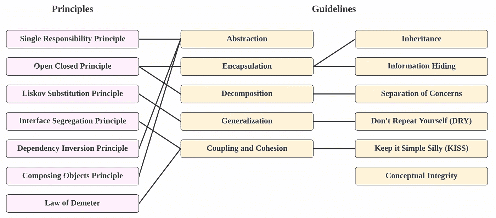

# 除了编码最佳实践之外，编写干净代码的 3 个技巧

> 原文：<https://towardsdatascience.com/3-tips-for-writing-clean-codes-beyond-coding-best-practices-c53b04120c3>

## 编写优雅的、模块化的、可理解的和可维护的代码

Pierre chtel-Innocenti 在 [Unsplash](https://unsplash.com?utm_source=medium&utm_medium=referral) 上拍摄的照片

你可能听说过“混乱的代码”这个术语，并想知道混乱到底是什么意思(当你的代码工作时)，或者遇到过一些编码最佳实践术语，如[固体](https://en.wikipedia.org/wiki/SOLID)设计原则、[干燥](https://en.wikipedia.org/wiki/Don%27t_repeat_yourself)(不要重复自己)，或者[亲吻](https://en.wikipedia.org/wiki/KISS_principle)(保持简单愚蠢)原则。编码最佳实践中有如此多的术语和规则，以至于我发现它令人困惑和重复(讽刺来自 KISS 和 DRY 原则)，并质疑它们在实践中是否可行，因为它们毕竟是在理论上。

本文旨在提供良好编码标准、编码最佳实践、不同代码味道和设计模式的速成课程和总结，并以编写干净代码的 3 个实用技巧结束。在我以前的一篇文章中，我写了一些学习新编程语言的方法，这篇文章是对那篇文章的扩展，因为这篇文章假设了一些代码理解。请随意查看我以前的文章，

</how-to-learn-new-programming-languages-easily-1e6e29d3898a>  

# 目录

1.  [编码标准](https://medium.com/p/c53b04120c3/#2d5c)
2.  [编码最佳实践](https://medium.com/p/c53b04120c3/#90ce)
3.  [代码气味](https://medium.com/p/c53b04120c3/#e023)
4.  [设计模式](https://medium.com/p/c53b04120c3/#6b96)
5.  [提示 1:规划你的组件](https://medium.com/p/c53b04120c3/#6b96)
6.  技巧 2:不断抽象你的代码
7.  [提示 3:利用开源工具](https://medium.com/p/c53b04120c3/#0553)

# 编码标准

> 编码标准定义了代码约定或风格指南，就像英语如何遵循语法规则一样，编写遵循编码约定的代码可以提高代码的可读性和可理解性。

不同编程语言的编码标准通常遵循相同的规则，但由于不同的语言有不同的语法，所以可能会略有不同。Python 有 [PEP 8](https://peps.python.org/pep-0008/) 标准，Java 有[Oracle](https://www.oracle.com/java/technologies/javase/codeconventions-contents.html)创建的代码约定。

为了使本文与语言无关，编码标准通常为以下内容定义规则

*   文件夹和文件结构(针对 Java)
*   缩进和间距
*   包、模块、类、变量名等的命名约定。
*   执行导入、编写注释和语句的正确方式

在上面的每一个类别中，都有很多规则要遵循——在 PEP 8 文档中甚至有一个关于“讨厌的东西”的章节！有这么多规则要遵守，很难记住所有的规则，或者很容易漏掉某些违规，就像英语中有拼写错误一样。

有一些工具可以帮助标记出不符合正确编码标准的代码，如 IDE(集成开发环境)可以突出显示不符合正确编码标准的代码，还有一些工具可以帮助重新格式化和重写代码，称为代码林挺。帮助林挺的一些流行的 Python 包有 [pylint](https://pylint.pycqa.org/) 、 [black](https://black.readthedocs.io/en/stable/usage_and_configuration/index.html) 、 [flake8](https://flake8.pycqa.org/) 和 [isort](https://pycqa.github.io/isort/) 等等。

# 编码最佳实践

> 编码最佳实践定义了构建代码的理论和指导方针，增强了代码的模块化和可维护性

正如本文开头所提到的，在编码最佳实践的大伞下使用了许多行话。我在下图中总结并画出了常用术语之间的联系。这应该是一个总结，而不是详尽的例子。

图 1:原则和指南摘要—作者图片

遵循可靠的设计原则，

*   **单一责任原则**:一个班只能有一项工作
*   **打开关闭原则**:一个类应该对扩展开放，但对修改关闭
*   **利斯科夫替换原则**:程序中的对象应该可以用它们的子类型的实例替换，而不改变程序的正确性
*   **接口分离原则**:永远不要强迫客户实现一个它不使用的接口
*   **依赖倒置原则**:高级模块应该依赖于高级概括，而不是低级细节

其他设计原则和指南包括:

*   **组合对象原则**:类应该通过聚合而不是继承来实现代码重用
*   **得墨忒耳定律/最小知识原理**:类应该尽可能少地了解其他类并与之交互
*   抽象:通过只显示相关信息来简化
*   **封装**:将属性和行为捆绑到一个对象中，并在必要时公开特性
*   **分解**:将一个实体分解成可以单独实现的部分
*   **泛化**:分解出可以在其他地方重用的类的公共特性
*   **耦合和内聚**:松散耦合的模块依赖性更小，更容易重用，而高内聚描述的是一个有明确目的的模块，不会比它需要的更复杂
*   **继承**:子类从超类继承或者通过接口实现的属性或行为
*   **信息隐藏**:模块应该只能访问它需要的信息
*   关注点分离:不同的关注点应该在不同的模块中
*   **不要重复自己**:减少代码重复
*   保持简单愚蠢:简单应该是一个设计目标
*   概念完整性:创建一致的软件，并决定如何设计和实现系统

> 主要外卖就是这些是一大堆原则，有些原则是对比的！例如，封装和分解在某种程度上有相反的含义，这就引出了什么时候应该使用每一个原则的问题。

在实践中，我们根据自己的判断，在任何适用的情况下运用这些原则，我们甚至可能为了“更大的利益”而违背某些原则。了解这些原则就足够了，它不应该作为实现一切的清单来执行。

# 代码气味

> 代码气味是坏代码的一个症状，这可能表明更深层次的问题

类似于编码最佳实践，知道代码气味的存在就足够了，而不是强制或可能避免所有代码气味。也很难避免代码味道，因为它们可能是基于开发人员、编程语言和问题类型的主观味道。

常见的代码气味是，

1.  **注释**:有注释是好的，但是如果注释被过度使用(*主观*)来弥补代码的不清晰，那就有问题了
2.  **大类**:如果一个类非常大(*主观*，考虑使用分解
3.  **数据类**:如果类太小(*主观*)；与大类相反
4.  **数据块**:如果一组代码经常一起出现，考虑使用封装
5.  **重复代码**:如果在代码库的多个部分发现了几乎没有变化的相同代码，考虑使用泛化
6.  **长方法**:如果一个方法很大(*主观*，这表明关注点的分离很差，考虑使用分解
7.  **长参数列表**:如果一个方法有一个长参数列表(*主观*)，考虑传递封装了公共参数的参数对象
8.  **霰弹枪手术**:如果一个地方的变化导致了其他多个部分的变化，这表明了紧耦合

以上项目是常见代码气味的非详尽列表，完整的代码气味列表可以在[这里](https://en.wikipedia.org/wiki/Code_smell)找到。正如您从上面的列表中所观察到的，代码气味可能是相当主观的，并且与编码最佳实践密切相关——如果您努力实践和实现编码最佳实践，代码气味也可以被最小化。

# 设计模式

> 设计模式为常见的软件工程问题提供解决方案，并且与语言和代码无关。

有三种类型的设计模式——创造、结构和行为设计模式。

*   **创造性设计模式**定义了设计对象实例化方法的方式，例如使用继承或封装来实例化对象的不同方式等。
*   结构设计模式定义了创建类和关系的设计方法，重点是保持它们的灵活性和高效性
*   行为设计模式定义了设计相关类行为的方法，重点是类和对象如何相互通信

虽然设计模式更适用于面向对象编程，但它的设计概念是与代码无关的。了解不同的设计模式使您能够选择适用于该问题的设计模式。每个设计模式的详细说明可以在[这里](https://en.wikipedia.org/wiki/Software_design_pattern)找到。

# №1.规划您的组件

> “如果你没有计划，你就计划失败。”——本杰明·富兰克林

> 总是仔细检查项目需求并计划组件以防止将来主要的代码重组是有好处的。

在大多数情况下，在编写代码的时候，你确实对代码库的结构有一些想法。例如，数据科学工作流分为数据接收、数据处理、特征工程、建模和评估组件，并且作为**关注点分离**最佳实践的一部分，为每个组件创建单独的文件夹或文件。

这些组件可以源自项目的性质(在这种情况下是数据科学工作流),也可以是特定于项目的组件。如果项目需要添加额外的组件，比如数据分析，那么就要为它做好计划，并尽早将它们包含进来。

最后，除了与代码相关的组件，规划与数据相关的组件也很重要。确定将要加载和保存的数据量和内容，并设计数据的存储方式！

# №2.不断抽象你的代码

> “设计是一个迭代的过程。一个想法往往建立在另一个之上”——马克·帕克

按照上一节，当您完成所有组件时，代码正常工作，没有任何中断——但是将来会中断吗？可能会有变化或新的需求、数据、特性或实现方法。

让我们假设数据路径发生了变化，您最终更改了代码的多个部分来从新路径中读取数据——这发出了一种猎枪手术代码味道的信号。您执行抽象，将数据路径抽象到配置文件中，问题就解决了。

第二天，数据格式发生了变化，您最终更改了代码的多个部分来改变数据的读取方式——这发出了一种猎枪手术代码味道的信号。您执行抽象，将代码抽象成一个加载数据的新函数，问题就解决了。

这就引出了一个问题——您应该事先执行抽象吗？您第一次没有正确规划组件吗？然而，如果您过度抽象您的代码，这可能会导致不必要的复杂性，因为您过度设计了代码(这也是另一种代码味道)。这是编码最佳实践在理论和实践上的冲突。

一般的经验法则是执行关注点分离，而不是硬编码变量。如果您不得不在项目过程的后期抽象出组件，那也没关系——变化确实会发生，编码是一个迭代循环。

# №3.利用开源工具

> 不要多此一举

因为现在每个组件都是分离的，所以很容易感到渴望从头开始实现每个组件。手工实现组件也让开发人员对流程有了更多的控制，因为每个部分都可以根据需要进行调整。

然而，你写的代码越多，代码库越复杂，其他开发者就越难理解你的代码库。如果其他开发人员不理解你的代码库，将来很难维护。利用其他开发人员广泛使用和了解的开源工具会更容易。

例如，如果您正在安排作业，请使用 Apache Airflow。如果你在做实验，用 MLFlow 跟踪你的实验。利用开源工具并将其集成到项目中，因为它们通常由自己的开发人员更好地开发和维护，这样您就少了一份担心。

</job-scheduling-with-apache-airflow-2-0-in-10-minutes-16d19f548a46>  </experiment-tracking-with-mlflow-in-10-minutes-f7c2128b8f2c>  

# 结论

在重构和重组了来自我的队友的多个代码库以及我自己的代码库之后，我发现这些技巧是有益的，可以节省我很多时间和精力。编码实际上是一个迭代周期，即使遵循了编码最佳实践，我仍然发现自己在做调整和改变。我希望这篇文章对编码标准、最佳实践、代码味道和设计模式有所启发，并且这些提示将成为您在未来项目中考虑的东西！

概括来说，这是本文分享的 3 个技巧

1.  规划您的组件
2.  不断抽象你的代码
3.  利用开源工具

**感谢您的阅读！**如果你喜欢这篇文章，请随意分享。

# 相关链接

## 编码标准

*   python PEP 8:【https://peps.python.org/pep-0008/ 
*   Java 代码约定:[https://www . Oracle . com/Java/technologies/Java se/Code conventions-contents . html](https://www.oracle.com/java/technologies/javase/codeconventions-contents.html)

## 设计模式

*   设计模式:[https://refactoring.guru/design-patterns](https://refactoring.guru/design-patterns)