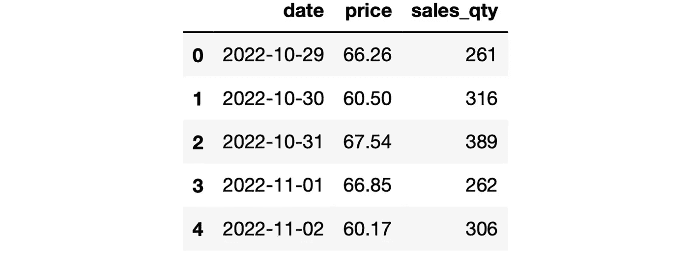

# 与熊猫建立更稳固管道的 3 个技巧

> 原文：<https://towardsdatascience.com/3-tips-to-create-more-robust-pipelines-with-pandas-c404c52ad216>

## 高效有序的工作流程之路。


在 [Unsplash](https://unsplash.com/s/photos/clean?utm_source=unsplash&utm_medium=referral&utm_content=creditCopyText) 上[偷拍](https://unsplash.com/@candid?utm_source=unsplash&utm_medium=referral&utm_content=creditCopyText)的照片

Pandas 是一个数据分析和操作库，所以它可以让你从杂乱的原始数据到丰富的见解。不过在这个过程中，你可能会做一系列的数据清理、处理、分析操作。

当您有一组连续的步骤来预处理原始数据时，pipe 函数有助于设计一个有组织的、健壮的工作流。

在本文中，我将分享在设计更好的管道时很重要的 3 个技巧。

在开始学习这些技巧之前，让我们先简单介绍一下什么是管道并创建一个管道。管道是指使用管道功能连接的一系列操作。管道中使用的函数需要将一个数据帧作为输入，并返回一个数据帧。

我有一个包含一些模拟数据的数据帧:

```
import numpy as np
import pandas as pddf = pd.read_csv("sample_dataset.csv")df.head()
```



df(作者图片)

以下是需要在该数据帧上完成的操作列表:

*   日期列的数据类型是 string，需要将其转换为适当的数据类型。
*   价格列中有缺失值，需要用以前的价格填充。
*   销售数量列中有一些异常值，需要删除。

我们的管道包含 3 个步骤。我们首先为上面的任务定义函数。

```
def handle_dtypes(df):
    df["date"] = df["date"].astype("datetime64[ns]")
    return dfdef fill_missing_prices(df):
    df["price"].fillna(method="ffill", inplace=True)
    return dfdef remove_outliers(df):
    return df[df["sales_qty"] <= 2000].reset_index(drop=True)
```

这里是管道:

```
df_processed = (df.
                 pipe(handle_dtypes).
                 pipe(fill_missing_prices).
                 pipe(remove_outliers))
```

通过分别应用这些功能，可以完成相同的操作。但是，管道功能提供了一种结构化和有组织的方式，可以将多个功能合并到一个操作中。

根据原始数据和任务，预处理可能包括更多步骤。我们可以使用管道功能根据需要添加任意多的步骤。随着步骤数量的增加，与单独执行函数相比，管道函数的语法变得更加清晰。

我们现在有了一个功能管道，所以我们可以从吸头开始。

## 1.独占启动管道

在下面的管道中，我们将修改后的 DataFrame 赋给另一个名为“df_processed”的变量。

```
df_processed = (df.
                 pipe(handle_dtypes).
                 pipe(fill_missing_prices).
                 pipe(remove_outliers))
```

我们可以假设原始数据帧 df 保持不变。然而，事实并非如此。即使我们将流水线的输出赋给另一个变量，原始的数据帧也会被更新。

这不是一个好的做法，因为我们通常希望保持原始数据对我们可用。解决方案是用一个独占的启动步骤来启动流水线，它只是复制原始的数据帧。

这个步骤可以使用下面的函数来完成。

```
def start_pipeline(df):
    return df.copy()
```

让我们也相应地更新管道。

```
df_processed = (df.
                 pipe(start_pipeline).
                 pipe(handle_dtypes).
                 pipe(fill_missing_prices).
                 pipe(remove_outliers))
```

现在，无论我们在管道中做什么，原始数据帧都保持不变。

## 2.添加参数

参数为函数增加了更多的功能和灵活性。我们可能在管道中有带参数的函数。

酷的是这些参数可以在管道内部访问。我们可以用它们作为管道函数的参数。

为了演示这种情况，让我们通过将检测异常值的阈值作为一个参数，使删除异常值函数更灵活一些。

```
def remove_outliers(df, threshold=2000):
    return df[df["sales_qty"] <= threshold].reset_index(drop=True)
```

默认值是 2000，因此如果我们在管道中不使用该参数，异常值阈值将是 2000。

我们可以如下控制流水线中的阈值:

```
df_processed = (df.
                 pipe(start_pipeline).
                 pipe(handle_dtypes).
                 pipe(fill_missing_prices).
                 pipe(remove_outliers, threshold=1500))
```

## 3.记录

我们有一个由 4 个步骤组成的管道。根据原始数据和手头的任务，我们可能需要创建包含多个步骤的管道。

在这样的工作流中，跟踪每一步发生的事情是很重要的，这样在出现问题时就更容易调试。

我们可以通过在每一步之后记录一些信息来实现这一点。在我们的管道中，数据帧的大小告诉我们是否发生了意想不到的事情。

让我们在管道中应用每一步后打印数据帧的大小。由于这些步骤是函数，我们可以使用 Python 装饰器来完成这项任务。

一个[装饰器](https://medium.com/p/ac33d6f736cb)是一个接受另一个函数并扩展其行为的函数。不修改基本函数。装饰者包装它并添加额外的功能。

这是我们将在管道中的函数上使用的装饰器。

```
from functools import wrapsdef logging(func):
    [@](http://twitter.com/wraps)wraps(func)
    def wrapper(*args, **kwargs):
        result = func(*args, **kwargs)
        print(f"The size after {func.__name__} is {result.shape}.")
        return result
    return wrapper
```

我们将如下“装饰”管道中使用的函数:

```
[@logging](http://twitter.com/logging)
def start_pipeline(df):
    return df.copy()[@logging](http://twitter.com/logging)
def handle_dtypes(df):
    df["date"] = df["date"].astype("datetime64[ns]")
    return df[@logging](http://twitter.com/logging)
def fill_missing_prices(df):
    df["price"].fillna(method="ffill", inplace=True)
    return df[@logging](http://twitter.com/logging)
def remove_outliers(df, threshold=2000):
    return df[df["sales_qty"] <= threshold].reset_index(drop=True)
```

让我们重新运行管道。

```
df_processed = (df.
                 pipe(start_pipeline).
                 pipe(handle_dtypes).
                 pipe(fill_missing_prices).
                 pipe(remove_outliers, threshold=1500))**# output**
The size after start_pipeline is (1000, 3).
The size after handle_dtypes is (1000, 3).
The size after fill_missing_prices is (1000, 3).
The size after remove_outliers is (997, 3).
```

我们现在有了一个输出，它告诉我们管道中的流程。您可以定制日志记录功能，并添加一些其他功能，如测量函数执行所需的时间。

*你可以成为* [*媒介会员*](https://sonery.medium.com/membership) *解锁我的全部写作权限，外加其余媒介。如果你已经是了，别忘了订阅**如果你想在我发表新文章时收到电子邮件。***

## *结论*

*管道非常适合组织数据清理和处理工作流。我们在本文中所做的例子似乎很容易通过分别应用函数来处理。然而，考虑到我们有超过 10 个步骤应用于原始数据。与使用管道相比，用单独的函数处理它们调试起来有点麻烦和乏味。*

*感谢您的阅读。如果您有任何反馈，请告诉我。*