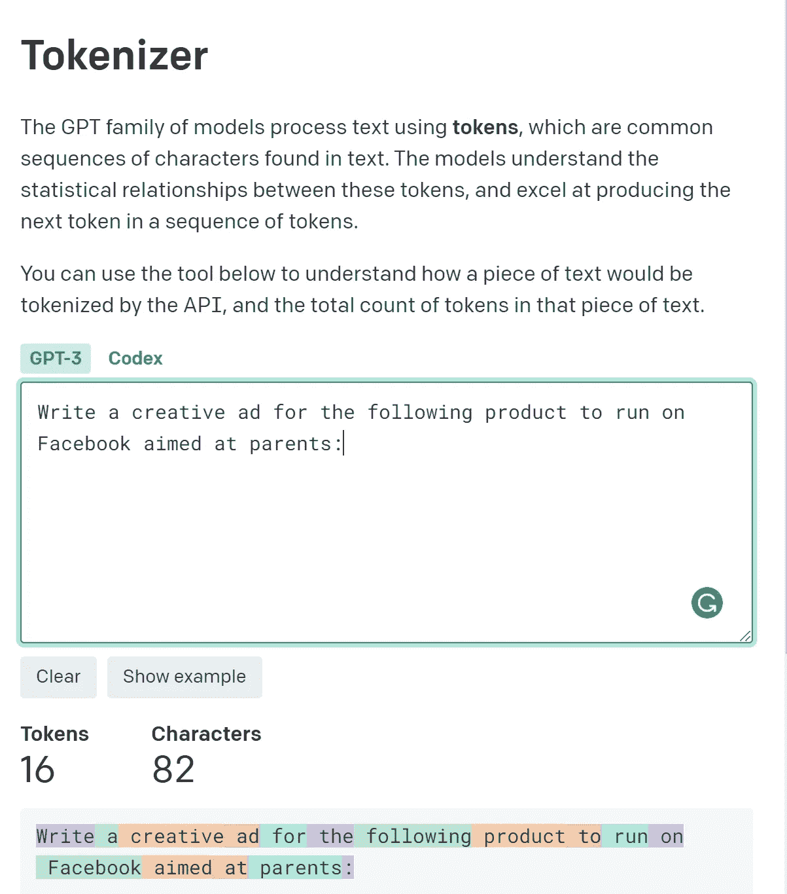
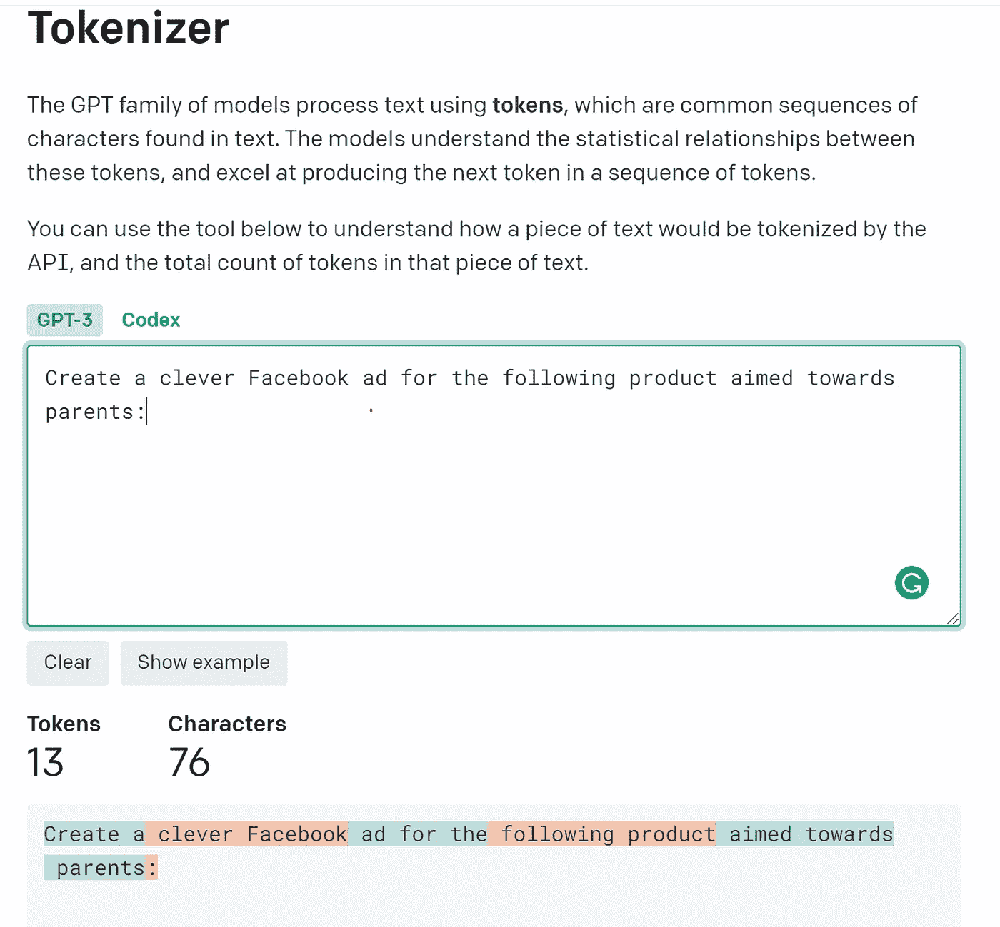
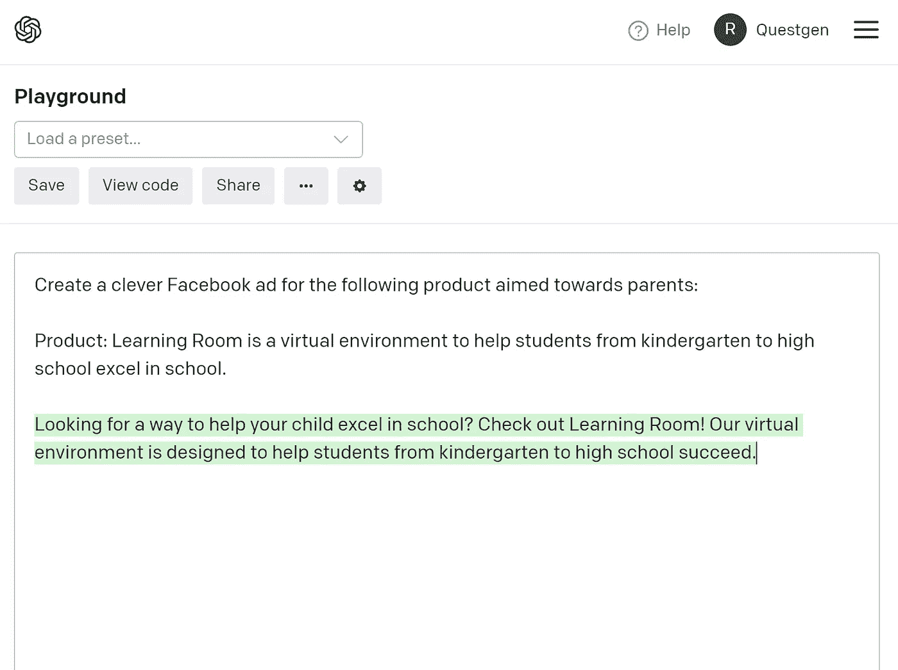
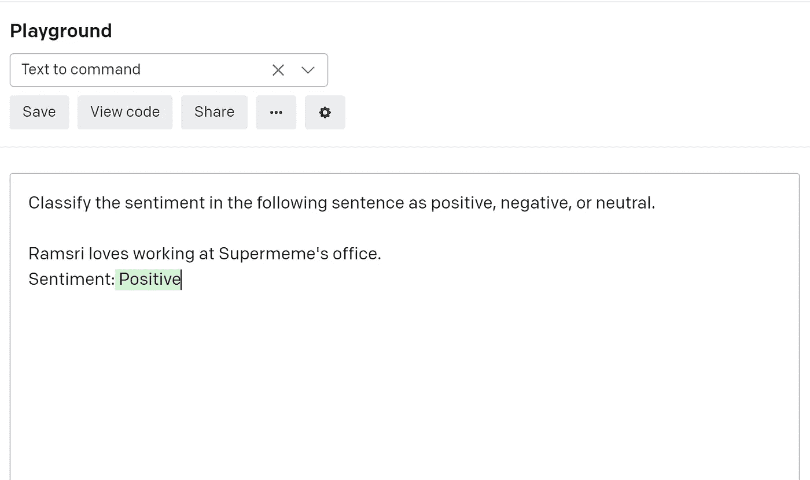
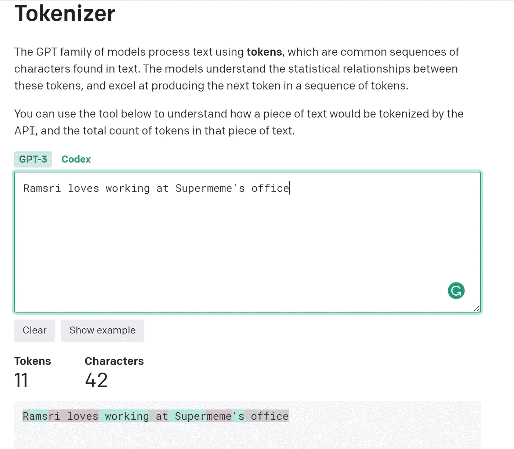
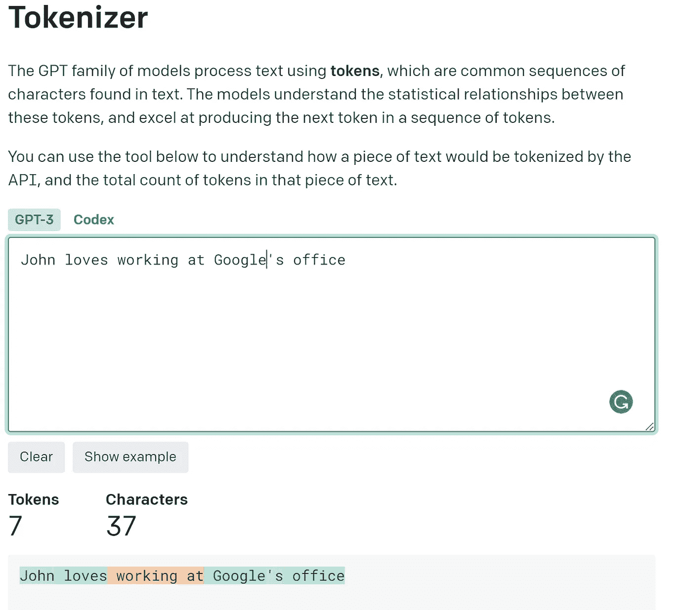
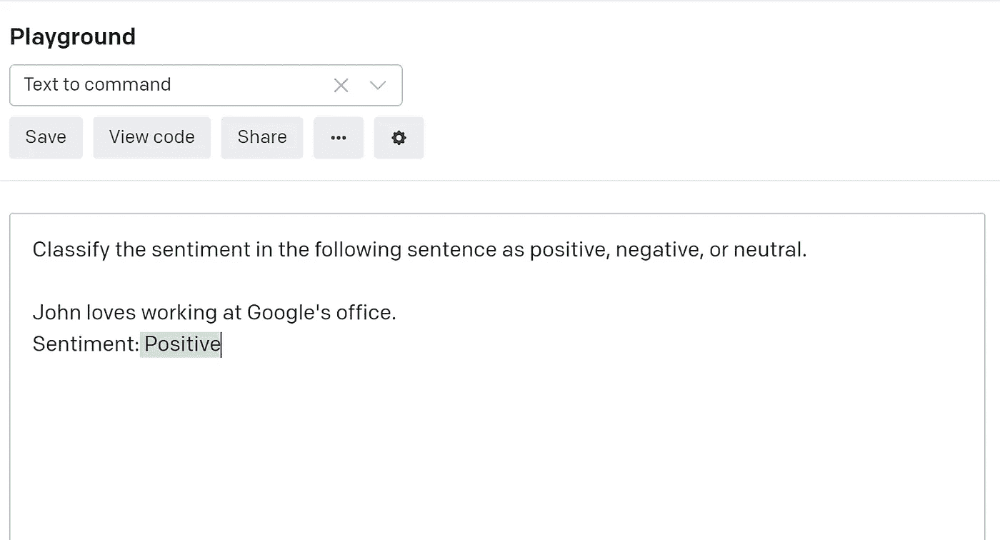
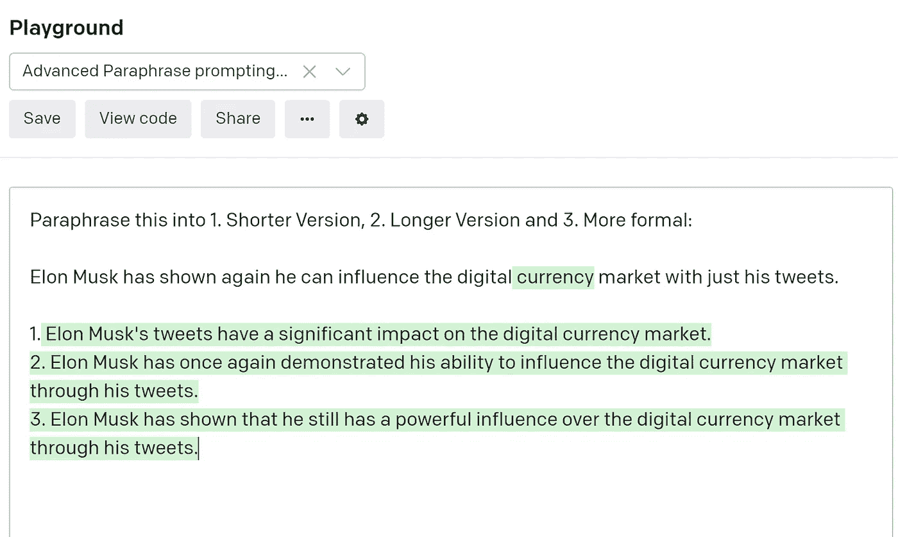

# 通过智能提示降低 OpenAI GPT-3 成本的 3 个技巧

> 原文：<https://towardsdatascience.com/3-tips-to-reduce-openai-gpt-3s-costs-by-smart-prompting-53c457229cfc>

## 减少 GPT-3 提示令牌并节省资金

作者图片

GPT-3 的最高和最准确的模型达芬奇成本为每 1000 代币 6 美分。因此，在生产应用中进行大规模运营并不便宜。

所以除了设计提示之外，掌握智能提示的技巧也很重要，那就是减少输入提示中的标记数量。

在本教程中，我们将看到一些技术来减少给定提示中的令牌数量，这些技术来自我构建[superme . ai](https://supermeme.ai/)的经验，这是一个基于 GPT 3 的应用程序，目前正在生产中。请记住，每减少 1000 个代币可以节省 6 美分(0.06 美元)，因此从规模上来看，这是巨大的。

# 1.迅速解释

所以让我们从 OpenAI 的[游乐场](https://beta.openai.com/playground)本身提供的一个例子开始，叫做**“来自产品描述的广告”。**

在下图中，输入是黑色文本，输出是 GPT-3 生成的绿色高亮文本。

为了在生产应用程序中运行，第一行**“在脸书上为以下产品写一个创意广告给 rn，目标是父母:“，**总是保持不变，只有产品描述是从用户输入中动态获取的。

GPT 3 号游乐场广告描述示例

在下图中，您可以看到第一行输入来自 [GPT-3 令牌估计器的 16 个令牌。](https://beta.openai.com/tokenizer)

具有 16 个令牌的原始提示

但是我们可以使用类似于 [Quillbot](https://quillbot.com/) 的解释工具来缩短提示，然后在 GPT-3 令牌估计器中测试修改后的提示的令牌总数。请注意，字数的减少并不一定意味着标记的减少，因为 GPT-3 标记器是根据自己的数据训练的，并不直接与单词相关。

用 Quillbot 解释提示

新的转述提示“为以下针对父母的产品创建一个聪明的脸书广告”，只需要 13 个令牌，而原来的提示需要 16 个令牌。这是一个 3 令牌减少！

只有 13 个标记的解释提示

通过在操场上再次测试，你可以看到转述提示在为脸书生成一个好的广告文案方面也很有效。

如果您对转述提示符生成的文本感到满意，那么您可以继续使用转述提示符，它的令牌数更少，生产成本也更低。

生成的带有解释提示的广告

# 2.NER 替换提示

让我们考虑另一个例子，你试图对一个给定的句子进行情感分析。在下图中，你可以看到输入的句子是**“rams ri 喜欢在 Supermeme 的办公室工作”**。在这里，Ramsri 是一家**公司的名字**，Supermeme 是一家**公司的名字**。

原始提示情绪

如果您查找该提示消耗的令牌数，您可以看到“Ramsri 喜欢在 Supermeme 的办公室工作”总共有 11 个令牌。这是因为 Ramsri 对于 GPT-3 记号赋予器来说不是一个已知单词，所以它将 Ramsri 拆分为“R”+“AMS”+“ri”(3 个记号)，如下图中的彩色编码文本所示。

但是有趣的部分来了！能不能把 **Ramsri** (3 个令牌字)换成一个像‘约翰’这样的令牌字，省两个令牌？答案是肯定的！

原始句子标记计数

因此，您可以用“John”替换“Ramsri ”,用“Google”替换类似的“Supermeme ”,并将句子的令牌从 11 个减少到 7 个！

因此，本质上，您可以进行 NER(命名实体识别)来识别命名实体，如名称、组织、地点等，并用相应的一个替代令牌来替换它们。

NER 修改令牌计数

就句子的情感而言，不管你有“约翰快乐”还是“拉姆斯里快乐”！对于这种情况，它总是产生积极的正确情绪。

NER 取代了即时情绪

# 3.多任务提示

与多次调用 GPT-3 引擎并为每个单独的任务消耗令牌相比，您可以在一个提示中组合多个任务。

在这里，你可以看到，在一个提示中，我们能够将句子**“埃隆·马斯克再次表明，他可以通过他的推文影响数字货币市场”**修改为 1。较短的版本 2。更长的版本和 a 3。正式版。

如果单独完成，您将需要 3 次调用 GPT-3 API，并且您将因句子**中的令牌数量而被计费 3 次,“埃隆·马斯克再次表明，他仅通过他的推文就可以影响数字货币市场”**

但是通过一些仔细的提示，我们能够将多个任务批处理到一个提示中！

多任务提示

祝 NLP 探索愉快，如果你喜欢它的内容，请随时在 [Twitter 上找到我。](https://twitter.com/ramsri_goutham)

如果你想以实用的方式学习 NLP，请查看我的课程[自然语言处理实用介绍](https://www.learnnlp.academy/practical-introduction-to-natural-language-processing)