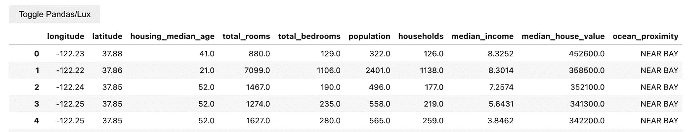
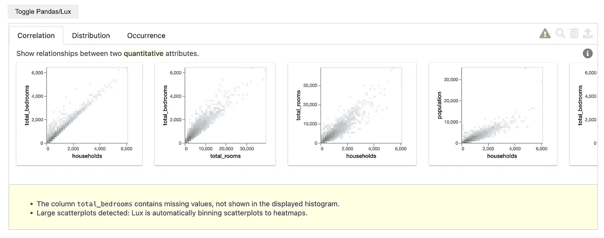
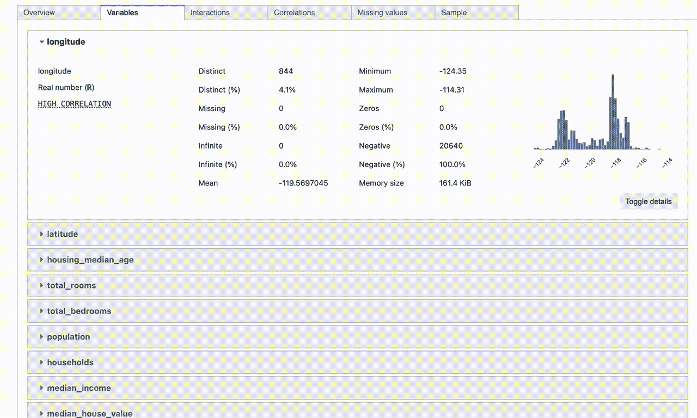
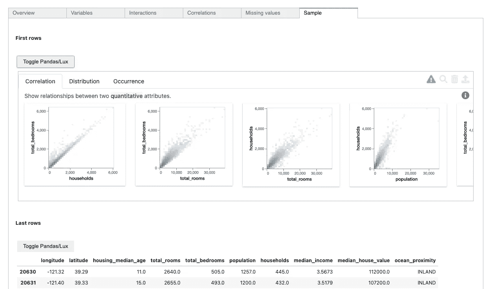
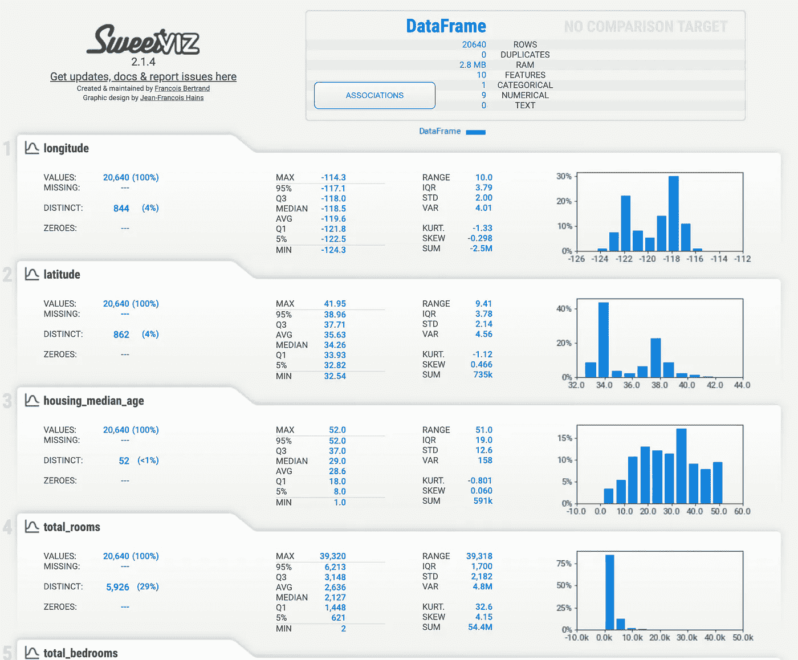
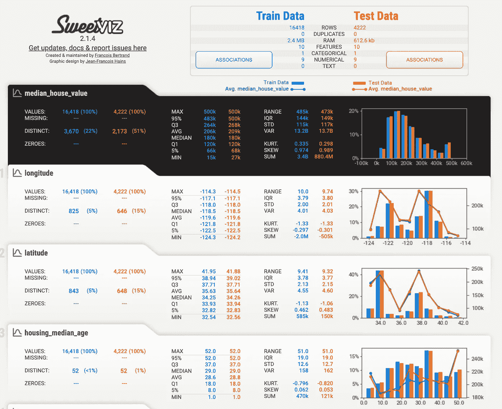

# 3 个用于快速数据分析的工具

> 原文：<https://towardsdatascience.com/3-tools-for-fast-data-profiling-5bd4e962e482>

## 使用这些 Python 工具快速分析和总结您的数据


罗宾·皮耶尔在 [Unsplash](https://unsplash.com/s/photos/quick?utm_source=unsplash&utm_medium=referral&utm_content=creditCopyText) 拍摄的照片

数据概要分析是任何数据科学项目的首要步骤之一。它是探索性数据分析的一种形式，旨在分析、描述和总结数据集，以了解其质量和基本特征。

数据分析任务用于通知数据科学项目中的进一步步骤，例如所需的数据清理的类型和范围，以及可能需要应用的任何其他预处理技术。在没有首先应用至少一些基本处理的情况下，真实世界中的数据很少准备好用于诸如机器学习之类的任务。

数据分析中涉及的许多步骤在不同的数据集和项目中是通用的。数据分析通常包括对每一列应用描述性统计、确定缺失值的数量以及了解变量之间存在的交互和相关性等任务。

由于这些任务可能非常常规，因此有许多开源 Python 库寻求自动化数据分析任务。在本文中，我将通过代码示例简要介绍三个 Python 包，它们极大地简化并加速了这个初步的探索性分析。

# 1.勒克斯

[Lux](https://lux-api.readthedocs.io/en/latest/) 是一个 python 库，作为流行的数据分析包 [Pandas](https://pandas.pydata.org/) 的补充。Lux 库提供了一种简单的方法来快速创建数据集的可视化，并以最少的代码应用基本的统计分析。此外，Lux 还提供了一些工具，可帮助指导和通知数据分析的后续步骤。

Lux 可以通过运行以下命令来安装。如果您在交互式 Jupyter 笔记本中使用 Lux，您还需要安装 Lux 小工具。

```
$ pip install-api# Install Lux widget for Jupyter Notebooks$ jupyter nbextension install --py luxwidget
$ jupyter nbextension enable --py luxwidget# Or for JupyterLab$ jupyter labextension install @jupyter-widgets/jupyterlab-manager
$ jupyter labextension install luxwidget
```

为了说明其中的一些功能，我将使用一个来自 Kaggle.com 的数据集。数据可以通过这个[链接](https://www.kaggle.com/datasets/camnugent/california-housing-prices)下载。该数据集包含来自 1990 年加利福尼亚人口普查的与加利福尼亚地区住房相关的各种属性。

一旦莱克丝安装好，我们就把它和熊猫一起进口。现在，当我们运行某些常用的熊猫函数时，Lux 提供了一些增强的功能。

如果我们将 Lux 和 Pandas 都导入到一个笔记本中，然后运行`df`，在读取上述数据集后，我们将在显示的 dataframe 上方看到一个新按钮，如下所示。



熊猫/力士切换。作者图片

单击“切换熊猫/勒克司”按钮会显示一系列交互式可视化，为数据集中的要素提供基本的统计分析。此外，单击黄色警告三角形可以深入了解与所提供的分析相关的任何警告。

正如您在下图中看到的，Lux 报告有几个选项卡。套件中的第一个选项卡显示所有定量变量组合的相关图。此数据集的后续选项卡显示相关要素的分布和出现情况。



Lux 提供的自动分析报告。作者图片

除了提供一种快速可视化数据集的方法，Lux 还为进一步分析提供指导和建议。该功能由`intent`功能引导。为了表达您的分析意图，您可以将感兴趣的列传递给此函数，Lux 会提供合适的可视化效果，并显示分析中建议的后续步骤的图表。

在下面的例子中，我将两个列名传递给`intent`，“中位数 _ 房价 _ 价值”和“中位数 _ 收入”。Lux 返回一个散点图，比较这些列中的值与选择的其他图和增强之间的关系。


基于分析目的的 Lux 增强。作者图片

# 2.熊猫-侧写

[pandas-profiling](https://pandas-profiling.ydata.ai/docs/master/index.html) 工具也提供了一种快速了解数据集的方法。

Pandas-profiling 可以按如下方式安装。我已经给出了安装 Jupyter 扩展的可选命令，这是在笔记本中生成内联可视化所必需的。

```
$ pip install -U pandas-profiling
$ jupyter nbextension enable --py widgetsnbextension
```

熊猫概况的基本功能是概况报告。这提供了数据集中变量的详细概述。这样可以深入了解各个特征的统计数据，如分布、平均值、最小值和最大值。此外，该报告提供了变量之间的相关性和相互作用的见解。



熊猫-简介报告。作者创建的 Gif

一个很好的特性是 pandas-profiling 工具还集成了 Lux。如果我们导航到 profile 报告的 sample 选项卡，我们会再次看到 Toggle Pandas/Lux 按钮！



Lux 与熊猫的融合。作者图片

# 3.甜蜜的

[Sweet-Viz](https://pypi.org/project/sweetviz/) 是另一个用于快速数据可视化和分析的开源 Python 库。Sweet-Viz 的卖点在于，它提供了一个丰富的 HTML 仪表板，其中包含有用的可视化和数据汇总，并且只有一行代码。

Sweet-Viz 可以用下面的命令安装。

```
$ pip install sweetviz
```

让我们看看生成 Sweet-Viz 仪表板所需的代码。

HTML 报告将在您的浏览器中打开。



甜蜜的仪表板。作者图片

与本文中的其他两个库相比，Sweet-Viz 的一个很好的附加功能是能够比较不同的样本或数据版本。例如，如果您想要比较从不同时间段收集的机器学习的训练数据集，这可能非常有用。

为了演示这一点，在下面的代码中，我将数据集分成了两部分。然后，我使用 Sweet-Viz `compare`函数生成了一个报告，该报告提供了一些分析来比较这两个样本的 chrematistics 和 statistics。



Sweet-Viz 仪表板比较两个数据集。作者图片

本文中涉及的三个库都试图在应用其他数据科学技术之前，自动执行常规的数据分析任务。

虽然每个工具执行相似的任务，但它们都有独特的功能。我在下面提供了我对每个库的主要想法的简要总结。

1.  **Lux** 通过现有的 pandas 功能提供可视化数据分析，如果你已经是 pandas 的用户，这将非常容易使用。它还提供了一些建议来指导您使用`intent`功能进行分析。然而，Lux 没有给出关于数据集质量的更多指示，例如提供缺失值的计数。
2.  **Pandas-profiling** 用一行代码生成丰富的数据分析报告，并在 Juypter 笔记本中显示出来。该报告提供了数据分析的大部分元素，包括描述性统计数据和数据质量指标。熊猫轮廓也与力士集成。
3.  Sweet-Viz 提供了一个全面的、视觉上吸引人的仪表板，涵盖了所需的绝大多数数据概要分析。这个库还提供了比较同一个数据集的两个版本的能力，这是其他工具所不能提供的。

感谢阅读！

## **致谢**

***加州住房数据集:*** *该数据集最初从 StatLib 存储库[*[*https://www . DCC . fc . up . pt/~ ltorgo/Regression/cal _ housing . html*](https://www.dcc.fc.up.pt/~ltorgo/Regression/cal_housing.html)*]获得，在 CCO 1.0 Universal (CCO 1)许可下使用。*