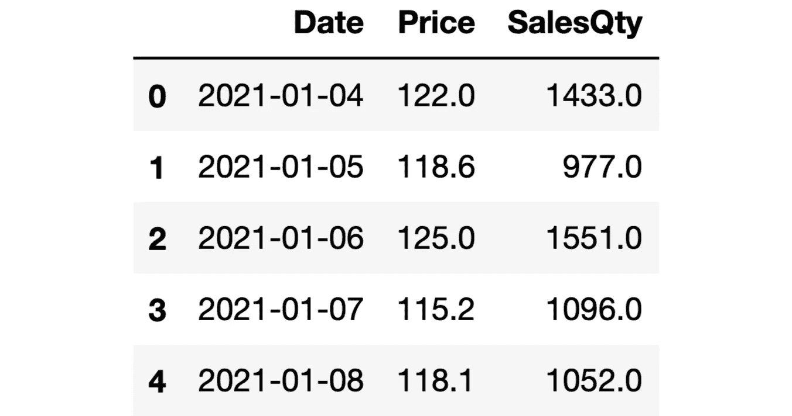
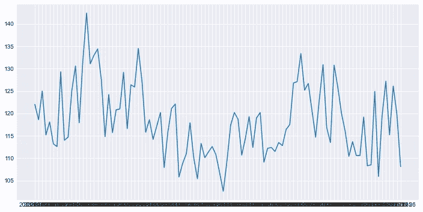
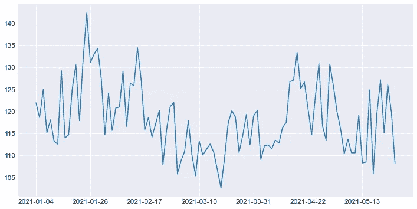
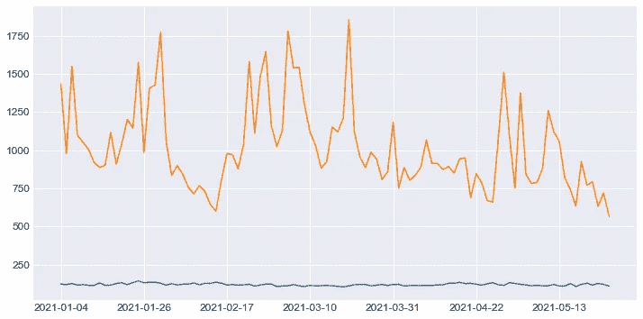
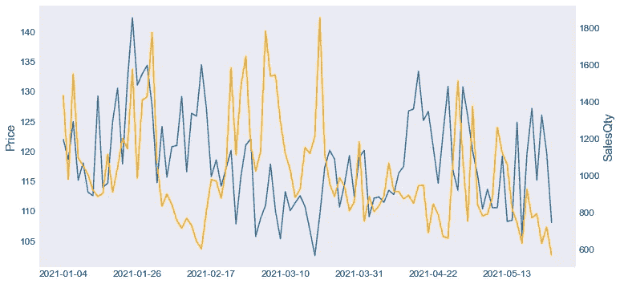
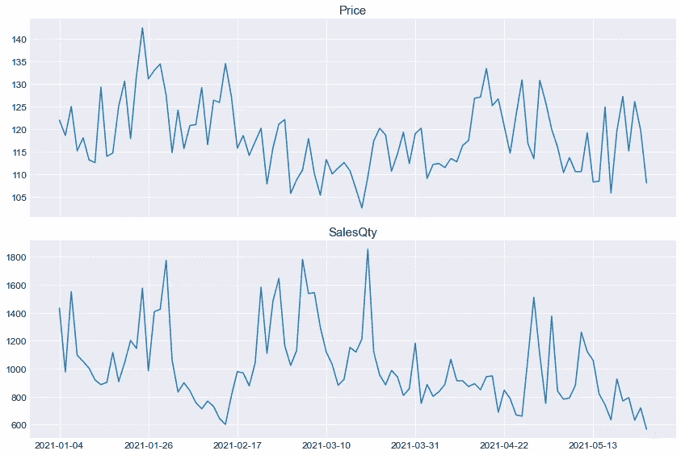

# 美化 Matplotlib 情节的 3 个技巧

> 原文：<https://towardsdatascience.com/3-tricks-to-prettify-matplotlib-plots-d0a73b861c09>

## 你如何显示信息是至关重要的


图为 [Unsplash](https://unsplash.com/s/photos/pretty?utm_source=unsplash&utm_medium=referral&utm_content=creditCopyText) 上的[杜尔西·利马](https://unsplash.com/@dulceylima?utm_source=unsplash&utm_medium=referral&utm_content=creditCopyText)

Matplotlib 是 Python 的数据可视化库之母。它是其他一些用于可视化数据的工具的基础，如 Seaborn 和 Pandas。

Matplotlib 提供了很大的灵活性，因此您可以定制或调整图上的几乎任何内容。如果您想完全控制可视化效果，这是一个优势，但是这需要您编写更多的代码。

在本文中，我们将介绍 3 个可用于定制 Matplotlib 图的技巧，它们是:

*   减少 x 轴或 y 轴上的刻度数
*   添加辅助 y 轴
*   共享 x 轴和紧凑布局的人物与支线剧情

我们将创建线形图，但是这些技巧也可以应用于其他类型的图。当然，我们需要一些数据来处理。我创建了一个包含模拟价格和销售数据的数据集。你可以从我的 GitHub 页面上的[数据集](https://github.com/SonerYldrm/datasets)库中下载数据集。让我们从从这个数据集创建一个熊猫数据帧开始。

```
import pandas as pd
import numpy as npdf = pd.read_csv("mock_sales_data.csv", nrows=100)df.head()
```



(图片由作者提供)

数据集包含日期、价格和销售量列。出于演示目的，我只读了数据集的前 100 行。

# 减少刻度数

如果绘制在轴上的数据点数很多，刻度可能看起来太紧，甚至在某些情况下重叠。处理时间序列数据时，x 轴通常包含占用大量空间的日期，因此最好减少轴上的刻度数。

我们先做一个例子，不限制 x 轴上的刻度数。

```
import matplotlib.pyplot as plt
plt.style.use("seaborn-darkgrid")# create a Figure object
plt.figure(figsize=(12, 6))# create the line plot
plt.plot(df["Date"], df["Price"])
plt.show()
```



(图片由作者提供)

刻度重叠，我们无法读取它们。让我们创建一个相同的图，但是使用更少的刻度。

```
# create a Figure object
plt.figure(figsize=(12, 6))# create the line plot
plt.plot(df["Date"], df["Price"])# show one tick for every 15 value and change the fontsize of ticks
plt.xticks(np.arange(0, len(df), 15), fontsize=12)
plt.yticks(fontsize=12)plt.show()
```



(图片由作者提供)

现在看起来好多了。我们使用 NumPy 的 arrange 函数指定了记号的位置。

# 第二 y 轴

我们有时想在同一个图上显示两个变量。例如，可以将一种产品的价格和它的销售数量绘制在一起，以查看价格对销售数量的影响。

如果价格和销售量具有非常不同的值范围，则需要一个辅助 y 轴。否则，情节将不会好看，甚至可能无法阅读。

下面是演示这种情况的一个示例。我们的数据框架中的销售数量和价格列显示在同一个线图上，只有一个 y 轴。



(图片由作者提供)

因为与销售量相比，价格值非常低，所以我们把它们看作一条直线，它不能告诉我们价格和销售量之间的任何关系。

让我们用第二个 y 轴生成同样的图。

```
# create a Figure and an Axes object
fig, ax1 = plt.subplots(figsize=(12,6))# create the second Axes object with same x-axis
ax2 = ax1.twinx()# create the line plots
ax1.plot(df["Date"], df["Price"])
ax2.plot(df["Date"], df["SalesQty"], color="orange")# create axis labels and title
ax1.set_ylabel("Price", fontsize=15)
ax2.set_ylabel("SalesQty", fontsize=15)# customize x-ticks and y-ticks
ax1.tick_params(axis='both', which='major', labelsize=12)
ax2.tick_params(axis='both', which='major', labelsize=12)# reduce the number of x-ticks
plt.xticks(np.arange(0, len(df), 15))# remove the grid lines
ax1.grid(False)
ax2.grid(False)plt.show()
```



(图片由作者提供)

看起来好多了。我们可以观察到价格和销售量之间的反比关系。

# 共享 x 轴和紧凑布局的人物与支线剧情

我们可以在一个人物对象上创建多个支线剧情。Matplotlib 允许使用 subplots 函数创建一个 subplots 网格。例如，下面的代码行创建了一个 2x2 网格的图形，其中有 4 个支线剧情。

```
fig, (ax1, ax2, ax3, ax4) = plt.subplots(nrows=2, ncols=2)
```

我们使用 nrows 和 ncols 参数定制网格的结构。

当创建一个有支线剧情的网格时，有一些事情要记住。第一个是 sharex 参数。如果我们把支线剧情一个接一个的放在一起，那么最好在底部的剧情上只有 x 轴。这可以通过使用 sharex 参数来实现。

另一个提高可读性的技巧是 tight_layout 函数。它可以用来调整支线剧情之间的填充。在某些情况下，支线剧情过于紧凑，甚至重叠。我们可以使用 tight_layout 函数来防止这种情况。

让我们用这些技巧做一个例子。

```
# create a grid of subplots with 2 rows
fig, (ax1, ax2) = plt.subplots(
    nrows=2, ncols=1, 
    sharex=True,
    figsize=(12, 8)
)# adjust the space between the subplots
fig.tight_layout(pad=2)# create the first subplot
ax1.plot(df["Date"], df["Price"])
ax1.set_title("Price", fontsize=15)# create the second subplot
ax2.plot(df["Date"], df["SalesQty"])
ax2.set_title("SalesQty", fontsize=15)# customize x-ticks and y-ticks
ax1.tick_params(axis='both', which='major', labelsize=12)
ax2.tick_params(axis='both', which='major', labelsize=12)# reduce the number of x-ticks
plt.xticks(np.arange(0, len(df), 15), fontsize=12)plt.show()
```



(图片由作者提供)

随意更改凸台参数的值，并查看其对图形的影响。

我们已经学习了 3 个自定义 Matplotlib 可视化的技巧。可视化显示的内容是关键部分，但如何显示也很重要。因此，这些技巧肯定会帮助您创建更多信息和功能的数据可视化。

*你可以成为* [*媒介会员*](https://sonery.medium.com/membership) *解锁我的全部写作权限，外加其余媒介。如果你已经是了，别忘了订阅*<https://sonery.medium.com/subscribe>**如果你想在我发表新文章时收到电子邮件。**

*感谢您的阅读。如果您有任何反馈，请告诉我。*