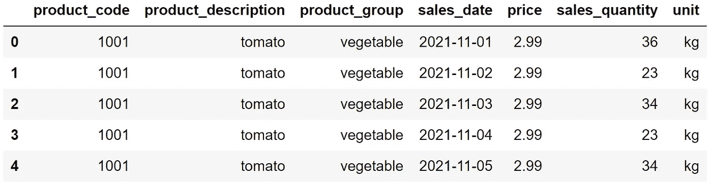
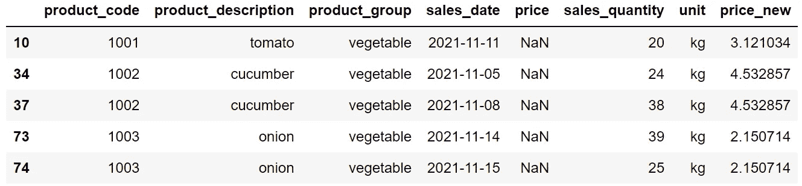
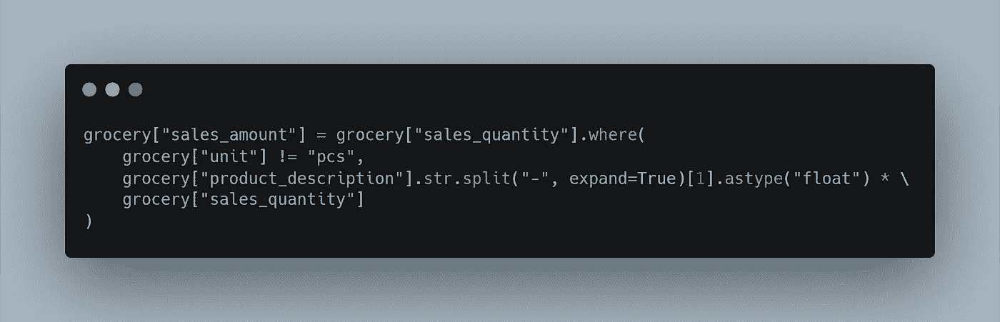
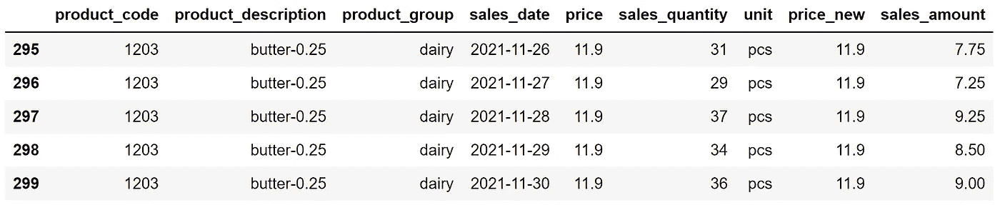

# 3 个棘手的数据分析问题以及如何用熊猫解决它们

> 原文：<https://towardsdatascience.com/3-tricky-data-analysis-questions-and-how-to-solve-them-with-pandas-ceb53bbb9c9e>

# 3 个棘手的数据分析问题以及如何用熊猫解决它们

## Pandas 简化并加速了复杂的任务


micha Parzuchowski 在 [Unsplash](https://unsplash.com/s/photos/tricky?utm_source=unsplash&utm_medium=referral&utm_content=creditCopyText) 上的照片

Pandas 是数据科学生态系统中使用最频繁的库之一。它非常灵活和高效，几乎可以为您可能遇到的任何数据分析和操作问题提供解决方案。

在这篇文章中，我们将讨论 3 个相当棘手的数据分析和操作问题，并看看如何用熊猫来解决它们。

这些问题将与我用模拟数据创建的数据集相关。请随意从我的 GitHub [页面](https://github.com/SonerYldrm/datasets)下载并跟随。我们将使用杂货数据集。

```
import pandas as pdgrocery = pd.read_csv("groceries.csv")grocery.head()
```



(图片由作者提供)

该数据集包含一些带有每日销售量和价格信息的杂货产品。

## 问题 1

价格列包含一些丢失的值。我们如何用产品的平均价格来替代这些缺失的值呢？请注意，我们不应该用价格列的平均值来填充缺少的值。苹果的缺失值需要用苹果的平均价格来填充，等等。

## 解决方案 1

有多种方法可以完成这个操作。最实用的选择之一是在`fillna`函数中使用`groupby`函数。

我们先来看看每个产品的均价。

```
grocery.groupby('product_description')['price'].mean()# output
product_description
apple           2.077778
butter-0.25    11.400000
cucumber        4.532857
grape           4.400000
milk-1.5        6.078571
onion           2.150714
orange          2.714286
plum            4.389655
tomato          3.121034
yogurt-1        6.693103
Name: price, dtype: float64
```

但是我们不能在`fillna`函数中使用这行代码。相反，我们将通过添加`transform`方法来稍微改变它。

```
grocery["price_new"] = grocery['price'].fillna(
   grocery.groupby('product_description')['price'].transform("mean")
)
```

让我们通过比较 price 列中缺少的值和新列中的值来检查结果。

```
grocery[grocery["price"].isna()].head()
```



(图片由作者提供)

番茄的缺失值用 3.12 填充，这是我们之前计算的平均值。类似地，黄瓜和洋葱的缺失值用正确的平均值填充。

## 问题 2

如何才能找到每个产品的最高价和最低价的区别？

## 解决方案 2

当然，完成这项任务有多种方式。`groupby`函数也为这个任务提供了一个快速的解决方案。我们不需要使用内置的聚合函数，只需要编写自己的函数。

在根据产品描述列对行进行分组之后，我们将应用一个 lambda 函数来计算最大值和最小值之间的差值。

```
grocery.groupby("product_description")["price"].apply(
    lambda x: x.max() - x.min()
)# output
product_description
apple          0.3
butter-0.25    1.0
cucumber       0.4
grape          0.0
milk-1.5       0.5
onion          0.3
orange         0.3
plum           0.8
tomato         0.6
yogurt-1       1.0
Name: price, dtype: float64
```

让我们检查最高和最低苹果价格之间的差异，以确认我们的结果。

```
max_apple = grocery[grocery.product_description=="apple"]["price"].max()min_apple = grocery[grocery.product_description=="apple"]["price"].min()max_apple - min_apple# output
0.30
```

它等于苹果在`groupby`函数输出中的差值。

## 问题 3

我们如何创建一个销售金额列来显示每次销售中销售了多少产品(以千克为单位)。

有些产品的单位是千克，所以我们可以只取它们的销售数量列中的值。然而，有些产品是按件出售的。这些产品的重量信息可从描述中提取。

```
butter-0.25  # 0.25 kg
milk-1.5     # 1.5 kg
yogurt-1     # 1 kg
```

## 解决方案 3

对于以千克为单位的产品，销售金额值将与销售数量值相同。

对于按件销售的产品，我们需要从描述中提取 kg 信息，并乘以销售额。

我们可以使用`where`函数有条件地更新这些值。可以通过使用`st`访问器下的`split`函数提取重量信息。



(图片由作者提供)

我不想将代码显示为文本，因为在纯文本中它看起来有点复杂。

`where`功能接受一个条件或一组条件。然后，我们可以为符合和不符合条件的行分配单独的值。

这个条件是在第一个`where`函数里面指定的。符合条件的行保持不变。因此，没有片段单元的行将保持不变。

第二行和第三行指定如何更新不符合条件的行。第二行从产品描述中提取重量信息。在第三行，这个值乘以销售数量。

让我们检查一些结果。

```
grocery.tail()
```



(图片由作者提供)

“黄油-0.25”重 0.25 公斤。在最后一行，销售数量是 36，所以销售额需要是 0.25 * 36，等于 9。

Pandas 是一个非常棒的数据分析和处理库。它提供了许多功能，简化和加快甚至复杂的任务。

如果你想在我发表新文章时收到电子邮件，别忘了订阅。

*你可以成为* [*媒介会员*](https://sonery.medium.com/membership) *解锁我的全部写作权限，外加其余媒介。如果您使用以下链接，我将收取您的一部分会员费，无需您支付额外费用。*

[](https://sonery.medium.com/membership) [## 通过我的推荐链接加入 Medium-Soner yl DRM

### 作为一个媒体会员，你的会员费的一部分会给你阅读的作家，你可以完全接触到每一个故事…

sonery.medium.com](https://sonery.medium.com/membership) 

感谢您的阅读。如果您有任何反馈，请告诉我。