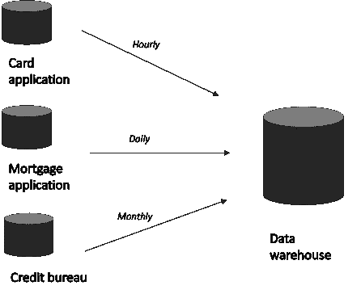
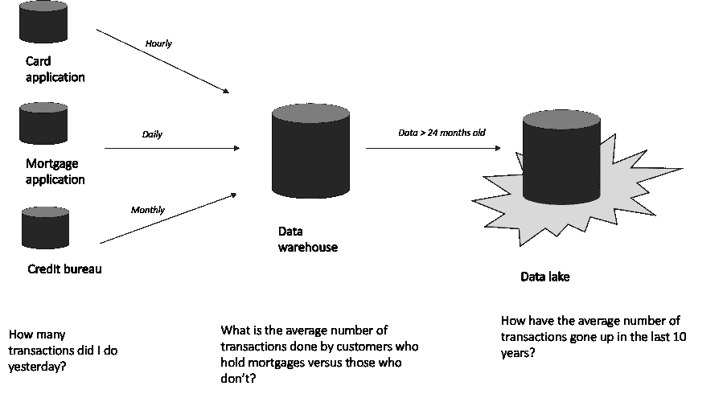

# 您应该了解的 3 种数据架构组件:应用程序、仓库和湖泊

> 原文：<https://towardsdatascience.com/3-types-of-data-architecture-components-you-should-know-about-applications-warehouses-and-lakes-9e399c744ebb>

## 有什么区别，为什么重要？

彼得·德·格兰迪在 [Unsplash](https://unsplash.com/s/photos/lake?utm_source=unsplash&utm_medium=referral&utm_content=creditCopyText) 上拍摄的照片

当我开始涉足分析领域时，数据架构非常令人生畏。这些术语对我来说是陌生的，人们会抛出一些术语，比如“ETL”和“数据湖”，我会点头附和，对他们谈论的内容只有模糊的感觉，然后把它放在“太难”的框中。

今天，我想用简单的术语描述数据架构的 3 个部分；应用程序、数据仓库和数据湖。我将重点讲述作为一个业务人员你需要知道的东西(而不是分析),为了保持实用性，我将使用一个我们大多数人可能至少每周都会做的例子，用信用卡买东西。

# **应用数据库**

应用程序是生成数据的地方。

假设我每周都去乐购购物。当我交出我的卡进行支付时，卡应用程序将记录我在 4 月 19 日下午 5.05 支付了乐购 45.50 英镑(有几个中间步骤，但对于本文来说，这并不重要)。但是卡应用程序只生成和保存关于卡的数据，没有关于你是否持有抵押贷款、你的地址、你的营销偏好等信息。现在，假设您想了解客户每月的交易总数，除以客户是否还有抵押贷款。仅仅使用卡应用数据是不可能的，这就是为什么我们需要一个数据仓库。

# 数据仓库

数据仓库是事实的单一版本。不同的应用程序数据被放在一起并重新格式化，以便来自不同应用程序的数据以相同的方式定义和构造。

继续我的 Tesco 示例，来自卡应用程序的交易数据被传输到数据仓库。来自抵押贷款应用程序的数据也被传输到数据仓库，以查看哪些客户持有抵押贷款以及他们的未偿余额。我们也从第三方获得数据；每个月我们都会收到一份来自信用机构的报告，上面有每个客户的信用评分。数据移动的频率取决于数据的类型。客户的信用评分每月才可获得，而信用卡交易数据每分钟都在发生。这就是数据架构师的用武之地——定义移动数据的最佳频率。

作者图片

现在，将不同的来源汇集在一起，我们可以对客户每月进行的交易数量进行分析，按客户是否持有抵押贷款进行划分。

数据仓库保存一定时间的历史数据(我们通常保存 2-3 年)，这就是数据湖的由来。

# 数据湖

数据湖基本上是一个巨大的停车场。数据湖主要用于需要访问数据的机会减少的旧数据。

回到我的例子，你可以想象英国每天发生的卡交易数量(数百万！).将这些数据长时间保存在数据仓库中是不现实的，因为这样会降低速度，而且保存这些数据的成本会很高。在固定时间后，卡交易数据将从数据仓库转移到数据湖。它仍然可以访问，但是不在分析师日常使用的表中。

作者图片

# 作为一名业务人员或产品负责人，我需要了解多少？

实际情况是，不多，但有几个“注意”区域会影响完成工作的可行性或完成请求的时间长度。

如果我们需要的数据不在数据仓库或数据湖中，数据和分析团队将需要与应用程序所有者合作，建立将数据传输到数据仓库的流程。这可能需要时间，并且可能涉及数据共享协议。

如果数据很旧并且在数据湖中，那么数据是可用的，但是可能需要分析师多花一点时间来提取，所以您可能希望在项目计划中留出多一点时间。

在本文中，我们没有考虑数据是存储在物理服务器上还是存储在云中的区别——但那是以后的事情了！

感谢您的阅读——请务必让我知道您的任何反馈。

参考资料:

Inmon，W.H. (2019) *数据架构:数据科学家入门*。第二版。加利福尼亚州圣地亚哥:爱思唯尔。

_________

我喜欢为商业用户写关于数据科学的文章，我热衷于使用数据来提供切实的商业利益。

你可以在 [LinkedIn](https://www.linkedin.com/in/charlottetu/) 上与我联系，并在 Medium 上关注我，了解我的最新文章。