# Python 中处理缺失值的 3 种终极方法

> 原文：<https://towardsdatascience.com/3-ultimate-ways-to-deal-with-missing-values-in-python-ac5a17c53787>

## 数据科学

## 在插补和删除数据之间做出明智的选择


在 [Unsplash](https://unsplash.com/?utm_source=unsplash&utm_medium=referral&utm_content=creditCopyText) 上由[阿尼鲁德](https://unsplash.com/@underroot?utm_source=unsplash&utm_medium=referral&utm_content=creditCopyText)拍摄的照片

缺失数据是最常见的数据问题之一！

现实世界中的数据集通常包含丢失的数据，这可能是由于数据损坏或数据不可用造成的。然而，为了进一步处理数据以获得准确和可行的见解，您应该处理缺失值。

如果你想将这些数据用于机器学习目的，那么你必须知道，大多数机器学习模型不接受缺失数据。因此，学习处理缺失数据的不同方法是很重要的。

在这里，我列出了 3 种处理缺失值的经典方法，当你遇到缺失数据时可以随时使用。

在我的上一篇文章—[**Python 中你必须知道的 3 种数据清理类型**](/3-types-of-data-cleaning-you-must-know-in-python-1ab6986a8b1d) —我讨论了识别丢失数据的方法。现在，让我们看看下面三种处理缺失数据的方法。

与上一篇文章类似，我使用的是由 [Pavlo Fesenko](https://www.kaggle.com/datasets/pavlofesenko/titanic-extended) 创建的 Titanic 数据集的扩展版本，该数据集可以在 [CC 许可](https://creativecommons.org/licenses/by-sa/3.0/)下免费获得。

让我们将数据集读入 pandas DataFrame，并快速浏览一下，以了解其中的列和缺失数据。

```
import pandas as pd
**df = pd.read_csv("Complete_Titanic_Extended_Dataset.csv")
df.info()**
```

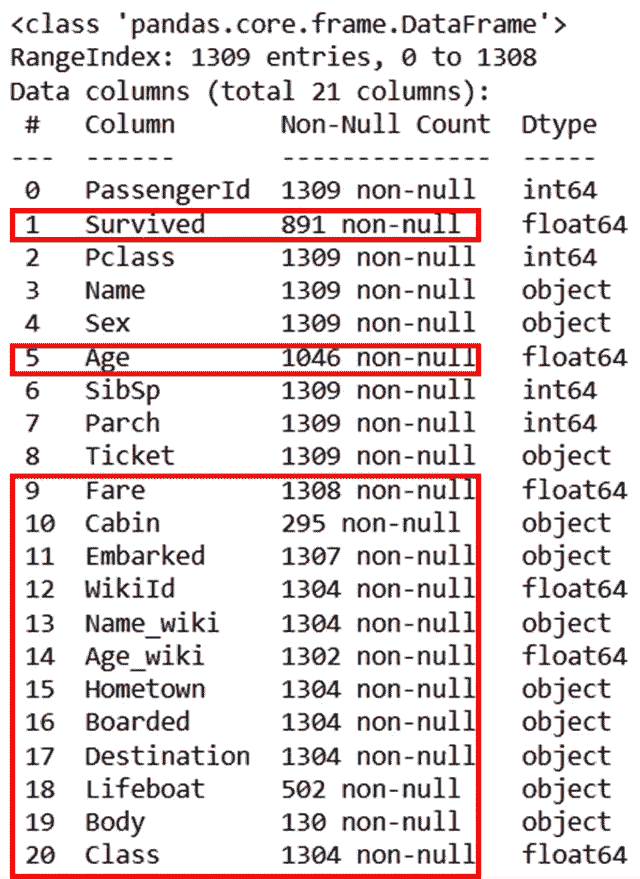

作者提供的数据帧图像的简明摘要

这是一个跨 21 列有 1309 条记录的数据集，这意味着理想情况下每列应该有 1309 个值。

但是，您可以在上图中看到，红框内标记的列包含的记录少于 1309 条，即它们有一个或多个缺失值。

在随后的章节中，我解释了大量的例子来处理这些缺失的值。

在开始处理缺失值之前，我必须承认，没有最好的方法来处理这些值。您所能做的就是仔细查看每个缺少值的列，并理解该列对于将来使用这些数据的重要性。

在处理缺失数据时，可以使用两种主要的方法——数据的 ***插补*** 和 ***剔除*** 。哪种方法用于哪一列完全取决于您对数据的研究和理解。

让我们从最简单的方法开始——数据的 ***去除*** 。当数据在随机位置丢失时，可以从数据帧中删除相关数据。然而，删除数据可能不是好的解决方案，如果它留给您的'**数据不足以获得可靠的分析结果。**

您可以使用以下两种方法从数据集中移除数据。

# 放下唱片

您可以使用 pandas DataFrame 方法`[**.dropna()**](https://pandas.pydata.org/docs/reference/api/pandas.DataFrame.dropna.html)`删除包含至少一个缺失值的行或记录。

让我们删除所有包含缺失值的行，如下所示。

```
df_records_dropped = **df.dropna(axis=0, how='any')** df_records_dropped.info()
```

在上面的代码中，`axis=0`显示 DataFrame 中的记录或行，而`how = ‘any’` 显示删除其中任何一列有缺失值的所有行。

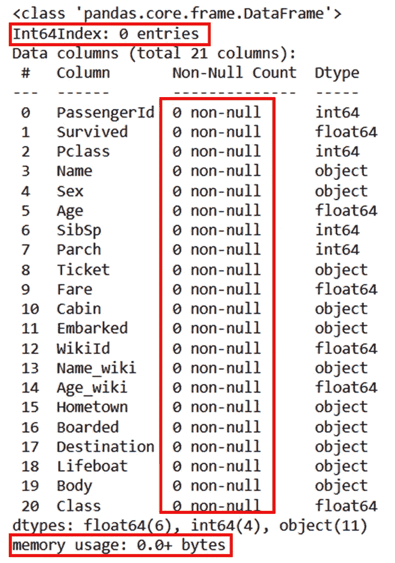

熊猫 dropna()删除记录|作者图片

当您检查这个新数据帧`df_records_dropped`的大小时，您会注意到——它包含零行。意思是，你丢失了所有数据。关于丢弃记录，这是需要记住的重要一点。

> 删除记录会大大减少您的数据！！🚩

为了解决这个问题，让我们使用`how = ‘all’`只删除那些包含所有列中缺失值的记录。

```
df_records_dropped = **df.dropna(axis=0, how='all')** df_records_dropped.info()
```

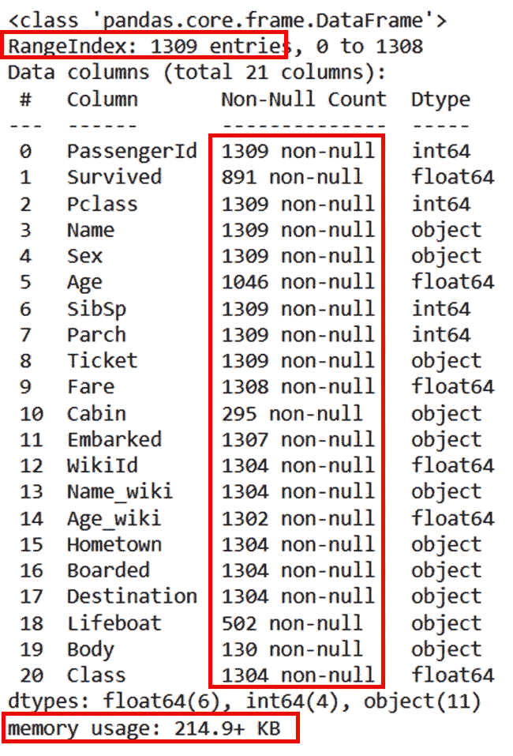

熊猫 dropna()删除行|作者图片

现在，这看起来像是原始数据帧的副本，即没有删除任何记录。

因此，使用方法`dropna()`中的另一个选项**子集**，只删除那些在特定列中缺少值的记录。

执行此操作时，请注意要删除的行数。在我所有的研究中，我将这个数字限制在数据集中所有行的 1%。因此，在这个数据集中，只有当被删除的行数少于 13 时，我才会删除该记录。

因此，让我们删除列 *Fare、Embarked、WikiId、Name_wiki、Age_wiki、homeland、Boarded、Destination、*和 *Class* 缺少值的行，如下所示。

```
columns_with_na = ['Fare', 'Embarked', 'WikiId',
                   'Name_wiki', 'Age_wiki', 'Hometown',
                   'Boarded', 'Destination', 'Class']
df_records_dropped = **df.dropna(axis=0, subset = columns_with_na)**
df_records_dropped.info()
```

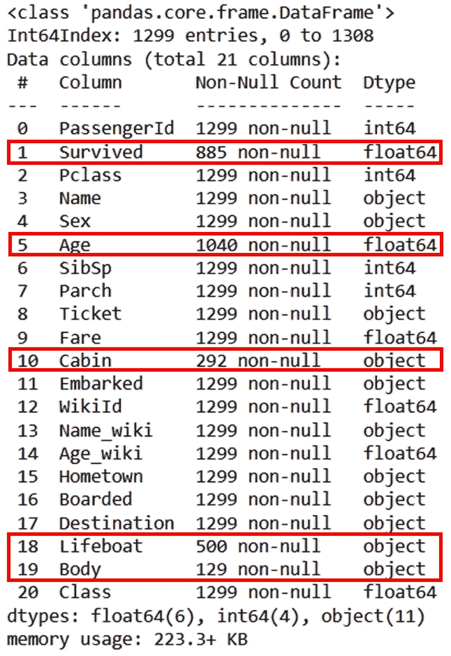

从所选列中删除缺少的值|按作者排序的图像

通过这种方式，您可以删除上述列中缺少值的所有行。您可以注意到，除了用红色圈出的列之外，所有列现在都有相同数量的记录。

类似地，您可以考虑从包含大量缺失值的数据集中删除一列。然而，为此你需要理解这个特性对未来可用性的重要性。

# 删除列或特征

上面的图片显示，大部分的价值仍然是失踪的列体，救生艇，船舱。

为了理解这个特性的重要性，让我们看看这些列中的数据是什么样子的。

```
condition = (df_records_dropped.Cabin.isna()
             & df_records_dropped.Lifeboat.isna()
             & df_records_dropped.Body.isna())
df1 = **df_records_dropped[~condition]**
df1[["PassengerId","Name","Ticket","Cabin","Lifeboat","Body"]]
```

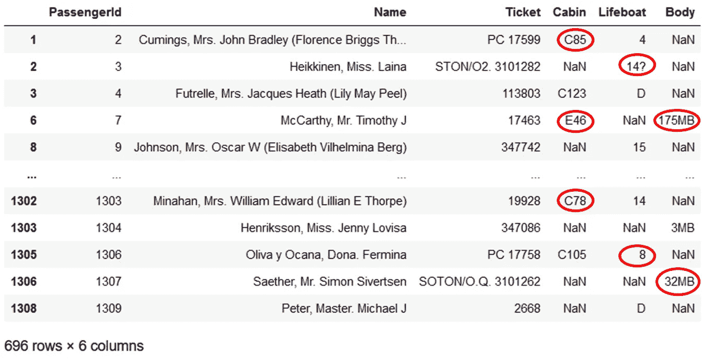

查看列|作者图片中的非缺失值

上面的代码显示了所有 696 行，其中这三列中至少有一列有一个`**NaN**`。由于行数巨大，删除这些记录将会使数据集减半。

此外，当您检查这些值时，例如，机舱中的`**C85**`、救生艇中的`**14?**`和身体中的`**32MB**`，您会看到这些列没有提供任何有用的信息。因此，您可以从数据集中删除这三列。

```
**columns = ['Cabin','Lifeboat','Body']**
df_columns_dropped = **df_records_dropped.drop(columns, axis=1)**
df_columns_dropped.info()
```

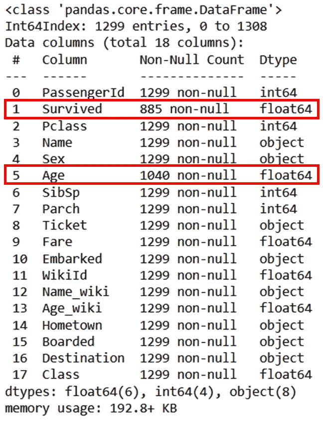

熊猫。DataFrame.drop 到 drop 列|按作者分类的图像

现在，您得到了一个只有 17 列的数据集，所有记录都具有相同数量的非缺失值，除了列*幸存*和*年龄*。

当理解一个列在有数值时的重要性时，您可以使用其他探索性的方法，例如不同列之间的关系。这将让您知道缺少值的列是否会影响其他功能。

最后，仅当您确信—
1 时，才使用上述数据删除方法。一个专栏或专题不会提供任何有价值的信息
2。删除记录不会导致质量结果的记录非常少

否则，使用另一种方法处理数据— *插补*——您可以用其他值替换数据集中缺失的值。

# 估算缺失数据

您可以随时填充缺失的值，而不是删除记录或列，Python 提供了灵活的工具来完成这项工作。

最简单的方法是[**熊猫。DataFrame.fillna()**](https://pandas.pydata.org/docs/reference/api/pandas.DataFrame.fillna.html) 使您能够用特定值或使用下面列出的两种策略之一填充`NaNs`。

1.  `**ffill**`:用同一列的前一个或最后一个非空值替换 NaN
2.  `**bfill**`:用同一列中下一个非空值替换 NaN。

此外，方法`fillna()`不追加原始数据帧，除非您提到`**inplace = True**`。

让我们来看看这些不同的`fillna`策略在起作用。为了更好地理解`fillna`策略，我只提取了数据集的一小部分。

```
columns = ['Name', 'Survived', 'Age', 'Sex']
df1 = **df_columns_dropped[columns].sample(10, random_state=7)**
df1
```

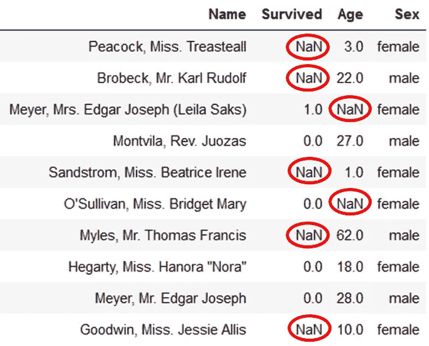

作者随机选择数据帧|图像中的记录

您可以看到这个子集对于数字列*年龄*和*幸存*几乎没有丢失值。

让我们首先使用`ffill`策略用前面或最后的非空值填充所有的`NaNs`。

```
df2 = **df1.fillna(method='ffill')**
df2
```

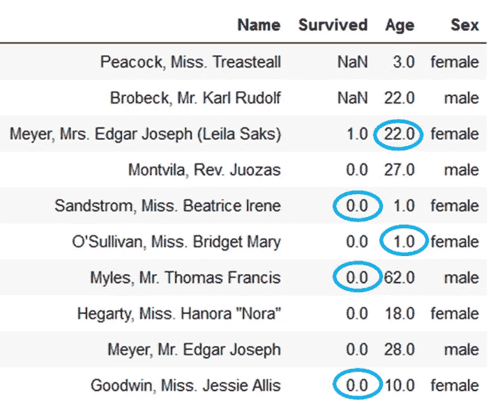

将 NaNs 替换为熊猫数据帧|作者图片中的前置值

在上图中，蓝色圆圈中的值与之前的值相同，因为您用`ffill`策略替换了它们。

您可以注意到，在*开始的几个`**NaNs**`幸存的*列没有被填充，因为它们没有任何前面的非空值。你可以对这些`NaNs`使用回填策略，如下所示。

```
df3 = **df2.fillna(method='bfill')**
df3
```

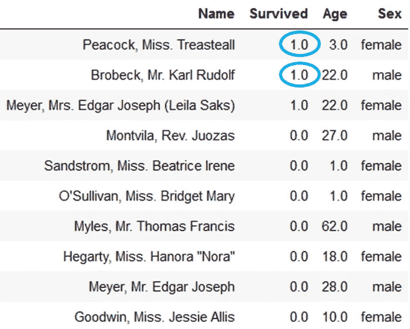

将 NaN 替换为熊猫数据帧|作者图片中的下一个值

这样，你需要使用`ffill`和`bfill`的组合来填充所有缺失的值。

或者，您可以用固定值代替`NaN`，如下所示。

```
df4 = **df1.fillna(100)**
df4
```

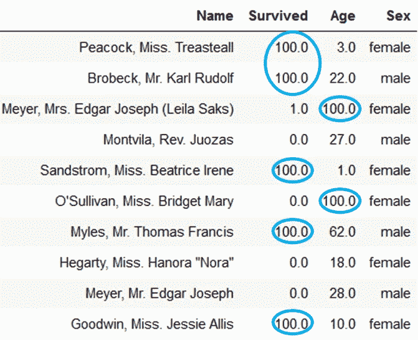

用固定值替换所有缺失值|按作者排序的图像

这里你把所有的`NaNs`都换成了 100。简单！

> 但是等等，这是 sense❓吗

幸存的列只需要两个值中的一个，即 0.0 和 1.0，因此 100.0 在此列中被错误地替换。

Pandas 为您提供了用不同的值替换不同列中的`NaNs`的灵活性。你可以这样做—

```
**values = {"Survived": 1.0, "Age": 100}**
df5 = **df1.fillna(value=values)**
df5
```

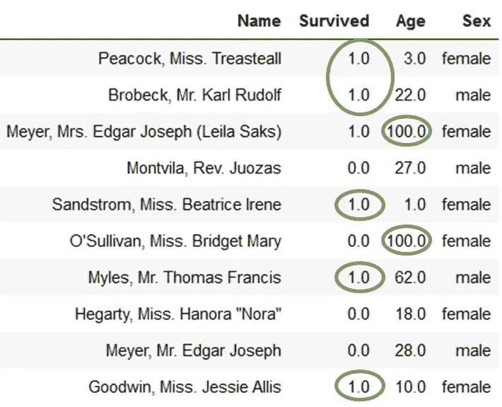

将每列中的 NaNs 替换为不同的值|图片由作者提供

现在，结果看起来更一致了。✅

在数字列中用固定值替换`NaNs`时，可以考虑该列中所有非空值的平均值或中值。

这些是估算缺失值的基本方法，但是您也可以使用高级方法，如多元估算、最近邻估算。

由于删除记录或特征通常不是一个好的选择，因此了解不同的插补方法非常重要。因此，我将单独讲述高级插补方法的工作原理。

仅此而已！

我希望这篇文章对你有用并且实用。处理丢失的值总是一个讨论的话题，根据您正在处理的数据，您需要有创造性地填充 nan。

现在你可以直接在你的收件箱里得到我的所有文章— [**在这里得到**](https://medium.com/subscribe/@17.rsuraj) ！

> 有兴趣无限制地使用媒体吗？？？

[**加入 Medium**](https://medium.com/@17.rsuraj/membership) 使用我下面的推荐链接，它也将支持我作为一名作家，因为 Medium 与我分享你的一小部分费用。✅

[](https://medium.com/@17.rsuraj/membership) [## 加入我的推荐链接- Suraj Gurav 媒体

### 作为一个媒体会员，你的会员费的一部分会给你阅读的作家，你可以完全接触到每一个故事…

medium.com](https://medium.com/@17.rsuraj/membership) 

**感谢您的阅读！**