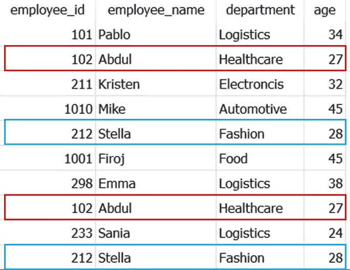
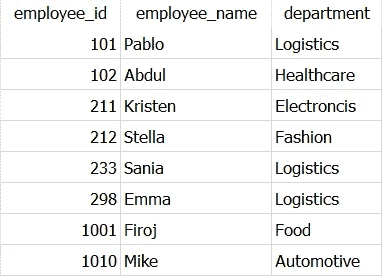
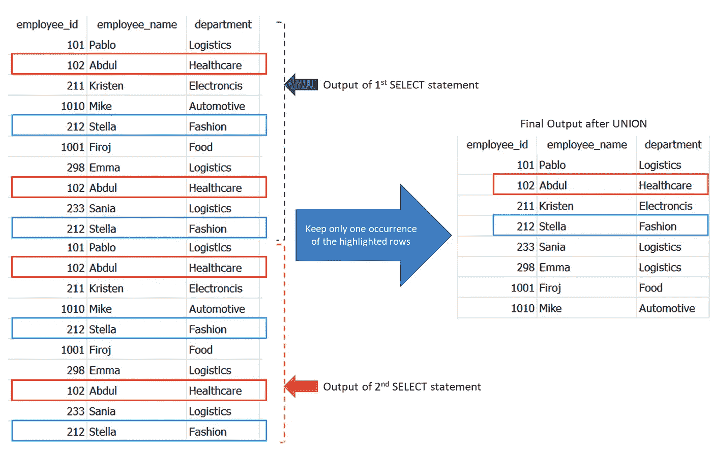
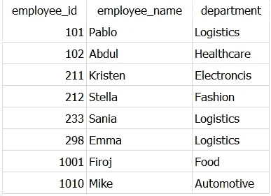
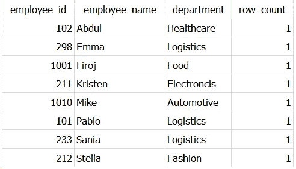
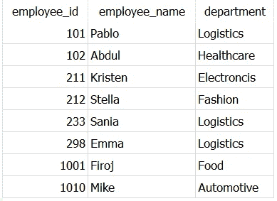

# 在 SQL 中查找唯一记录的 3 种终极方法

> 原文：<https://towardsdatascience.com/3-ultimate-ways-to-find-unique-records-in-sql-6ddf8ae567b0>

## 数据科学

## 停止使用 DISTINCT！开始使用这些快速的替代方法来避免混淆！


由[路易斯·科尔特斯](https://unsplash.com/@luiscortestamez?utm_source=unsplash&utm_medium=referral&utm_content=creditCopyText)在 [Unsplash](https://unsplash.com/?utm_source=unsplash&utm_medium=referral&utm_content=creditCopyText) 上拍摄

**不使用** `**DISTINCT**` **关键字获取唯一记录！**🏆

在您的数据分析项目中，每当您需要从数据库中提取唯一的记录时，一个简单的答案就是使用`**DISTINCT**`！！

毫无疑问，DISTINCT 是为返回唯一行而设计的，它做得很好。但是，它不会告诉您所使用的连接和过滤器是正确的还是不正确的，这实际上是重复的原因。

因此，我总结了 3 个最好的、安全的和省时的替代方法，它们在不同的 doe 下返回相同的输出，并且仍然保持代码整洁和易于维护。💯

你可以使用下面的索引跳到你最喜欢的部分。

```
**·** [**UNION()**](#d286) **·** [**INTERSECT()**](#5b09) **·** [**ROW_NUMBER()**](#3f9b) **·** [**GROUP BY**](#421a)
```

> 📍注意:我使用的是 SQLite DB 浏览器和自己创建的 [Dummy_Employees](https://github.com/17rsuraj/data-curious/blob/master/TowardsDataScience/Dummy_employees.csv) ，你可以在我的 [**Github**](https://github.com/17rsuraj/data-curious/blob/master/TowardsDataScience/Dummy_employees.csv) repo 上免费获得！

好了，我们开始吧…🚀

首先，让我向您展示数据是怎样的。



虚拟员工数据集|作者图片

这是一个简单的 10x4 数据集，是我在文章 [**Faker 中创建的:一个惊人且非常有用的 Python 库**](/faker-an-amazing-and-insanely-useful-python-library-b313a60bdabf) **。**📚

上图中以蓝色和红色突出显示的行在数据集中是重复的。

📚您可以使用这个 [**SQLite 数据库**](https://github.com/17rsuraj/data-curious/blob/master/TowardsDataScience/employees_cost.sqlite3) 来跟踪本文中的查询。

在我上一篇文章[**2022**](/5-practical-sql-queries-you-should-know-in-2022-11b428560a30)你应该知道的 5 个实用 SQL 查询中提到，在寻找唯一记录之前，你必须定义哪一列或者哪几列的组合构成了唯一行。

对于在单个列中查找唯一值，DISTINCT 总是更方便。但是，对于从数据集中检索唯一的行，这些替代方法可以保持代码的整洁和高效。

例如，让我们使用 DISTINCT 从数据集中获得*雇员 id、雇员姓名*和*部门*的唯一组合。

```
SELECT **DISTINCT** employee_id,
                employee_name,
                department
FROM Dummy_employees
```


使用 DISTINCT | Image by Author 选择唯一值

正如预期的那样，它只返回属于*employee _ id*和`212`的重复行的一个实例，最终得到 8 行。

现在，让我们看看如何在不专门使用 DISTINCT 的情况下获得完全相同的结果。

# 联合()

在 SQL 中，`UNION`是一个运算符，用于组合两个`SELECT`语句的结果。类似于对器械包的`UNION`操作。

此外，它还会删除结果数据集中多次出现的行，只保留每行的一次出现。✅

你所需要做的就是写两条完全相同的`SELECT`语句，并用操作符`UNION`将它们连接起来，如下所示。

```
SELECT employee_id,
       employee_name,
       department
FROM Dummy_employees**UNION**SELECT employee_id,
       employee_name,
       department
FROM Dummy_employees
```



不使用 DISTINCT | Image by Author 选择唯一的行

这显示了与 DISTINCT 相同的输出，只是记录的顺序不同。

现在，让我向您展示一下后端刚刚发生了什么。🛠️



UNION 如何在 SQL 中删除重复|按作者分类的图片

通过这种方式，`UNION`简单地连接两个单独的`SELECT`语句的输出，并且只保留重复行的一个实例。

选择唯一记录的另一个有趣的方法是使用另一个操作符— `INTERSECT`。

# 相交()

与前面的操作符类似，`INTERSECT`也用于连接两个`SELECT`查询的结果，并且只返回那些在两个`SELECT`查询的输出中相同的记录。它与两个集合的交集相同。

`INTERSECT`还删除结果数据集中多次出现的行，只保留每行的一次出现。✅

你需要做的就是写两个完全相同的`SELECT`语句并用`INTERSECT`将它们连接起来，如下所示。

```
SELECT employee_id,
       employee_name,
       department
FROM Dummy_employees**INTERSECT**SELECT employee_id,
       employee_name,
       department
FROM Dummy_employees
```



不使用 DISTINCT | Image by Author 选择唯一的行

由于两个`SELECT`查询产生相同的输出，连接将产生 10 行数据。然后根据`INTERSECT`返回唯一行的固有属性，将只返回一次重复行，最终输出 8 行。

> 🚩注意:使用`UNION`和`INTERSECT`时，两个 SELECT 语句中的列数和顺序必须相同。

继续下一步，获取唯一的记录..

# ROW_NUMBER()

在 SQL 中，`ROW_NUMBER()`是一个窗口函数，它将一个连续的整数分配给结果集分区内的每一行。

> **窗口函数**:一个 SQL 函数，输入值取自`SELECT`语句结果集中的一行或多行的“窗口”。它使用`OVER`子句后跟`PARTITION BY`和`ORDER BY`子句来创建一个包含一行或多行的窗口。

因此，在每个分区中，第一行的行号为 1。✅

这是它的工作原理..

```
SELECT employee_id,
       employee_name,
       department,
       **ROW_NUMBER() OVER(PARTITION BY employee_name,
                                      department,
                                      employee_id) as row_count**
FROM Dummy_employees
```


ROW_NUMBER()在 SQL | Image 中的工作方式(按作者)

正如你所看到的，当 *employee_name* 是 *Abdul* 和 *Stella* 时，每个分区中有两行。因此行号 2 被分配给这些重复行中的每一行。

因此，要获得唯一记录，您需要选择行号为 1 的所有行，即上表中 *row_count* 的值为 1。

> ❓然而，这里有一个捕捉！！

不能在`WHERE`子句中使用窗口函数，因为在 SQL 查询执行中，`WHERE`子句是在计算窗口函数之前处理的。你可以在 Agnieszka 的这篇文章中阅读更多关于 SQL 查询执行顺序的内容。

最终，您需要创建一个临时表来存储上述查询的输出，并需要另一个`SELECT`语句来获得不同的记录。您可以使用`WITH`子句或`CTE` s(通用表表达式)来创建临时表。💯

让我们看看如何从数据集中获得*雇员 id、雇员姓名*和*部门*的唯一组合。

```
**WITH temporary_employees** as
(
SELECT 
  employee_id,
  employee_name,
  department,
  **ROW_NUMBER() OVER(PARTITION BY employee_name,
                                 department,
                                 employee_id) as row_count**
FROM Dummy_employees
)SELECT *
FROM temporary_employees
**WHERE row_count = 1**
```



使用 SQL | Image by Author 中的 ROW_NUMBER()获取不同的记录

这样，您可以看到只有那些记录出现在具有`**row_count = 1**`的输出中

这里，生成最后一列— *row_count* 只是为了提供信息。即使不包括该列，查询仍然有效。

除了操作符和窗口函数，还有一种简单方便的方法来获得唯一的行— `GROUP BY`

# 分组依据

在 SQL 中，`GROUP BY`子句用于按一列或多列对行进行分组。经常与`COUNT()`、`MAX()`、`MIN()`、`SUM()`、`AVG()`等聚合函数一起使用，得到分组行的聚合计算。

但是，可以在没有任何聚合函数的情况下使用它来获得不同的或唯一的记录，如下所示，

```
SELECT employee_id,
       employee_name,
       department
FROM Dummy_employees
**GROUP BY employee_id,
         employee_name,
         department**
```



使用 GROUP BY | Image by Author 获取 SQL 中的唯一记录

简单地说，您需要在`GROUP BY`子句中提到所有的列名来获得唯一的记录。

几乎 90%的时候，我发现`GROUP BY`更方便，因为我总是想用集合函数做一些其他的计算。

仅此而已！

希望你很快看完这篇文章，觉得耳目一新，很有用。

我在过去的 3 年里一直使用 SQL，我发现这些替代方法非常省时，而且功能强大，尤其是在处理大型数据集的时候。此外，我发现其中一些问题是很好的面试问题。

> *对阅读介质上的无限故事感兴趣？？*

💡考虑 [**成为媒体会员**](https://medium.com/@17.rsuraj/membership)**访问媒体上无限的**故事和每日有趣的媒体文摘。我会得到你的费用的一小部分，没有额外的费用给你。

💡不要忘记 [**注册我的电子邮件列表**](https://medium.com/subscribe/@17.rsuraj) 来接收我文章的第一份拷贝。

**感谢您的阅读！**