# 让你成为下一级熊猫用户的 3 个不被重视的技能

> 原文：<https://towardsdatascience.com/3-underappreciated-skills-to-make-you-a-next-level-pandas-user-b173f1b15ada>

## 一键编码、合并和连接:向有用的数据转换和时髦的数据组合问好。


[法比奥](https://unsplash.com/@fabioha?utm_source=medium&utm_medium=referral)在 [Unsplash](https://unsplash.com?utm_source=medium&utm_medium=referral) 上的照片

这是我的下一级系列的第三篇文章。一定要看看前两个: [*3 个不被重视的技能让你成为下一级数据科学家*](/3-underappreciated-skills-to-make-you-a-next-level-data-scientist-6b5236770651) *和* [*3 个不被重视的技能让你成为下一级 Python 程序员*](/3-underappreciated-skills-to-make-you-a-next-level-python-programmer-a20de69b29f2) *。*

众所周知，熊猫是一个很难学习的模块。这可能会令人困惑和不知所措——尤其是对新程序员来说。然而，如果你想成为一名数据科学家 ，这也是 ***非常重要的一点。***

出于这个原因，甚至数据科学教育项目也开始转向比以前更强调学习熊猫的模式。当我第一次学习数据科学时(大约 4 年前)，我在加州大学伯克利分校的课程使用了一个名为`datascience` [1]的内部模块，该模块建立在 Pandas 之上，但功能完全不同。

但是课程开始改变了。最近，加州大学圣地亚哥分校推出了一个模块，旨在为学生向成熟的熊猫过渡做准备——因此，他们称之为`babypandas` [2]。

个人和机构都开始意识到，理解熊猫是现代数据科学的必要条件，他们正在围绕这一前提形成自己的教育愿望。

如果你正在读这篇文章，很可能你就是其中之一。请允许我在路上帮助你。

让我们来看看 3 个被低估的技能，它们将帮助你成为下一级熊猫用户。

## 分类变量的一键编码

为了正确理解这项技能，我们需要快速回顾一下统计环境中不同类型的变量。变量的两个主要类型是**定量**和**定性(分类)**，它们可以进一步细分为以下几组:

*   **离散(定量)**:这是一个数值，但可以精确计数。例如，如果您的变量是一个城市的人口，它将是一个离散变量。为什么？很明显，这是一个可以进行各种算术计算的数字，但同时，说一个城市的人口是 786.5 人是没有意义的。它必须是一个精确的数字。
*   **连续(定量)**:这也是一个数值，但它是由*测量的*，因此永远无法精确确定。身高就是一个例子。虽然由于可用的工具，我们可能会测量到最接近的厘米或毫米，但理论上，我们可以通过极其精细的测量(微米、纳米、皮米等)达到我们想要的深度。
*   **序数(分类)**:这是一个定性变量——也就是说，它不是一个对其执行算术运算有意义的数字。这种变量可以取有限数量的*有序*类别内的任何值。例如，您可能有一个可变的“香料级别”，其潜在值为“温和”、“中等”或“热”
*   **名义上的(分类的)**:这类似于一个顺序变量，除了类别没有明确的层次结构。标称变量的一个常见例子是颜色。

关于上述定义的一个注意事项:序数和名义变量通常仍然可以是数字；区别在于对这些数字进行算术运算是没有意义的。例如，地理邮政编码是一个名义变量，而不是一个数量变量，因为计算总和或差值(或乘积、商等)是没有意义的。)的两个邮政编码。

既然我们已经回顾了上述内容，我们可以解决主要问题了:计算机喜欢定量数据，但我们可用的数据通常是定性的。特别是在构建预测模型的上下文中，我们需要一种方法来以对模型有意义的方式表示分类数据。这一点最好通过例子来看。

假设我们有一个包含三列的数据集:`"Age"`、`"State"`和`"Income"`。我们想建立一个模型，用一个人的居住状态和年龄来预测他们的收入。我们数据集的一个子集可能如下所示:

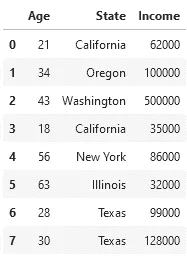

作者图片

在我们可以根据这些数据训练一个模型之前，我们需要对`"State"`列做一些事情。虽然它目前的格式对人类可读性很好，但机器学习模型将很难理解它，因为模型喜欢数字。

第一次尝试可能包括简单地将数字 1-6 分配给我们上面的六种不同的状态。虽然对于顺序变量来说这是一个好主意，但对于我们的名义变量来说，这并不奏效，因为它意味着数据中的排序并不存在。

名义变量最常见的转换技术被称为**一键编码**。一键编码是将具有不同类别值的一列转换为多列(每个不同类别值一列)的过程，并且每一行都有一个二进制整数来指示它是否适合该列[3]。

因此，我们将重新组织数据，使数据中出现的每个唯一状态都有列`"is_state_California"`、`"is_state_Oregon"`等等，而不是只有一个名为`"State"`的列。然后，`"State"`列最初具有值`"California"`的行将在`"is_state_California"`列中具有值`1`，在所有其他列中具有值`0`。

现在重要的是:我们如何在熊猫身上实现这一点？完成了所有的概念性工作后，您会很高兴地了解到代码本身实际上相当简单:Pandas 有一个名为`get_dummies`的函数，它为我们完成了所有的一次性编码工作[4]。假设我们上面的数据帧被称为`my_df`，我们将执行以下操作:

```
pd.get_dummies(my_df, columns=["State"], prefix='is_state')
```


作者图片

现在你知道了！你的数据现在的格式更有利于训练机器学习模型。

## **将数据帧合并在一起**

如果你已经在数据科学领域工作了一段时间，你会很清楚数据的初始形式总是丑陋的。一直都是。无一例外。如果你刚刚进入这个领域，这是一个你很快就会熟悉的现实。

因此，数据科学家的大部分工作涉及将来自不同位置的数据组合在一起，并清除缺失的值。组合数据的最重要的方法之一——不幸的是也是最复杂的方法之一——是通过**合并**。

原则上，合并背后的想法实际上并不坏:它只是提供了一种方式来组合来自两个不同数据框架的数据，这两个数据框架具有不同的信息，但至少有一列具有匹配的值。然而，实现可能会变得混乱，因为有许多不同类型的合并(也称为联接)。

一如既往，让我们看一个例子。让我们从上面类似的数据帧开始，除了这次它也有名字，叫做`left_df`(你马上就会明白为什么):

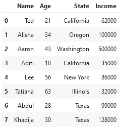

作者图片

我们还有一个名为`right_df`的第二个数据框架，它包含不同人的大学学位的附加信息，其中一些人与`left_df`中的人相同:

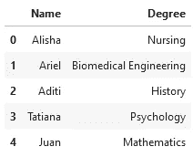

作者图片

我们对添加一个人的学位作为我们模型的特征感兴趣，所以我们决定将这两个数据框架合并在一起。当我们合并时，我们需要指定一些不同的东西:

*   左侧数据帧
*   正确的数据帧
*   我们要合并的列
*   我们需要什么类型的联接:内联接、左联接、右联接还是外联接

上面的最后一个规范是令人困惑的地方，所以让我们详细地看一下它们。

一个**内部连接**将两个数据帧合并在一起，这样只有在两个数据帧中都匹配的行才会出现在输出数据帧中。例如，对于上面的两个数据帧，如下所示:

```
left_df.merge(right_df, on='Name', how='inner')
```

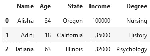

作者图片

只有艾丽夏、阿迪提和塔蒂亚娜出现在两个数据帧中，因此，当通过内部连接合并时，只有他们的行是输出的一部分。我们还可以看到现在出现了`"Degree"`列，这说明了我们最初合并的原因。

下图直观地描绘了内部联接。左边的圆圈可以看作是`left_df`，右边的圆圈可以看作是`right_df`。

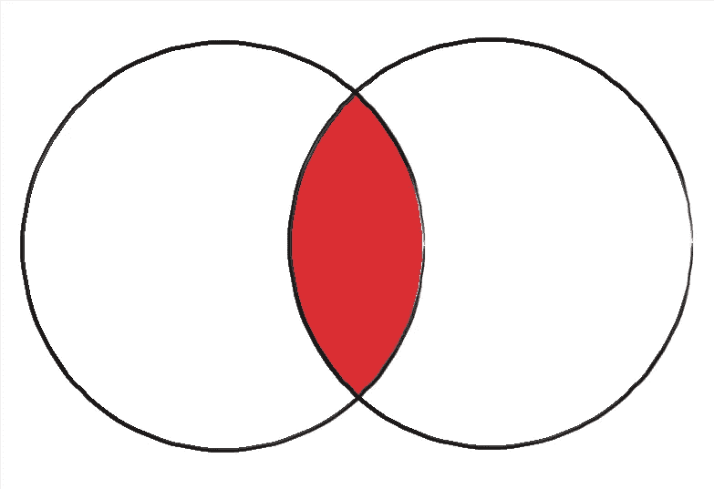

内部联接。图片作者。

一个**左连接**包括左侧数据帧中的所有*行，即使它们在右侧数据帧中没有匹配。对于那些没有出现在正确数据帧中的数据(因此在新列中没有值，在本例中是`"Degree"`)，Pandas 填充一个空值。在本文的后面，我们将看到如何处理这样的值。*

重要的是，这种类型的合并不**而**包括右边数据帧中在左边没有匹配的值。让我们看一下我们的例子:

```
left_df.merge(right_df, on='Name', how='left')
```

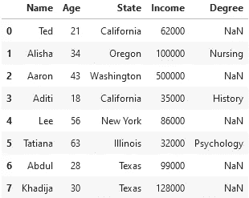

作者图片

我们可以看到所有来自`left_df`的人都在场，即使他们在`right_df`没有匹配。另一方面，只在`right_df`中的 Ariel 和 Juan 不在输出数据帧中。

以下是左连接的图形描述:

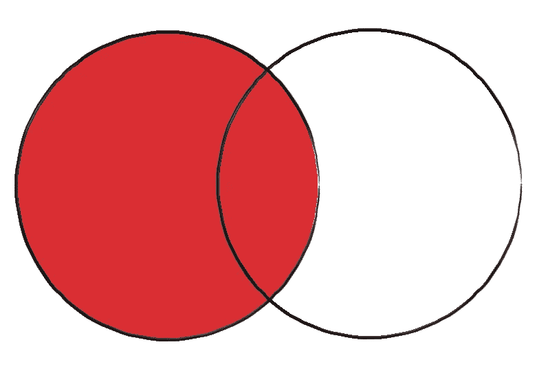

左接合。图片作者。

**右连接**与左连接几乎完全相同，除了这次它包括右数据帧的所有值，而不是左数据帧的所有值，同样用空值填充不匹配:

```
left_df.merge(right_df, on='Name', how='right')
```

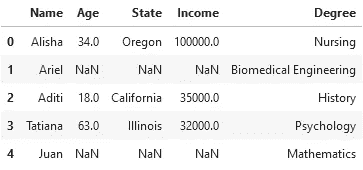

作者图片

这次是 Ted、Aaron、Lee、Abdul 和 Khadija 从输出中消失了，因为他们没有出现在`right_df`中。这是一个以图形方式显示的右连接:

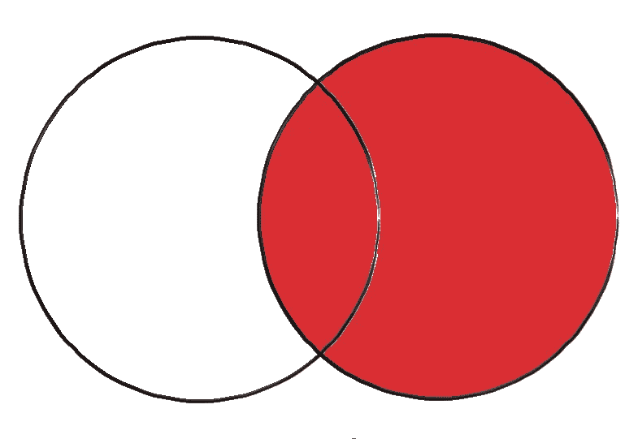

右接合。图片作者。

最后一种合并是通过**外部连接**完成的。正如您可能已经猜到的，这种类型的连接包括两个数据帧中的所有行，用空值填充所有缺少的值。根据我们的数据，这看起来如下:

```
left_df.merge(right_df, on='Name', how='outer')
```

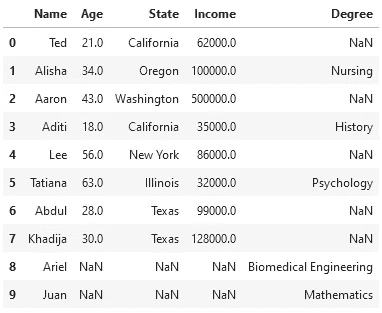

作者图片

我们可以看到 Pandas 是如何为 Ted、Aaron、Lee、Abdul 和 Khadija 的`"Degree"`值填充`NaN`的，因为它们没有出现在`right_df`中，因此没有该列的相应数据。类似地，Ariel 和 Juan 具有`"State"`和`"Income"`的`NaN`值，因为它们在`left_df`中不存在。

以下是外部联接的图形描述:

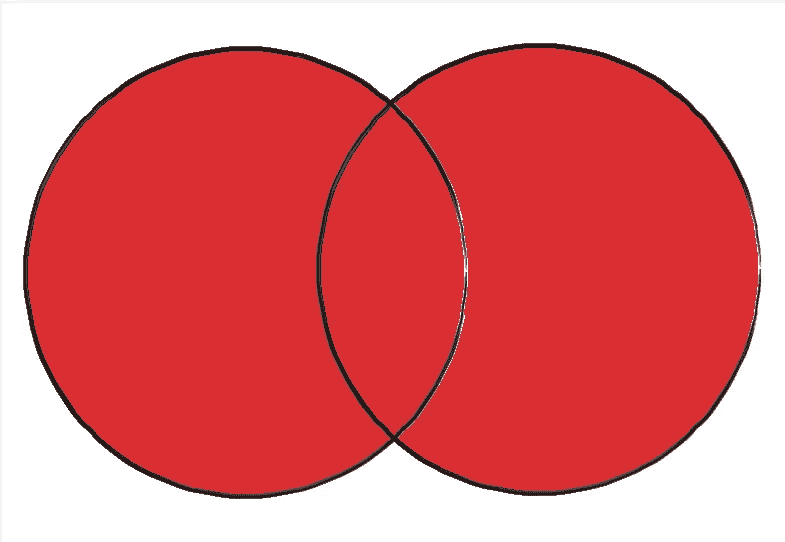

外部联接。图片作者。

有了这些，你应该准备好融入野外了。

让我们继续我们最后一项不被重视的技能。

## 将数据帧连接在一起

在 merge 中迷宫般的可能性之后，您会很高兴地了解到连接相当简单。它还涉及组合两个数据帧，除了不是基于一个公共标签连接列，它更像是将两个数据帧堆叠在一起。此外，该操作还可以同时在两个以上的数据帧上执行。

最基本的连接示例涉及两个列相同的数据帧[5]。例如，假设我们有以下两个数据帧，分别称为`top_df`和`bottom_df`:

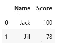

top_df。图片作者。

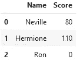

底 _df。图片作者。

我们可以将它们连接起来，如下所示:

```
pd.concat([top_df, bottom_df])
```

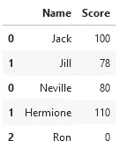

作者图片

关于上述内容，有几个重要注意事项:

*   与我们经常在 DataFrame 对象上直接调用的`merge`不同(例如`top_df.merge(bottom_df)`，我们使用`pd.concat`调用`concat`。
*   我们要连接的数据帧是作为列表中的一个参数传入的，而不是两个(或更多)单独的参数。

我们还可以连接不完全匹配的数据帧。例如，假设我们向我们的`bottom_df`添加另一列:

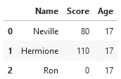

作者图片

然后，相同的连接为我们提供了以下输出数据帧:

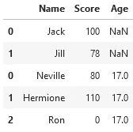

作者图片

它可以工作，但并不理想，因为我们最终需要对那些讨厌的空值做些什么，以及将浮点数转换回整数(见下一节)。

最后，串联也可以水平工作。为了看到这一点，我们将向我们的武器库中添加一个数据帧，称为`more_df`:

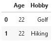

more_df。图片作者。

然后，我们得到以下结果:

```
pd.concat([top_df, more_df], axis=1)
```

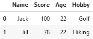

图片作者。

附加参数`axis=1`告诉熊猫我们要横向组合(按列)；如果我们省略这个参数，它默认为`axis=0`，垂直组合(按行)。

注意，水平连接不同于合并两个数据帧，因为它不选择公共列来将两个数据帧连接在一起；它基本上只是将两个不同的数据帧粘在一起，而不用担心公共标签的存在。

唯一需要解决的是那些讨厌的`NaN`值。

## **加成技能:填充替换**

您可能已经注意到，当我们从不同的地方收集数据到一个位置时，我们经常会遇到令人讨厌的空值或输入错误的数据条目。让我们来看看如何解决这些问题。作为一个例子，我们将使用上面的一个数据帧，这次称它为`faulty_df`:


faulty_df。图片作者。

空值代表我们没有的数据；在许多情况下，我们希望填入这些值，这样我们就可以在不出错的情况下进行分析。填补缺失数据的方法有很多，但我们在本例中只选择一种简单的方法:使用平均值——在本例中是 17。

在熊猫身上实现这一点最简单的方法是通过`fill_na`功能:

```
faulty_df = faulty_df.fillna(17)
faulty_df
```

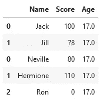

作者图片

然后，我们可以通过`astype`函数将这些浮点数转换回期望的类型——整数:

```
faulty_df['Age'] = faulty_df['Age'].astype('int')
faulty_df
```

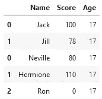

作者图片

现在，您已经有了一个简单的方法来处理在合并和连接后可能会得到的一些不完整的数据帧条目。

## 总结和最终想法

作为一名数据科学家，舒适地收集、组织、清理和重组数据以满足您的分析需求是非常重要的。通过掌握以上技能，你将离理想更近一步。

以下是一份备忘单，供将来参考:

1.  分类数据不符合 ML 模型。学习**一键编码**。
2.  你需要的数据通常是分散的。善于**将**信息融合在一起。
3.  相似的数据集应该放在一起。通过**串联**帮助他们团结起来。

祝你的数据处理工作好运。

**想擅长 Python？** [**获取独家，免费获取我简单易懂的指南**](https://witty-speaker-6901.ck.page/0977670a91) **。想在介质上无限阅读故事？用我下面的推荐链接注册！**

[](https://murtaza5152-ali.medium.com/?source=entity_driven_subscription-607fa603b7ce---------------------------------------) [## 穆尔塔扎阿里培养基

### 阅读媒介上穆尔塔扎·阿里的作品。华盛顿大学的博士生。对人机感兴趣…

murtaza5152-ali.medium.com](https://murtaza5152-ali.medium.com/?source=entity_driven_subscription-607fa603b7ce---------------------------------------) 

*我叫穆尔塔扎·阿里，是华盛顿大学研究人机交互的博士生。我喜欢写关于教育、编程、生活以及偶尔的随想。*

## 参考

[1]【http://data8.org/datascience/】
【2】[https://babypandas.readthedocs.io/en/latest/](https://babypandas.readthedocs.io/en/latest/)
【3】[https://www.educative.io/blog/one-hot-encoding](https://www.educative.io/blog/one-hot-encoding)
【4】[https://stack abuse . com/one-hot-encoding-in-python-with-pandas-and-scikit-learn/](https://stackabuse.com/one-hot-encoding-in-python-with-pandas-and-scikit-learn/)
【5】[https://www.w3resource.com/pandas/concat.php](https://www.w3resource.com/pandas/concat.php)