# 用于时间序列预测的 3 个独特的 Python 包

> 原文：<https://towardsdatascience.com/3-unique-python-packages-for-time-series-forecasting-2926a09aaf5b>

## 您可以添加到您的武器库中的一些时间系列包

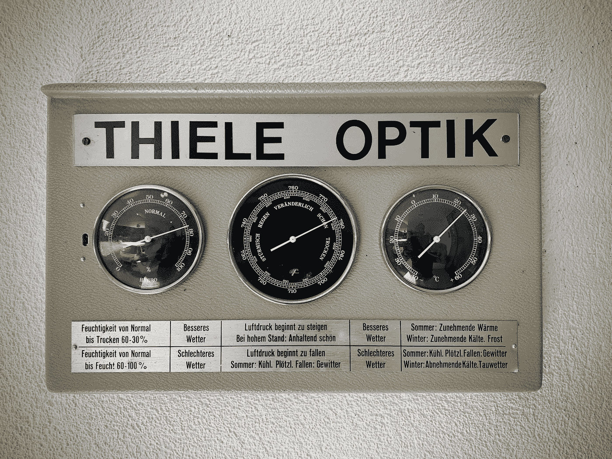

拉尔夫·哈特在 [Unsplash](https://unsplash.com?utm_source=medium&utm_medium=referral) 上拍摄的照片

时间序列预测是统计领域中的一种方法，用于分析具有时间成分的历史数据，并基于该数据创建预测。

时间序列预测方法的一些经典例子是移动平均、ARIMA 和指数平滑。这些方法已经使用了很长时间，现在仍然有用，因为用户很容易解释结果——尽管预测不太准确。

反过来，许多机器学习驱动的预测是通过牺牲一些可解释性和提高准确性来开发的，如[预言家](https://facebook.github.io/prophet/)和 [Kats](https://facebookresearch.github.io/Kats/) 。

无论您需要经典方法还是机器学习驱动的模型，许多人都开发了 Python 包来访问所有这些方法。一些著名的包有 [Statsmodel](https://www.statsmodels.org/stable/tsa.html) 、 [pmdarima](https://alkaline-ml.com/pmdarima/) 和 [sktime](https://www.sktime.org/en/stable/) 。然而，预测模型不仅限于我上面列出的那些，因为许多伟大的软件包都值得考虑。

这就是为什么本文将介绍我的 3 个独特的用于时间序列预测的 Python 包。让我们开始吧。

# 1.统计预测

[StatsForecast](https://github.com/Nixtla/statsforecast) 是一个 Python 包，它提供了一组[单变量](https://itl.nist.gov/div898/handbook/pmc/section4/pmc44.htm)时间序列预测模型。StatsForecast 的独特之处在于，该模型提供了快速训练，并针对高精度模型进行了优化。此外，该软件包提供了几个基准，我们可以在训练各种模型时使用。

让我们试用一下这个包，感受一下它。首先，我们需要安装 StatsForecast 包。

```
pip install statsforecast
```

出于演示目的，我将使用从 StatsForecast 生成的合成数据。使用下面的代码，我将获得每月记录的合成数据。

```
from statsforecast.utils import generate_seriessynthetic_panel = generate_series(n_series=1, freq = 'M')synthetic_panel.head()
```

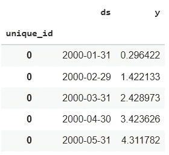

作者图片

数据集包含一个日期特征(“ds”)和我们要预测的数字特征(“y”)。此外，根据 StatsForecast，该指数具有“唯一 id”指数，这将提高训练速度。

接下来，我会将数据集分成训练数据和测试数据。我将最后 6 次观察作为测试数据，其余的作为训练数据。

```
Y_train_df = synthetic_panel[:-6]
Y_test_df = synthetic_panel[-6:]
```

准备好数据集后，我们可以尝试开发我们的预测模型。第一步是导入我们想要使用的模型。在我们的例子中，我们将使用 AutoARIMA(带自动参数训练的 ARIMA 模型)和指数平滑(ETS)。

```
from statsforecast import StatsForecast
from statsforecast.models import AutoARIMA, ETS
```

接下来，我们将建立模型并向模型传递一些参数。我们要传递的参数是季节长度(使用 12，因为一年有 12 个月)，以及 ets 的“ZMZ”模型，以便对模型进行优化调整。此外，我设置了 horizon 变量作为我们预测的长度。

```
season_length = 12horizon = len(Y_test_df)models = [
AutoARIMA(season_length=season_length),
ETS(season_length=season_length, model='ZMZ')
]model = StatsForecast(
df=Y_train_df,
models=models,
freq='M',
n_jobs=-1)
```

StatsForecast 的优点是可以在一行中直接测试各种模型。我们只需要决定我们想要使用什么样的预测模型，我们可以通过下面的代码轻松获得所有的预测。

```
%timeY_hat_df = model.forecast(horizon).reset_index()
Y_hat_df.head()
```

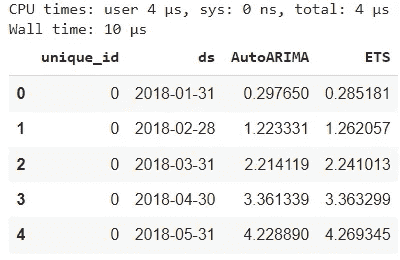

作者图片

StatsForecast 自诩训练时间快，从上图可以看出预测时间。我们的预测花了很短的时间。那么，我们的预测有多准确呢？让我们用时间图来看看。

```
fig, ax = plt.subplots(1, 1, figsize = (20, 7))Y_hat_df = Y_test_df.merge(Y_hat_df, how='left', on=['unique_id', 'ds'])plot_df = pd.concat([Y_train_df, Y_hat_df]).set_index('ds')
plot_df[['y', 'AutoARIMA', 'ETS']].plot(ax=ax, linewidth=2)ax.set_title('Forecast Synthetic Data', fontsize=22)
ax.set_ylabel('Number', fontsize=20)
ax.set_xlabel('Timestamp [t]', fontsize=20)
ax.legend(prop={'size': 15})
ax.grid()
```

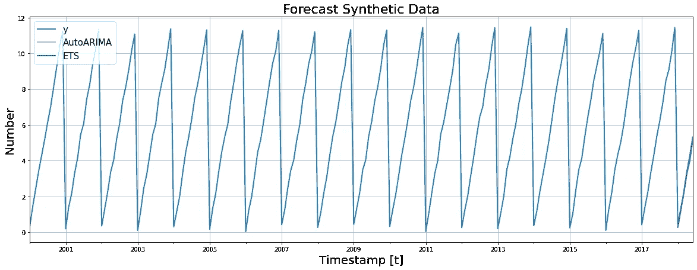

作者图片

从上图可以看出，预测数据模式足够接近实际数据。这两种预测都会导致与实际情况重叠的预测。

你可以用 StatsForecast 尝试很多模型；建议你来访问这个[页面](https://nixtla.github.io/statsforecast/models.html)。

# 2.PyAF

[PyAF](https://github.com/antoinecarme/pyaf) 或 Python Automatic Forecasting 是一个开源的 Python 包，用于自动开发时间序列预测模型(单变量或外生数据)。该模型是在 Scikit-Learn 和 Pandas 的基础上构建的，因此可以期待熟悉的 API。该软件包还提供了各种模型，尽可能在几行中使用。

让我们用之前的数据集来试试 PyAF 包。首先，我们需要安装软件包。

```
pip install pyaf
```

接下来，我们可以使用以前的数据来开发我们的 PyAF 预测模型。让我们用下面的代码试试自动预测引擎。

```
horizon = len(Y_test_df)import pyaf.ForecastEngine as autof#set up the model engine
lEngine = autof.cForecastEngine()# get the best time series model for test prediction
lEngine.train(iInputDS = Y_train_df, iTime = 'ds', iSignal = 'y', iHorizon = horizon)
```

我们试着看一下预测数据。我们可以使用下面的代码来获取预测。

```
forecast_df= lEngine.forecast(Y_train_df, horizon)
```

预测结果将是我们当前和预测数据的数据框架。此外，每个预测结果都有如此多的信息，我们可以用来评估我们的模型。

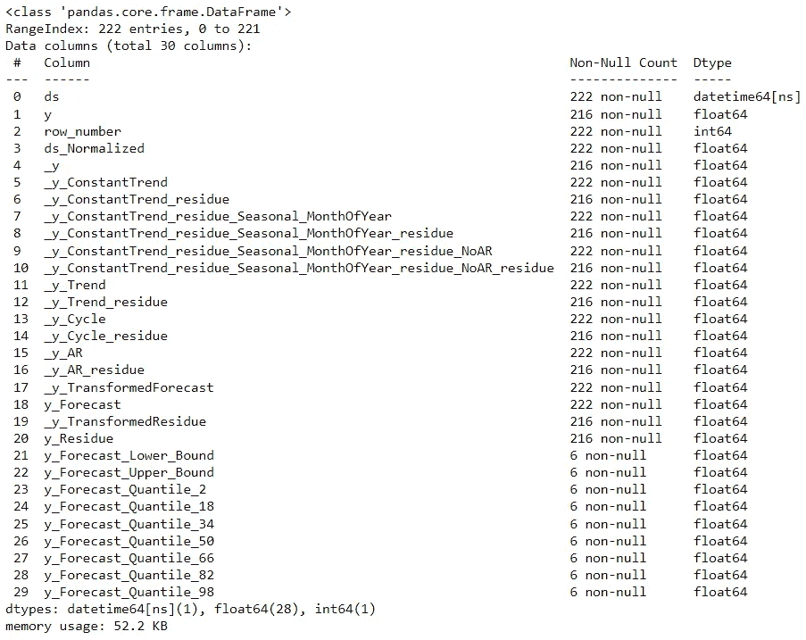

作者图片

让我们只获取关键信息，并进行视觉比较。

```
forecast_df.plot.line('ds', ['y' , 'y_Forecast','y_Forecast_Lower_Bound', 'y_Forecast_Upper_Bound'], grid = True, figsize=(12, 8))
```

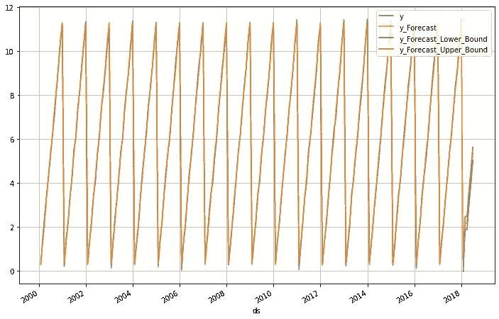

预测相当不错，如上图所示，预测数据和实际数据重叠。此外，上限和下限足够小，可以表示模型的可信度。我们可以通过使用外源数据来改进模型，你可以尝试使用下面的[笔记本教程](https://github.com/antoinecarme/pyaf/blob/master/docs/PyAF_Exogenous.ipynb)。

# 3.神经营养细胞

[NeuralProphet](https://neuralprophet.com/) 是一个 Python 包，用于开发基于[脸书预言家](https://github.com/facebook/prophet)的时间序列模型，但具有神经网络架构。这个包基于 PyTorch，可以很容易地使用尽可能少的代码行。

让我们从安装包开始。

```
pip install neuralprophet
```

如果你想在 Jupyter 笔记本中实现交互式可视化，我们可以使用下面的代码来安装它。

```
pip install neuralprophet[live]
```

让我们从初始化模型开始。对于这个例子，我们使用与上一个相同的数据集。此外，为了使事情更容易，我将删除数据索引。

```
train = Y_train_df.reset_index(drop = True)
test = Y_test_df.reset_index(drop = True)
```

接下来，我们将启动神经先知模型。

```
from neuralprophet import NeuralProphet
m = NeuralProphet()
```

然后，我们将使用下面的代码来训练模型。

```
metrics = m.fit(train, freq='M', validation_df=Y_test_df, progress='plot')
```

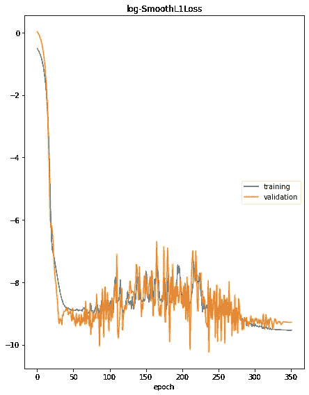

作者图片

该模型将自动递归训练数据，并在默认纪元后停止(您可以设置您的纪元)。要查看最终的指标，我们可以使用下面的代码。

```
metrics.tail(1)
```

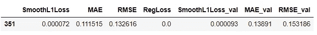

作者图片

我们还可以尝试使用该模型来直观地预测和比较当前的训练数据。

```
forecast = m.predict(train)
fig = m.plot(forecast)
```

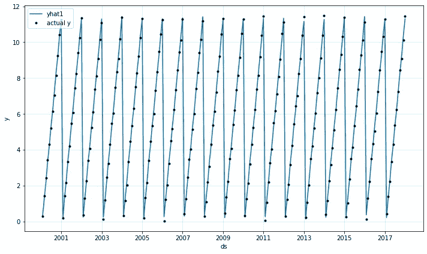

从上面的图我们可以看出，预测和实际数据点比较接近。我们试着和测试数据对比一下。

```
forecast = m.predict(test)
m = m.highlight_nth_step_ahead_of_each_forecast(1)
fig = m.plot(forecast)
```

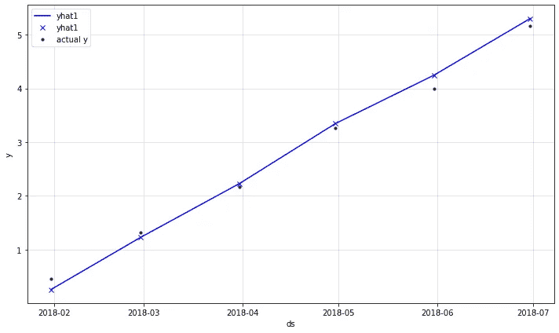

作者图片

我们可以在上面的图像中看到，预测与实际数据相当接近。仍然有一些误差可以通过进一步的预测模型开发来修正。

与 Prophet 类似，我们可以使用下面的代码获取 NeuralProphet 预测组件。

```
fig_param = m.plot_parameters()
```

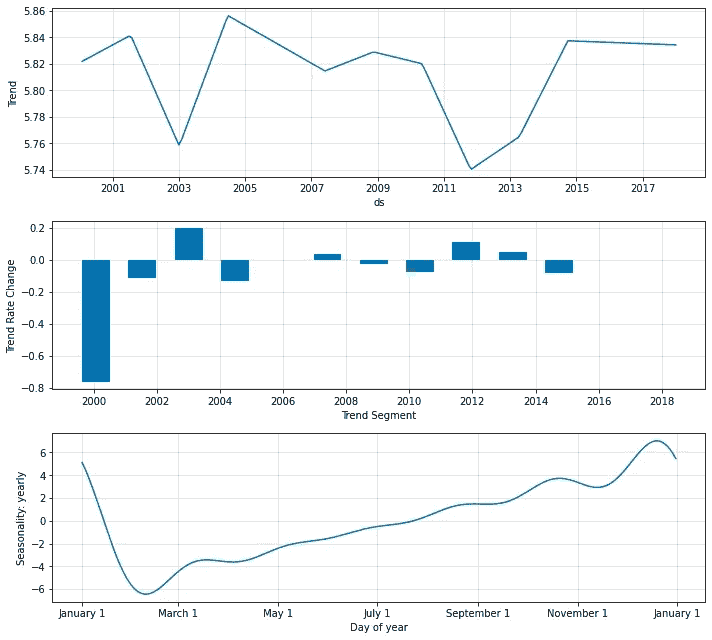

作者图片

分解将显示我们的训练数据的趋势和季节性，这对我们的洞察力也是至关重要的。

撰写本文时，NeuralProphet 包仍处于测试阶段，因此可以期待该包的许多新开发，尤其是增加预测能力。要了解他们的发展时间表，您可以点击查看[。](https://github.com/ourownstory/neural_prophet/blob/main/notes/development_timeline.md)

# 结论

时间序列预测是一种基于历史时间数据(例如，天气或人数)预测未来值的方法。

许多 Python 包是为时间序列预测开发的，但我想在本文中展示一些更独特的包。它们是:

1.  统计预测
2.  PyAF
3.  神经营养细胞

希望有帮助！

> *访问我的* [***社交媒体***](https://bio.link/cornelli)**进行更深入的交谈或有任何问题。**

> **如果您不是作为中等会员订阅，请考虑通过* [*我的推荐*](https://cornelliusyudhawijaya.medium.com/membership) *订阅。**