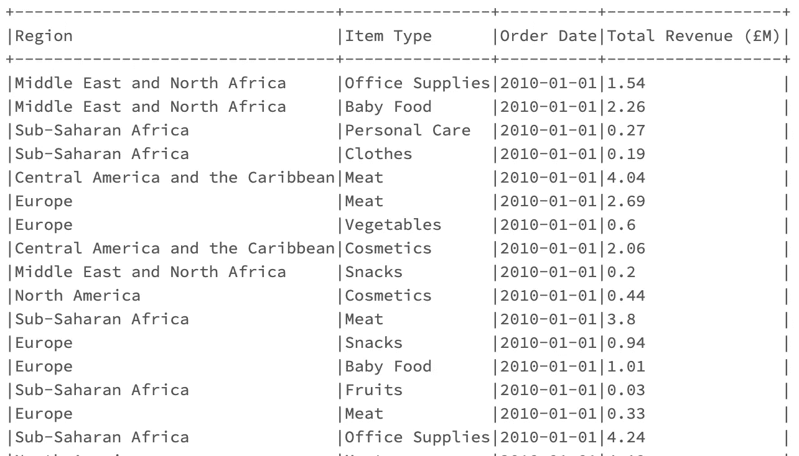
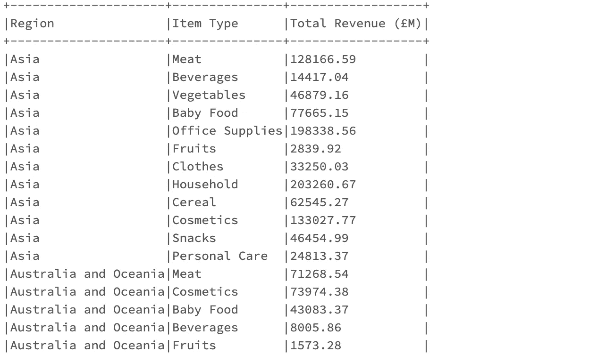
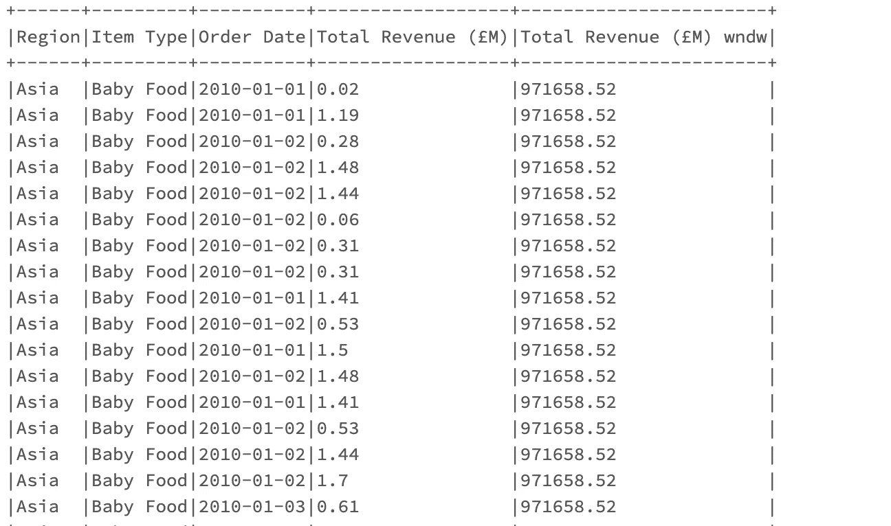
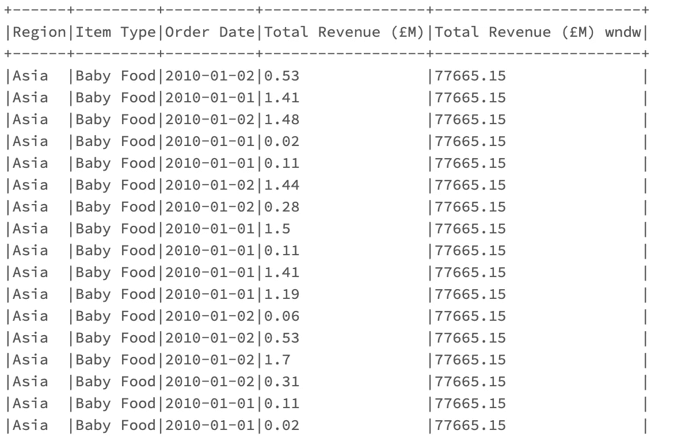

# PySpark 中聚合数据的 3 种方法

> 原文：<https://towardsdatascience.com/3-ways-to-aggregate-data-in-pyspark-72209197c90>

## [编程](https://towardsdatascience.com/tagged/programming) | [大数据](https://towardsdatascience.com/tagged/big-data) | [PySpark](https://towardsdatascience.com/tagged/pyspark)

## PySpark 用编码示例解释基本聚合。

[](https://imp.i115008.net/zaX10r)

照片由[像素](https://www.pexels.com/photo/close-up-photo-of-fire-266526/)上的[像素](https://www.pexels.com/photo/close-up-photo-of-fire-266526/)拍摄

## 建议的点播课程

*我的一些读者联系我，要求提供点播课程，以了解关于使用 Python 的****Apache Spark****的更多信息。这是我推荐的 3 个很好的资源:*

*   **阿帕奇卡夫卡数据流&阿帕奇火花纳米级(UDACITY) →** 非常高质量的课程！
*   [**数据工程纳米学位(UDACITY)**](https://imp.i115008.net/zaX10r)
*   [**Spark 与 Python 对于大数据的配合**](https://click.linksynergy.com/deeplink?id=533LxfDBSaM&mid=39197&murl=https%3A%2F%2Fwww.udemy.com%2Fcourse%2Fspark-and-python-for-big-data-with-pyspark%2F)

*还不是中等会员？考虑与我的* [***推荐链接***](https://anbento4.medium.com/membership) *签约，以获得 Medium 提供的一切服务，价格低至****【5 美元一个月*** *！*

# 介绍

[Apache Spark](https://www.databricks.com/spark/about) 是一个数据处理引擎，在大型数据集上执行聚合的速度非常快。根据所执行的聚合类型，输出数据集通常会显示:

*   **较低的** [**基数**](https://dzone.com/articles/what-is-high-cardinality) **与原始数据集** →当对一组维度应用聚合时会出现这种情况。
*   **相同的** [**基数**](https://dzone.com/articles/what-is-high-cardinality) **与原始数据集** →当对记录窗口应用聚合时会发生这种情况。

在本教程中，我将分享使用 Python 在 PySpark 数据帧上执行聚合的三种方法，并解释何时根据目的使用每种方法是有意义的。

对于编码示例，我将使用虚构的数据集，包括按世界区域划分的**500 万笔销售交易**。如果你想继续下去，你可以从这个网站下载 CSV 文件。

原始数据集[已被简化](https://gist.github.com/anbento0490/49313e47d4e56c7aad35f2baaefb1a8e)，如下表所示:

[](/3-ways-to-create-tables-with-apache-spark-32aed0f355ab)  

# 在 PySpark 中聚合数据

在本节中，我将介绍在 PySpark 数据帧上工作时聚合数据的三种方法。

在下面的代码片段中，我将只使用`SUM()`函数，但是同样的推理和语法也适用于`MEAN()`、`AVG()`、`MAX()`、`MIN()`、`COUNT()`和`PIVOT()`函数。

## 方法 1:使用 GroupBy( ) +函数

在 PySpark 数据帧上运行聚合的最简单方法是将`groupBy()`与聚合函数结合使用。

这种方法非常类似于使用 SQL `GROUP BY`子句，因为它通过一组维度有效地折叠输入数据集，从而产生粒度更低[的输出数据集](https://www.techopedia.com/definition/31722/granular-data) ( *意味着记录更少*)。

例如，如果选择的函数是`sum()`，语法应该是:

```
dataframe.groupBy(‘dimension_1’, 'dimension_2', ...).sum(‘metric_1’)
```

回到销售数据集，假设任务是计算:

*   `Total Revenue (£M)`由`Region`组成
*   由`Region`和`Item Type`组成的`Total Revenue (£M)`

在这种情况下，你可以写:

与 SQL 一样，`groupBy()`可用于在多个列上运行聚合。下面，找到由`Region`聚合的输出数据集:

**输出 1**


以下是由`Region`和`Item Type`聚合的输出数据集:

**输出 2**



**何时使用/避免→** 当不需要格式化并且您只想在浏览数据集时运行**快速聚合**时，应该使用**该方法。**

相反，当您希望**执行多重聚合或对聚合输出应用多个转换**时，应该避免使用它。

例如，对聚合输出进行舍入并将列重命名为更整洁的名称非常麻烦，因为它需要两次单独的转换。

## 方法 2:使用 GroupBy( ) + AGG()

使用`groupBy()`执行聚合的另一种方式是将所需的函数包装在`AGG()`方法中。

至于`METHOD 1`，这个方法的行为也类似于 SQL `GROUP BY`子句，因为它生成一个数据集，其基数*比它的源低。然而，正如您将验证的那样，它比`METHOD 1`要方便得多，因为它需要对聚合输出执行多次转换。*

*同样，假设选择的函数是`SUM()`，语法应该是:*

```
*dataframe.groupBy('dimension_1', 'dimension_2', ...).agg(sum(“column_name”))*
```

*例如，如果您希望在销售数据集上复制使用`METHOD 1` 所取得的成果，您可以编写以下代码:*

*这再次导致两个输出，一个按世界`Region`分组，另一个按`Region`和`Item Type`分组:*

***输出 1***

**

***输出 2***

**

***何时使用/避免→** 在生产中对 PySpark 数据帧执行聚合时，这种方法应该是您的首选解决方案。事实上，使用`AGG()`允许您在第 行中应用 ***多重连接转换，使您的代码更加易读和简洁。****

*另一方面，当您的目标是运行聚合时，您应该避免使用这种方法，保持源数据集的粒度不变(*这意味着不按维度组*折叠记录)。*

*的确，这个要求，导致了`METHOD 3`。*

## *方法 3:使用窗口函数*

*在 PySpark DataFrame 中聚合数据的最后一种方法是对行窗口应用函数。*

*这实际上相当于一个 SQL 窗口函数，因此以`SUM()`为例，语法将是:*

```
*# WINDOW DEFINITION
Window.partitionBy(‘dimension_1’, 'dimension_2', ...)

# DF AGGREGATION USING WINDOW FUNCTION
dataframe.withColumn(‘new_column_name’, functions.sum(‘metric_1’)\
         .over(Window.partitionBy(‘dimension_1’)))*
```

*和在 SQL 中一样，`partitionBy`子句用来代替`groupBy()`来对特定的行窗口应用`SUM()`函数。对于销售数据集，您可以编写:*

*正如您在下面的输出中看到的，这一次列`Total Revenue (£M)`保持不变，取而代之的是计算一个新列`Total Revenue (£M) wndw` — *，显示窗口*中的总收入。*

***输出 1***

**

***输出 2***

**

***何时使用/避免→** 当您希望保留数据集的粒度时，应该首选此方法。实际上，窗口函数的一个主要优点是聚合应用于记录窗口，然后显示每一行，而不会折叠源数据集中的记录。*

*另一方面，当您处理非常大的数据集并希望执行聚合以获得更小、更易于管理的输出时，您应该避免使用这种方法。*

*[](/3-nanodegrees-you-should-consider-to-advance-your-data-engineering-career-in-2021-baf597debc72)  

# 结论

在本教程中，我讨论了在 Spark 数据帧上工作时，如何使用 Python 执行聚合，至少有三种基本方法。

从概念上讲，在 PySpark 中聚合数据与在 SQL 中使用`GROUP BY`子句或利用窗口函数聚合数据非常相似。

具有强大 SQL 背景的数据专业人员通常会发现向 PySpark 的过渡非常简单，尤其是在使用 [pyspark.sql](https://spark.apache.org/docs/2.4.0/api/python/pyspark.sql.html#pyspark-sql-module) 模块时。

但是你呢？您是否尝试过使用 [rollup](https://spark.apache.org/docs/3.2.0/api/python/reference/api/pyspark.sql.DataFrame.rollup.html) 和 [cube](https://spark.apache.org/docs/latest/api/python/reference/pyspark.sql/api/pyspark.sql.DataFrame.cube.html) 运行更高级的聚合？* 

## *给我的读者一个提示*

> *这篇文章包括附属链接，如果你购买的话，我可以免费(但实际上是打折)给你一点佣金。*

# ***消息来源***

*   *[数据集最初从 Excel BI Analytics 网站下载，版权免费。](https://excelbianalytics.com/wp/downloads-18-sample-csv-files-data-sets-for-testing-sales/)*
*   *[什么是数据库中的基数？](https://orangematter.solarwinds.com/2020/01/05/what-is-cardinality-in-a-database/)*
*   *[PySpark GroupBy 举例说明](https://sparkbyexamples.com/pyspark/pyspark-groupby-explained-with-example/)*
*   *[PySpark GroupBy Aggregate 解释](https://sparkbyexamples.com/pyspark/pyspark-groupby-agg-aggregate-explained/)*