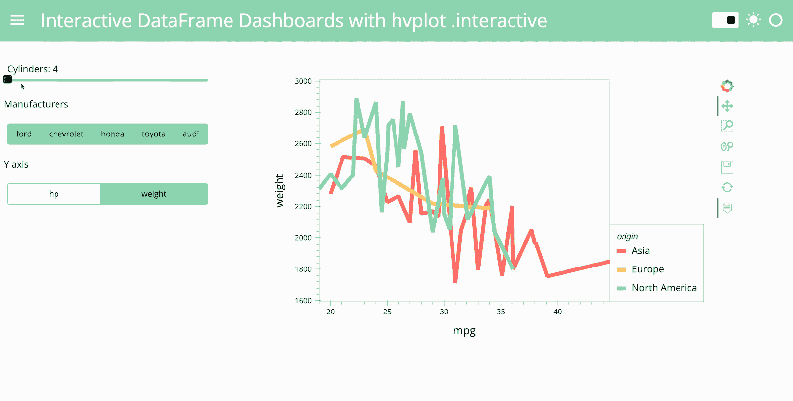

# 构建面板可视化仪表板的 3 种方式

> 原文：<https://towardsdatascience.com/3-ways-to-build-a-panel-visualization-dashboard-6e14148f529d>

## hvPlot。互动，面板。bind 和 Param。依赖

由[索菲亚·杨](https://twitter.com/sophiamyang)和[马克·斯科夫·麦德森](https://twitter.com/MarcSkovMadsen)

您对用 Python 构建交互式仪表板感兴趣吗？不仅有不同的工具可以使用，甚至像 Panel 这样的单一工具也有多种方式来构建仪表板。您是否想知道为什么会有不同的选项，以及哪种方法最适合您自己的用例？本文将向您介绍三种创建面板仪表板的方法:

*   **hvPlot。交互式**将您的任何数据帧处理管道转变为仪表板(如果您想探索数据集，这是个好主意！);
*   **面板。绑定**将你的小部件和你的交互情节绑定在一起(如果你想构建一个任意的应用程序，这很棒！);
*   **Param** 将您的仪表板封装为自包含类(如果您想要构建一个支持 GUI 和非 GUI 使用的复杂代码库，这是个好主意)。

我们将向您展示如何选择适合您的方法，以及如何使用以下三种方法创建这个交互式仪表盘:

# **什么是面板？**

Panel 是开源 **HoloViz** 生态系统中的仪表板库，包括八个库(见图 1)，由我们的 Anaconda 朋友 [Philipp Rudiger](https://twitter.com/PhilippJFR) ，Jean-Luc Stevens 和 [Jim Bednar](https://twitter.com/JamesABednar) 开发。HoloViz 每月有数十万次下载，是最受欢迎的 Python 可视化生态系统。

[Panel](https://panel.holoviz.org/) 旨在构建定制的交互式应用和仪表盘。有许多 Python 可视化和仪表板工具，每种工具都有自己的优点和特殊功能。要了解更多关于 Python dashboarding 的情况，并找出哪种工具最适合您的用例，请查看我们之前的博客文章[比较最流行的仪表板工具](https://anaconda.cloud/dashboardlandscape)。在这里，我将重点介绍 Panel，并展示三种非常不同的使用方法，以便您可以看到哪种方法最符合您的目标和情况。

图一。HoloViz 生态系统中的八个包。

# 以数据为中心的方法:hvPlot。互动

hvPlot 是 HoloViz 生态系统中绘图的推荐入口点。如果你了解熊猫或者哈维。plot API，你已经知道如何使用 hvPlot:只需将`df.plot`替换为`df.hvplot`即可。

hvPlot 的。如果您主要关注于探索 Panel、Dask DataFrame 或 Xarray DataArray 中的数据集，交互式支持是使用 Panel 的最佳方式。有了`.interactive`，你可以非常容易地将你的处理流水线变成一个面板仪表盘，只需要几行代码。学习如何绘制？互动作品详情，请查看[我们之前关于这个话题的博文和视频](/the-easiest-way-to-create-an-interactive-dashboard-in-python-77440f2511d1?sk=e1ea8c40c090cdbe7689333267f73b25)。

下面是 hvPlot。用于创建上面仪表板的交互式代码。我们将在此强调一些要点:

*   hvPlot。互动是以数据为中心的。一旦有了数据框，就可以通过调用`idf=df.interactive()`把这个数据框变成交互数据框。
*   在这段代码中，我们定义了三个小部件`cylinders`、`mfr`和`yaxis`，这样我们的用户就可以交互地控制这三个值。然后，我们可以将小部件传递到数据处理管道中，产生交互式数据处理管道`ipipeline`，并构建反映从小部件中选择的值的交互式绘图`iplot`。
*   然后，我们使用一个模板在侧边栏中显示小部件，并在应用程序的主体中绘图。

请注意，即使您没有数据框作为起点，`hvplot.bind(function, widget).interactive()`也可以将函数绑定到微件，并使绑定的函数具有交互性。此功能允许您从数据库或 web API 查询数据，因此您仍然可以使用。互动，即使你还没有*拿着你的数据框。*

方法 1: hvplot。交互式(要运行此脚本，首先通过运行“conda install hvplot panel”来设置您的环境，然后在命令行中运行“panel serve HV plot _ interactive . py”

# **以应用为中心的方法:pn。绑定**

如果您不是从正在探索的数据集开始，而是编写了一些函数来返回您想要显示的内容，无论是否涉及数据集，该怎么办？

不是从数据帧或创建数据帧的函数开始。绑定从一个函数开始。正如您在下面的代码中看到的，导入包和定义小部件的前 19 行与前面的方法完全相同。区别从第 20 行开始，这里我们定义了一个 plot 函数，它返回一个 plot(或者面板可以显示的任何东西)。

当我们使用 **pn 时，奇迹就发生了。绑定**将标绘函数`plot`与控件`cylinders`、`mfr`、`yaxis`绑定。结果是一个互动的情节`interactive_plot`:

`interactive_plot = pn.bind(plot, cylinders, mfr, yaxis)`

方法二:pn。bind(要运行此脚本，首先通过运行“conda install hvplot panel”设置您的环境，然后在命令行中运行“panel serve pn_bind.py ”)

您可以使用`pn.bind`将窗口小部件“绑定”到任意数量的不同功能，然后用 Panel 布局每个“绑定”的功能，这样当绑定到它的任何窗口小部件被修改时，该功能会被自动调用。这种反应式编程模型允许您将任何小部件和输出的集合构建到仪表板中，如果您的目标是构建应用程序而不是探索数据集，pn.bind 是一种极好的方法。

# **以应用为中心的方法:param。取决于**

如果您主要是为研究、分析、科学或工程领域编写代码，但是您也想支持可选的 GUI 应用程序接口，该怎么办？也就是说，如果您需要维护一个既可以用作 GUI *又可以用作命令行、批处理或其他自动化过程的单一代码库，该怎么办？*

如果您的代码主要是作为 Python 函数组织的，pn.bind 可以很好地处理这种情况；只需将这些函数放入一个可导入的文件中，然后将它们“绑定”到一个单独的 app.py 文件中的小部件上，以生成 GUI 版本。如果你的代码被组织成 Python 类会怎样？在这种情况下，Panel 被设计为与`param`包一起工作，该包允许您在 Python 类中声明所有代码的参数，然后*单独地*打开一个 GUI 来编辑这些值，同时保持您的 GUI 和非 GUI 代码完全独立。

正如您在下面的代码中看到的，对于这种方法，我们创建了一个名为`InteractiveDashboard`的类。在这个类中，我们创建三个参数`cylinders`、`mfr`、`yaxis`。注意，这些是抽象参数，而不是面板小部件，所以代码不依赖于任何特定的 GUI 框架。重要的是，我们不需要依赖 Panel 来调用和使用这个类。我们可以在不使用 Panel 或任何其他 GUI 库的情况下使用这个 dashboard 类。

类似于 pn。上面的绑定方法，我们使用一个`plot`函数来创建我们的情节。`@param.depends`装饰器让我们显式地表达绘图函数和参数之间的依赖关系，这样我们就知道这个绘图依赖于三个小部件。

我们通过调用`dashboard=InteractiveDashboard()`来实例化这个类。然后在最后一步，我们使用一个模板在侧边栏显示参数`dashboard.param`并在应用程序的主体中绘制`dashboard.plot`。

方法 3:参数。depends(要运行此脚本，首先通过运行“conda install hvplot panel param”来设置您的环境，然后在命令行中运行“panel serve param_depends.py”

# 你应该选择哪种方法？

## 你在做数据探索吗？

如果你是一名数据科学家或数据分析师，使用 Pandas 或 Dask DataFrame 或 Xarray 对象，从 hvPlot .interactive 开始。interactive 满足了我的大部分仪表板需求。

## **代码复杂度**:

hvPlot。互动< Panel .bind < Param .depends

*   hvPlot .interactive is no doubt the easiest to learn and implement, and produces very short, readable code. It lives within the hvPlot framework. Even though it uses Panel to create a Panel dashboard, you don’t actually need to know much about Panel.
*   Panel .bind requires you to write functions, which is pretty easy as well, and is a better choice if you want to write an app that does a lot of computation that is not centered around dataframes.
*   Param .depends requires you to write classes, which is suited to the subset of people who are maintaining large, class-based Python codebases.

## **App 灵活性:**

hvPlot。互动< Panel .bind < Param .depends

*   hvPlot .interactive is restricted to Pandas, Dask, Xarray DataFrame, or functions that produce such a data object.
*   Panel .bind can handle any arbitrary collection of objects and computations, but is specific to building an app.
*   The Param .depends approach lets you write code that supports a GUI but can also be used fully on its own, with no GUI dependencies.

# **你有问题吗？**

## **我可以用 Jupyter 笔记本制作我的 app 吗？**

是的，绝对的！需要指出的一点是，我们上面展示的三个示例文件都是。py 文件，但也可以是。ipynb 文件。因此，如果你是 Jupyter Notebook 用户，你可以在 Jupyter Notebook 中创建你的仪表盘，然后运行`panel serve filename.ipynb`来服务你的应用。

## **如果我需要更多的控制怎么办？我是否应该使用其他受支持的方法，如 pn。看情况 pn。互动，参数。手表，还是 HoloViews 动态地图？**

本文提到的三种方法中的一种最适合大多数用户。pn.interact 主要是为从 ipywidets.interact 迁移而提供的，它的功能有限。pn.bind 取代了 pn.depends，支持相同的用途，同时也有助于保持 GUI 代码与应用程序的隔离，而不是影响特定领域的计算。参数。watch 是所有这些方法的底层实现，因此如果您需要对事件和相关计算进行最精细的控制，您可以使用它，但即使对于复杂的应用程序，也很少需要这样的控制。HoloViews DynamicMap 有助于优化您的应用程序，以避免闪烁并为部分绘图提供细粒度更新，但它比这里的方法更难描述，并且在您准备好优化交互性能之前不需要。

# **从哪里可以了解更多信息？**

*   查看官方文档:[holoviz.org](https://holoviz.org/)、[panel.holoviz.org](https://panel.holoviz.org)、[hvplot.holoviz.org](https://hvplot.holoviz.org)。
*   去 https://awesome-panel.org/[寻找灵感。](https://awesome-panel.org/)

希望这篇文章对你有帮助！如果你有问题或者想联系其他 HoloViz 用户，请查看 https://discourse.holoviz.org/.的

# 致谢:

谢谢你的反馈和支持！

# **参考文献:**

*   【https://holoviz.org/】
*   [https://panel.holoviz.org/](https://panel.holoviz.org/)
*   [https://holoviews.org/](https://holoviews.org/)
*   [https://hvplot.holoviz.org/](https://hvplot.holoviz.org/)
*   [https://anaconda.cloud/dashboardlandscape](https://anaconda.cloud/dashboardlandscape)
*   https://anaconda.cloud/easiest-interactive-dashboard

. . .

由[索菲亚杨](https://twitter.com/sophiamyang)和[马克斯科夫麦德森](https://twitter.com/MarcSkovMadsen)于 2022 年 9 月 20 日。

Sophia Yang 是 Anaconda 的高级数据科学家。在 [LinkedIn](https://www.linkedin.com/in/sophiamyang/) 、 [Twitter](https://twitter.com/sophiamyang) 和 [YouTube](https://www.youtube.com/SophiaYangDS) 上与我联系，并加入 ds/ml[❤️读书俱乐部](https://discord.com/invite/6BremEf9db)