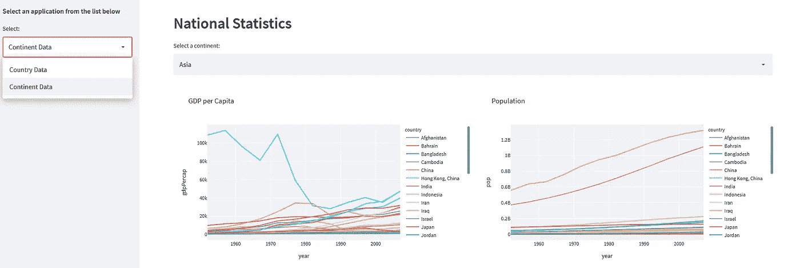

# 创建多页简化应用程序的 4 种方法

> 原文：<https://towardsdatascience.com/3-ways-to-create-a-multi-page-streamlit-app-1825b5b07c0f>

## Streamlit 可能不是为成熟的网站设计的，但在一个应用程序中创建多个页面是相当简单的



作者图片

创建多页面应用程序有两个方面:如何从用户界面中选择你想要的，以及如何选择要运行的代码。

UI 可以是选项菜单、下拉菜单、按钮或其他 UI 元素。在这里，我们将使用侧边栏中的 Streamlit `selectbox`来选择运行应用程序的哪一部分。

为了确定要运行哪些代码，我们将考察您可以自己实现的 3 种不同技术，以及 Streamlit 的多页面新的本机实现:

*   使用 select 语句如`if... else...`或 3.10 模式匹配来选择要显示的页面。这是最简单的方法，适用于少量页面。
*   将应用程序构建为库包。一种更复杂的交付多页的方式，也很容易使用——只要遵循这个模式。
*   一个应用程序库的通用启动器应用程序。这个启动器会自动获取存储在库中的应用程序，但仍然易于创建和使用。
*   Streamlit 本机方法

## 书页

在每种情况下，我们将使用相同的两个代码块来显示来自 Plotly 中包含的 Gapminder 数据的关于一个国家或洲的数据。所以让我们先来看一下代码。

首先让我们得到数据:

```
df = pd.DataFrame(px.data.gapminder())
```

下面的代码显示了两个图表，一个是一个国家的人均 GDP，另一个是人口增长。数据在熊猫数据框`df`中，我们首先从数据框中构建一个唯一的国家名称列表。然后从细流中选择国家`selectbox`。然后，我们将图形分成两列，使它们并排出现。

下一个代码块非常相似，但是显示了一个大陆上所有国家的数据。

因此，这两个代码块将成为我们的两个“页面”。对于这三种解决方案，我将向您展示框架并指出这些代码块的位置。

## 简单选择

第一种技术非常简单，我们简单地使用一个`if... else...`或 Python 3.10 `match`语句来选择要运行的代码。这非常简单，但可能更适合于少量的页面，比如我们在这里使用的两个页面。

在这个解决方案中，我们将页面定义为函数`countryData()`和`continentData()`，并将`st.selectbox`放在`st.sidebar`中，作为选择我们将运行哪个代码的机制。然后，我们简单地根据从`st.selectbox`返回的值调用适当的函数。

如果您使用的是 Python 3.10 或更高版本，您可以用类似下面的`match`语句替换`if... else...`:

```
match page:
    case 'Country data': countryData()
    case 'Continent data': continentData()
```

这个结构更简洁一些，尤其是当你有超过两个页面的时候。

## 实现为库

如果您有几个页面需要选择，那么将所有代码放在一个文件中会有点麻烦。更好的方法是使用 Python 包机制来保存可以导入到主程序中的函数。

您需要做的第一件事是创建一个存放页面的文件夹，并将其配置为库。所以首先创建一个名为`stlib`的子文件夹，然后在里面创建一个文件`__init__.py`。这个文件可以是空的，它只需要将文件夹标记为库。

现在在子文件夹中再创建两个文件，一个用于国家数据页面，另一个用于洲数据页面。我们将这些文件称为`countryData.py`和`continentData.py`。

主代码编码为一个名为`run()`的函数。它可以被命名为任何名称，但是它有助于使用一个标准名称来调用函数，我们将在后面看到。

最后一个`if`语句是可选的，但是如果你包含它，你可以将模块作为独立程序运行。

现在我们已经将“页面”实现为 Python 模块，我们可以导入它们并为每个调用`run()`函数。

## 通用解决方案

库的方法非常吸引人，因为这意味着我们可以将“页面”的功能转移到函数库。然而，我们可以更进一步，将模块信息存储在一个外部文件(在库中)中，并构建一个通用的“主”程序，该程序将读取该文件，构建选择菜单并调用任何可用的模块。

首先要做的是在 library 文件夹中创建一个包含可用模块列表的文件。我称之为`libContents.py`，它看起来像这样:

```
*# Return a list of the modules in this package*
    def packages():
        return ['countryData','continentData']
```

这是一个以列表形式返回模块名称的函数。

这个解决方案中的代码要多一点，但是更加灵活，您只需要编写一次。

代码如下所示，首先要注意的是我们显式地导入了`libContents`，然后我们声明了保存模块列表(名称、描述和模块引用)的全局数组。`moduleNames`是直接从`libContents`分配的，其他的我们会在后面的循环中处理。第一件事是使用`importlib.import_module`从名字中获取模块引用。然后我们在一个全局字符串`description`中寻找模块的描述。如果存在，我们将其存储在`descriptions`列表中，否则，我们存储模块名称。

这意味着模块现在可以包含如下描述:

```
description = "Continent Data"def run():
    import streamlit as st *# etc.*
```

这不是强制性的，但如果有，它将在下拉菜单中使用。

我们将使用`st.selectbox`中的描述。这与我们之前看到的类似，但是它使用一个函数来定义显示的文本，而不是传递给它的实际值(这非常简洁)。

因此函数`format_func(name)`获取模块的名称，在`moduleNames`列表中找到它的索引，然后使用这个索引来选择要为`descriptions`列表显示的正确文本。

最后一行

```
modules[moduleNames.index(page)].run()
```

通过检索模块引用，再次通过使用模块名称的索引来运行选定的模块。

## Streamlit 本机方法

在我写这篇文章的几个小时内，Streamlit 宣布了一个简单易用的原生多页面特性。

你需要把你的应用组织成一个文件层次结构。在你的主目录中必须有一个主文件，它是应用程序的入口点。必须有一个名为“页面”的子文件夹。你把附加的页面文件放在这个子文件夹中，主程序会自动把它们捡起来并显示在侧边栏中。选择其中一个条目将加载该页面。简单！

下面是这个实现的完整代码。

我们做到了！三…不，四，在 Streamlit 中实现多页面应用的方法。第一个简单，第二个更适合更多页面，第三个是可以在任何应用程序中重用的通用解决方案，第四个是由 Streamlit 新提供的非常简单的解决方案。

虽然 Streamlit 版本很简单(尽管，在撰写本文时，它似乎在 Python 3.10 中不起作用)，但我最喜欢的解决方案是第三个，因为一旦编写了主函数，这个解决方案就像原生解决方案一样容易使用，但更灵活，因为可以添加描述，并且顺序由作者决定(Streamlit 按字母顺序排序)。它还可以进一步定制。

感谢阅读，我希望这是有用的。如果你发现任何错误，有任何建议，或者只是想说声“你好”，请留下你的评论。

你可以在我的 [Github 页面](/alanjones2.github.io)上找到这篇文章和我其他作品的代码

[](https://alanjones2.github.io)  

你可以在 Substack 上订阅我偶尔发的[时事通讯。](/technofile.substack.com)

[](https://technofile.substack.com) 