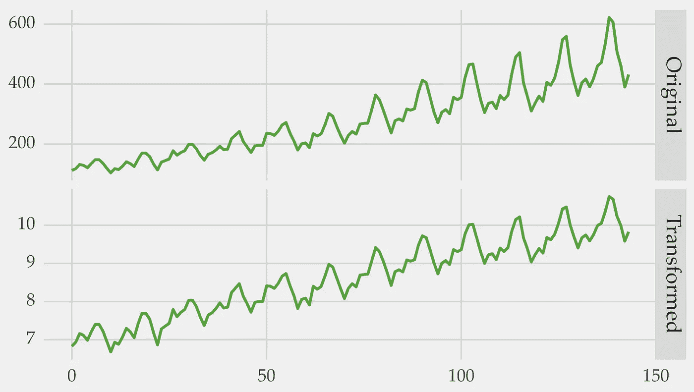
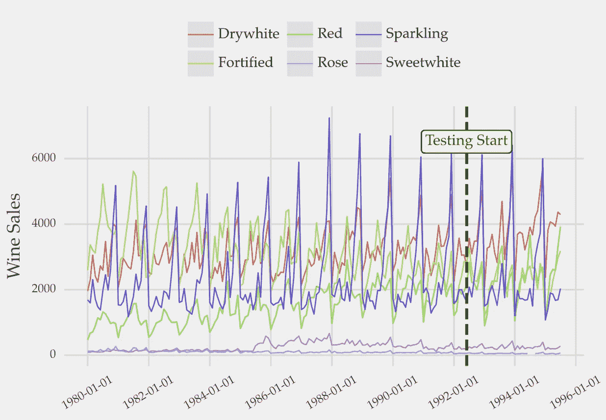

# 处理时间序列中异方差的 3 种方法

> 原文：<https://towardsdatascience.com/3-ways-to-deal-with-heteroskedasticity-in-time-series-831f6499e688>

## 如何稳定时间序列的方差，提高预测性能


塞缪尔·费拉拉在 [Unsplash](https://unsplash.com?utm_source=medium&utm_medium=referral) 上的照片

本文是对[我的上一篇文章](https://medium.com/towards-data-science/how-to-detect-heteroskedasticity-in-time-series-3413a8aa8da9)的后续。在那里，我描述了如何检测时间序列中的异方差。

我们在这里继续研究非常方差的问题。您将了解处理这种情况的三种方法。

# 非恒定方差的影响

[异方差影响预测模型的拟合](https://medium.com/towards-data-science/how-to-detect-heteroskedasticity-in-time-series-3413a8aa8da9)。

方差不恒定的时间序列通常具有长尾分布。数据是左偏或右偏的。这可能会损害某些算法的学习过程。与基于树的方法不同，诸如深度神经网络的方法受到这个问题的影响。

线性模型的估计系数仍然是无偏的。这意味着，平均而言，他们将是正确的。但是，它们不会是最精确的。

异方差也使任何假设观测值间方差不变的统计检验无效。

总而言之，如果不处理异方差，你的表现就会被搁置。

# 如何应对异方差

假设你运行了一个统计测试，证实时间序列是异方差的。

对此你能做些什么？

让我们看看三种可能的方法。

## 1.对数或幂变换

转换数据是消除异方差的最佳方法。目标是稳定方差，使分布更接近正态分布。

[日志是做到这一点的有效转换](https://medium.com/towards-data-science/how-to-detect-heteroskedasticity-in-time-series-3413a8aa8da9)。平方根或立方根是两种可能的选择。这些是 Box-Cox 变换的特殊例子。

以下是如何使用 Python 将 Box-Cox 应用于时间序列:

```
import numpy as np
from pmdarima.datasets import load_airpassengers
from scipy.stats import boxcox
from scipy.special import inv_boxcox

# loading the data
series = load_airpassengers(True)

# transforming the series
# lambda_ is the transformation parameter
series_transformed, lambda_ = boxcox(series)

# reverting to the original scale
original_series = inv_boxcox(series_transformed, lambda_)

# check if it is the same as the original data
np.allclose(original_series, series)
# True
```

Box-Cox 依赖于转换参数 lambda。但是，它是在引擎盖下由 *scipy* 自动优化的。没必要担心那个。当λ的值等于 0 时，应用 Box-Cox 变换与对数标度相同。

您可以使用函数 *inv_boxcox* 将转换后的数据恢复到其原始比例。

Box-Cox 的一个局限性是，它只为正数据定义。Yeo-Johnson 转换类似于 Box-Cox 方法，解决了这个问题。

下面是脚本中使用的示例时间序列中 Box-Cox 的影响。



图 1:原始时间序列(上图)和各自的 Box-cox 变换(下图)。方差在变换后变得稳定。图片作者。

## 2.波动标准化

波动率标准化是处理非恒定方差的另一种方法。

时间序列的波动性是数据最近的变化水平。这种可变性通常用标准差来量化。波动率标准化的思想是根据其波动率对序列进行标准化。它导致了具有相同变化水平的观察结果。

波动性标准化在具有许多时间序列的数据集中特别有用。例如，[在训练全球预测模型时](https://medium.com/towards-data-science/introduction-to-global-forecasting-models-3ca8e69a6524)。

## 例子

让我们看一个使用多元时间序列的例子。

目标是预测序列中不同变量的未来值。我们将使用一个全球预测模型来做这件事。在这篇介绍性文章中，你可以了解更多关于[全球预测模型的信息。基本思想是使用几个时间序列作为输入建立一个单一的预测模型。](https://medium.com/towards-data-science/introduction-to-global-forecasting-models-3ca8e69a6524)

此示例中的数据集是葡萄酒销售时间序列。它看起来是这样的:



图 2:葡萄酒销售多元时间序列。目标是预测超过测试开始标记的所有观察值。这些数据是公开的。查看参考文献[3]中的原始资料。图片作者。

在每个变量(葡萄酒类型)中，方差在系列中看起来是稳定的。但是，很明显，不同的变量有不同程度的可变性。波动率标准化可用于稳定每个变量的方差。

以下是在构建预测模型时如何应用波动率标准化。查看评论了解更多上下文。

```
import re
import numpy as np
import pandas as pd

# using xgboost as the regression algorithm
from xgboost import XGBRegressor
from sklearn.model_selection import train_test_split
from sklearn.metrics import mean_absolute_error as mae

# https://github.com/vcerqueira/blog/
from src.tde import time_delay_embedding

# https://github.com/vcerqueira/blog/tree/main/data
wine = pd.read_csv('data/wine_sales.csv', parse_dates=['date'])
wine.set_index('date', inplace=True)

# train test split
# using the last 20% of data as testing
train, test = train_test_split(wine, test_size=0.2, shuffle=False)

# transforming the time series for supervised learning
train_df, test_df = [], []
for col in wine:
    # using 12 lags to forecast the next value (horizon=1)
    col_train_df = time_delay_embedding(train[col], n_lags=12, horizon=1)
    col_train_df = col_train_df.rename(columns=lambda x: re.sub(col, 'Series', x))
    train_df.append(col_train_df)

    col_test_df = time_delay_embedding(test[col], n_lags=12, horizon=1)
    col_test_df = col_test_df.rename(columns=lambda x: re.sub(col, 'Series', x))
    test_df.append(col_test_df)

# different series are concatenated on rows
# to train a global forecasting model
train_df = pd.concat(train_df, axis=0)
test_df = pd.concat(test_df, axis=0)

# splitting the explanatory variables from target variables
predictor_variables = train_df.columns.str.contains('\(t\-')
target_variables = train_df.columns.str.contains('Series\(t\+')
X_train = train_df.iloc[:, predictor_variables]
Y_train = train_df.iloc[:, target_variables]
X_test = test_df.iloc[:, predictor_variables]
Y_test = test_df.iloc[:, target_variables]

# volatility standardization
# dividing by the standard deviation of past 12 lags
X_train_vs = X_train.apply(lambda x: x / x.std(), axis=0)
X_test_vs = X_test.apply(lambda x: x / x.std(), axis=0)

# testing three methods
## no normalization/preprocessing
mod_raw = XGBRegressor()
## volatility standardization
mod_vs = XGBRegressor()
## log transformation
mod_log = XGBRegressor()

# fitting on raw data
mod_raw.fit(X_train, Y_train)
# fitting with log-scaled data
mod_log.fit(np.log(X_train), np.log(Y_train))
# fitting with vol. std. data
mod_vs.fit(X_train_vs, Y_train)

# making predictions
preds_raw = mod_raw.predict(X_test)
preds_log = np.exp(mod_log.predict(np.log(X_test)))
preds_vs = mod_vs.predict(X_test_vs)

print(mae(Y_test, preds_raw))
# 301.73
print(mae(Y_test, preds_vs))
# 294.74
print(mae(Y_test, preds_log))
# 308.41
```

用波动率标准化对数据进行预处理可以提高预测性能。相对于这个问题中的对数变换，波动率标准化也更好。

## 3.加权回归

另一种处理异方差的方法是选择合适的方法。例如，不假设观测值之间的方差相等。

您还可以根据观察值的可变性为其分配权重。默认情况下，学习算法对数据集中的所有观察值给予相同的权重。然而，可变性更高的病例具有更少的信息。你可以通过减轻它们的重量来降低它们对方法的重要性。

这些权重是根据拟合值的方差计算的。方差越大，权重越小。[这里有一个来自 *statsmodels* Python 库](https://www.statsmodels.org/dev/examples/notebooks/generated/wls.html)的例子。

*scikit-learn* 中的几个算法都有一个 *sample_weight* 参数，可以用来设置权重。

# 方差建模


Nikola Knezevic 在 [Unsplash](https://unsplash.com?utm_source=medium&utm_medium=referral) 上拍摄的照片

您可以模拟方差的变化，而不是稳定它。

这可以通过 ARCH(自回归条件异方差)等模型来实现。这种类型的模型用于根据时间序列的过去值预测方差。

GARCH(广义自回归条件异方差)扩展了 ARCH。除了使用序列的过去值，它还使用过去的方差。

[*arch*](https://pypi.org/project/arch/) 库为这些方法提供了 Python 实现。

# 外卖

在本文中，您学习了如何处理时间序列中的异方差。我们讨论了三种方法:

1.  对数或幂变换；
2.  波动率标准化；
3.  加权回归。

我个人的偏好是转换数据。当我处理一个单一的时间序列时，我会选择选项 1。对于几个时间序列，我倾向于使用选项 2。但是，你可以使用交叉验证来优化[。](https://medium.com/towards-data-science/4-things-to-do-when-applying-cross-validation-with-time-series-c6a5674ebf3a)

您可以使用 ARCH/GARCH 方法直接对方差建模。

谢谢你的阅读，下一个故事再见！

## 进一步阅读

[1] [关于电力变换](https://otexts.com/fpp2/transformations.html)，预测原理与实践

[2] [关于加权回归](https://www.itl.nist.gov/div898/handbook/pmd/section1/pmd143.htm)，工程统计手册

[3]罗布·海德曼和杨卓然(2018)。时间序列数据库。v 0 . 1 . 0 .[https://pkg.yangzhuoranyang.com/tsdl/](https://pkg.yangzhuoranyang.com/tsdl/)(GPL-3)