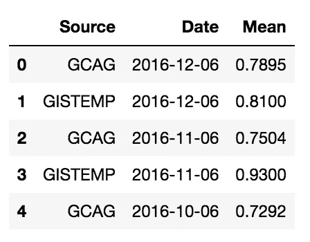
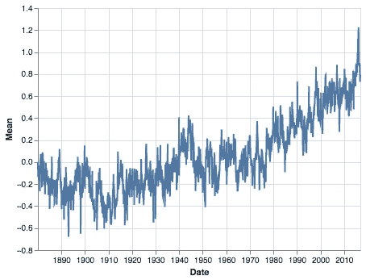
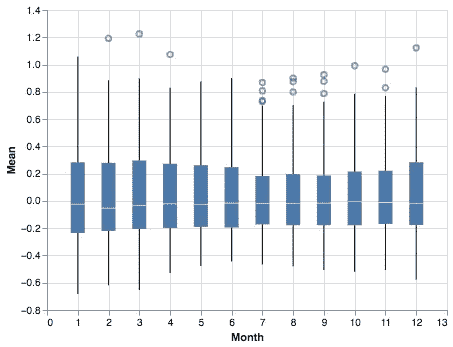
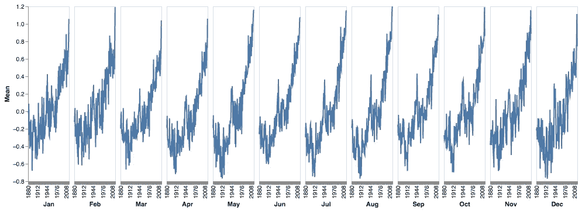
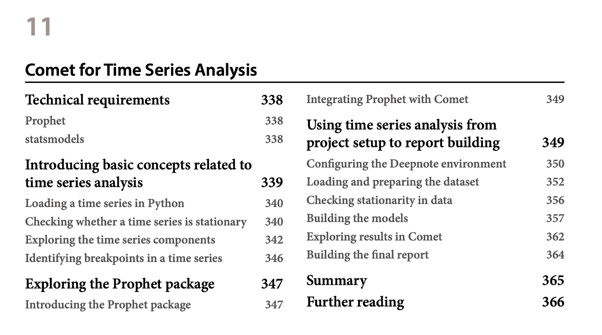

# 3 种你可能不知道的时间序列可视化方法

> 原文：<https://towardsdatascience.com/3-ways-to-visualize-time-series-you-may-not-know-c8572952ea9c>

## 数据可视化，时间序列

## 关于如何在 Python 和 Altair 中可视化时间序列的现成教程


Anton Maksimov 5642.su 在 [Unsplash](https://unsplash.com?utm_source=medium&utm_medium=referral) 上的照片

时间序列是一系列数据点，通常以离散的时间间隔测量。我们可以使用各种方法来表示时间序列数据，包括折线图、条形图和散点图。在 Python 中，我们可以使用 matplotlib、seaborn 和 Altair 等库来创建时间序列图。

有几种方法可以显示时间序列数据，如折线图和条形图。折线图是最常见的时间序列图，用于显示一段时间内的趋势。条形图用于显示不同时间段之间的比较。在本文中，我们将描述三种可视化时间序列的替代方法:

*   日历热图
*   箱形图
*   循环图

为了演示这三种类型的图，我们将使用 Python 和 Altair 实现一个实际的例子，但是我们可以将这种方法推广到其他库。

# 数据集加载

作为一个例子，我们使用在[开放数据共享](https://opendatacommons.org/)许可下发布的[全球温度时间序列](https://datahub.io/core/global-temp)。

首先，我们加载数据集作为熊猫数据帧

```
import pandas as pd

df = pd.read_csv( '../Datasets/monthly_temperature.csv' , parse_dates=[ 'Date' ]) 
df.head()
```



作者图片

接下来，我们关注 GCAG 源，因此我们应用一些过滤器:

```
df = df[df[ 'Source' ] == 'GCAG' ] 
df.drop(labels=[ 'Source' ], axis= 1 , inplace= True )
```

我们画一条简单的线来显示经典趋势线。

```
import altair come alt 

alt.Chart(df).mark_line().encode( 
    x= 'Data' , 
    y= 'Media'
 )
```



作者图片

# 日历热图

日历热图是一种可视化时间序列的好方法。它显示了值随时间的分布，并使查看模式和异常值变得更加容易。让我们构建一个日历热图，在 x 轴上显示年份，在 y 轴上显示月份。

首先，我们从日期中提取月份和年份。

```
df[ 'Mese' ] = pd.to_datetime(df[ 'Data' ]).dt.month 
df[ 'Anno' ] = pd.to_datetime(df[ 'Data' ]).dt.year
```

然后，我们建立图表。

```
alt.Chart(df).mark_rect().encode( 
    x= 'Anno:O' , 
    y= 'Mese:O' , 
    color=alt.Color( 'Mean:Q' , scale=alt.Scale( range =['blue','green', 'yellow','orange','red'])) 
).properties(width= 800 )
```


作者图片

日历热图对于显示几个月和几年的重复模式非常有用。在我们的方案中，我们只看到温度逐年上升。

# 箱线图

箱线图是一种显示数据集分布的图形。这是可视化时间序列的好方法，因为它显示了值随时间的分布。创建箱线图时，确保轴的比例正确。否则剧情会有误导。例如，如果 y 轴没有正确缩放，看起来会有比实际更多的异常值。

一旦我们创建了箱线图，我们就可以用它来识别数据中的模式。例如，我们注意到数据中有很多变化，或者在一天中的某些时候，这些值往往会高于或低于其他值。

在 Altair 中编写以下代码来构建一个 boxplot:

```
alt.Chart(df).mark_boxplot().encode(
    x='Month',
    y='Mean'
)
```



作者图片

# 循环图

周期图是一种图形工具，用于可视化时间序列数据的周期性质。这种类型的图对于识别数据的季节性特别有用。循环图的 x 轴被分成相等的间隔，每个间隔代表一个完整的数据循环。y 轴显示周期中每个点的数据量。

周期图可用于识别数据中的周期性趋势，如每月或每年的周期。它们还可用于识别一次性事件，如不定期出现的数据峰值。

要在 Altair 中构建循环图，我们必须连接 12 个不同的图，每个月一个。

```
months = ['Jan', 'Feb', 'Mar', 'Apr', 'May','Jun', 'Jul', 'Aug', 'Sep', 'Oct', 'Nov', 'Dec',]

charts =alt.hconcat(spacing=0)
for i in range(1,13):
    if i == 1:
        axis = alt.Axis(grid=False)
    else:
        axis = None
    chart = alt.Chart(df).mark_line().encode(
        x=alt.X('Year:O', title=months[i-1]),
        y=alt.Y('Mean', axis=axis)
    ).transform_filter(
        alt.FieldEqualPredicate(field='Month', equal=i)
    ).properties(
        width=70,
        height=300
    )
    charts |= chart
```



作者图片

# 摘要

恭喜你！您刚刚学习了三种可视化时间序列的新方法！有许多方法可以可视化时间序列数据，在本文中，我们探讨了三种您可能不熟悉的方法。日历热图、箱线图和周期图都可以为您的数据提供有价值的见解。

所以下次你查看时间序列时，不要忘记尝试这些不同的可视化技术——你可能会发现一些关于你的数据的新东西。

在这里下载这篇文章中描述的例子的代码来玩你的数据集。

# 你可能也会对…感兴趣。

*   [**了解萨里玛模型的季节顺序**](/understanding-the-seasonal-order-of-the-sarima-model-ebef613e40fa) —了解 Python `statsmodels`库的萨里玛模型的(D，P，Q，M)季节顺序的快速概述和现成代码。
*   [**4 种不同的时序分析方法**](/4-different-approaches-for-time-series-analysis-7e2364fadcb9)——一个现成的 Python 代码，包括不同的时序分析策略和库

# 你想了解更多关于时间序列的知识吗？

阅读 Packt 有限公司出版的《用于数据科学的彗星》一书的第 11 章。



作者图片