# 30 个非常有用的熊猫函数，用于日常数据分析任务

> 原文：<https://towardsdatascience.com/30-very-useful-pandas-functions-for-everyday-data-analysis-tasks-f1eae16409af>


卢卡斯·森奇尼在 [Unsplash](https://unsplash.com?utm_source=medium&utm_medium=referral) 上的照片

# 30 个非常有用的熊猫函数，用于日常数据分析任务

## 熊猫小型张

Python 的 Pandas 库是 Python 中使用最广泛的库。因为这是数据分析或机器学习的每个方面都需要的数据操作库。即使你正在进行数据可视化或机器学习，一些数据操作仍然会存在。在本文中，我将列出日常使用所必需的 Pandas 函数，这些函数可能足以执行常规的数据操作任务。

在本文中，我将使用来自 Kaggle 的公共数据集 FIFA dataset。

*这里提到的用户许可是*<https://www.kaggle.com/stefanoleone992/fifa-21-complete-player-dataset/metadata>**。**

*请随意从这里下载数据集:*

*<https://github.com/rashida048/Datasets/blob/master/fifa.csv>  

好戏开始了！

我正在导入必要的包和数据集:

```
import numpy as np
import pandas as pd
pd.set_option('display.max_columns', 100)
```

让我们开始讨论功能:

## 1.pd.read_csv，pd.read_excel

首先要提到的函数是 read_csv 或者 read_excel。到目前为止，我在每个项目中至少使用了其中一个函数。这些函数已经不言自明了。它们用于将 CSV 或 excel 文件读取为 pandas DataFrame 格式。这里我使用 read_csv 函数来读取 FIFA 数据集:

```
df = pd.read_csv("fifa.csv")
```

我有一个关于 read_csv 函数的详细视频。它有几个很好的参数，可以帮助您在读取数据集时稍微清理一下数据集。我这里有一篇详细的文章:

</import-csv-files-as-pandas-dataframe-with-skiprows-skipfooter-usecols-index-col-and-header-fbf67a2f92a>  

答。txt 文件也可以使用。read_csv()函数使用以下语法:

```
data = pd.read_csv(file.txt, sep=" ")
```

> 如果您有一个 excel 文件而不是 csv 文件，您将使用 pd.read_excel。

也是常用的。head()函数在 read_csv 或 read_excel 后查看数据帧。默认情况下，它显示数据帧的前 5 行。在这里，我展示了上面数据帧 df 的前五行:

```
df.head()
```

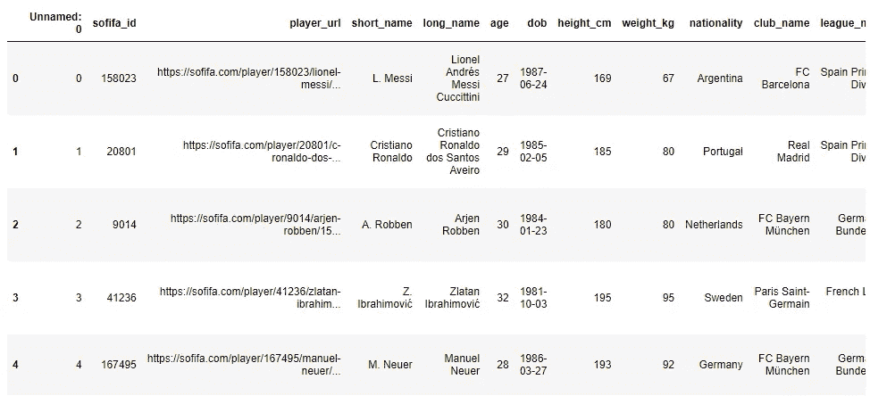

作者图片

如果您想要特定的行数而不是 5 行，您可以指定。如果我想要 7 行，我会在。head()函数作为参数。

```
df.head(7)
```

## 2.df.columns

当你有这么大的数据集时，很难看到所有的列。使用。columns 函数，可以打印出数据集的所有列:

```
df.columns
```

输出:

```
Index(['Unnamed: 0', 'sofifa_id', 'player_url', 'short_name', 'long_name', 'age', 'dob', 'height_cm', 'weight_kg', 'nationality', 'club_name', 'league_name', 'league_rank', 'overall', 'potential', 'value_eur', 'wage_eur', 'player_positions', 'preferred_foot', 'international_reputation', 'weak_foot', 'skill_moves', 'work_rate', 'body_type', 'real_face', 'release_clause_eur', 'player_tags', 'team_position', 'team_jersey_number', 'loaned_from', 'joined', 'contract_valid_until', 'nation_position', 'nation_jersey_number', 'pace', 'shooting', 'passing', 'dribbling', 'defending', 'physic', 'gk_diving', 'gk_handling', 'gk_kicking', 'gk_reflexes', 'gk_speed', 'gk_positioning', 'player_traits', 'attacking_crossing', 'attacking_finishing', 'attacking_heading_accuracy', 'attacking_short_passing', 'attacking_volleys', 'skill_dribbling', 'skill_curve', 'skill_fk_accuracy', 'skill_long_passing', 'skill_ball_control', 'movement_acceleration', 'movement_sprint_speed', 'movement_agility', 'movement_reactions', 'movement_balance', 'power_shot_power', 'power_jumping', 'power_stamina', 'power_strength', 'power_long_shots', 'mentality_aggression', 'mentality_interceptions', 'mentality_positioning', 'mentality_vision', 'mentality_penalties',
'mentality_composure', 'defending_marking', 'defending_standing_tackle', 'defending_sliding_tackle', 'goalkeeping_diving', 'goalkeeping_handling', 'goalkeeping_kicking', 'goalkeeping_positioning', 'goalkeeping_reflexes'], dtype='object')
```

## 3.df.drop()

您可以使用 df.drop()删除一些不必要的列。在这个数据集中，我们有如此多的列，我们不打算在本教程中使用它们。所以，我们可以很容易地放弃一些:

```
df = df.drop(columns=['Unnamed: 0', 'weak_foot', 'real_face'])
```

我只是掉了这三列:‘未命名:0’，‘弱 _ 足’，‘真 _ 脸’。

## 4.。len()

为提供数据帧的长度。让我们看一个例子:

```
len(df)
```

输出:

```
16155
```

这个数据帧有 16155 行数据。

## [5。df.query()](https://pandas.pydata.org/docs/reference/api/pandas.DataFrame.query.html)

您可以使用布尔表达式进行过滤或查询。在这个例子中，我将使用“射门”和“传球”列。在这里，我检查哪些行“射门”大于“传球”。

```
df.query("shooting > passing")
```

这将只返回投篮大于传球的行。

## 6.df.iloc()

该函数将行和列索引作为参数，并相应地给出数据帧的子集。这里我取前 10 行数据，索引第 5 到第 10 列:

```
df.iloc[:10, 5:10]
```

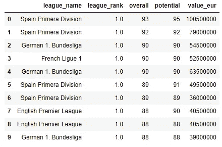

作者图片

## 7.df.loc()

这个函数的操作与。iloc()函数。但是在这里，我们可以准确地指定我们想要的行索引，以及我们希望在子集中包含的列的名称。这里有一个例子:

```
df.loc[[3, 10, 14, 23], ['nationality', 'weight_kg', "height_cm"]]
```

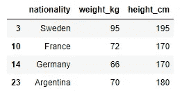

作者图片

查看行索引。我们只有第 3、10、14 和 23 排。另一方面，对于列，我们只有指定的列。

## 8.df['']。数据类型

另一个非常基本和广泛使用的功能。因为在我们深入分析、可视化或预测建模之前，有必要知道变量的数据类型。我正在使用获取“height_cm”列的数据类型。此处的 dtypes 函数:

```
df.height_cm.dtypes
```

输出:

```
dtype('int64')
```

您可以选择使用以下语法获取每一列的数据类型:

```
df.dtypes
```

输出:

```
height_cm                     int64
weight_kg                     int64
nationality                  object
random_col                    int32
club_name                    object
league_name                  object
league_rank                 float64
overall                       int64
potential                     int64
value_eur                     int64
wage_eur                      int64
player_positions             object
preferred_foot               object
international_reputation      int64
skill_moves                   int64
work_rate                    object
body_type                    object
team_position                object
team_jersey_number          float64
nation_position              object
nation_jersey_number        float64
pace                        float64
shooting                    float64
passing                     float64
dribbling                   float64
defending                   float64
physic                      float64
cumsum_2                      int64
rank_calc                   float64
dtype: object
```

## 9.df.select_dtypes()

您可以使用此函数选择特定数据类型的变量或列。例如，我只想选择数据类型为“int64”的列。下面是如何做到这一点:

```
df.select_dtypes(include='int64')
```

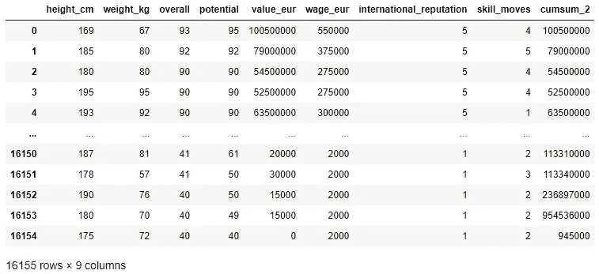

作者图片

我们得到了所有数据类型为“int64”的列。如果我们在' select_dtypes '函数中使用' exclude '而不是' include ',我们将得到不具有数据类型' int64 '的列:

```
df.select_dtypes(exclude='int64')
```

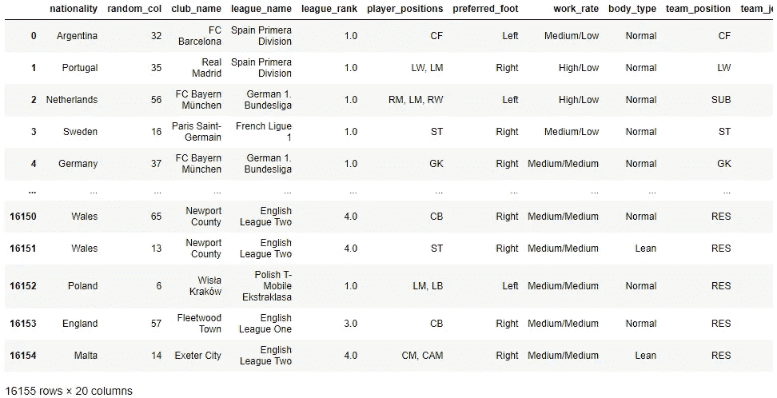

作者图片

这是输出的一部分。看，变量不是整数。你可能认为‘random _ col’列是整数。但是如果你检查它的数据类型，你会发现它看起来是整数，但是它的数据类型是不同的。请随意检查。

## [10。df.insert()](https://pandas.pydata.org/docs/reference/api/pandas.DataFrame.insert.html)

顾名思义，该函数在指定位置插入一列。为了说明这一点，我将首先创建一个长度与数据帧相同的随机数数组:

```
random_col = np.random.randint(100, size=len(df))
```

我将把这个数组作为一列插入数据帧 df 的第 3 列。记住，列索引从零开始。

```
df.insert(3, 'random_col', random_col)
```

这是数据帧的一部分:

```
df.head()
```

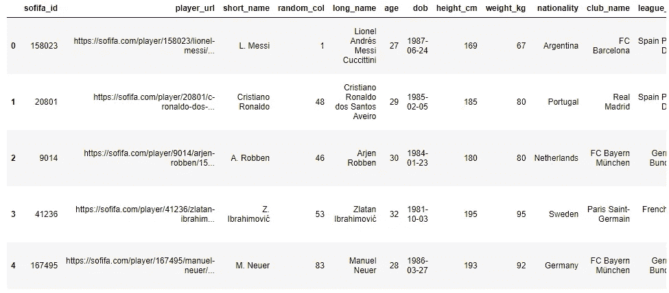

作者图片

看，列“random_col”被插入到第三个位置。

## [11。df['']。累计值()](https://pandas.pydata.org/pandas-docs/stable/reference/api/pandas.DataFrame.cumsum.html)

它为你提供了累计的总和。我举个例子解释一下。在本例中，我将使用“value_eur”和“wage_eur”列。代码如下:

```
df[['value_eur', 'wage_eur']].cumsum()
```

输出:

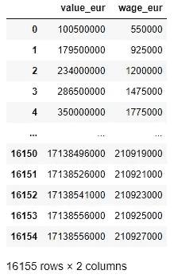

作者图片

正如您在每一行中看到的，它为您提供了前面各行中所有值的累积和。

## 12.df.sample()

当数据集太大时，您可以从中选取一个有代表性的样本来执行分析和预测建模。那可能会节省你一些时间。此外，过多的数据有时可能会破坏可视化。我们可以用这个函数得到一定数量的数据点或者某个分数或者数据点。在这里，我从国际足联的数据集中抽取了 200 个数据点。它随机抽取样本。

```
df.sample(n = 200)
```

我在这里取了国际足联数据集的 25%:

```
df.sample(frac = 0.25)
```

## 13.df['']。哪里()

此函数帮助您基于布尔条件查询数据集。举个例子，我们之前做的 random_col 的取值范围是从 0 到 100。下面是我们如何制作一个系列，看看它们中哪些大于 50。

```
df['random_col'].where(df['random_col'] > 50)
```

输出:

```
0         NaN
1         NaN
2        56.0
3         NaN
4         NaN
         ... 
16150    65.0
16151     NaN
16152     NaN
16153    57.0
16154     NaN
Name: random_col, Length: 16155, dtype: float64
```

如果值不满足条件，即值不大于 50，则返回 NaN。我们可以使用以下语法将 NaN 替换为 0 或任何其他值:

```
df['random_col'].where(df['random_col'] > 50, 0)
```

输出:

```
0         0
1         0
2        56
3         0
4         0
         ..
16150    65
16151     0
16152     0
16153    57
16154     0
Name: random_col, Length: 16155, dtype: int32
```

## 14.df['']。唯一()

这在我们有分类变量的地方非常有用。它用于找出分类列的唯一值。让我们看看 FIFA 数据集中“skill_moves”列的唯一值是什么:

```
df.skill_moves.unique()
```

输出:

```
array([4, 5, 1, 3, 2], dtype=int64)
```

因此，在 skill_moves 列中有五个唯一值。如果我们打印出数据集的头部来检查列的值，您可能看不到其中所有的唯一值。所以，要知道所有的唯一值。unique()函数非常方便。

## 15.df['']。努尼克

另一个受欢迎的功能。这个函数让你知道一列中有多少个唯一值。例如，如果您想查看这个数据集中有多少不同的国籍，您可以使用下面这行简单的代码

```
df.nationality.nunique()
```

输出:

```
149
```

最棒的是，这个函数还可以用于总数据集，以了解每列中唯一值的数量:

```
df.nunique()
```

输出:

```
height_cm                      48
weight_kg                      54
nationality                   149
random_col                    100
club_name                     577
league_name                    37
league_rank                     4
overall                        53
potential                      49
value_eur                     161
wage_eur                       41
player_positions              907
preferred_foot                  2
international_reputation        5
skill_moves                     5
work_rate                       9
body_type                       3
team_position                  29
team_jersey_number             99
nation_position                28
nation_jersey_number           26
pace                           74
shooting                       70
passing                        67
dribbling                      67
defending                      69
physic                         63
cumsum_2                    14859
rank_calc                     161
dtype: int64
```

这里我们有每列中唯一值的数量。

## 16.df['']。排名()

该函数为您提供基于某一列的排名。在 FIFA 数据集中，如果我们想根据“value_eur”列对球员进行排名，下面是其语法:

```
df['rank_calc'] = df["value_eur"].rank()
```

使用上面的代码行，我创建了一个名为“rank_calc”的新列。这个新的栏目会根据“价值欧元”给你每个玩家的排名。默认情况下，该列将被添加到末尾。请自行运行该行代码进行检查。

## 17.。isin()

我将制作一个数据集的子集，其中只包含一些使用。isin()函数。

```
nationality = ["Argentina", "Portugal", "Sweden", "England"]
df[df.nationality.isin(nationality)]
```

如果您运行这段代码，您会看到我们得到的数据集只包含上面列表中提到的几个国家。你可以在这里看到数据集的一部分:

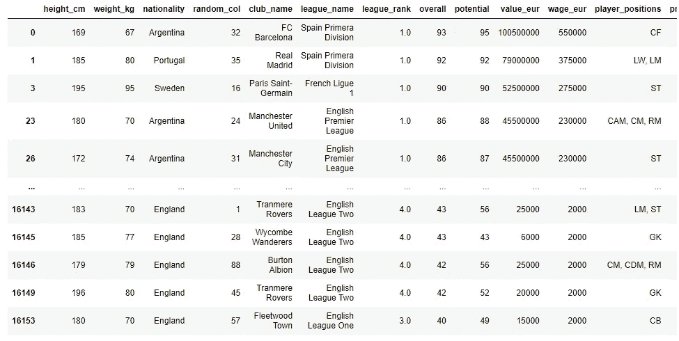

作者图片

## 18.df.replace()

它确实像它听起来那样。它替换列的值。当我们只需要替换一个列的唯一值时，我们只需要传递旧值和新值。想象一下，我们刚刚发现‘league _ rank’1.0 现在需要换成 1.1。下面是如何做到这一点:

```
df.replace(1.0, 1.1)
```

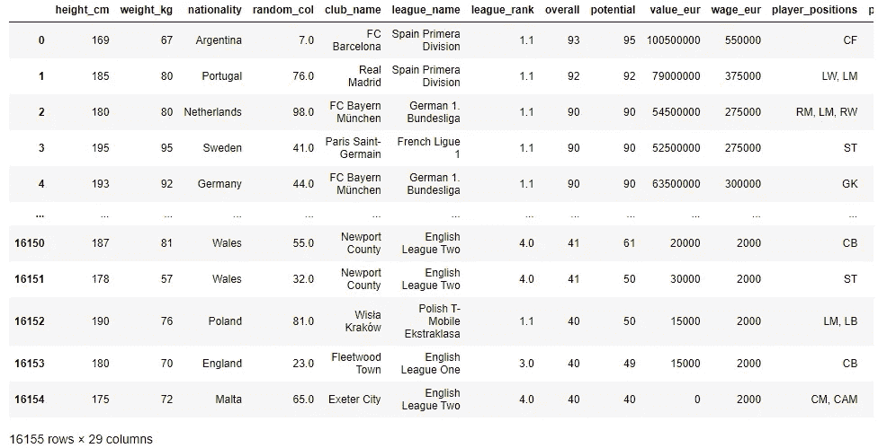

作者图片

再看现在数据集中的 league_rank 列，1.0 换成了 1.1。如果我们需要更改多个值，我们可以向 replace 函数传递一个字典，其中键应该是原始值，值应该是替换值。

```
df.replace({1.0: 1.1,  4.0: 4.1, 3.0: 3.1})
```


作者图片

## 19.df.rename()

它用于重命名列。在这里，我将“体重 _ 千克”和“身高 _ 厘米”列更改为“体重(千克)”和“身高(厘米)”:

```
df.rename(columns = {"weight_kg": "Weight (kg)", "height_cm": "Height (cm)"})
```

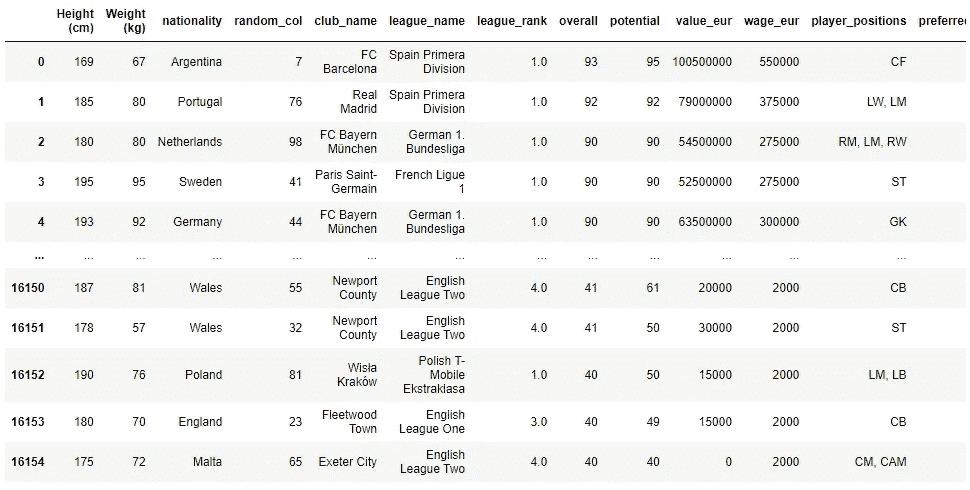

作者图片

非常简单有用！

## 20.。菲尔娜

现实生活中无论什么时候你会收到一个大的数据集，大多数情况下都会有一些空值。很难得到一个完美的数据集。因此，如果您是数据分析师或数据科学家，填充空值是您日常任务的一部分。这个功能。fillna()用您选择的其他值替换空值。以下是国际足联数据集末尾的一些栏目:

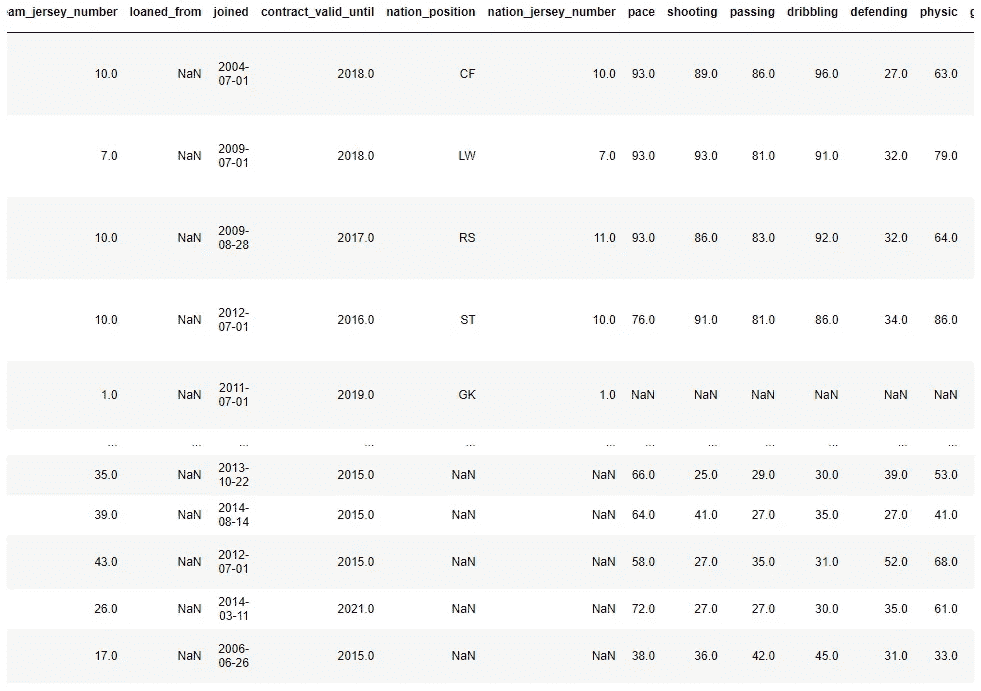

作者图片

你看，投篮，传球，防守，还有其他一些栏目都有空值。在开始进行任何预测建模和其他数据科学任务之前，我们确实需要用一些兼容数据类型的值来替换这些空值。否则，我们可能会出错。例如，在“步速”列中，值应该是数字，但在这里和那里您会看到 NaN 值。最普通但不太有效的方法是用零替换那些 NaN 值。以下是用零更改“pace”列的所有 NaN 值的方法:

```
df['pace'].fillna(0, inplace=True)
```

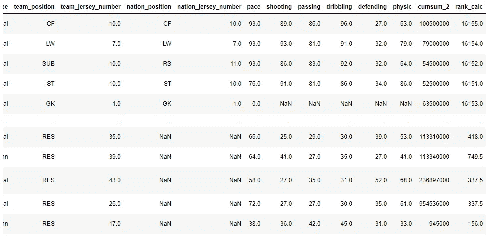

作者图片

如果你注意到，在速度栏中的 NaN 现在是零。在总起搏栏中，如果有更多的 NaN 值，也应将其替换为零。

正如我之前提到的，用零替换可能不是最有效的方法。您可以用自己选择的其他值来替换它。用平均值或中值替换值也很常见。如果我们想用空间平均值列替换 pace 列的 NaN 值，我们应该使用下面这行代码:

```
df['pace'].fillna(df['pace'].mean(), inplace = True)
```

## 21.df.groupby()

这是最流行的数据汇总功能。您可以按照某个变量对数据进行分组，并找出关于这些组的有用信息。例如，我在这里按国籍对数据进行分组，并计算每个国籍的总“价值欧元”:

```
df.groupby("nationality")['value_eur'].sum()
```

输出:

```
nationality
Albania                25860000
Algeria                70560000
Angola                  6070000
Antigua & Barbuda       1450000
Argentina            1281372000
                        ...    
Uzbekistan              7495000
Venezuela              41495000
Wales                 113340000
Zambia                  4375000
Zimbabwe                6000000
Name: value_eur, Length: 149, dtype: int64
```

阿尔巴尼亚所有球员的总价值为 25860000 欧元。

也可以通过几个变量进行分组，并使用几个集合函数。我们将看到每个国籍和每个联赛级别的平均值欧元、中值欧元、平均工资欧元和中值工资欧元。

```
df.groupby(['nationality', 'league_rank'])['value_eur', 'wage_eur'].agg([np.mean, np.median])
```

输出:

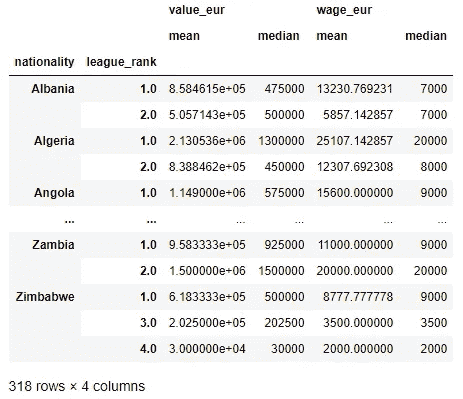

作者图片

使用“分组依据”功能，您可以做更多的事情。我这里有一篇详细的文章:

</efficient-data-summarizing-and-analysis-using-pandas-groupby-function-7b2cc9eff186>  

## 22.。pct_change()

你可以从变量的前一个值得到百分比变化。在本演示中，我将使用 value_eur 列，并获取每行数据相对于之前的百分比变化。第一行将是 NaN，因为之前没有要比较的值。

```
df.value_eur.pct_change()
```

输出

```
0             NaN
1       -0.213930
2       -0.310127
3       -0.036697
4        0.209524
           ...   
16150    0.000000
16151    0.500000
16152   -0.500000
16153    0.000000
16154   -1.000000
Name: value_eur, Length: 16155, dtype: float64
```

在这个数据集中，你可能觉得这并不重要。

> 但是想想一些财务数据。特别是当你每天都有股票市值的时候。看到每天价值的百分比变化该有多好。

## 23.df.count()

它提供数据帧中指定方向的数据数量。当方向为 0 时，它提供列中的数据数:

```
df.count(0)
```

输出:

```
Unnamed: 0                 16155
sofifa_id                  16155
player_url                 16155
short_name                 16155
long_name                  16155
                           ...  
goalkeeping_diving         16155
goalkeeping_handling       16155
goalkeeping_kicking        16155
goalkeeping_positioning    16155
goalkeeping_reflexes       16155
Length: 81, dtype: int64
```

您可以看到每列中的数据数量。

当方向为 1 时，它提供行中的数据数量:

```
df.count(1)
```

输出:

```
0        72
1        72
2        72
3        72
4        71
         ..
16150    68
16151    68
16152    68
16153    68
16154    69
Length: 16155, dtype: int64
```

正如您所看到的，每一行都有不同数量的数据。如果仔细观察数据集，您会发现它在几列中有许多空值。

## 24.df['']。值计数()

我们可以使用这个函数获得每个类别的值计数。在这里，我得到了每个等级中有多少个值。

```
df['league_rank'].value_counts()
```

输出:

```
1.0    11738
2.0     2936
3.0      639
4.0      603
Name: league_rank, dtype: int64
```

它返回默认排序的结果。如果希望结果以升序排列，只需设置 ascending=True:

```
df['league_rank'].value_counts(ascending=True)
```

输出:

```
4.0      603
3.0      639
2.0     2936
1.0    11738
Name: league_rank, dtype: int64
```

## 25.pd.crosstab()

它给出了一个频率表，是两个变量的交叉列表。我在这里做一个联赛排名和国际声誉的交叉列表:

```
pd.crosstab(df['league_rank'], df['international_reputation'])
```


作者图片

所以，我们得到了联赛排名和国际声誉的所有组合的数量。我们可以看到，大多数球员的国际声誉和联赛排名都是 1。

它可以进一步改进。我们可以在两个方向上添加边距，这将是总和，如果需要，我们还可以获得归一化值:

```
pd.crosstab(df['league_rank'], df['international_reputation'], 
            margins = True,
            margins_name="Total",
            normalize = True)
```


作者图片

下面是关于 count、value_counts 和 crosstab 方法的详细教程:

</three-very-useful-functions-of-pandas-to-summarize-the-data-491b64db9370> [## 熊猫总结数据的三个非常有用的功能

towardsdatascience.com](/three-very-useful-functions-of-pandas-to-summarize-the-data-491b64db9370) 

## 26.pd.qcut()

该函数根据数据的分布对数据进行分类或分段。所以，我们得到了每个玩家的范围。在这里，我将把 value_eur 分成 5 个部分，并得出哪个玩家属于哪个部分:

```
pd.qcut(df['value_eur'], q = 5)
```

输出:

```
0        (1100000.0, 100500000.0]
1        (1100000.0, 100500000.0]
2        (1100000.0, 100500000.0]
3        (1100000.0, 100500000.0]
4        (1100000.0, 100500000.0]
                   ...           
16150          (-0.001, 100000.0]
16151          (-0.001, 100000.0]
16152          (-0.001, 100000.0]
16153          (-0.001, 100000.0]
16154          (-0.001, 100000.0]
Name: value_eur, Length: 16155, dtype: category
Categories (5, interval[float64]): [(-0.001, 100000.0] < (100000.0, 230000.0] < (230000.0, 500000.0] < (500000.0, 1100000.0] < (1100000.0, 100500000.0]]
```

您可以使用上面代码行中的 value_counts 来查看玩家属于哪个范围:

```
pd.qcut(df['value_eur'], q = 5).value_counts()
```

输出:

```
(-0.001, 100000.0]          3462
(230000.0, 500000.0]        3305
(100000.0, 230000.0]        3184
(500000.0, 1100000.0]       3154
(1100000.0, 100500000.0]    3050
Name: value_eur, dtype: int64
```

如你所见，数字非常接近。默认情况下，qcut 试图平均分配它们。但在现实生活中，它并不想总是平等的。因为大部分时间分布并不均匀。

## 27.pd.cut()

宁滨的另一种方法。如果我们想使用 cut 创建 5 个箱，它会将整个 value_eur 范围分成相等的五个部分，每个箱中的人口也会相应地增加。

```
pd.cut(df['value_eur'], bins = 5).value_counts()
```

输出:

```
(-100500.0, 20100000.0]      16102 
(20100000.0, 40200000.0]        40 
(40200000.0, 60300000.0]        10 
(60300000.0, 80400000.0]         2 
(80400000.0, 100500000.0]        1 
Name: value_eur, dtype: int64
```

每个范围内的间隔是相等的。但是每个群体中的人口是非常不同的。

我有一篇关于使用 cut 和 qcut 方法的数据宁滨的详细文章。请随意看一看:

</sort-and-segment-your-data-into-bins-to-get-sorted-ranges-pandas-cut-and-qcut-7785931bbfde>  

## 28.df['']。描述()

这是一个伟大的功能，提供了一些基本的统计措施。在这里，我对 wage_eur 列使用了 describe 函数:

```
df['wage_eur'].describe()
```

输出:

```
count     16155.000000
mean      13056.453110
std       23488.182571
min           0.000000
25%        2000.000000
50%        5000.000000
75%       10000.000000
max      550000.000000
Name: wage_eur, dtype: float64
```

如输出所示，我们有八个不同的度量。每一个都非常重要。

## 29.最大和最小

这将为您提供具有指定变量的 n 个最大值或最小值的数据集。例如，我想获得工资最高的 5 行:

```
df.nlargest(5, "wage_eur")
```

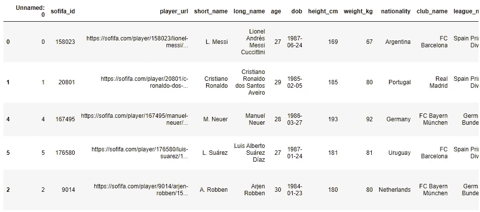

作者图片

同样，我可以用 5 个最小的 wage_eur 数据创建数据集的子集:

```
df.nsmallest(5, "wage_eur")
```

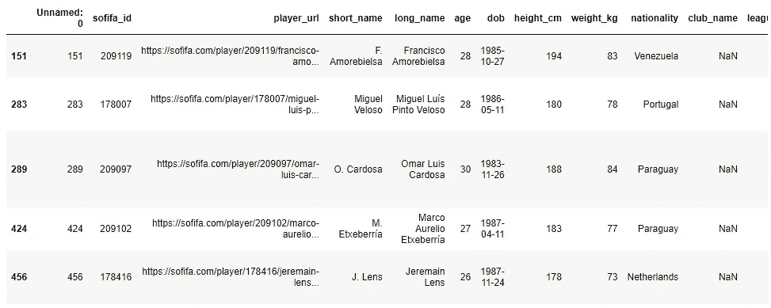

作者图片

## 30.df.explode()

当您在某些行中有一个数据列表时，分解会很有用。当一些列中有整数，一些列中有列表时，很难分析、可视化或执行一些预测建模。Explode 有助于分解这些列表。例如，看这个数据帧:

```
df1 = pd.DataFrame({"city": ['A', 'B', 'C'],
                   "day1": [22, 25, 21],
                   'day2':[31, 12, 67],
                   'day3': [27, 20, 15],
                   'day4': [34, 37, [41, 45, 67, 90, 21]],
                   'day5': [23, 54, 36]})
df1
```

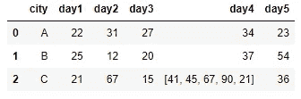

作者图片

让我们展开 d4 列:

```
df1.explode(jupyter notebook
'day4').reset_index(drop=True)
```

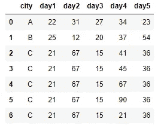

作者图片

## 结论

Python 的熊猫库好大。功能那么多。我选择一些日常生活中的重要功能。如果您非常了解这些，您将能够成功地执行大多数分析任务。熊猫还有一个非常有用的功能，我在这里没有提到。plot()函数。你只能用熊猫来绘图。熊猫在后端使用 Matplotlib，为你返回剧情。我这里有一个详细的教程:

</an-ultimate-cheat-sheet-for-data-visualization-in-pandas-f7bc239c9937>  

希望这篇文章是有帮助的。

请随时在 [Twitter](https://twitter.com/rashida048) 、[脸书页面](https://www.facebook.com/Regenerative-149425692134498)上关注我，并查看我的新 [YouTube。频道](https://www.youtube.com/channel/UCzJgOvsJJPCXWytXWuVSeXw)。

## 更多阅读

</exploratory-data-analysis-with-some-cool-visualizations-in-pythons-matplotlib-and-seaborn-library-99dde20d98bf>  </a-complete-anomaly-detection-algorithm-from-scratch-in-python-step-by-step-guide-4c115e65d54e>  </all-the-datasets-you-need-to-practice-data-science-skills-and-make-a-great-portfolio-74f2eb53b38a>  <https://pub.towardsai.net/a-complete-guide-to-confidence-interval-t-test-and-z-test-in-r-for-data-scientists-cd16dd2d0eec> *