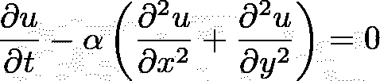
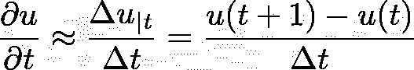
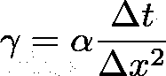
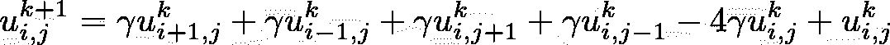
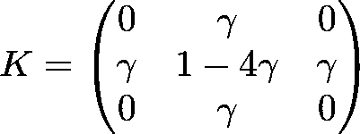
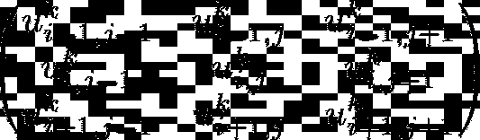
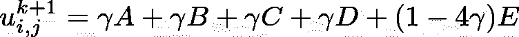
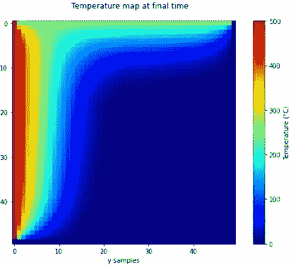
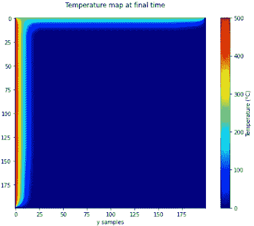

# 使用 NumPy 将有限差分法的分辨率提高 300 倍

> 原文：<https://towardsdatascience.com/300-times-faster-resolution-of-finite-difference-method-using-numpy-de28cdade4e1>

## 有限差分法是解决复杂问题的强大技术，NumPy 使其

**

*左边界为 500°C，上边界为 250°C 的温度图(图片由作者提供)*

**你可以在最后找到所有的代码。所有方程图像都是作者制作的。**

> ****记得使用右边的“关注”按钮来关注我→:你会收到新文章的通知，并帮助我达到 100 个关注者的目标:)****

*我最近看到了这篇关于用有限差分法求解 2D 偏微分方程的文章。我发现这个帖子是对有限差分法(FDM)的一个很好的介绍:如果你使用数值方法，一定要去看看。这是很好的解释，并使用了一个简单的例子，所以很容易理解。*

*<https://levelup.gitconnected.com/solving-2d-heat-equation-numerically-using-python-3334004aa01a>  

但当我阅读代码时，我意识到可以进行一些改进来加快解决速度，特别是因为 FDM 被认为是“慢”或“计算量大”的方法。

我将向您展示几行 num-python 代码如何将解析时间提高了 300 倍！

# 方程式快速入门

热量方程基本上是一个混合了时间和空间的偏微分方程——倒方形三角形只是“对每个方向上的二重导数求和”的一个有趣符号:

αa(扩散率)为常数。所以在 2D 我们可以写得更明确:

现在这种方程没有解析解，所以我们用数值方法求解。为了做到这一点，我们可以使用有限差分法:这种方法只是用一个“斜率”表达式来近似导数。例如，时间导数:

所以用有限差分符号，我们可以重写 2D 热方程:我们用 k 来描述时间步长，I 和 j 来描述 x 和 y 步长:

请注意，二阶导数(针对上述 x 或 y)在目标位置(I，j)之前(i-1 或 j-1)和之后(i+1 或 j+1)使用样本。

为简单起见，假设我们在每个方向上使用相同的采样:δx =δy。该等式得到简化，我们可以仅使用时间 t 的温度值，在几个空间位置上表示时间 k+1 的温度:

现在我们已经有了从时间“k”的样本给出时间“k+1”的温度的等式，我们可以递归地计算每个“帧”。

# 第一种方法:想到图像卷积！

请注意，计算 k+1 时刻温度的等式是 k 时刻其他温度点的线性组合**。因此，该关系可视为线性运算，因此可写成卷积。**

如果这没有意义，这里有另一个公式:将时间 k 的热图想象为 2D 图像，将时间 k+1 的热图想象为另一个图像，这是使用特定内核对第一个图像进行卷积的结果。

这个概念在使用模板表示的原始帖子中也有很好的描述。

用以下等式重写等式:

我们得到位置(I，j)在时间(k+1)的温度表达式:

该表达式可以写成内核(不依赖于 u)与时间 k 的温度图之间的卷积，内核可以写成:

局部(以位置(I，j)为中心)和电流(在时间 k)热图:

请注意，这个 3x3 矩阵只是主要目标样本周围的 9 个局部样本，是时间 k 时温度图像的“裁剪”

因此，下一时间步“k+1”的温度表达式就是这两个矩阵的“和积”,也称为张量积或点积:

# 密码

基于原帖的代码，我们初始化一个 3D 温度图，其中第一维度是时间，第二维度和第三维度是空间维度。我们将每个方向上的样本数设置为参数，以方便以后改进模拟。

现在，让我们来看看用于沿每个维度传播温度的代码:

众所周知，python 的“for 循环”应该在大多数情况下避免使用。尤其是嵌套的时候。所以我们将使用更快的 pythonic 符号重写上面的函数。

回到等式:

请注意，等式右侧的所有内容仅取决于第 k 次热图。我们有一个 k 循环沿时间方向传播，I 和 j 循环设置每个空间位置的温度。
现在我们想用 numpy 和一种“内核卷积方法”重写这个函数。

本质上，有限差分方法将解从时间 k 传播到时间 k+1，所以我们必须保留最外面的循环:k 循环。但是 2 个内环可以简化很多*。*

*请记住上面的点积:通过和积运算，我们可以计算位置 I，j 在时间 k+1 的温度，但是 numpy 允许对所有空间位置同时进行计算！所以不做 Nx*Ny 操作，只做一个！*

*为此，我们需要一个滑动窗口，这是处理卷积时的一个常用工具，由函数“NP . lib . stride _ tricks . sliding _ window _ view(arr，shape)”提供:该函数使用输入数组上的 stride 视图来返回给定形状的每个“局部”窗口的视图。*

*只是为了使滑动窗口视图更加清晰:*

*得到的数组具有形状(2，4，3，3):
-垂直方向上有 2 个元素，因为我们只能垂直地适应两个 3x3 的窗口
-水平方向上有 4 个元素，因为我们只能水平地适应四个 3x3 的窗口
-并且每个窗口的形状都是 3x3*

*既然我们有了每个局部窗口，我们还需要内核:因为伽马系数已经被定义，我们可以立即定义内核:*

*最后，我们用一个函数来替换原来的函数:*

*对于边界内的所有样本，滑动窗口函数返回一个 3x3 数组，该数组用于乘以内核，然后求和以最终计算 k+1 时刻的温度。*

*现在我们已经重写了函数，让我们确保它们输出相同的结果:*

*哪个输出为真！最后，我们可以使用 ipython 神奇的命令“timeit”来估计速度的提高:*

*所以我们从 10 秒，到只有 0.2 秒！*

*所以计算时间大大提高了！有限差分慢，但不是*慢就是*慢。*

# *如果…会怎样*

*如果我告诉你我们可以用更简单的代码获得 10 倍以上的计算速度呢？嗯，我们可以，使用简单的索引。*

*同样，记住位于(I，j)的样本的基本方程:*

**

*该等式适用于边界内的所有样本(因此，不包括第一行、最后一行、第一行或最后一行的样本，因为它们没有完整的邻域)。*

*还要注意，有 5 个“u 变量”，即:*

**

*我们来写:
——` a = u[k，2:，1:-1]`代表 u_{i+1,j}^k
——` b = u[k，:-2，1:-1]`代表 u_{i-1,j}^k
——` c = u[k，1:-1，2: ]`代表 u_{i,j-1}^k
——` d = u[k，1:-1，:-2]`代表 u_{i,j+1}^k
——` e = u[k，1:-1，1:-1]`代表 u_{i,j}^k*

*其中“1:-1”在这里是为了保持边界不变，k 在这里是因为我们只使用时间 k 的样本来计算时间 k+1 的样本。这样我们可以写…*

**

*现在，对所有样本及其邻域进行加权平均的操作在一个操作中完成，对于所有样本:*

*让我们确保它输出与之前相同的结果:*

*它输出 True。更有趣的是，让我们测试一下这个方法:*

*因此，我们得到了大约 30 毫秒，而使用嵌套循环得到了大约 10 秒，这是 300 倍的增益！(大约比卷积方法快 7 倍)*

# *包裹*

*以下是这篇帖子需要记住的重要内容:
- **查看原帖。**
- **卷积:如果“新”值的等式是旧值的线性组合，就像模板图案一样，新值可以用卷积来表示**:想想图像卷积。与嵌套循环相比，这种技术有了很大的改进，但仍然不如索引有效。
-***尽可能随时使用 numpy 索引*** :这样效率更高，也更 pythonic 化。*

*由于我们获得了巨大的速度提升，我们可以增加样本数量来优化模拟:*

***

50x50 样本(左)和 200x200 样本(右)的仿真比较(图片由作者提供)。* 

*以下是完整的代码:**