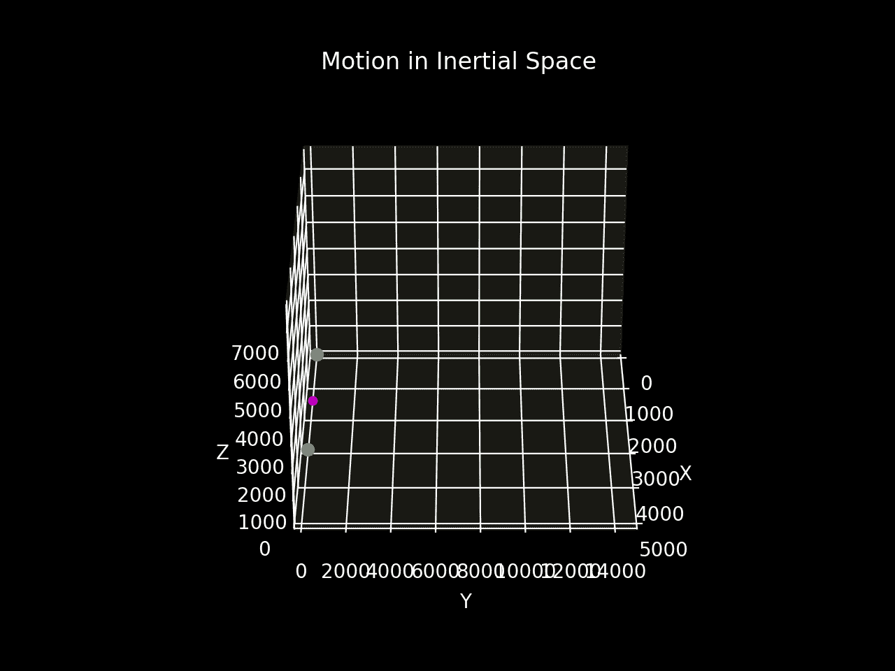
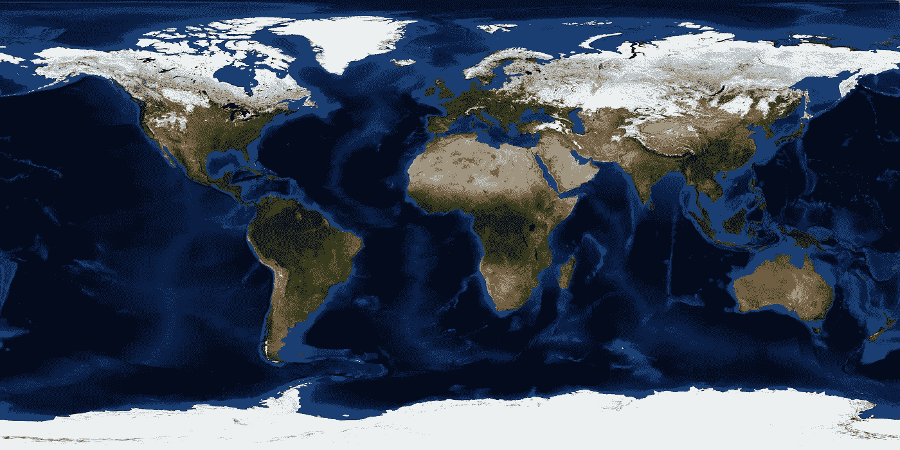
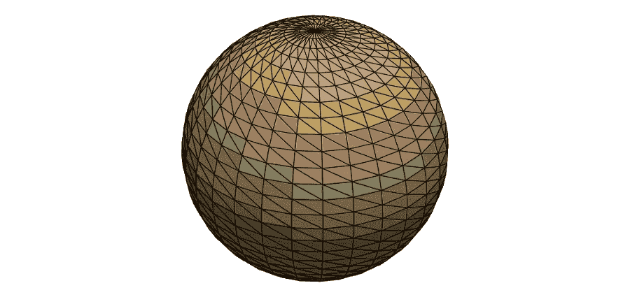
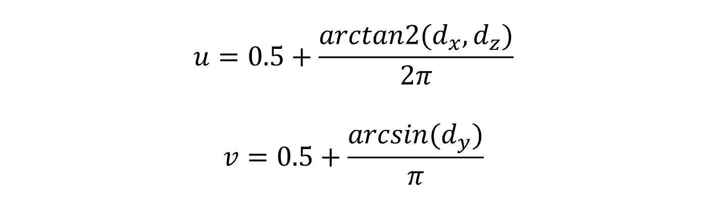

# 使用 Python 中的 UV 纹理映射实现 3D 地球可视化

> 原文：<https://towardsdatascience.com/3d-earth-visualisation-with-uv-texture-mapping-in-python-201c92aa177a>

## 使用 NumPy 和 PyVista 的纹理映射绘制真实的地球

## 介绍

许多*数据科学*和*工程*项目从引人入胜的可视化中获益。生成**动态图表**能够实现更好的*理解*和数据*通信*，以及其他好处。

互动视觉具有巨大优势的一个领域是**轨迹绘制**，适用于轨道力学 [**两体问题**](https://levelup.gitconnected.com/the-two-body-problem-in-python-6bbe4a0b2f88) 等主题。

Juliana Kozoski 在 [Unsplash](https://unsplash.com?utm_source=medium&utm_medium=referral) 上拍摄的照片

## 应用

在成功应用*数值积分*技术求解*运动方程*后，可以使用 *Matplotlib* 为两体问题创建**动态 3D 绘图**。然而，Matplotlib 的一个*缺点*是它使用了 *2D 渲染器*。因此，有其他选项可以产生更好的 3D 输出。

  

图 1 描绘了两个物体的**运动**，这仅仅是由于它们相互的重力吸引的影响。

使用 Matplotlib 而不是简单地制作*点质量*的动画，拥有一个行星体**纹理**将*显著增强*图形。

图 1——惯性空间中的两体问题运动(图片由作者提供)

## 纹理映射

纹理映射*将* **逼真的图案**或图像转换到计算机模型上。以图 2 为例*平地*地图。

**UV 贴图** *将*这个 2D 图像投射到 3D 模型的表面。该过程将图像像素分配给模型上的表面区域。

图 2——蓝色大理石 Nasa 纹理图(来源: [NASA](https://visibleearth.nasa.gov/image) )

*可视化工具包***【VTK】**是为 3D 计算机图形、图像处理和数据可视化而设计的软件。 **PyVista** 是一个 *3D 绘图*和*网格分析* Python 库，作为 VTK 的流线型接口。

使用 Gist 1 在 *PyVista* 中创建一个**球体**同样简单。执行下面的代码会得到如图 3 所示的结果。

要点 1 —在 PyVista 中创建球体

在 Matplotlib 中执行这个过程是可能的。然而，使用 PyVista 会给出更加真实的图像。

图 3 — PyVista 球体(图片由作者提供)

球形 UV 贴图的相关**方程**在维基百科上，使得该过程易于实现。等式 1 和 2 确定了在 3D 图像上正确显示 2D 图案的坐标。

等式 1 和 2 —紫外线坐标(图片由作者提供)

dₓ、dᵧ和 dᶻ是从 3D 球形模型的中心到其表面上的一点的*笛卡尔位置*。

## 结果

图 4 是用 PyVista 和蓝色大理石 NASA jpeg 制作的 3D 纹理映射地球 T21 动画。

*gif 帧率*相对较高，文件大小*大幅压缩*以满足 Medium 的 25 **兆***图片上传限制*。因此，实际结果在桌面上会更好，它显示为一个标准的交互式 Python 窗口。

图 4-纹理映射地球的模拟结果(图片由作者提供)

## 结论

PyVista 提供了更新网格值和重绘图形的函数。因此，根据 **3D 现实建模**的结果，下一步是将其纳入轨道力学模拟的代码中，并尝试重新生成图 1 的 gif。

探索 PyVista 文档中关于地理数据的其他独特例子。

如果你对 Python、工程学和数据科学感兴趣，可以看看我的其他文章。

  

## 参考

【1】Python 贴图图像到 3D 球体—[stack overflow](https://stackoverflow.com/a/53158632/12040795)
【2】UV 贴图— [维基](https://en.wikipedia.org/wiki/UV_mapping)
【3】为什么是 PyVista？— [PyVista 文档](https://docs.pyvista.org/getting-started/why.html)