# 基于 RANSAC 和 Python 的点云三维模型拟合

> 原文：<https://towardsdatascience.com/3d-model-fitting-for-point-clouds-with-ransac-and-python-2ab87d5fd363>

## 3D Python

## 无监督三维点云二元分割的线性模型创建、检测和拟合的 5 步指南:RANSAC 从头实现。

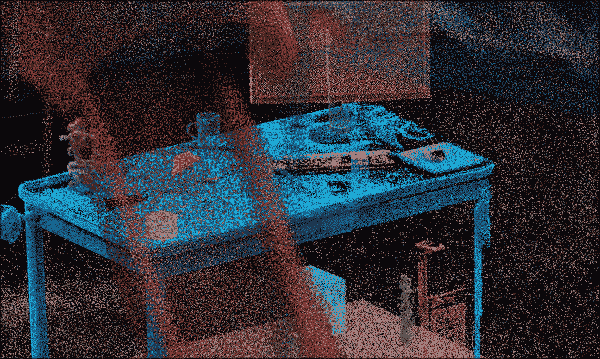

点云好玩！现在，让我们试着理解这个模糊的集合。弗·普克斯。我获得了研究员办公桌，ADAS 激光雷达来自威力登传感器，操场是由 Emm 用 Everypoint.io 生成的(场景)。

你有没有想过为什么我们会在周围的世界中发现如此多的几何图形？不，你没有？好消息，这意味着你是理智的。我倾向于对生活和事物有奇怪的疑问🙃。我觉得它非常迷人，尤其是❄️薄片的对称奇迹，美味中的基本形状🍈、或遗产设计🕌图案的奇迹。

我们的世界充满了不同的几何风味。但是如果你环顾四周，我打赌你至少能找到五个简单的几何图形。我们注意到，我们发现的大多数形状都可以与几何图元联系起来，如平面、金字塔、圆柱体、立方体和球体。这是一个引人注目的观察结果；为什么？

让我们假设我们可以捕捉并数字化我们真实世界环境的细节。在这些 3D 数字复制品中检测组成场景的形状并将其用作语义提取层会不会很方便？做模特吗？为了场景理解？

哈哈，准确的说！在本教程中，我会给你一个快速的方法来定义三维平面，并使用它们作为基础来划分三维点云。


本教程涵盖了整个工作流程。我们获取一个点云场景，我们将使用随机样本一致性方法对其进行分割。F. Poux

为此，我们将介绍一个健壮的算法，并从头开始实现它:RANSAC！你准备好了吗？让我们开始吧！

# 步骤 0。战略

在直截了当地用一个有效的解决方案来处理这个项目之前，让我们先设计一个总体方案。本教程遵循由五个简单步骤组成的策略，如下图所示。

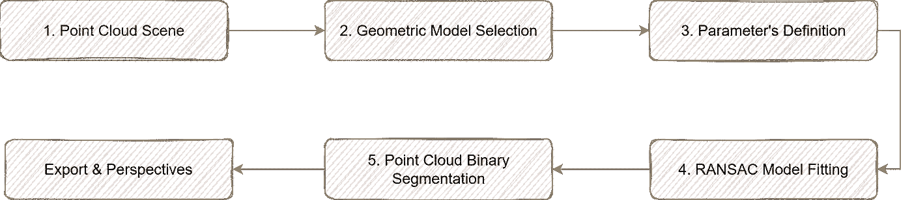

基于 RANSAC 平面模型拟合的点云二值分割策略图。F. Poux

首先，(1)我们在我与你分享的三个数据集中选择了一个点云数据集。然后，(2)在数据中选择一个几何模型进行检测。(3)研究了推广参数的定义。(4)我们将这三种成分与 RANSAC 配方混合在一起，(5)我们分割我们的点云:瞧！一个精心制作的点云！该战略已经制定，您可以在下面找到这些步骤的快速链接:

```
Step 1\. The Point Cloud Data
Step 2\. Geometric Model Selection
Step 3\. Parameter's Definition
Step 4\. RANSAC Model Fitting (from scratch)
Step 5\. Point Cloud Binary SegmentationPerspectives & Conclusion
```

现在我们已经设置好了，让我们直接开始吧。

# 第一步。点云数据

好了，我们走吧。我们将设计一个容易扩展到不同用例的方法。出于这个目的，不是一个而是三个数据集，你可以从中选择，下载，并做你的科学实验😁。选择这些来说明三种不同的场景，并提供基本的数据。多酷啊，匈奴？


这一集中可用的不同点云可以直接在提供的链接下载:研究员桌(。xyz)，汽车(。xyz)、操场(。xyz)。操场是 Emm 用 Everypoint.io 生成的(场景)。F. Poux

我们想要展示的场景如下:

*   🤖机器人:我们正在设计一个机器人，它需要清洁地面和桌子，并确保在清洁时避开障碍物。最重要的是，我们希望检测感兴趣的元素的位置，并将其作为未来清理任务的基础，以了解我们最初是否需要重新定位它们。
*   🚙ADAS(高级驾驶辅助系统):在这里，我们感兴趣的是让车辆能够自己驾驶:一辆自动驾驶的车辆。为此目的，我们使用威力登 VLP-16 扫描的一个时期，在此期间我们通常进行实时分析以检测目标。
*   🏚️建筑公司:几年前建造的一个操场由于地基不稳定出现了问题。因此，我们希望评估元素的平面度，并确定是否有必要进行调平操作。

为了确保您的选择，您可以使用 [Flyvast WebGL 应用程序](https://app.flyvast.com/flyvast/app/page-snapshot-viewer.html#/566/8f32e130-d775-8989-b574-d1d7cd08d5d0)在线玩它们，然后在这里([研究员工作台)下载它们。](https://drive.google.com/file/d/1OBgYx5c0-m4DGY1Lz2nl4NR56atvwU1e/view?usp=sharing)，【xyz】，[车子(。【xyz】，](https://drive.google.com/file/d/12dAMGQmET2NIdRCXQxWnhLDf2mZkngEC/view?usp=sharing)[操场(。xyz)](https://drive.google.com/file/d/1rakvffprfchT_KmEUNw35GLY5OKC-67W/view?usp=sharing) )。

[](https://medium.com/@florentpoux/membership)  

# 第二步。选择几何模型

在之前的一篇文章中，我们定义了 RANSAC 方法，该文章提出了自动分割和聚类:

> RANSAC(随机样本一致性)是一种试错法，它将你的数据点分成两个部分:一个内部集和一个外部集。

[](/how-to-automate-3d-point-cloud-segmentation-and-clustering-with-python-343c9039e4f5) [## 如何使用 Python 实现 3D 点云分割和聚类的自动化

towardsdatascience.com](/how-to-automate-3d-point-cloud-segmentation-and-clustering-with-python-343c9039e4f5) 

为了实现这一目标，我们采取了三个简单的步骤:

*   我们选择一个几何模型，它符合我们数据集中的一个微小的随机样本(如果我们想定义一个平面，随机选取 3 个点)。
*   然后，我们通过检查有多少点“接近”感兴趣的表面来估计拟合的好坏，因此我们得到一个内层计数。
*   我们在一定数量的迭代中重复这个过程，并保留使内层计数最大化的平面。

这种方法不是火箭科学，而是一种针对嘈杂的真实世界数据集的超级实用的方法。

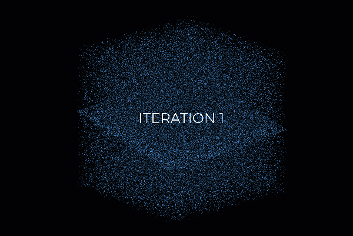

RANSAC 通过多次迭代及其随机计算初始化来工作。来源: [**如何用 Python 实现 3D 点云的自动分割和聚类**](/how-to-automate-3d-point-cloud-segmentation-and-clustering-with-python-343c9039e4f5) ，F. Poux

在本教程中，我们选择了:平面几何！这是快速理解大量数据集的最佳方式。但是请容忍我；我现在给你一些重要的数学理解，我们用来描述欧几里得空间中的平面。 **ℝ** 中平面的方程的一般形式为 **𝑎𝑥+𝑏𝑦+𝑐𝑧+𝑑=0** 。

多美啊🦋。撇开笑不谈，𝑎,𝑏和𝑐常数是垂直于平面或平行于平面的任何向量的法向量*-*=(𝑎,𝑏,𝑐)的分量。当你掌握了这一点，玩变换(平移，旋转，缩放)并适应它是超级容易的。d 常数将使平面从原点移动。

意味着一个点 ***p* = (𝑥,𝑦,𝑧)** 属于由法向量*-*引导的平面，如果它满足等式。如果你理解了这一点，你就获得了指导几何拟合的第一手原理。太好了！

现在让我们用 RANSAC 到处安装飞机。

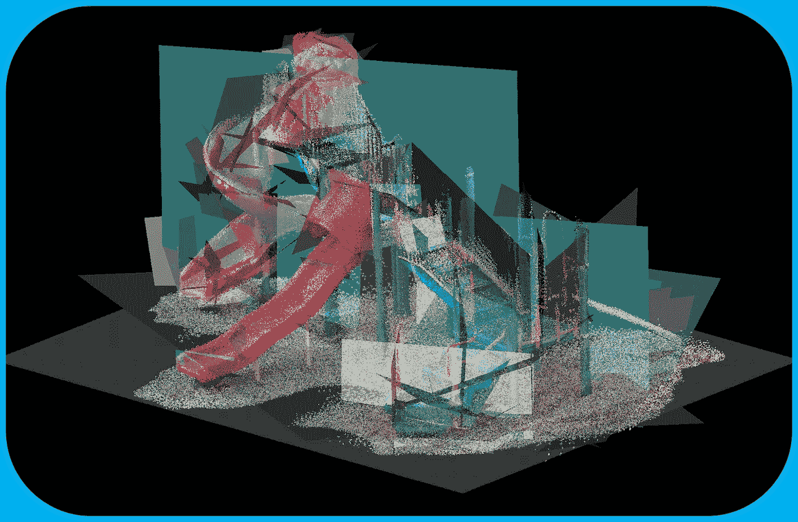

操场上的 RANSAC 飞机汤点云。这几乎是艺术，不是吗😀？F. Poux

兰萨克汤，是吗？好的，让我们定义参数使它正常工作。

# 第三步。参数定义

是时候弄脏我们矮小的编码者的手了！而这一次，让我们从零开始编写一个点云**的 RANSAC 平面检测算法，更好地把握遮光罩下的东西。我们将用两个库来做这件事:`random`和`numpy`。很难再简约了。为了形象化，我们亲爱的(或甜蜜的敌人😊)`matplotlib`和`plotly`用于交互式 Jupyter 笔记本和 Google Colab 脚本。**

```
import random
import numpy as np
import matplotlib.pyplot as plt
from mpl_toolkits import mplot3dimport plotly.express as px
```

## A.明智地选择数据集

你选择的武器是什么？我将把我的研究桌作为主要案例研究:

```
dataset="the_researcher_desk.xyz"
pcd = np.loadtxt(data_folder+dataset,skiprows=1)
```

然后，我通过从辐射属性中分离出几何属性来快速准备:

```
xyz=pcd[:,:3]
rgb=pcd[:,3:6]
```

好了，现在是时候设置一些参数了。

## B.手动参数设置

我们需要定义一个阈值参数来确定一个点是属于拟合的平面形状(内层)还是一个离群点。我们将根据点到平面的距离来区分；因此，我们需要快速掌握点云中的单元。让我们用`matplotlib`显示点云:

```
plt.figure(figsize=(8, 5), dpi=150)
plt.scatter(xyz[:,0], xyz[:,1], c=rgb/255, s=0.05)
plt.title("Top-View")
plt.xlabel('X-axis (m)')
plt.ylabel('Y-axis (m)')
plt.show()
```

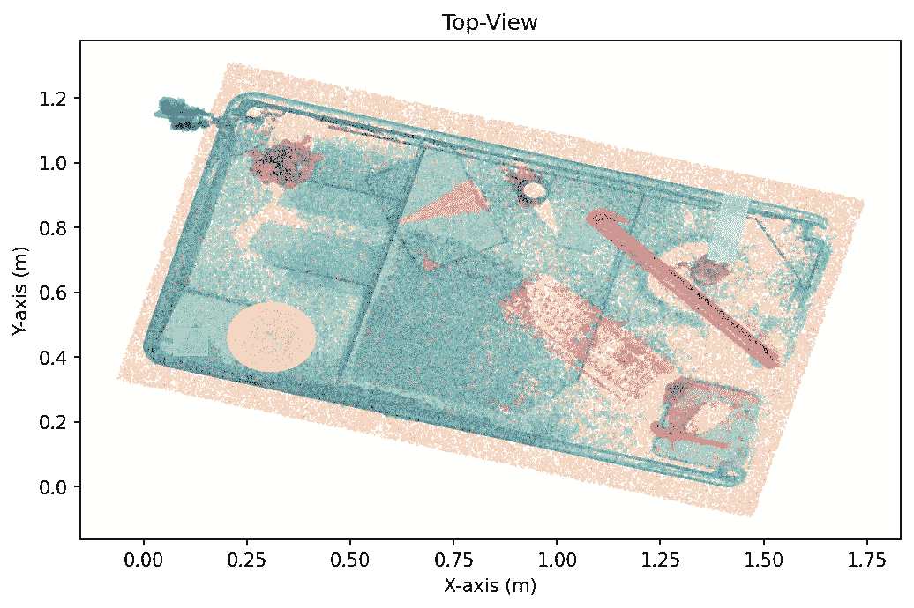

研究桌面点云的俯视图。F. Poux

有时，可能很难解释两点之间的区别，尤其是使用 Google Colab 和非交互式渲染。如果您在这样的场景中，您可以将`plotly`与 import `plotly.express as px`一起使用，然后您可以通过

```
fig = px.scatter(x=xyz[:,0], y=xyz[:,1], color=xyz[:,2])
fig.show()
```

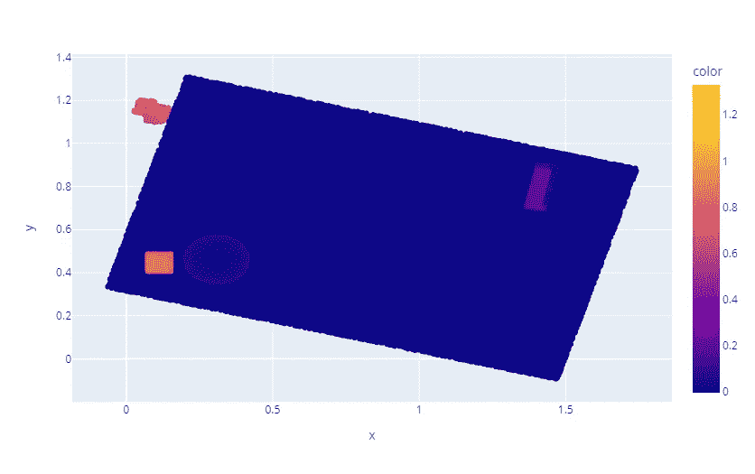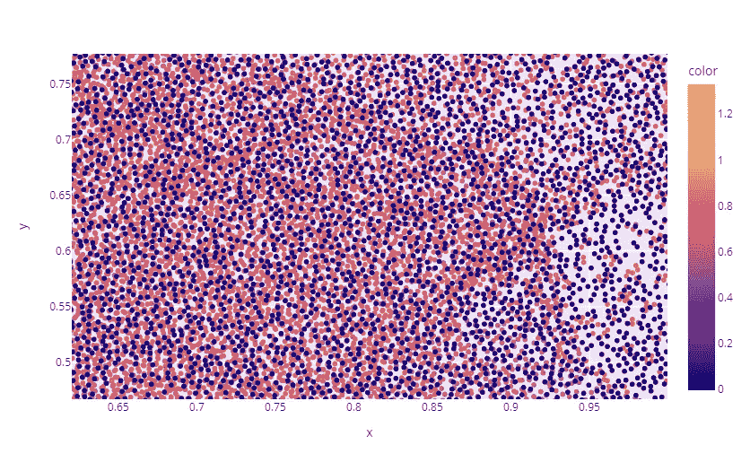

左边是 plotly 点云，右边是场景的交互缩放。F. Poux

它允许我们看到，平均来说，每个`5 mm`都有相邻点，因此我们将阈值参数设置得高十倍(绝对是经验性的😊):`threshold=0.05`。同样，我们将把迭代的次数设置为一个不受限的相当大的数；让我们说`1000 iterations`:

```
iterations=1000
```

## C.自动参数设置

我们可能有点受限，需要一些领域知识来设置阈值。因此，尝试绕过这一点向非专家开放这种方法将是令人兴奋的。我将与你分享一个可能有用的简单想法。如果我们计算数据集中各点之间的平均距离，并以此为基础设置阈值，会怎么样？

这是一个值得探索的想法。为了尝试确定这样一个值，我们可以使用一个`KD-Tree`来加速查询每个点的最近邻居的过程。在流程的这个阶段，我建议使用`scikit-learn`实现，并在每个节点将 KD 树分成两个超平面:

```
from sklearn.neighbors import KDTree
tree = KDTree(np.array(xyz), leaf_size=2) 
```

然后，我们可以使用简单的查询方法查询点云中每个点的 k-最近邻:

```
tree.query(xyz, k=8)
```

其分别输出点距离和点索引:

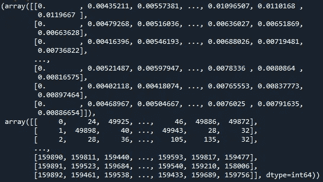

KD 树查询的 numpy 输出。F. Poux

🤓**注意** : *最近邻的第一个距离值始终等于* `*0*` *。你会问奇怪吗？这是因为我们对整个点云本身进行查询；因此，每个点到自身都有一个距离。因此，我们需要过滤每行的第一个元素:* `nearest_dist, nearest_ind = tree.query(xyz, k=8)`

太好了！现在，如果我们对每个邻居候选进行平均，用`np.mean(nearest_dist[:,1:],axis=0)`从最近到最远排序，我们得到:

```
>> array([0.0046, 0.0052 , 0.0059, 0.0067, 0.0074, 0.0081, 0.0087])
```

这意味着，如果我们通过考虑最近的邻居进行推理，我们将得到 4.6 mm 的平均距离。如果我们想要使用`np.mean(nearest_dist[:,1:])`获得每个点到其第 n 个最近邻居的平均距离的局部表示，则在我们的情况下输出`6.7` mm。

为了让您的实验顺利进行，我建议设置一个查询，使用 8 到 15 个点作为邻居，并对其进行平均。因此，它给出了点云中噪声比的良好局部表示。我们将在未来的教程中探索更巧妙的方法来寻找点云的噪波比。😉

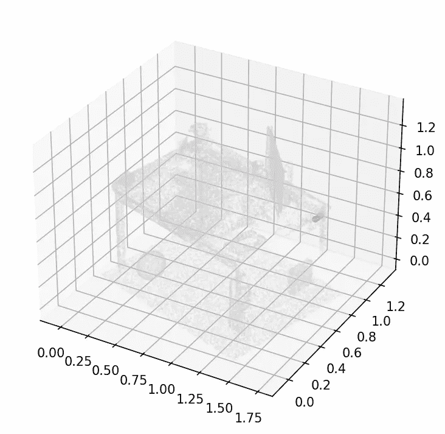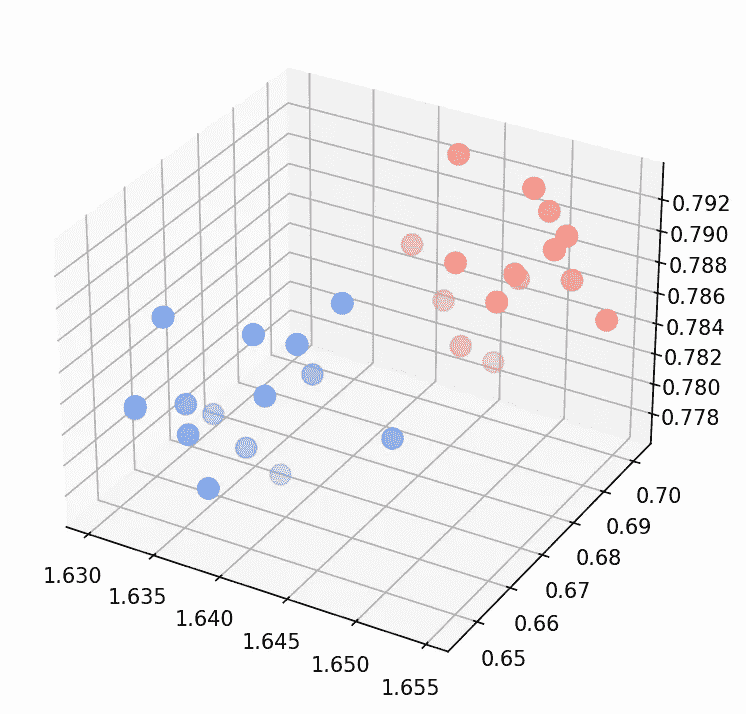

🧙‍♂️ **专家** : *有一种自动的方法每次都能得到正确的迭代次数。如果我们希望以概率 p(例如 99%)成功，我们数据中的异常值比率是 e(例如 60%)，我们需要 s 点来定义我们的模型(这里是 3)。下面的公式给出了要进行的试验(迭代)次数:*

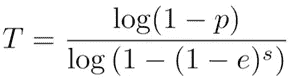

# 第四步。RANSAC 模型拟合

## A.寻找平面(1 次迭代)

让我们在自动化指定数量的迭代之前模拟一次迭代。

首先，我们要从点云中随机选取三个点:

```
idx_samples = random.sample(range(len(xyz)), 3)
pts = xyz[idx_samples]
```

然后，我们要确定平面的方程。例如，找到方程𝑎𝑥+𝑏𝑦+𝑐𝑧+𝑑=0.的参数𝑎,𝑏,𝑐和𝑑为此，我们可以玩一个奇妙的线性代数性质，即两个向量的叉积生成一个正交向量。

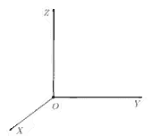

Z 向量是 X 和 Y 叉积的结果，这符合经验法则😀。F. Poux

因此，我们只需要从平面上的同一点定义两个向量`vecA`和`vecB`，然后计算它们的法线，这将是平面的法线。多棒啊。

```
vecA = pts[1] - pts[0]
vecB = pts[2] - pts[0]
normal = np.cross(vecA, vecB)
```

从那里，我们将归一化我们的`normal`向量，然后得到定义向量的𝑎,𝑏和𝑐，并使用落在平面上的三个点之一找到𝑑:*d =***—**(𝑎𝑥+𝑏𝑦+𝑐𝑧)

```
a,b,c = normal / np.linalg.norm(normal)
d=-np.sum(normal*pts[1])
```

现在，我们准备开始计算我们刚刚定义的平面上任何剩余的点💪。

## B.点到平面的距离:阈值定义

如果你相信我的话，下面是我们需要实现的:

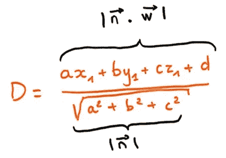

点到平面的距离用上面的符号表示。点 P(见下)到给定平面的距离就是向量 w 到单位法向量 n 上的投影长度，我们知道，向量 n 的长度等于 1，点 P 到平面的距离就是向量 w 和 n 的点积的绝对值！F. Poux

这个距离是最短的，是点和平面之间的正交距离，如下图所示。

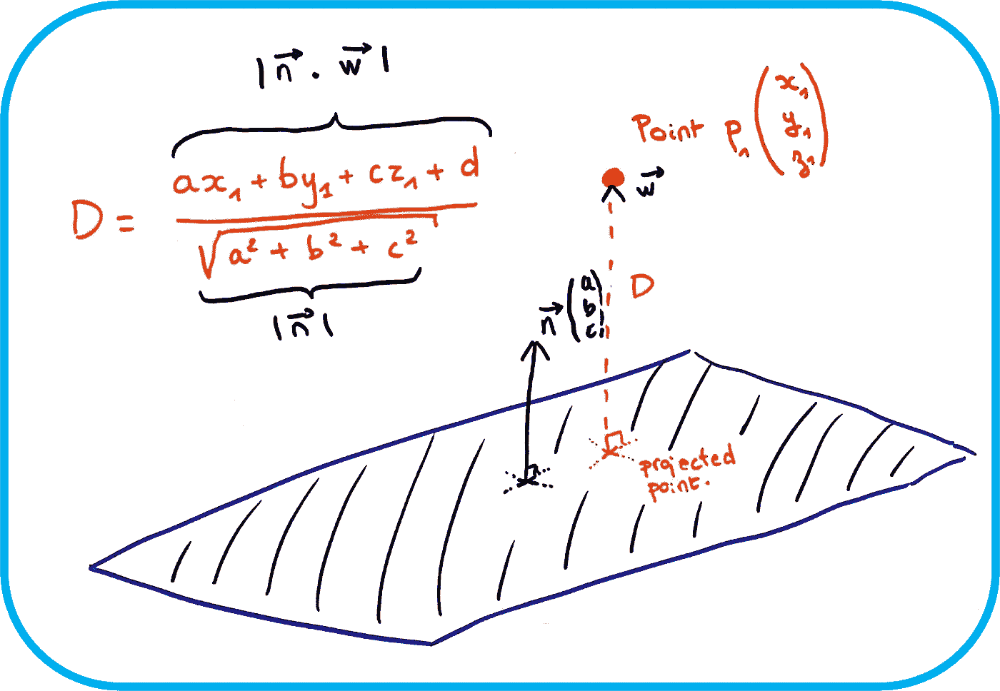

一个法线 n 定义了平面，我们可以看到我们想要计算的点到平面的 D 距离是什么样子的。F. Poux

这意味着我们可以简单地计算这个距离，只需取点云中的每个点，这些点不是我们在一次 Ransac 迭代中用来建立平面的三个点的一部分，就像这样:

```
distance = (a * xyz[:,0] + b * xyz[:,1] + c * xyz[:,2] + d
            ) / np.sqrt(a ** 2 + b ** 2 + c ** 2)
```

对于我们的随机选择和平面拟合输出:

```
array([-1.39510085, -1.41347083, -1.410467 , …, -0.80881761, -0.85785174, -0.81925854])
```

🤓**注意** : *看到负值了？我们必须解决这个问题来得到无符号的距离，因为我们的法线在平面上可以翻转 180°。*

非常好！从那里，我们可以对照阈值进行检查，并过滤所有符合标准的点，只保留点到平面距离在`threshold`以下的点作为内嵌点。

```
idx_candidates = np.where(np.abs(distance) <= threshold)[0]
```

🤓**注意**:*`[0]`*允许我们在这一步只处理索引，不要用不必要的点坐标溢出我们的系统。**

*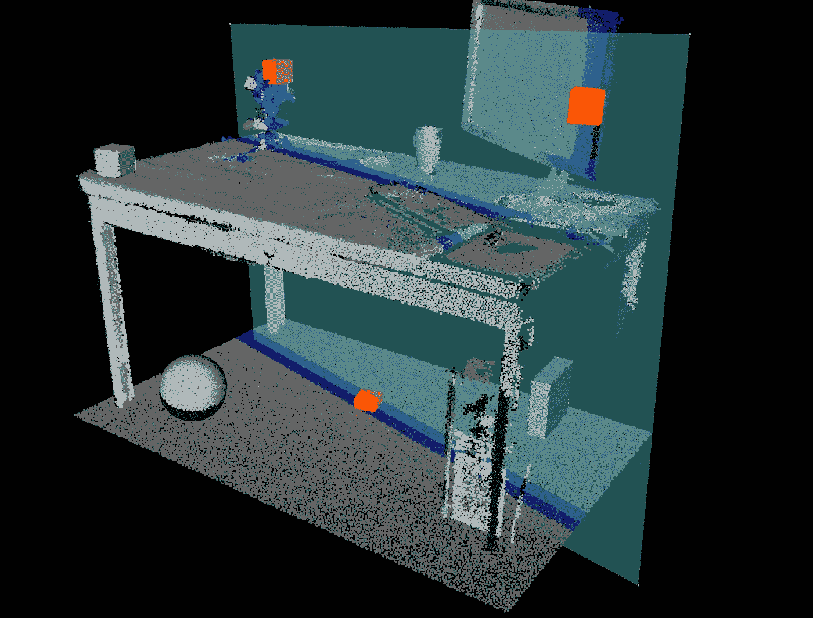*

*一次迭代的结果。在青色中，平面适合三个采样点。蓝色表示被选为内线的点，得分为 17 772。F. Poux*

*你已经知道下一步会是什么了吗？🤔*

## *C.迭代和函数定义*

*的确，我们现在需要迭代一定的次数来找到最优平面！为此，我们将定义一个函数，该函数将输入点`coordinates`、`threshold`和`iterations`的编号作为输入点，并返回平面`equation`和点`inliers`索引:*

```
*def function(coordinates, threshold, iterations):
  ...
  i=1
  while i < iterations:
    do <<all below>>
    if len(idx_candidates) > len(inliers):
      equation = [a,b,c,d]
      inliers = idx_candidates
    i+=1
  return equation, inliers*
```

*🤓**注意** : *我们在迭代参数上创建 RANSAC 循环。对于每个循环，我们将计算最佳拟合 RANSAC 平面，并保留方程和内嵌索引。使用* `if` *语句，我们然后检查当前迭代的得分是否最大，在这种情况下，我们切换点索引。**

*现在，让我们填充 RANSAC 函数，得到如下结果:*

```
*def ransac_plane(xyz, threshold=0.05, iterations=1000):
  inliers=[]
  n_points=len(xyz)
  i=1 while i<iterations:
    idx_samples = random.sample(range(n_points), 3)
    pts = xyz[idx_samples] vecA = pts[1] - pts[0]
    vecB = pts[2] - pts[0]
    normal = np.cross(vecA, vecB)
    a,b,c = normal / np.linalg.norm(normal)
    d=-np.sum(normal*pts[1]) distance = (a * xyz[:,0] + b * xyz[:,1] + c * xyz[:,2] + d
                ) / np.sqrt(a ** 2 + b ** 2 + c ** 2) idx_candidates = np.where(np.abs(distance) <= threshold)[0] if len(idx_candidates) > len(inliers):
      equation = [a,b,c,d]
      inliers = idx_candidates

    i+=1
  return equation, inliers*
```

*在这里，我们为平面检测创建了一个 RANSAC 函数，它可以吃掉 3D 点云！！！！它以这种方式进行了充分的优化，让你可以攻击大的点云，而不会有烧毁电脑的风险🔥！现在，让我们扩展到我们想要分割点云的实际情况。*

# *第五步。点云二值分割*

*这是最后一步！至少在现阶段😀。我们将在两个变量中保留函数的结果:*

```
*eq,idx_inliers=ransac_plane(xyz,0.01)
inliers=xyz[idx_inliers]*
```

*非常好！但现在，我们还想对原始点云进行拆分，高效地抓住离群点。这是一个极好的转机。我们创建一个遮罩，作为快速过滤器来获取不属于内联体的其余点:*

```
*mask = np.ones(len(xyz), dtype=bool)
mask[idx_inliers] = False
outliers=xyz[mask]*
```

*太棒了！我们现在有了一个内部集合和一个外部集合！让我们用`matplotlib`来检验一下结果:*

```
*ax = plt.axes(projection='3d')
ax.scatter(inliers[:,0], inliers[:,1], inliers[:,2], c = 'cornflowerblue', s=0.02)
ax.scatter(outliers[:,0], outliers[:,1], outliers[:,2], c = 'salmon', s=0.02)
plt.show()*
```

*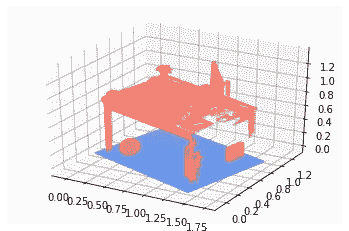*

*研究桌的 3D 点云用我们的 RANSAC 函数分割。F. Poux*

*哇，它非常好用！我们在这个场景中找到了地面！多牛逼啊！最后一件事:分别导出两个数据集:*

```
*result_folder=”../DATA/RESULTS/”
np.savetxt(result_folder+dataset.split(“.”)[0]+”_inliers.xyz”, inliers, fmt=’%1.4f’, delimiter=’;’)
np.savetxt(result_folder+dataset.split(“.”)[0]+”_outliers.xyz”, outliers, fmt=’%1.4f’, delimiter=’;’)*
```

*其他数据集呢？这是我们使用自动阈值方法得到的结果，基于到第 15 个最近邻居的距离估计！多好啊！*

*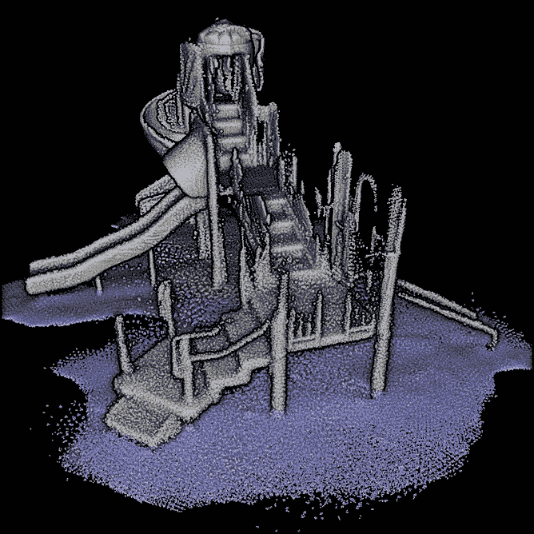**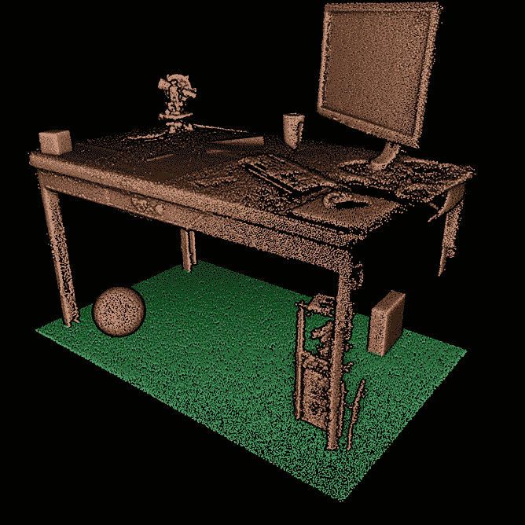**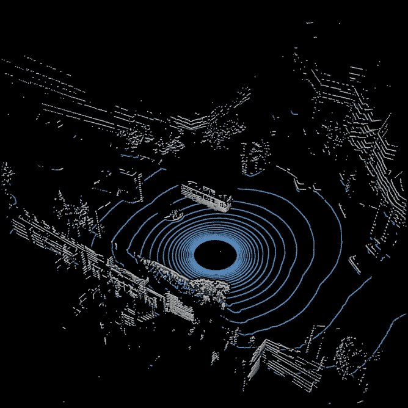*

*操场点云被分割，研究桌被分割，威力登 adas 激光雷达数据集被分割。正如我们所看到的，自动阈值方法允许以 100%的自动化有效地处理手头的任务。F. Poux*

*令人着迷的是，我们对噪声和数据环境具有超强的鲁棒性！你值得在这台 [Google Colab 笔记本](https://colab.research.google.com/drive/1sK4tLAKJQ42ePKe71ReCHaYtUW5RTn5m?usp=sharing)上访问和运行完整的代码。尽情享受吧！*

# *结论*

*🥳万岁！您从头开始实现了一个完整的 RANSAC 模型拟合算法，用于平面检测和 3D 点云分割。最重要的是，您现在可以自动设置 RANSAC 参数，这样您就不会有 99%的自动解决方案，而是 100%的自动化。这是重要的一步！如果您想更深入地了解如何在您的项目中包含这项新技能，下面是下一步教程，它将允许您迭代 RANSAC 方法并使用聚类方法来检测点云中的实例:*

*[](/how-to-automate-3d-point-cloud-segmentation-and-clustering-with-python-343c9039e4f5) 的课程开始。

[](https://learngeodata.eu/)  

# 更进一步

存在用于点云的其他高级分割方法。这是一个我深入参与的研究领域，你已经可以在文章[1-6]中找到一些设计良好的方法。对于更高级的 3D 深度学习架构，一些综合教程即将推出！

1.  **Poux，F.** ，& Billen，R. (2019)。基于体素的三维点云语义分割:无监督的几何和关系特征与深度学习方法。ISPRS 国际地理信息杂志。8(5), 213;[https://doi.org/10.3390/ijgi8050213](https://doi.org/10.3390/ijgi8050213)—杰克·丹格蒙德奖([链接到新闻报道](https://www.geographie.uliege.be/cms/c_5724437/en/florent-poux-and-roland-billen-winners-of-the-2019-jack-dangermond-award))
2.  **Poux，F.** ，纽维尔，r .，纽约，g .-a .&比伦，R. (2018)。三维点云语义建模:室内空间和家具的集成框架。*遥感*， *10* (9)，1412。[https://doi.org/10.3390/rs10091412](https://doi.org/10.3390/rs10091412)
3.  **Poux，F.** ，Neuville，r .，Van Wersch，l .，Nys，g .-a .&Billen，R. (2017)。考古学中的 3D 点云:应用于准平面物体的获取、处理和知识集成的进展。*地学*， *7* (4)，96。[https://doi.org/10.3390/GEOSCIENCES7040096](https://doi.org/10.3390/GEOSCIENCES7040096)
4.  Poux，F. ，Mattes，c .，Kobbelt，l .，2020 年。室内三维点云的无监督分割:应用于基于对象的分类，摄影测量、遥感和空间信息科学国际档案。第 111-118 页。[https://doi:10.5194/ISPRS-archives-XLIV-4-W1-2020-111-2020](https://doi:10.5194/isprs-archives-XLIV-4-W1-2020-111-2020)
5.  Poux，F. ，Ponciano，J.J .，2020。用于 3d 室内点云实例分割的自学习本体，ISPRS 摄影测量、遥感和空间信息科学国际档案。第 309-316 页。[https://doi:10.5194/ISPRS-archives-XLIII-B2-2020-309-2020](https://doi:10.5194/isprs-archives-XLIII-B2-2020-309-2020)
6.  Bassier，m .、Vergauwen，m .、 **Poux、F.** 、(2020)。用于建筑物内部分类的点云和网格特征。*遥感*。12, 2224.[https://doi:10.3390/RS 12142224](https://doi:10.3390/rs12142224)*