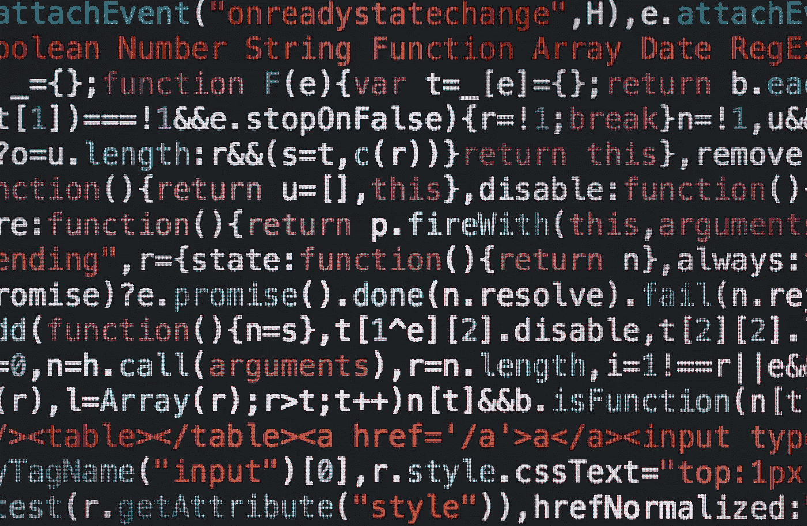

# 4 种可能已经存在于代码中的代码味道

> 原文：<https://towardsdatascience.com/4-code-smells-that-are-probably-already-in-your-code-ae75dea3fe32>

## 通过重构常见的代码味道产生干净的代码



由[马库斯·斯皮斯克](https://unsplash.com/@markusspiske?utm_source=unsplash&utm_medium=referral&utm_content=creditCopyText)在 [Unsplash](https://unsplash.com/s/photos/code?utm_source=unsplash&utm_medium=referral&utm_content=creditCopyText) 上拍摄

缺乏经验、仓促的截止日期或错过代码审查只是可能导致您创建构思不佳的代码的几个因素，即所谓的“**代码味道”**。

要修复这些“气味”,你必须打开你的 IDE，检查你的代码，并找出你的代码的哪一部分受到影响。

虽然代码味道不会立即破坏你的应用程序，但它可能会导致将来的错误，因为它可能会使代码不可读和不可维护。此外，实现新功能将会更加复杂，花费更长的时间，并引入更多的错误。

本文将讨论四种流行的代码味道，并解释可能出现的问题。我将详细描述每一个，提供实例，并展示如何修复它们。

为了突出代码的味道，我使用了 JavaScript，但是它们存在于每一种编程语言中！

# 神奇的数字

幻数是软件开发人员分配给代码中变量的值，用来做“一些事情”。它们总是有一些意义，但是如果编写代码的软件开发人员离开了，没有人会记得它。虽然它们被称为幻数，但这种代码味道包括了每一种原始数据类型，如`Char`、`String`、`Boolean`等。

最重要的是要明白你的代码在任何时候都是可读的。使用神奇的数字将会阻止你的同事甚至是你在未来的工作和改变。

为了更好地理解这个问题，请查看下面的代码片段:

```
let a = "1534";

for(let i = 0; i < 4; i++) {
    send(a[i])
}
```

这是一个相当愚蠢的例子，但它应该足以说明问题。代码遍历输入字符串`a`中的每个字符，并为每个字符调用`send()`。然而，for 循环是从 0 - 3 开始的，因为输入字符串有 4 个字符，并且您想要迭代整个字符串。

实现这个循环的开发人员确实使用了这个神奇的数字，因为输入总是 4 个字符长。这个限制在这个代码片段中是有意义的，但是如果字符串`a`由于某种原因改变，将来可能会引入一些奇怪的错误。

**缺乏规划使得代码无法扩展。**

然而，代码片段中的一个简单变化会产生很大的不同:

```
let a = "1534";

for(let i = 0; i < a.length; i++) {
    send(a[i])
}
```

通过删除幻数，for 循环遍历输入字符串的长度。现在，代码可以扩展，适用于任何输入字符串，并且是面向未来的。

幻数的另一个问题是代码可读性:

```
const totalCost = order.getCost() * 1.19;
```

你可能会问自己 1.19 的值从何而来，为什么一个订单的成本要乘以这个值。也许你可以做一些有根据的猜测，但你能做的只有这些:**猜测**！

这个神奇的数字是个问题，因为:

*   你不能确定这个号码是做什么用的
*   如果多次使用，将很难更改此号码

要解决这个问题，您可以记录代码行并解释这个数字，或者通过用一个 mnemotechnic 名称定义一个常数并使用它来替换这个幻数。**始终**选择第二个选项，因为常量很容易重用和更改:

```
const OVERALL_PROFIT_MARGIN = 1.19

const totalCost = order.getCost() * OVERALL_PROFIT_MARGIN 
```

对这个神奇数字的修正很容易，这将有助于理解在总成本计算的末尾增加了一个固定利润率。如果您之前猜测 1.19 会将税率添加到订单中，那么您就错了，因为这已经包含在订单成本中了。

对于任何字符串、数字或其他数据类型，如果在没有适当文档的情况下使用它们的原始表示，都应该进行这种重构。

几个月后，它会帮助每个人阅读你的代码，甚至是你自己。

# 重复的逻辑/代码

每个软件开发人员都应该知道几种技术来避免在整个软件项目中创建重复的代码。应该敲响警钟的一个明显迹象是复制粘贴任何逻辑。如果发生这种情况，您应该将其抽象成函数，并通过调用新创建的函数来替换用法。

但是，如果你不是在复制代码，而是在复制逻辑，你会怎么做？

在软件团队中，经常会有许多不同的开发人员从事软件的某些部分。通常，他们会遇到相同的问题，并实现一个有良好文档记录、可读性和可维护性的解决方案。

为了演示这个问题，假设您正在处理一个大型软件项目，并且使用了多个`console.log`实例。现在您想使用一种更好的方法来记录您的错误、警告和信息。现在，您在`utils.js`文件中创建了一个新的全局日志功能:

```
const log = (message) => {
    if(LOG_ENABLED) {
        console.log(message)
    }
}
```

从现在开始，你可以导入你的`utils.js`文件，使用你的`log`函数来记录任何事情，也可以通过调整全局常量`LOG_ENABLED`来完全停止日志输出。

由于您与许多开发人员一起工作，另一个开发人员可能也考虑到了这一点，并实现了另一个日志功能:

```
const log = (message) => {
 if(NODE_ENV === 'production') {
     console.log(message)
    }
}
```

不幸的是，另一个开发人员创建了一个新文件`log.utils.js`来存储他的日志功能，并在需要的地方使用它。

您将最终实现两个日志记录函数，它们使用不同的变量来检查日志是否被启用。如果您现在想要允许日志消息，但是没有更新`NODE_ENV,`，您将只能看到一些日志，并且会疑惑为什么没有生成其他日志消息。

记住:重复代码是不好的，**但是重复逻辑更糟糕。**

识别这种问题要困难得多，潜在的解决方案需要大量的工作(或返工)。尝试总是谈论、计划和协调添加影响整个软件项目的新特性。

# 一个功能是统治他们所有人

如果**“一个戒指统治所有人**”在*指环王*中对任何人都不起作用，为什么它应该对你的软件项目起作用？

在一个软件项目中，避免使用元函数来统治…我的意思是，包含所需的业务逻辑的每一部分。理想情况下，每个功能应该只处理一件事情，并且有一个单一的职责。如果设计任何类或函数，你应该总是问自己:

*   “这个阶层为什么存在？”
*   “这个函数解决哪个问题？”

Robert C. Martin 有一句名言，在实现类、模块或函数时，你应该经常考虑:

> *“一个类*(，模块，或者函数)*应该只有一个改变的理由。”*

这是因为如果你遇到任何问题，你会知道在哪里搜索它。此外，如果您必须更改一些逻辑、修正一些计算或删除一个依赖项，您可以在没有任何影响的情况下这样做。

就像用乐高积木一样。如果你只有一个大的，想改变一个单一的东西，那是不可能的。但是如果你用你能买到的最小的积木，你可以毫无问题地把一些积木换成其他积木。

**将软件项目和功能与乐高积木进行比较非常有效，因为你的积木越小，你在构建任何东西时就有越大的灵活性！**

听说过[单一责任原则](https://en.wikipedia.org/wiki/Single-responsibility_principle) (SRP)吗？这个原则定义了你在软件项目中实现的所有东西都应该只有一个单一的职责(无论是函数、模块、类，还是你代码中的任何结构)。这意味着函数只做一件事，而类(或模块)将多个与同一任务相关的函数组合在一起！

例如，如果您正在与一家网店合作，并希望实现付款工作流，您有几种方法来实现这一点:

1.  创建一个名为`makePayment`的新功能，它集成了完整的支付网关并集中了所有逻辑。它将在一个地方包含成功支付的所有内容，并将有几千行代码长。
2.  将每个部分集成到它的类中，分成不同的模块，每个模块专用于一个网关。这将保持代码整洁，但也增加了可维护性，因为许多工作流可能有许多共同点，或者使用可以抽象和重用的公共概念。
3.  创建一个单一的支付工作流程，其中每个类或模块为每个网关集中单独的功能或方法。

就 SRP 而言，选项 2 是最合适的，因为责任是处理付款。此外，这将是选项#1 和选项#2 之间的权衡。此外，它将使代码分布在不同的结构中，但在单个逻辑组中是可管理的。您将不必维护大量的逻辑，并且可以在互不影响的情况下重构或分离更多的部分。

永远记住: **SRP 是关于责任**，而不是把所有事情都放在一个单一的功能中。

# 长参数列表

在一个函数调用(或类)中有一个很长的参数列表是一件令人讨厌的事情。并且应该尽快删除！

通常一个很长的参数列表表明实现有问题，或者几个算法被合并到一个方法中(这是违反 SRP 的！).

官方并没有具体规定多少才算多，但通常情况下，你应该**永远不要**使用超过三个或四个。每次将参数列表长度增加到 5 时，都应该重构这个函数(或类)。

让我们看看下面的代码片段，它从几个值创建了一个用户:

```
const createUser = (username, password, state, city, street, nr) => {
  // ...   
}
```

创建用户需要六个不同的值:`username`、`password`、`state`、`city`、`street`和`nr`。现在，代替使用这个参数列表，该方法可以使用另一个数据结构作为输入来创建将减少所使用的参数的用户:

```
const createAddress = (state, city, stree, nr) => {
    // ...
}

const createUser = (username, password, address) => {
    // ...
}
```

通过这一更改，您将拥有两个独立的功能，承担一项责任，并且只包含属于一起的参数。一个新的函数将创建 address 对象，然后将其作为参数传递给用户，而不是将地址分配给用户。

**但是为什么要这样做呢？**

因为它会产生一些收益:

*   可读性更强，代码更短
*   重构可能会暴露出以前没有注意到的重复代码！

# 结束语

在我们作为软件开发人员、工程师或领导的职业生涯中，我们经常需要在没有计划的情况下编写代码。结果往往是我们最终产生了代码味道。

有时代码味道可以很容易地被识别和重构，但是在某些情况下，它们可能需要大的重构。解决它们的最好方法是意识到它们，并在它们成为软件项目中的问题之前发现它们。在开始一个新特性之前，花时间规划实现和研究。

通常，几行额外的代码、1 个小时的额外研究或 15 分钟的给另一个团队成员打电话可以在项目后期节省几个小时的头痛时间。

在实现新功能之前花点时间，因为你以后会感谢你自己！

你呢？你还有其他我应该在这里提到的代码气味吗？此外，您对提到的代码气味有任何疑问吗？我很想听听你的想法。请在评论中分享一切。

请随时在[我的博客](https://www.paulsblog.dev)、 [LinkedIn](https://www.linkedin.com/in/paulknulst/) 、 [Twitter](https://twitter.com/paulknulst) 和 [GitHub](https://github.com/paulknulst) 上与我联系。

*本文原载于我的博客*[*https://www . paulsblog . dev/4-code-smokes-that-is-possible-in-your-code/*](https://www.paulsblog.dev/4-code-smells-that-are-probably-already-in-your-code/)