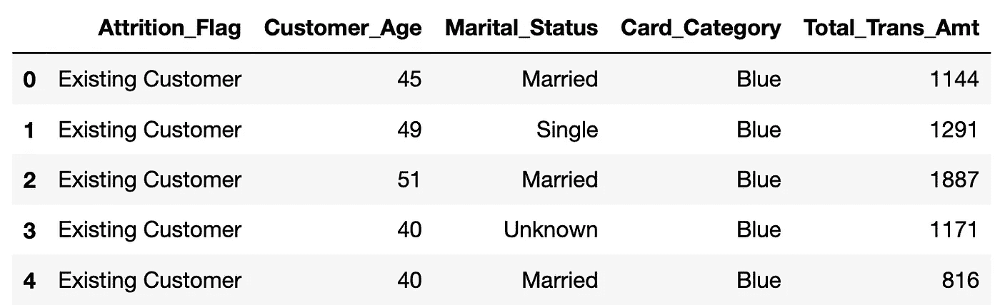
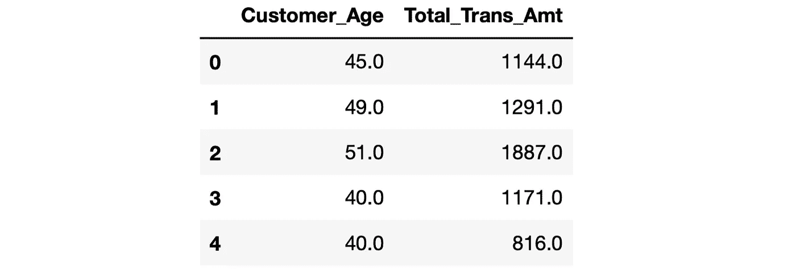
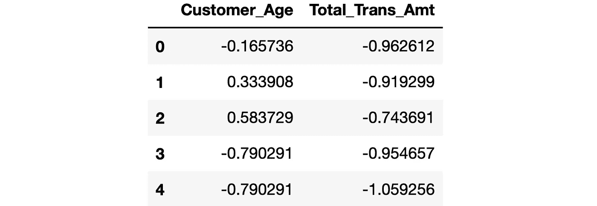
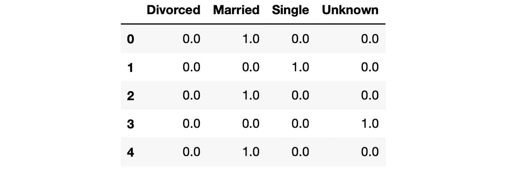

# 4 使用 Scikit-learn 的数据预处理操作

> 原文：<https://towardsdatascience.com/4-data-preprocessing-operations-with-scikit-learn-5d26bf1442dd>

## 通过使数据正确来帮助算法


[哈里·格劳特](https://unsplash.com/@photographybyharry?utm_source=unsplash&utm_medium=referral&utm_content=creditCopyText)在[号航天飞机](https://unsplash.com/s/photos/preparation?utm_source=unsplash&utm_medium=referral&utm_content=creditCopyText)上的照片

数据预处理是机器学习管道中的一个基本步骤。这取决于所使用的算法，但总的来说，我们不能或不应该期望算法在原始数据中表现良好。

如果原始数据处理不当，即使结构良好的模型也可能无法产生可接受的结果。

有些人可能会考虑使用术语数据准备来涵盖数据清理和数据预处理操作。本文的重点是数据预处理部分。

例如，一些算法要求将数字特征缩放到相似的级别。否则，它们往往会更加重视具有较高价值范围的特征。

考虑一个房价预测任务。房屋面积通常在 1000 到 2000 平方英尺之间，而在大多数情况下，年龄小于 50 岁。为了防止机器学习模型更加重视房屋面积，我们会将这些特征缩放到给定的最小值和最大值之间，例如 0 和 1 之间。这个过程被称为最小最大缩放。

我们将介绍 4 种常用的数据预处理操作，包括解释如何使用 Scikit-learn 进行这些操作的代码片段。

我们将使用一个[银行流失](https://www.kaggle.com/datasets/sakshigoyal7/credit-card-customers?resource=download)数据集，该数据集可在 Kaggle 上获得创意共享许可。请随意下载并继续。

# 读取数据

```
import pandas as pd

# Read the dataset (only 5 columns) into a Pandas DataFrame
churn = pd.read_csv(
    "BankChurners.csv",
    usecols=["Attrition_Flag", "Marital_Status", "Card_Category", "Customer_Age", "Total_Trans_Amt"]
)

churn.head()
```



数据框的前 5 行(作者提供的图像)

这里要提到的一件非常重要的事情是训练-测试分裂，这对于评估模型性能是至关重要的。就像我们用数据训练模型一样，我们用数据来衡量它们的准确性。但是，我们不能将相同的数据用于培训和测试。

在训练模型之前，我们应该留出一些数据进行测试。这被称为训练测试分割，必须在任何数据预处理操作之前完成。否则，我们将导致数据泄漏，这基本上意味着模型学习测试数据的属性。

因此，所有以下操作必须在列车测试分离后进行。想想我们拥有的数据框架，它只包含训练数据。

# 1.处理缺失值

现实生活中的数据集很可能包含一些缺失的值。有两种方法来处理它们，即删除缺失的值并用适当的值替换它们。

一般来说，后者更好，因为数据是基于数据的产品中最有价值的资产，我们不想浪费它。替换缺失值的合适值取决于数据集的特征和结构。

我们使用的数据集没有任何缺失值，所以让我们故意添加一些值来演示如何处理它们。

```
import numpy as np

churn.iloc[np.random.randint(0, 1000, size=25), 1] = np.nan
churn.iloc[np.random.randint(0, 1000, size=25), 4] = np.nan

churn.isna().sum()

# output
Attrition_Flag      0
Customer_Age       24
Marital_Status      0
Card_Category       0
Total_Trans_Amt    24
dtype: int64
```

在上面的代码片段中，一个包含 25 个随机整数的 NumPy 数组用于选择第二列和第五列中的值被替换为缺失值(np.nan)的行的索引。

在输出中，我们看到这些列中有 24 个缺失值，因为 NumPy 数组是随机生成的，可能包含重复值。

为了处理这些缺失值，我们可以使用 SimpleImputer 类，它是单变量特征插补的一个示例。简单估算器提供了估算缺失值的基本策略，可以使用提供的常数值进行估算，或者使用缺失值所在的每列的统计数据(平均值、中值或最频繁值)进行估算。

让我们用列的平均值来代替缺失的值。

```
from sklearn.impute import SimpleImputer

# Create an imputer
imputer = SimpleImputer(missing_values=np.nan, strategy='mean')

# Apply it to the numeric columns
numeric_features = ["Customer_Age", "Total_Trans_Amt"]
churn[numeric_features] = imputer.fit_transform(churn[numeric_features])

churn.isna().sum()

# output
Attrition_Flag     0
Customer_Age       0
Marital_Status     0
Card_Category      0
Total_Trans_Amt    0
dtype: int64
```

在上面的代码片段中，使用 mean 策略创建了一个简单的估算对象，这意味着它使用列的平均值来估算缺失值。然后，我们用它来替换“客户年龄”和“总交易金额”列中缺失的值。

Scikit-learn 还提供了更复杂的输入缺失值的方法。例如，迭代插补器类是多变量特征插补的一个示例，它将每个具有缺失值的特征建模为其他特征的函数，并使用该估计值进行插补。

# 2.标准化

我们提到，与其他特性相比具有更高值范围的特性可能被赋予更高的重要性，这可能会产生误导。此外，当要素处于相对相似的比例时，模型往往表现更好，收敛更快。

处理具有非常不同的值范围的要素的一个选项是标准化，这基本上意味着通过移除每个要素的平均值来转换数据以使其居中，然后通过将非恒定要素除以其标准偏差来缩放数据。生成的要素的标准差为 1，平均值非常接近于零。因此，我们最终得到的特征(即数据集中的变量或列)几乎呈正态分布。

让我们将 Scikit-learn 的 StandardScaler 类应用于客户年龄和总交易量列。正如我们在下面的输出中看到的，这两列具有非常不同的值范围。

```
churn[["Customer_Age", "Total_Trans_Amt"]].head()
```



(图片由作者提供)

让我们对这些特性应用标准化，然后检查这些值。

```
from sklearn.preprocessing import StandardScaler

# Create a scaler object
scaler = StandardScaler()

# Fit training data
scaler.fit(churn[["Customer_Age", "Total_Trans_Amt"]])

# Transform the feature values
churn[["Customer_Age", "Total_Trans_Amt"]] = scaler.transform(churn[["Customer_Age", "Total_Trans_Amt"]])

# Display the transformed features
churn[["Customer_Age", "Total_Trans_Amt"]].head()
```



(图片由作者提供)

我们还可以检查变换后要素的标准差和平均值。

```
churn["Customer_Age"].apply(["mean", "std"])

# output
mean   -7.942474e-16
std     1.000049e+00
Name: Customer_Age, dtype: float64
```

标准偏差为 1，平均值非常接近预期的 0。

# 3.缩放比例

将数值范围提高到类似水平的另一种方法是将它们缩放到特定的范围。例如，我们可以将每一列压缩到 0 和 1 之间，使得缩放前的最小值和最大值在缩放后变成 0 和 1。这种缩放可以通过 Scikit-learn 的 MinMaxScaler 来实现。

```
from sklearn.preprocessing import MinMaxScaler

# Create a scaler object
mm_scaler = MinMaxScaler()

# Fit training data
mm_scaler.fit(churn[["Customer_Age", "Total_Trans_Amt"]])

# Transform the feature values
churn[["Customer_Age", "Total_Trans_Amt"]] = mm_scaler.transform(churn[["Customer_Age", "Total_Trans_Amt"]])

# check the feature value range after transformation
churn["Customer_Age"].apply(["min", "max"])

# output
min    0.0
max    1.0
Name: Customer_Age, dtype: float64
```

正如我们在上面的输出中看到的，这些特性的最小值和最大值分别是 0 和 1。MinMaxScaler 的默认范围是[0，1]，但是我们可以使用 feature_range 参数来更改它。

StandardScaler 和 MinMaxScaler 对异常值不稳健。假设我们有一个值在 100 到 500 之间的特性，其异常值为 25000。如果我们用`MinMaxScaler(feature_range=(0,1))`缩放该特性，25000 被缩放为 1，所有其他值变得非常接近下限，即零。

因此，我们最终得到了一个不成比例的比例，这对模型的性能产生了负面影响。一种解决方案是移除异常值，然后应用缩放。然而，删除异常值并不总是一个好的做法。在这种情况下，我们可以使用 Scikit-learn 的 RobustScaler 类。

顾名思义，RobustScaler 对异常值具有鲁棒性。它会移除中位数，并根据分位数范围(默认为 IQR:四分位数范围)缩放数据。IQR 是第一个四分位数(第 25 个四分位数)和第三个四分位数(第 75 个四分位数)之间的范围。RobustScaler 不会以预定的时间间隔限制缩放范围。因此，我们不需要像对 MinMaxScaler 那样指定一个范围。

# 4.一键编码

我们经常使用具有分类特征的数据集，这些数据集也像数字特征一样需要一些预处理。

一些算法期望分类变量采用数字或一键编码格式。标签编码简单地说就是将类别转换成数字。例如，值为 S、M 和 L 的尺寸要素将被转换为值为 1、2 和 3 的要素。

如果分类变量不是有序的(也就是说，它们没有等级顺序)，标签编码是不够的。我们需要使用一键编码对名义分类变量进行编码。

考虑前面的例子，我们对婚姻状况特征进行了标签编码。未知状态编码为 3，而已婚状态编码为 1。机器学习模型可能会将此评估为未知状态优于或高于已婚状态，这是不正确的。这些值之间没有等级关系。

在这种情况下，最好进行一键编码，为每个类别创建一个二进制列。让我们把它应用到婚姻状况一栏。

```
from sklearn.preprocessing import OneHotEncoder

# Create a one-hot encoder
onehot = OneHotEncoder()

# Create an encoded feature
encoded_features = onehot.fit_transform(churn[["Marital_Status"]]).toarray()

# Create DataFrame with the encoded features
encoded_df = pd.DataFrame(encoded_features, columns=onehot.categories_)

# Display the first 5 rows
encoded_df.head()
```



(图片由作者提供)

由于婚姻状况列中有 4 个不同的值(离婚、结婚、单身、未知)，因此创建了 4 个二元列。婚姻状况列的第一个值是“已婚”，因此第一行中已婚列的值为 1。第一行中的所有其他值都是 0。

需要提及的一件重要事情是 drop 参数。如果一个分类列中有 n 个不同的值，我们可以对 n-1 列进行一次热编码，因为其中一列实际上是冗余的。例如，在上面的输出中，当 3 列的值为 0 时，则该行属于第四列。我们实际上不需要第四纵队来了解这一点。我们可以使用 OneHotEncoder 的 drop 参数删除其中一列。

# 结论

我们已经学习了机器学习中一些最常见的数据预处理操作，以及如何使用 Scikit-learn 库来执行这些操作。

*你可以成为* [*媒介会员*](https://sonery.medium.com/membership) *解锁我的全部写作权限，外加其余媒介。如果你已经是了，别忘了订阅*<https://sonery.medium.com/subscribe>**如果你想在我发表新文章时收到电子邮件。**

*感谢您的阅读。如果您有任何反馈，请告诉我。*