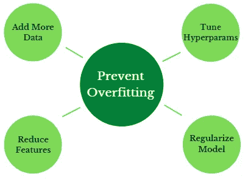

# 防止过度拟合的 4 种有效方法及其工作原理

> 原文：<https://towardsdatascience.com/4-effective-ways-to-prevent-overfitting-and-why-they-work-f6e3b98aefda>

## 构建有用的机器学习模型

过度拟合会导致你的模型错过目标，照片由 [Unsplash](https://unsplash.com?utm_source=medium&utm_medium=referral) 上的 [engin akyurt](https://unsplash.com/@enginakyurt?utm_source=medium&utm_medium=referral) 拍摄

## 介绍

在这篇文章中，我将分享在构建机器学习(ML)模型时可以避免过度拟合的四种实用方法，以及它们为什么有效。

过度拟合是一种不希望出现的情况，当模型拟合得过于接近训练数据，以至于无法很好地推广到新的示例，即无法为以前未见过的数据集提供准确的预测。

> 面对现实吧，过度拟合让 ML 模型无法使用。

检测过度拟合的最常见方法是通过比较训练和测试数据集上的模型性能。与训练集相比，过度拟合的模型在测试集上将具有明显更差的性能。

## 4 防止过度拟合的有效方法

作者图片

为了构建有用的 ML 模型，我们需要有效地解决过度拟合问题。以下是一些避免过度拟合模型的实用方法:

1.  **添加更多数据**

是的，增加训练样本的数量是减少过度拟合的可靠方法。除非训练集正确地代表了整体数据中的真实模式，否则您的模型可能会过于接近有限的数据，从而使其无法通用化到未经训练的新数据集。

这可以通过收集新样本(这在某些应用中可能很困难)或数据扩充(这将产生现有样本的变体)来实现。例如，在图像分类任务中，已经发现数据扩充可以显著提高模型性能。

*工作原理:*随着数据量的增加，该模型倾向于更一般化，因为它适合训练样本的较小部分。

2.**调整超参数**

复杂的 ML 模型通常比简单的模型更精确，但是前者更容易过度拟合。

在这种情况下，当超参数越多或训练时间越长时，ML 模型变得越复杂。超参数的值控制学习过程，不能从数据中估计，并且在模型之外。因此，它们是在训练开始前设置的。

该解决方案取决于算法类型，可以通过设置最佳超参数值来实现。一些常见的例子包括:

*   *树方法(决策树、随机森林、LGBM、XGBoost):* 减少每棵树的最大深度(即每棵树的叶子数)。
*   *神经网络:*早期停止(较早停止训练过程)和减少隐层数量(去掉部分神经元)。
*   *K 最近邻(KNN):* 增加 K 的值

*工作原理:*通过调整超参数可以降低模型的复杂性，从而减少过度拟合的机会。例如，越早停止训练过程，模型越简单。在 KNN 的情况下，增加 K 的值降低了模型对局部模式的敏感性，因为在训练过程中使用了更多的邻居。这使得模型对于新的数据集更具普适性，从而减少过度拟合。

3.**减少特征数量**

过度拟合可能是由具有大量特征的有限数据量造成的。但是，减少要素的数量可能会导致重要信息的丢失，因此必须谨慎操作。

一种想法是在探索性数据分析期间手动移除预测能力低的特征。与目标变量具有更强相关性的特征具有更强的预测能力。此外，可以使用[特征重要性分数](/understanding-feature-importance-and-how-to-implement-it-in-python-ff0287b20285)和互信息来测量预测能力。

此外，可以使用诸如主成分分析(PCA)的技术来降低数据的维度。使用这种方法，可以选择分量的数量，使得仅选择贡献重要信息(解释的方差)的特征。然而，PCA 导致变换特征的可解释性的损失。

*工作原理:*使用较少的特征降低了模型的复杂性，有助于防止过度拟合。

4.**正规化**

该方法用于通过惩罚对学习过程贡献很小或没有贡献的特征来约束 ML 模型的复杂性。

一些正则化类型包括 L1(最小绝对收缩和选择算子——套索)、L2(脊)和专门用于神经网络的[下降](https://programmathically.com/dropout-regularization-in-neural-networks-how-it-works-and-when-to-use-it/)。

LASSO 将不太重要的要素的贡献缩小到零，从而消除了这些要素，而 Ridge 则减少了这些要素的贡献。关于正规化的更多细节可以在[这里](https://www.geeksforgeeks.org/regularization-in-machine-learning/)找到。

*工作原理:*正则化限制了模型的复杂性，从而减少了过度拟合的机会。

## 结论

我们已经介绍了解决过度拟合的四种有效方法以及它们为什么有效。这些方法包括添加更多数据、调整超参数、减少特征数量和正则化。还提供了一些资源链接供进一步学习。

我希望这篇文章有深刻的见解，直到下一次。干杯！

你可以通过下面我的推荐链接订阅 Medium，获得更多我和其他作者的启发性文章，这也支持我的写作。谢谢大家！

 