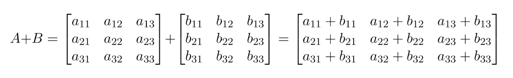
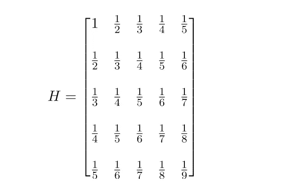
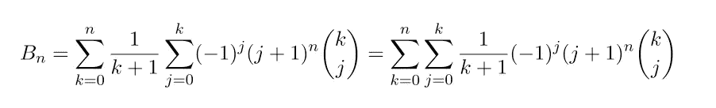
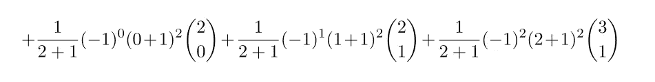

# 帮助您理解嵌套循环的 4 个示例

> 原文：<https://towardsdatascience.com/4-examples-to-help-you-understand-nested-loops-94bb7df797c4>

## 对嵌套 for 循环如何工作以及如何将它们用于各种任务有更好的直觉和理解。


布伦特·德·兰特在 [Unsplash](https://unsplash.com/@brentderanter) 上拍摄的照片

嵌套的 for 循环迭代多个索引，例如行和列。具有两个级别的嵌套循环有一个内循环，该内循环在外循环的每次迭代中执行。理论上，您可以在任意多的层中嵌套一个循环，但是很难跟踪在两层以上的循环中会发生什么。

对于大多数任务，可以使用矢量化运算或更有效的内置函数。但是，如果您正在努力理解嵌套循环的内部工作原理，我希望这些例子可以帮助您更好地理解嵌套 for 循环的工作原理，以及如何将它们用于各种任务。

你可以在这个 [Github repo](https://github.com/TalkingDataScience/nested_for_loops) 中找到本文使用的代码。

我们将通过使用嵌套的 for 循环来解决以下四个任务:

1.  创建乘法表
2.  矩阵加法
3.  创建希尔伯特矩阵
4.  找出伯努利数

在进入示例之前，让我们使用一个嵌套的 for 循环来迭代这个小矩阵。它将打印每个元素的位置(索引)和它的值，这样我们就可以看到嵌套的 for 循环在矩阵上的迭代顺序。


作者图片

作者图片

正如您所看到的，外部循环遍历所有行，对于每一行，内部循环遍历该行的所有元素。在这种情况下，当我们循环一个矩阵时，我们遵循命名索引 *i* 和 *j* 的惯例，这就是在数学中索引矩阵的方式。但是你可以给它们起任何你想要的名字，这有助于你记住迭代的顺序。

# 乘法表

让我们从一个简单的例子开始，它的输入、迭代和输出都非常简单。我们将创建一个乘法表。

*   我们指定表的大小，并创建一个矩阵来保存这些值
*   创建一个嵌套的 for 循环，外部循环遍历行，内部循环遍历列
*   通过将每个行索引乘以列索引来计算矩阵中每一项的值，并将它们存储在矩阵中

作者图片

让我们来分解一下每个循环中发生了什么。

```
**Outer loop, loop 1**, **for i=1:** The first outer loop stays on index i=1 (row 1) and the inner loop iterates over the entire length of index j, the columns. That is, we iterate over each j element (j=1 to j=n) in this row (i=1):
    **Inner loop: The inner loop will iterate from j=1 to j=n**:
    i=1, j=1, multiplies i=1 with j=1 and assigns value to mult_table[row i=1, col j=1]
    i=1, j=2, multiplies i=1 with j=2 and assigns value to mult_table[row i=1, col j=2]
    i=1, j=3, multiplies i=1 with j=3 and assigns value to mult_table[row i=1, col j=3]
    ...
    i=1, j=1n, multiplies i=1 with j=n and assigns value to mult_table[row i=1, col j=n]**Outer loop, loop 2**, **i=1:** The second outer loop stays on index i=2 (row 2) and the inner loop iterates over the entire length of index j, the columns:    
    **Inner loop: The inner loop will iterate from j=1 to j=n**:
    i=2, j=1, multiplies i=2 with j=1 and assigns alue to mult_table[row i=2, column j=1]
    i=2, j=2, multiplies i=2 with j=2 and assigns value to mult_table[row i=2, column j=2]
    i=2, j=3, multiplies i=2 with j=3 and assigns value to mult_table[row i=2, column j=3]
    ...
    i=2, j=n, multiplies i=2 with j=n and assigns value to mult_table[row i=2, j=n]
```

循环继续像这样迭代，每行的列中的每个元素，直到我们迭代完最后一行 n。

```
**Outer loop, loop n**, **i=n:** The last outer loop stays on index i=n (row n) and the inner loop iterates over the entire length of index j, the columns:
    **Inner loop: The inner loop will iterate from j=1 to j=n**:
    i=n, j=1, multiplies i=n with j=1 and assigns value to mult_table[row i=n, col j=1]
    i=n, j=2, multiplies i=n with j=2 and assigns value to mult_table[row i=n, col j=2]
    i=n, j=3, multiplies i=n with j=3 and assigns value to mult_table[row i=n, col j=3]
    ...
    i=n, j=n, multiplies i=10 with j=n and assigns value to mult_table[row i=n, col j=n]
```

在这个嵌套的 for 循环中，我们一次填充乘法表的一行，从左到右将值添加到列中。行 I 的每次迭代包含或嵌套了列 j 的 10 次迭代。

# 矩阵加法

在矩阵加法中，被加的矩阵必须具有相同的维数(行数和列数)。矩阵加法是一个简单的运算，我们将两个矩阵的相应元素相加。

将 A (a_11)的第一行(i=1)和第一列(j=1)中的元素添加到 B (b_11)的第一行(i=1)和第一列(j=1)中的相应元素，依此类推。



作者图片

我们将使用小数字，以便于看到矩阵的每一个加法。


作者图片

*   我们创建两个矩阵，A 和 B，我们将添加。我们还创建了一个矩阵 C，用于存储结果。
*   创建一个嵌套的 for 循环，外层循环遍历行，内层循环遍历列。
*   我们将矩阵 A 和 B 中的每个对应元素相加，并将总和存储在矩阵 c 中的对应索引中。

作者图片

在这个例子中，迭代遵循与乘法表中相同的模式。唯一不同的是，它同时迭代三个矩阵 A、B 和 C。

```
**Outer loop, loop 1**, **i=1:** The first outer loop stays on index i=1 (row 1) and the inner loop iterates over the entire length of index j (j=1 to j=3), for all three matrices A, B and C:
    **Inner loop: The inner loop will iterate from j=1 to j=3**:
    Adding matrix A[row i=1, col j=1] to matrix B[row i=1, j=1] and assigns value to matrix C[row i=1, col j=1]
    Adding matrix A[row i=1, col j=2] to matrix B[row i=1, j=2] and assigns value to matrix C[row i=1, col j=2]
    Adding matrix A[row i=1, col j=3] to matrix B[row i=1, j=3] and assigns value to matrix C[row i=1, col j=3]**Outer loop, loop 2**, **i=2:** Here i=2 (row 2 in all matrices), and the inner loop iterates over the entire length of index j (j=1 to j=3), for all three matrices A, B and C.
    **Inner loop: The inner loop will iterate from j=1 to j=3**:
    Adding matrix A[row i=2, col j=1] to matrix B[row i=2, j=1] and assigns value to matrix C[row i=2, col j=1]
    Adding matrix A[row i=2, col j=2] to matrix B[row i=2, j=2] and assigns value to matrix C[row i=2, col j=2]
    Adding matrix A[row i=2, col j=3] to matrix B[row i=2, j=3] and assigns value to matrix C[row i=2, col j=3]
```

# 希尔伯特矩阵

希尔伯特矩阵是一个正方形矩阵，其中每个元素是一个单位分数，定义如下:


作者图片

这是 5×5 希尔伯特矩阵:



作者图片

我们将定义一个创建任意大的希尔伯特矩阵的函数:

*   创建选定大小的矩阵 H
*   创建一个嵌套的 for 循环，外部循环遍历行，内部循环遍历列
*   计算矩阵中每一项的值

作者图片

在这个循环中，它按照以前的模式，一次填充矩阵的一行，从左到右在列中填充值。对于每个元素，它根据公式计算单位分数，并将值赋给希尔伯特矩阵。

```
**Outer loop, loop 1**, **i=1:** The first outer loop stays on index i=1 (row 1) and the inner loop iterates over the entire length of index j, the columns. That is, we iterate over each j element (j=1 to j=n) in this row (i=1):
    **Inner loop: The inner loop will iterate from j=1 to j=n**:
    i=1, j=1, calculates 1/(row i=1 + col j -1) and assigns value to hilbert[row i=1, col j=1]
    i=1, j=2, calculates 1/(row i=1 + col j -1) and assigns value to hilbert[row i=1, col j=2]
    i=1, j=3, calculates 1/(row i=1 + col j -1) and assigns value to hilbert[row i=1, col j=3]
    …
    i=1, j=n, calculates 1/(row i=1 + col j -1) and assigns value to hilbert[row i=1, col j=n]**Outer loop, loop n**, **i=n:** The last outer loop stays on index i=n (row n) and the inner loop iterates over the entire length of index j, the columns. That is, we iterate over each j element (j=1 to j=n) in this row (i=n):
    **Inner loop: The inner loop will iterate from j=1 to j=n**:
    i=n, j=1, calculates 1/(row i=n + col j -1) and assigns value to hilbert[row i=n, col j=1]
    i=n, j=2, calculates 1/(row i=n + col j -1) and assigns value to hilbert[row i=n, col j=2]
    i=n, j=3, calculates 1/(row i=n + col j -1) and assigns value to hilbert[row i=n, col j=3]
    ...
    i=n, j=n, calculates 1/(row i=n + col j -1) and assigns value to hilbert[row i=n, col j=n]
```

# 寻找伯努利数

最后，我将展示一个例子，说明我们如何通过使用嵌套的 for 循环来求解有索引的数学方程。我们将编写一个函数来寻找第二个伯努利数的第一个数字。第二伯努利数可以用下面的等式表示:



作者图片

为了了解如何计算这些数字，让我们来计算第二个数字 B_2。当 k=0 时，只有一项 j=0。


作者图片

当 k=1 时，需要计算 j=0 和 j=1 的两项。


作者图片

当 k=2 时，j=0，j=1，j=2 有三项。



作者图片

如你所见，如果我们想找到更高的伯努利数，这个方程很快就变得复杂了。我们可以让 R 用一个嵌套的 for 循环来替我们完成这项工作。

作者图片

在这个例子中，我们不像前面三个例子那样遍历行和列。相反，我们正在计算 k 和 j 的每一项，如上面求解伯努利数 2 的例子所示。

*   **外循环的迭代次数**是等式中 k 的**外和，范围从 0 到 n，如等式中所定义。**
*   作为 j 的**内求和的**内循环**的迭代次数由 k 决定，因为它的范围从 0 到 k**

# 结论

出于某种原因，我发现嵌套循环有些令人困惑，即使它们的逻辑非常清楚。我不愿意承认的是，嵌套循环经常会产生我没有预料到的结果，这也不是我想要的。在那些场合，我发现回到这些简单的例子有助于“重置”我的思维。如果您发现嵌套循环令人困惑，我希望这些例子可以帮助您。

你可以在这个 [Github repo](https://github.com/TalkingDataScience/nested_for_loops) 中找到本文使用的代码。