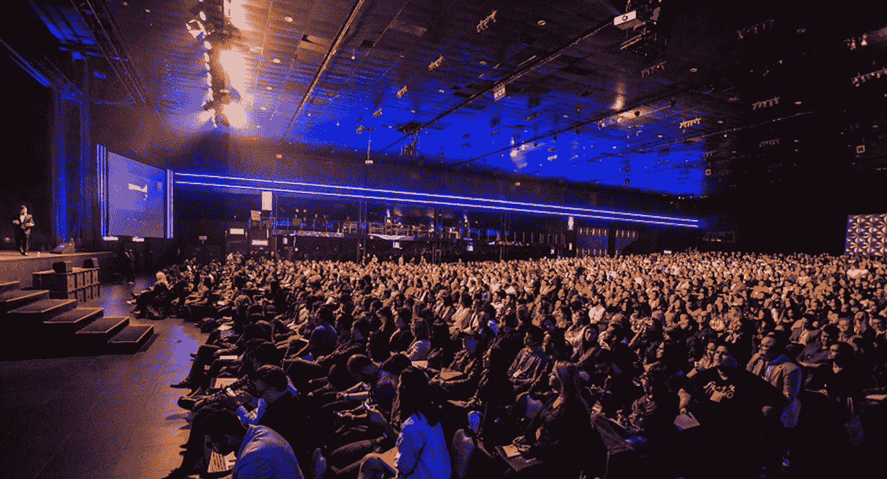
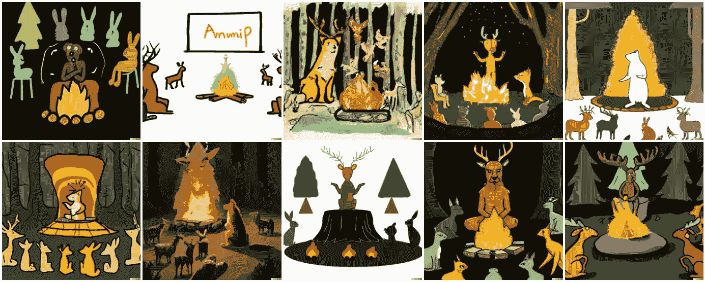

# 2022 年开放数据科学大会上的 4 项激动人心的数据科学发展

> 原文：<https://towardsdatascience.com/4-exciting-data-science-developments-at-the-open-data-science-conference-odsc2022-e427df926f85>

塞缪尔·佩雷拉在 [Unsplash](https://unsplash.com?utm_source=medium&utm_medium=referral) 上拍摄的照片

上周，我参加了在波斯顿举行的开放数据科学大会(ODSC)。作为一名早期职业数据科学家，这是我与社区联系的机会，我从中获得了明显的兴奋感和动力。

ODSC 持续了 4 天，同时进行了个人和在线跑步。会谈分为几个部分，包括机器学习、MLOps、NLP、生物技术等。

话题之广意味着不可能完全准确地概括 ODSC，所以我将挑选一些最令人兴奋的观点。

这些是:

1.  “生成模型正在经历一个时刻”——希拉里·梅森
2.  大公司正在投资解决无处不在的工程挑战的开源 MLOps 工具
3.  数据科学家对组织内部更好的合作感兴趣
4.  富有成效的人工智能协作将在不久的将来成为可能(现在！)

# 1.“生成模型正在经历一个时刻”——希拉里·梅森

来自[隐形门](https://www.hiddendoor.co/)的希拉里·梅森，一家基于人工智能讲故事的视频游戏初创公司，在她的演讲中提出了一个强有力的案例。虽然很难不意识到这一趋势，但希拉里为我解释了为什么，为什么是现在。

为什么是生成模型？从生成模型中取样使你能够创造出文本、图像、蛋白质序列和其他有用的输出。最著名的是， [GPT-3](https://openai.com/blog/gpt-3-apps/) 几年前问世，引发了许多关于机器智能的有趣讨论。 [GPT3 已经产生了类似人类的文本，](https://www.technologyreview.com/2020/07/20/1005454/openai-machine-learning-language-generator-gpt-3-nlp/)而且模型只会越来越好。

进一步研究这些模型，以创造新的能力，并为不同类型的产品打开大门，包括人工智能生成的艺术，如 [DALL-E](https://openai.com/blog/dall-e/) 、[使用人工智能说书人的视频游戏](https://www.hiddendoor.co/)，甚至更强大的语言模型，如 [PaLM](https://arxiv.org/abs/2204.02311) 。

[DALL-E 生成的图像](https://openai.com/blog/dall-e/)来自戴夫·奥尔生成并在此分享[的提示“一个形状像营火的人工智能给着迷的森林动物观众讲故事](https://www.lesswrong.com/posts/r99tazGiLgzqFX7ka/playing-with-dall-e-2)

为什么是现在？长期以来，外行人对这些模型的训练和改进深感难以理解。很容易想到，在可预见的未来，如果你想在 GPT3 等模型上工作，你需要在 DeepMind 或 OpenAI 上工作。

然而，希拉里指出，与这项技术互动比以往任何时候都更容易:

*   像 [HuggingFace](https://huggingface.co/) 这样的平台让分享数据和模型变得前所未有的容易。
*   Colab 和其他计算平台(如初创公司 SaturnCloud)使得根据需要访问强大的 GPU 和 TPU 变得越来越容易。

如果你想快速体验希拉里所说的，那就去 [OpenAI 的](https://openai.com/api/)网站，使用 API playground。OpenAI 通过按需提供生成模型，证明了它们已经足够成熟，可以作为公用事业进行交易，就像互联网或电力一样！

# 2.大公司正在投资解决无处不在的工程挑战的开源 MLOps 工具

根据我的经验，MLOps 是数据科学家生活中的一个重要组成部分。同时，它在学术背景下完全没有被教授。

MLOps 和数据工程是 ODSC 的工作重点。我参加的一个演讲特别好，来自谷歌/探照灯的 Robert Crowe 在[tensor flow Extended](https://www.tensorflow.org/tfx)(TFX)上做的。

TFX 是一个部署 ML 管道的端到端平台，被 Spotify、Google(地图/Gmail)和 OpenX 等公司使用。

Robert 认为构建 TFX 的动机就像构建任何软件工具的动机一样。每个人都面临着相同的任务，一次又一次地重写相同的样板代码。这与我自己的经历和我交谈过的许多与会者的经历相吻合。不管我们愿不愿意承认，许多重复的工作在应该自动化或抽象化的时候并没有自动化或抽象化——所以 TFX 的存在是件好事！

Robert 接着描述了与 TFX 合作开发和利用 ML 管道的许多细节，不过您可以在此处找到此类细节。

现在，TFX 是否是正确的 MLOps 解决方案可以进行更详细的调查(如本文中的[)。我只想说，当我得知许多人面临着类似的挑战，大公司正在合作开发强大的开源解决方案时，我感到非常兴奋。](https://intellerts.com/selecting-your-optimal-mlops-stack-advantages-and-challenges/)

最后一点，罗伯特建议使用[深度学习。艾·TFX 在 Coursera](https://www.coursera.org/specializations/machine-learning-engineering-for-production-mlops) (他是该网站的讲师)上为那些对这一领域的培训感兴趣的人服务。

  

# 3.数据科学家对沟通感兴趣，以最大化他们在组织中的价值

对于在这样一个技术领域工作的如此多的技术人员来说，讨论大多数技术主题是非常容易的。在 ODSC 会议上，并没有很多关于机器学习的社会和商业背景的演讲。

特别是，[Mona Khalil '](https://www.linkedin.com/in/mona-khalil)的演讲“提升贵组织基于数据的决策能力”既鼓舞人心又切合实际。Mona 是温室软件公司的数据科学经理。

Mona 首先鼓励与会者考虑他们组织内更广泛的数据背景。我对他们的论点的理解是，在考虑创造价值的途径时，制定有效的沟通策略可以使价值最大化。

在 Mona 的整个演示过程中，我不禁想到了 DevOps 中的 [3 种方法，其中包括系统思维(即:价值途径)和有效的沟通策略(放大反馈周期)作为关键组成部分。](https://itrevolution.com/the-three-ways-principles-underpinning-devops/)

我想强调一下 Mona 提出的具体建议，包括:

*   审计您的数据资产。了解哪些利益相关者需要访问哪些数据。
*   创建每月简讯，让您的组织了解与您的团队相关的关键数据点和发展。
*   使用仪表板工具在您的组织中创建有价值数据的低成本视图。

然而，Mona 的建议引起了我最大的共鸣，那就是在你的组织中加强学习(类似于 DevOps 中的第三种方法)。

> 人们对能够为他们的决策提供信息的数据了解得越多，数据科学专业人员随时获得数据支持的压力就越小。

Mona 提供了一些有价值的资源来提供进一步的细节，包括这篇关于自助服务分析的文章、Shopify 的“[数据科学和工程基础](https://shopify.engineering/shopifys-data-science-engineering-foundations)”文章以及这篇关于[为组织中的其他团队提供数据即服务的文章](https://hex.tech/blog/data-team-roi)。

卡洛斯·穆扎在 [Unsplash](https://unsplash.com?utm_source=medium&utm_medium=referral) 上的照片

# 4.富有成效的人工智能协作将在不久的将来成为可能(现在！)

今年早些时候，我开始使用 [GitHub Copilot](https://copilot.github.com/) 这是一个 AI pair 程序员，其功能远远超出了复杂的自动完成功能，可以将注释转换为相对复杂的代码，编写我的单元测试，并建议替代解决方案来完成任务。如果你还没试过，我强烈推荐。

[Rene Schulte](https://www.youtube.com/channel/UCTxZCcfpYMIFyUNPPkFEQKA) 提供了 GitHub copilot 的快速演示。

所以当我看到 [Padhraic Smyth](https://www.ics.uci.edu/~smyth/) 正在做一个题为“机器学习中的过度自信:我们的模型知道他们不知道的东西吗？”—我很感兴趣，但我没想到会有如此深入而有趣的关于人类与人工智能合作的演讲。

Smyth 首先表明，SOTA(最先进的)图像分类等任务模型可能是错误的，而且肯定是错误的。他举了一些例子，说明真正强大的、训练有素的模型给不正确的类别或预测分配了很高的概率。

有趣的是，他进一步指出，文献表明浅层模型往往校准得更好(与正确预测相比，不正确预测的置信度更低)，尽管已经进行了许多尝试来解决这些问题，例如通过集成、贝叶斯方法或标签平滑，但它们仅取得了不同程度的成功。

在这一点上，Smyth 出现了分歧，专注于作为解决方案的人类-人工智能互补性。基本的想法(我可能过于简单化了)，是人类和人工智能会犯不同类型的错误。也就是说，我们可能能够利用我们预测的正交性，并使用贝叶斯方法将人类/人工智能预测结合起来，比单独使用任何一种都要好。

[史密斯论文的图 3](https://www.pnas.org/doi/10.1073/pnas.2111547119#fig03)“[人类-人工智能互补性的贝叶斯建模| PNAS](https://www.pnas.org/doi/10.1073/pnas.2111547119) ”很好地展示了这种效果(我本应该在这里包括它，但想避免版权问题。看一看它，并注意到在预测的相关性较低的地方，人类-人工智能杂交的准确性提高了。

> 在这项图像分类任务中，人类和神经网络误差的相关性最小，可以使用贝叶斯建模来组合预测并改善结果。

Smyth 的见解和我自己的非常一致。是的，Github 副驾驶可能经常自信地出错。但对我来说，这显然是错误的。然而，它仍然非常有用，在我们两个之间，我们比以前更快地编写代码，并进行更全面的测试。

另一个我渴望更多使用的类似工具是人工智能研究助理工具[引出](https://elicit.org/)，它使用微调的 GPT-3 语言模型来帮助研究人员评估证据。

就我个人而言，我很高兴自己的生产力在这些工具的帮助下有所提高，并期待看到这个领域的进步，或者尽可能为之做出贡献。

# 最终注释

参加东 East 2022 是一次很棒的经历，我强烈推荐任何从事科技工作的人参加。

底线很简单。

机器学习和人工智能的能力正在达到新的高度，增强了人类的能力，使我们能够在我们的组织中民主化信息，并比以往任何时候都自动化更多的无聊任务。

希望我能在 2023 年 ODSC 奥运会上见到你们！

你可以在 twitter @ jbloomAus 上联系我，或者在这里阅读我的其他文章:

*   [开启我数据科学职业生涯的建议](/the-advice-that-started-my-career-in-data-science-1b27ed94feb5)
*   [自我如何复杂的科学](https://medium.com/computational-biology/how-ego-complicates-science-b84217ed939e)
*   [数据科学家:像生物学家一样思考！](/data-scientists-think-like-biologists-b681a9795627)