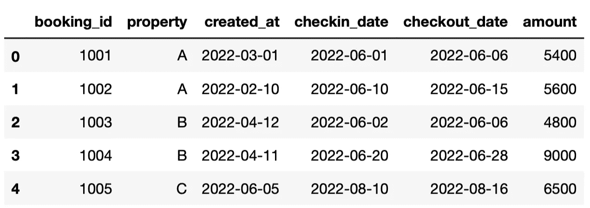
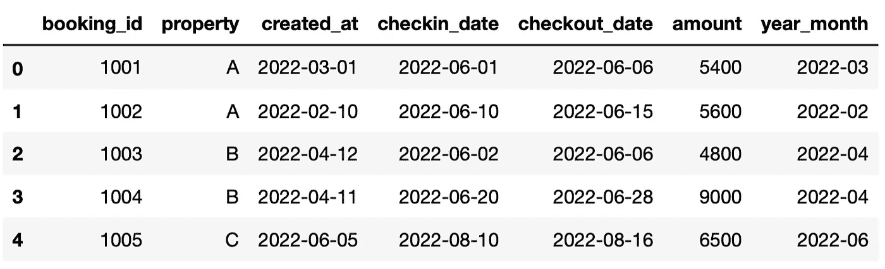
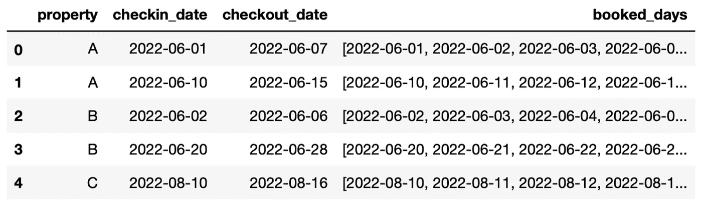
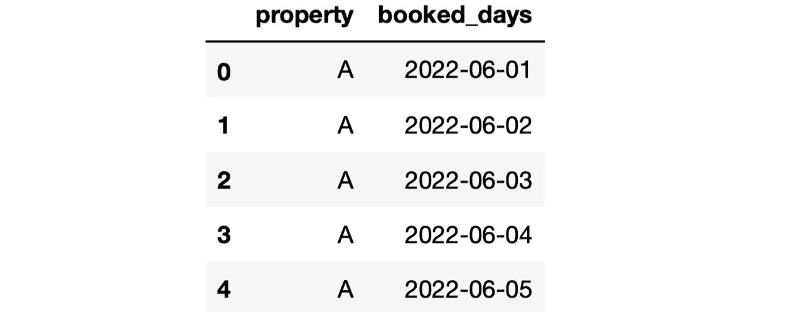

# 4 关于熊猫日期时间操作的常见问题

> 原文：<https://towardsdatascience.com/4-faq-about-date-time-manipulation-with-pandas-eecedcf111e3>

## 举例说明


(图片由作者提供)

熊猫图书馆是非常有效的时间序列数据。事实上，它是由 Wes McKinney 创建的，用于处理基本上由时间序列数据组成的金融数据。

当处理时间序列数据时，大量的时间花费在日期和时间操作上。在本文中，我们将讨论这方面的 4 个常见问题。

你可能遇到过这些问题。除了最后一个问题，它们都可以通过简单的操作来解决，最后一个问题有点棘手，需要多个步骤来解决。

让我们从创建一个示例数据帧开始。

```
df = pd.DataFrame({ "booking_id": [1001, 1002, 1003, 1004, 1005],
    "property" : ["A", "A", "B", "B", "C"],
    "created_at": ["2022-03-01", "2022-02-10", "2022-04-12",
                   "2022-04-11", "2022-06-05"],
    "checkin_date": ["2022-06-01", "2022-06-10", "2022-06-02",
                     "2022-06-20", "2022-08-10"],
    "checkout_date": ["2022-06-06", "2022-06-15", 
                      "2022-06-06","2022-06-28", "2022-08-16"],
    "amount": [5400, 5600, 4800, 9000, 6500]})# change the data type 
date_cols = ["created_at","checkin_date","checkout_date"]
df[date_cols] = df[date_cols].astype("datetime64[ns]")# display the DataFrame
df
```



df(作者图片)

为了能够使用 Pandas 的日期操作功能，我们需要将日期放在适当的数据类型中。这就是我们将数据类型更改为“datetime64[ns]”的原因。

## 1.如何提取年月？

日期包含不同的信息，如年、星期、月等。使用 dt 访问器提供的方法，可以从日期中提取所有不同的信息。

例如，我们可以使用 month 方法获得月份。其中一个不太明显的是年月组合。我们可以借助 to_period 方法提取这些信息。

```
# create the year_month column
df["year_month"] = df["created_at"].dt.to_period("M")# display the DataFrame
df
```



df(作者图片)

## 2.如何给日期加上时间间隔？

给日期加上或减去时间间隔通常在日期操作中执行。我们可以使用“DateOffset”或“Timedelta”函数来执行这项任务。

让我们将 id 为 1001 的预订的退房日期增加 1 天。

```
df.loc[df["booking_id"]==1001, "checkout_date"] = \
df.loc[df["booking_id"]==1001, "checkout_date"] + \
pd.DateOffset(days=1)# check the result
print(df.loc[df["booking_id"]==1001, "checkout_date"])**# output**
0   2022-06-07
Name: checkout_date, dtype: datetime64[ns]
```

## 3.如何求两个日期的天数差？

我们可以通过从两个日期中减去一个来找出两个日期之间的差异。但是，此操作的结果是一个 Timedelta 对象，如下所示:

```
df["checkout_date"][0] - df["checkin_date"][0]**# output**
Timedelta('6 days 00:00:00')
```

我们可以使用 days 方法提取整数形式的天数。让我们创建一个列，显示入住日期和预订创建日期之间的天数。

```
# difference in days
df["days_to_checkin"] = \
(df["checkin_date"] - df["created_at"]).dt.days# display the DataFrame
df
```


df(作者图片)

## 4.如何扩展开始日期和结束日期之间的日期？

假设我们需要一个日历来显示房产的预订天数。例如，数据框第一行中的预订告诉我们，房产 A 的预订时间是 2022 年 6 月 1 日至 2022 年 6 月 7 日。因此，酒店 A 的预订日期为 2022 年 6 月 1 日、2022 年 6 月 2 日、2022 年 6 月 3 日、2022 年 6 月 4 日、2022 年 6 月 5 日、2022 年 6 月 6 日(假设退房时间为 2022 年 6 月 7 日上午 10 点)。

我们可以通过查找入住日期和退房日期之间的日期来创建这样一个日历，然后基于这些日期展开数据框架。

首先，我们创建一个包含 property、checkin_date 和 checkout_date 列的日历数据帧。

```
# create a calendar DataFrame
calendar = df[["property","checkin_date","checkout_date"]]
```

date_range 函数给出了开始日期和结束日期之间的日期。这是第一次预订时的样子:

```
pd.date_range(calendar["checkin_date"][0], calendar["checkout_date"][0])**# output**
DatetimeIndex(['2022-06-01', '2022-06-02', '2022-06-03', 
               '2022-06-04', '2022-06-05', '2022-06-06', 
               '2022-06-07'],
              dtype='datetime64[ns]', freq='D')
```

这里的问题是，我们不希望退房日期显示为已预订。因此，我们将从退房日期中减去 1 天，然后找出两者之间的日期。

为了对所有的行执行这个操作，我们需要使用 apply 函数。我们还将使用 list 构造函数将 date_range 函数的输出转换为一个列表。

```
# create the booked_days column
calendar.loc[:, "booked_days"] = calendar.apply(

    lambda x: list(
        pd.date_range(
            x.checkin_date, 
            x.checkout_date + pd.DateOffset(days=1)
        ).date
    ),
    axis = 1

)# display the DataFrame
calendar
```



日历(图片由作者提供)

下一步是根据 booked_days 列中的日期展开数据框架。explode 函数就是做这个操作的。

```
# explode 
calendar = calendar.explode(
    column="booked_days", ignore_index=True
)[["property","booked_days"]]# display the first 5 rows
calendar.head()
```



日历(图片由作者提供)

我们现在有一个已预订天数的日历。

我们已经解决了您在处理时间序列数据时可能会遇到的 4 个问题。最后一个不像前三个那样常见，但我想把它包括进来，因为解决起来有点棘手。

*你可以成为* [*媒介会员*](https://sonery.medium.com/membership) *解锁我的全部写作权限，外加其余媒介。如果你已经是了，别忘了订阅*<https://sonery.medium.com/subscribe>**如果你想在我发表新文章时收到电子邮件。**

*<https://sonery.medium.com/membership>  

感谢您的阅读。如果您有任何反馈，请告诉我。*