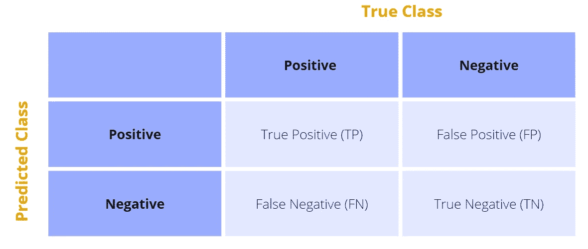
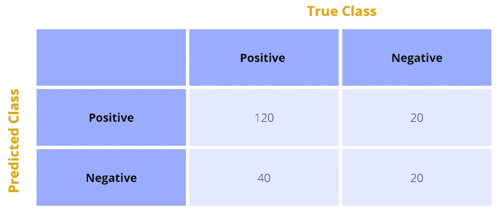
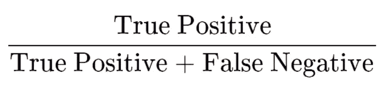
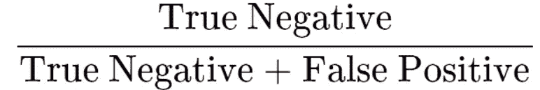
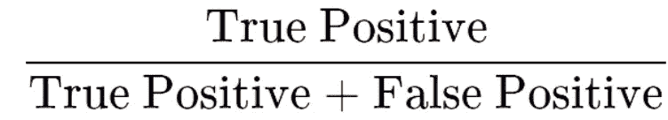
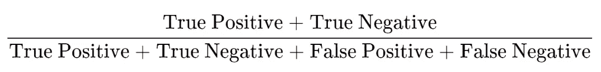
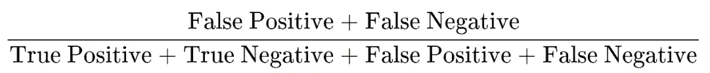

# 使用混淆矩阵时的 4 个基本问题

> 原文：<https://towardsdatascience.com/4-fundamental-questions-when-working-with-a-confusion-matrix-e49fc9536066>

## 这将有望让你对混淆矩阵不那么困惑


丹尼尔·利维斯·佩鲁西在 [Unsplash](https://unsplash.com?utm_source=medium&utm_medium=referral) 上的照片

混淆矩阵是在[机器学习](https://databasecamp.de/en/machine-learning)中评估分类模型质量的工具。它检查有多少预测被正确或错误地分配给一个类。

# 1.如何判断一个分类？

在最简单的情况下，分类由两种状态组成。假设我们想调查电晕试验如何反映病人的感染状况。在这种情况下，电晕测试用作总共两种状态的分类器:感染或未感染。

根据测试的分类是否真正正确，这两个类别总共可以产生四种状态:

*   **真阳性**:快速检测将此人归类为受感染，随后的聚合酶链式反应测试证实了这一结果。因此，快速测试是正确的。
*   **假阳性**:快速检测对一个人呈阳性，但随后的聚合酶链式反应测试显示这个人实际上没有被感染，即阴性。
*   **真阴性**:快速检测为阴性，人实际上没有被感染。
*   **假阴性**:电晕快速检测将受检者分类为健康，即阴性，然而，受检者被感染，因此应进行阳性快速检测。

# 2.什么是混淆矩阵？

混淆矩阵有助于评价和中立地评估学习分类的质量。此外，在矩阵的帮助下，可以更容易地计算具体指标。为了构建混淆矩阵，需要数据集的测试集。分类器将类别分配给数据点。

矩阵由已经提到的错误类型组成。行是测试集的预测类，列是测试集的实际标签:



混乱矩阵结构|来源:作者

假设我们用于 Corona 快速测试的测试集包括 200 个人，按细胞细分如下:



混淆矩阵示例|来源:作者

具体来说，该矩阵产生以下值:

*   **真阳性= 120** :共有 120 人被快速检测归类为感染者，实际携带病毒。
*   **假阳性= 20** :根据快速检测有 20 人患病，但并未实际感染。
*   **假阴性= 40** : 40 名受试者快速检测呈阴性，但实际上已被感染。
*   **真阴性= 20** : 20 人呈阴性，快速检测证实了这一点。

因此，混淆矩阵通常用于确定分类器中经常出现的错误类型。我们的示例性 Corona 快速测试在 70 %的情况下是正确的((120 + 20) / 200)，乍一看这是一个不错的值。然而，假阴性错误发生在所有病例的 20 % (40 / 200)中。这意味着，在 20%的情况下，这个人看起来是健康的，尽管他实际上是生病了，而且具有传染性。因此，在病毒性疾病的情况下，不仅准确性是决定性的，假阴性率也是决定性的。

这些比率可以很容易地从混淆矩阵中读出，然后计算出来。

# 3.从混淆矩阵中可以计算出哪些比率？

由于每个用例关注不同的度量标准，其中一些度量标准已经随着时间的推移而发展。在这一章中，我们简要介绍最重要的几个。

## 灵敏度

敏感度或真阳性率描述了阳性分类数据点实际上为阳性的情况:



## 特征

特异性，或真阴性率，测量阴性分类数据点实际上为阴性的所有情况:



## 精确

精确度是正确、肯定分类的主题的相对频率:



## 准确(性)

我们已经知道其他类型模型的准确性。它描述了与所有分类相关的正确分类人员的总数:



## 出错率

错误率与准确性相反，即错误分类的百分比:



# 4.如何用 Python 创建混淆矩阵？

一旦你用 [Python](https://databasecamp.de/en/python-coding) 训练了一个分类器，就可以使用“Scikit-Learn”模块创建真相矩阵。为此，我们只需要两个数组，其中包含测试集的预测类和测试集的实际标签。在我们的例子中，分类模型可以区分类“猫”、“蚂蚁”和“鸟”。因此，我们期望一个具有三行三列的混淆矩阵。

```
# Import Scikit-Learn
from sklearn.metrics import confusion_matrix# True Labels of Testset
y_true = ["cat", "ant", "cat", "cat", "ant", "bird"]# Predicted Labels of Testset
y_pred = ["ant", "ant", "cat", "cat", "ant", "cat"] # Create Confusion Matrix
confusion_matrix(y_true, y_pred, labels=["ant", "bird", "cat"])Out: 
array([[2, 0, 0],
       [0, 0, 1],
       [1, 0, 2]], dtype=int64)
```

这个矩阵现在也可以用来计算真阳性、假阳性等。从中。超过两个类别的分类手动起来会很复杂。

```
# Get Figures of a two-class Classification
tn, fp, fn, tp = confusion_matrix([0, 1, 0, 1], [1, 1, 1, 0]).ravel()
(tn, fp, fn, tp)Out: 
(0, 2, 1, 1)# Get Figures of a multi-class Classification
confusion_matrix(y_true, y_pred, labels=["ant", "bird", "cat"]).ravel()Out: 
array([2, 0, 0, 0, 0, 1, 1, 0, 2], dtype=int64)
```

# 这是你应该带走的东西

*   混淆矩阵有助于评估分类模型。
*   在大多数情况下，它包含四个字段:真阳性、真阴性、假阳性和假阴性。
*   这些字段可用于计算有助于评估分类器的特定指标。

*如果你喜欢我的作品，请在这里订阅*<https://medium.com/subscribe/@niklas_lang>**或者查看我的网站* [*数据大本营*](http://www.databasecamp.de/en/homepage) *！还有，medium 允许你每月免费阅读* ***3 篇*** *。如果你希望有****无限制的*** *访问我的文章和数以千计的精彩文章，不要犹豫，点击我的推荐链接:*[【https://medium.com/@niklas_lang/membership】](https://medium.com/@niklas_lang/membership)每月花$***5****获得会员资格**

*</association-rules-with-apriori-algorithm-574593e35223>  </an-introduction-to-tensorflow-fa5b17051f6b>  </software-as-a-service-the-game-changer-for-small-it-departments-f841b292b02a> *