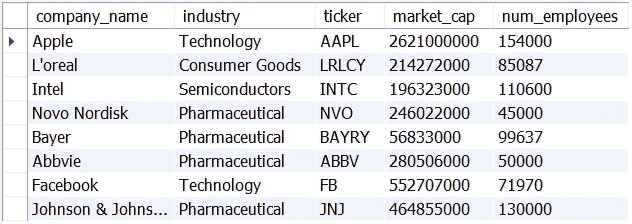
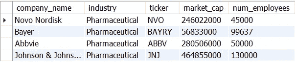
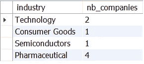
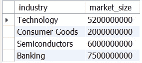
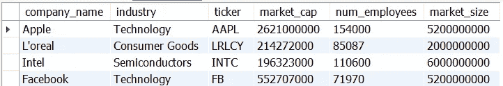
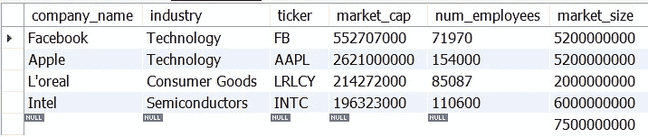
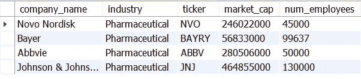
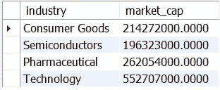
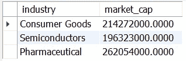

# 初学者的 4 个重要 SQL 概念

> 原文：<https://towardsdatascience.com/4-important-sql-concepts-for-beginners-51d69f195843>

## 让我们为初学者学习一些重要的 SQL 概念来增强您的查询能力


照片由 unsplash.com[@克里斯利维拉尼](https://unsplash.com/@chrisliverani)拍摄

QL 是目前最灵活的编程语言之一。随着 1974 年第一次实现，SQL 是一种查询语言，使开发人员能够顺利地处理存储在关系表中的数据。

如果你在一个组织中工作，你很有可能会在你公司的报告中发现一些 SQL 代码。为什么？因为应用程序开发人员、数据科学家、数据分析师或云工程师等各种各样的角色都使用 SQL。

SQL 也非常灵活——您可以将其与 Python、R、Java 和大多数编程语言集成。大多数情况下，如果您的应用程序有一个数据库层，您可能会使用某种类型的 SQL 实现(如 PostGres、MySQL 或 SQLite)与之通信。

在本帖中，**我们将为 SQL 初学者检查 4 个重要概念，它们将帮助你进一步练习和提高这门语言。**

# 示例数据

对于我们的沙盒示例，我们将使用一个名为`companies`的表，其中包含不同行业的几个组织的信息。

我将从头开始创建它，以便您也可以在一些 SQL 实现上复制这些示例(我将使用 MySQL，所以请注意，如果您选择其他实现，一些查询子句可能会有不同的语法)。

要运行这段代码，确保创建了一个`sandbox`数据库——如果没有，只需执行`CREATE DATABASE SANDBOX;`

下面的代码创建了我们的`companies`表结构，并将一些数据插入其中:

```
create table sandbox.companies (
 company_name varchar(30),
    industry varchar(30),
    ticker varchar(5),
    market_cap bigint,
    num_employees int
    );insert into sandbox.companies (
 company_name, industry, ticker, market_cap, num_employees
    ) values ("Apple","Technology","AAPL", 2621000000, 154000),
    ("L'oreal", "Consumer Goods", "LRLCY", 214272000, 85087),
             ("Intel", "Semiconductors", "INTC", 196323000, 110600),
             ("Novo Nordisk", "Pharmaceutical", "NVO",246022000,45000),
             ("Bayer", "Pharmaceutical", "BAYRY",56833000,99637),
             ("Abbvie", "Pharmaceutical", "ABBV",280506000,50000),
             ("Facebook", "Technology", "FB",552707000,71970),
             ("Johnson & Johnson", "Pharmaceutical", "JNJ",464855000,130000);
```

以下是我们数据的表格形式:



公司表-按作者分类的图片

这是我们将在整个帖子中使用的表格。

# 分组数据

在构建数据管道时，分组和聚合数据是最酷的技能之一。分组数据使您能够完全转换表结构，并基于几个列在原始数据上构建几个聚合。

一些虚构用例的示例:

*   对股票行情自动收录器的每日股票价格进行分组，以了解特定一天的平均价格；
*   对商店数据进行分组，以获得每个商店和每个月的总销售额；

关于用例，对数据进行分组主要有两个目的:

*   **构建数据管道，并为特定需求创建具有聚合数据的定制 ETL**—例如，为仪表板或机器学习算法准备数据。
*   **对数据进行快速统计。**

大多数情况下，数据分组是使用`GROUP BY` SQL 子句完成的。将`GROUP BY`子句与聚合函数结合起来是一个非常强大的 SQL 特性——例如，如果我们想在`companies`表中检查每个行业的平均雇员人数，我们只需:

```
select industry, avg(num_employees) as avg_n_employees
from sandbox.companies
group by industry;
```

注意这段代码有多简单——几乎就像我们在交谈一样！

> 我想从“公司”表中选择行业和雇员人数的平均值，并按行业对数据进行分组。

这将产生一个结果，其中我们有两列——`industry`和`avg_n_employees`。SQL 如何计算这个`avg_n_employees`？让我给你解释一下原因。

我们的原始表中有 4 家制药公司:



过滤查询-按作者分类的图像

该行业的平均雇员人数将为:`(45000+99637+50000+130000)/4`，大约为 81.159 人。这个数字代表 ***“制药行业公司的平均员工人数”。***

如果一切正确，我们的`GROUP BY`输出必须包含制药行业行的相同数据:


按公司列出的平均员工人数-按作者列出的图片

而且，没错！对于其他行业，SQL 自动计算相同的公式— **由于半导体和消费品在我们的** `**companies**` **表中只有公司，所以这些行业的员工人数值与** `**n=1**` **中的公司相同。**

酷！我们还可以用`GROUP BY`做什么花样？另一个想法是计算每个行业的公司数量——使用`count()`函数:

```
select industry, count(company_name) as nb_companies
from sandbox.companies
group by industry;
```

这会产生:



每个行业的计数-按作者分类的图片

在 SQL 中，`GROUP BY`子句通常位于`FROM`之后(如果您没有任何*连接*或*过滤器*)。如果*连接*或*过滤器*存在，这些子句将为我们查询的后续部分推送`GROUP BY`子句。只要记住他们总是需要跟在`FROM`从句后面！

你可以在我的 [SQL 课程的第一部分了解更多关于`GROUP BY`子句的知识。](https://www.udemy.com/course/sql-for-absolute-beginners/?referralCode=23E560A160F7202E026F)

# 连接

SQL 中另一个非常重要的概念是表连接。连接主要是为了将多个表合并成一个表。它们是 SQL 中需要掌握的关键方面之一，连接的效率(当与索引结合时)是开发人员可能更喜欢使用该语言来构建数据管道的主要原因之一。

**所以..依赖于连接的最常见的 SQL 用法是什么？**

两个主要的例子是:

*   在关系数据模型中连接数据；
*   为数据集市构建新的组合表；

连接有多种形式。在这一部分，我将解释一些最常见的。

对于我们的沙盒示例，我们需要一个额外的表与我们的`companies` 表交叉。让我们创建一个包含每个行业市场规模的新表:

```
# Create industries data
create table sandbox.industries (
    industry varchar(30),
    market_size bigint
    );

# Insert some industries data
insert into sandbox.industries (
 industry, market_size
    ) values ("Technology",5200000000),
    ("Consumer Goods", 2000000000),
             ("Semiconductors", 6000000000),
             ("Banking",7500000000);
```

我们的`industries`表如下所示:



行业表-按作者分类的图片

请注意该表的两点:

*   **这里有一个行业(银行业)不在公司表上；**
*   **有一个行业在公司表中，但不在** `**industries**` **(制药)中。**

对于现实生活中的数据，数据库中缺少一些信息是很常见的情况。这个小细节对于理解我们将要做的不同连接是很重要的。

让我们执行一个*内部连接*——假设我想将`market_size`列添加到`companies`表中——例如，对于特定行业中的每家公司，我希望有一个包含市场规模信息的列。我可以用一个连接来做到这一点！

让我们学习一下`INNER JOIN`的语法:

```
select left.*, right.market_size
from sandbox.companies as left
inner join sandbox.industries as right
on left.industry = right.industry;
```

对于连接，关键是定义将被用作表之间的连接器*T21 的列。在我们的例子中，我们使用`industry`列，因为这是我们在*左*和*右*表上都有的列。关于该查询的一些重要细节:*

*   我们使用别名来引用表格。左边是公司表，右边是行业表。
*   子句中的*声明了将用于连接两个表的列——通常称为*连接键*。*
*   *左。** 意味着我们要从*公司*表中选择所有列。

`INNER`关键字只返回在连接的两个表中都存在*键*的行。例如，由于制药公司不在行业表中，这些公司将从结果中排除:



内部连接结果-按作者排序的图像

有时，您可能希望覆盖这一点，例如，当行业数据不可用时，将 market_size 设为`NULL`—这可以通过`LEFT JOIN`来实现，这意味着您希望将表中的每一行都放在左侧*和右侧*上，而不管它是否出现在右侧*和*上:

```
# Left join example
select left.*, right.market_size
from sandbox.companies as left
left join sandbox.industries as right
on left.industry = right.industry;
```

语法和`INNER JOIN`超级相似——真的很酷。唯一的区别是我们现在用`LEFT JOIN`作为连接从句。上述查询的结果如下:


左连接结果-按作者排序的图像

通过这种方式，你不会丢失公司的数据，即使你没有更多关于这个行业的信息。

您也可以使用`RIGHT JOIN`进行相反的操作:

```
# Right join example
select left.*, right.market_size
from sandbox.companies as left
right join sandbox.industries as right
on left.industry = right.industry;
```



右连接结果-按作者排序的图像

请注意，现在我们有了银行业的市场规模，所有其他行都显示为`NULL`。奇怪的是，我们没有“银行”行的`industry`—**为什么？**因为在查询中我们从表`left`(我们的公司表)中选择了行业。

总而言之，连接是非常酷的概念，它使我们能够连接不同的表。我们没有涉及的其他连接是`OUTER`或`FULL`，但是您可以在掌握`INNER`、`RIGHT`和`LEFT`之后学习它们。

你可以在我的 [SQL 课程的第三部分了解更多关于`JOIN`子句的知识。](https://www.udemy.com/course/sql-for-absolute-beginners/?referralCode=23E560A160F7202E026F)

# 子查询

子查询是另一个 SQL 特性，它将使您的查询非常灵活。

使用子查询，您可以嵌套*查询*，并直接使用*查询结果*作为其他查询的输入。这听起来令人困惑，但实际上很简单！

例如，让我们创建一个表，只过滤我们的`companies`表中的制药公司:

```
select * 
from sandbox.companies
where industry = 'Pharmaceutical';
```

该查询将产生以下结果:



子查询结果-按作者排序的图像

**如果我们现在想从这个查询结果中获取最大数量的** `**num_employees**` **怎么办？**当然，我们可以在`where`上的查询中直接使用计算列，但是我们也可以使用子查询，例如:

```
# Subqueries Example
select max(subtable.num_employees) as max_n_employees 
from (
 select * 
 from sandbox.companies
 where industry = 'Pharmaceutical'
    ) as subtable;
```

可以把子查询想象成在`FROM`子句中替换一个物理表——SQL 的灵活性使我们能够直接在同一个`from`子句中使用任何查询结果。这有几个优点:

*   当我们想要进行两个连续的 group by 操作时，这一点尤其重要；
*   当您想要构建数据管道而不实际创建表时，这很有用。

您可以在我的 [SQL 课程的第五部分了解更多关于子查询的知识。](https://www.udemy.com/course/sql-for-absolute-beginners/?referralCode=23E560A160F7202E026F)

# 其中=/=拥有

初学者在开始用 SQL 编码时面临的一个常见问题是理解`WHERE`和`HAVING`子句之间的区别。

主要区别在于`WHERE`在任何`GROUP BY`应用之前应用，而`HAVING`在分组之后应用。让我们检查以下两个查询:

```
# Query with WHERE
select industry, avg(market_cap) as market_cap
from sandbox.companies
where market_cap < 1000000000
group by industry;# Query with HAVING
select industry, avg(market_cap) as market_cap
from sandbox.companies
group by industry
having market_cap < 1000000000;
```

我们会有两种不同的结果:



使用 Where 的查询结果-按作者排序的图像



作者使用 Having-Image 查询的结果

请注意*行业*技术的变化。这是为什么呢？第一个查询翻译成下面的句子:

> “我想按行业选择平均市值，但排除市值超过 1 万亿的公司”

这是因为`WHERE`总是在分组前应用。在这种情况下，`Apple`在计算之前被移除了**——因此唯一进入平均值计算的公司是`Facebook`，因为它是唯一与 where 子句中的筛选器匹配的技术公司。**

另一方面，对于第二个查询，我们执行以下操作:

> “我想按行业选择平均市值，但排除平均市值超过 1 万亿的行业”

注意到区别了吗？这是因为`HAVING`子句在分组完成后起作用。在这种情况下，`Apple`进入计算，使科技行业的平均价值超过 1 万亿市值。由于平均值超过 1 万亿，我们从结果中过滤掉了它，我们不再有关于`HAVING`条款的技术争论。

你可以在我的 [SQL 课程的第一部分了解更多关于`WHERE`和`HAVING`子句的知识。](https://www.udemy.com/course/sql-for-absolute-beginners/?referralCode=23E560A160F7202E026F)

我们完事了。感谢你花时间阅读这篇文章。当涉及到操作数据时，SQL 具有很少语言能够比拟的灵活性。它非常容易掌握，可能是不同数据领域角色(分析师、科学家、工程师等)使用最广泛的语言。).

在这篇文章中，我们探索了一些很酷的 SQL 概念，它们将帮助初学者提高查询的灵活性——还知道其他类似的概念吗？写在下面的评论里吧！

***我在***[***Udemy***](https://www.udemy.com/course/sql-for-absolute-beginners/?referralCode=23E560A160F7202E026F)***上开设了一门关于从零开始学习 SQL 的课程，我在其中深入探讨了这些概念以及更多内容——这门课程适合绝对的初学者，我希望您能在我身边！***