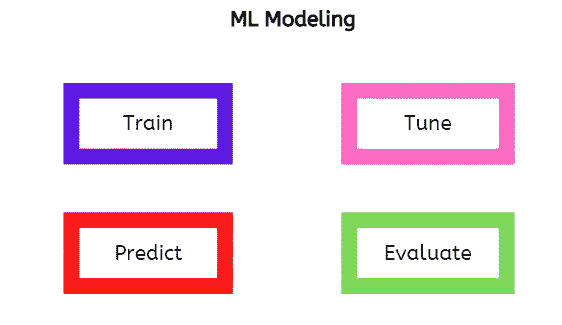
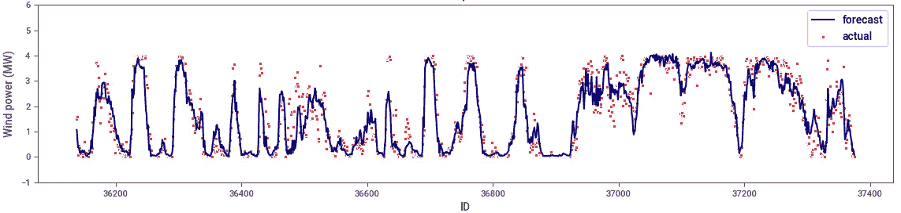
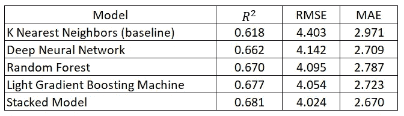

# 机器学习建模的 4 个关键过程

> 原文：<https://towardsdatascience.com/4-key-processes-in-machine-learning-modeling-c82144372eaf>

## 从数据中优化学习

康尼·施耐德在 [Unsplash](https://unsplash.com?utm_source=medium&utm_medium=referral) 上的照片

在本文中，我将介绍机器学习(ML)建模中的四个主要过程，作为一名数据从业者，您应该对这些过程了如指掌。

机器学习是人工智能的一个分支，它通过揭示数据模式(即特征和目标变量之间的关系)来模仿人类的学习能力。特征是独立变量，代表给定观察值或数据点的属性。另一方面，目标变量是一个因变量，我们感兴趣的是建模来进行预测。

ML 建模是数据科学项目生命周期中的一个重要步骤，也是项目中最有趣的部分之一。

作者图片

在上一篇文章中，我讨论了 ML 的主要组成部分，并提供了对 ML 建模的额外介绍。文章的链接可以在[这里](/three-main-components-of-machine-learning-modeling-c9186658f7fe)找到。

## ML 建模中的 4 个关键过程

ML 建模过程(图片由作者提供)

现在，让我们深入研究 ML 建模中的四个主要过程。

**训练**

这是将最大似然算法与数据拟合以学习模式的过程，其结果是创建模型。此外，算法的选择可能会受到基于可用计算能力的训练时间要求的影响。

在执行进一步的实验之前，通常对基线模型进行训练，作为项目的基准。基线模型可以是简单的算法，如线性回归或具有默认设置的随机森林算法。基线模型的选择很大程度上取决于问题和数据从业者的经验。

大多数 ML 算法通过*拟合*方法进行训练。

以下是常见的培训术语:

*串行训练:*这种类型的训练主要在单个处理器上进行，广泛用于简单到中等的训练工作。

*分布式训练:*在这里，适合一个算法的工作量被分割并在多个微型处理器之间共享。这就是所谓的并行计算，它有助于加快进程。更多详情可在[这里](https://learn.microsoft.com/en-us/azure/machine-learning/concept-distributed-training)找到。

*离线学习:*在这种情况下，对所有可用的数据定期进行训练，只有当性能令人满意时，才把模型部署到生产中。

*在线学习:*在这里，随着新数据流的出现，模型权重和参数会不断实时更新。

在线学习和离线学习的详细对比可以在[这里](https://www.qwak.com/post/online-vs-offline-machine-learning-whats-the-difference#:~:text=Training%20and%20complexity,used%20to%20train%20the%20model.)找到。

**调谐**

这是选择给出最佳模型的最优超参数集的过程。这是 ML 建模中最耗时的过程，包括创建具有不同超参数值集合的几个模型。诸如均方根误差(RMSE)、平均绝对误差(MAE)和精确度的相关度量可用于选择最佳模型。

在调优过程中要避免的一个常见缺陷是使用测试集来完成这个过程。相反，为此需要创建和使用一个验证集。更好的是，需要使用[交叉验证](https://scikit-learn.org/stable/modules/cross_validation.html)等方法来防止过度拟合。

用于调整的四重交叉验证(图片由作者提供)

python 中已经实现了一些易于使用的模块，可用于超参数优化，即 [GridSearchCV](https://scikit-learn.org/stable/modules/grid_search.html#exhaustive-grid-search) 、[randomsearccv](https://scikit-learn.org/stable/modules/grid_search.html#randomized-parameter-optimization)和 [BayesSearchCV](https://scikit-optimize.github.io/stable/modules/generated/skopt.BayesSearchCV.html) 。

**预测**

一旦选择了最佳模型，就可以使用测试数据和其他新数据集进行预测，而无需在模型的输入数据中提供目标变量。这也被称为最大似然推断。

样本 ML 预测-时间序列预测(图片由作者提供)

**评估**

模型评估是评估最大似然模型预测性能的过程。主要想法是量化模型预测的质量。这里可以使用在超参数优化期间采用的相同度量，并且还可以添加新的度量用于结果呈现目的。

样本模型评估报告(图片由作者提供)

关于模型评估的更多细节，包括 ML 建模中使用的通用指标，可在[这里](https://scikit-learn.org/stable/modules/model_evaluation.html)找到。

## 结论

在本文中，我们讨论了机器学习建模的四个主要过程:训练、调整、预测和评估。必要时还提供了一些有用的资源链接。

我希望你喜欢这篇文章，直到下次。干杯！

*你可以通过我下面的推荐链接订阅 Medium 来获得更多来自我和其他作者的启发性文章，这也支持我的写作。谢谢大家！*

 